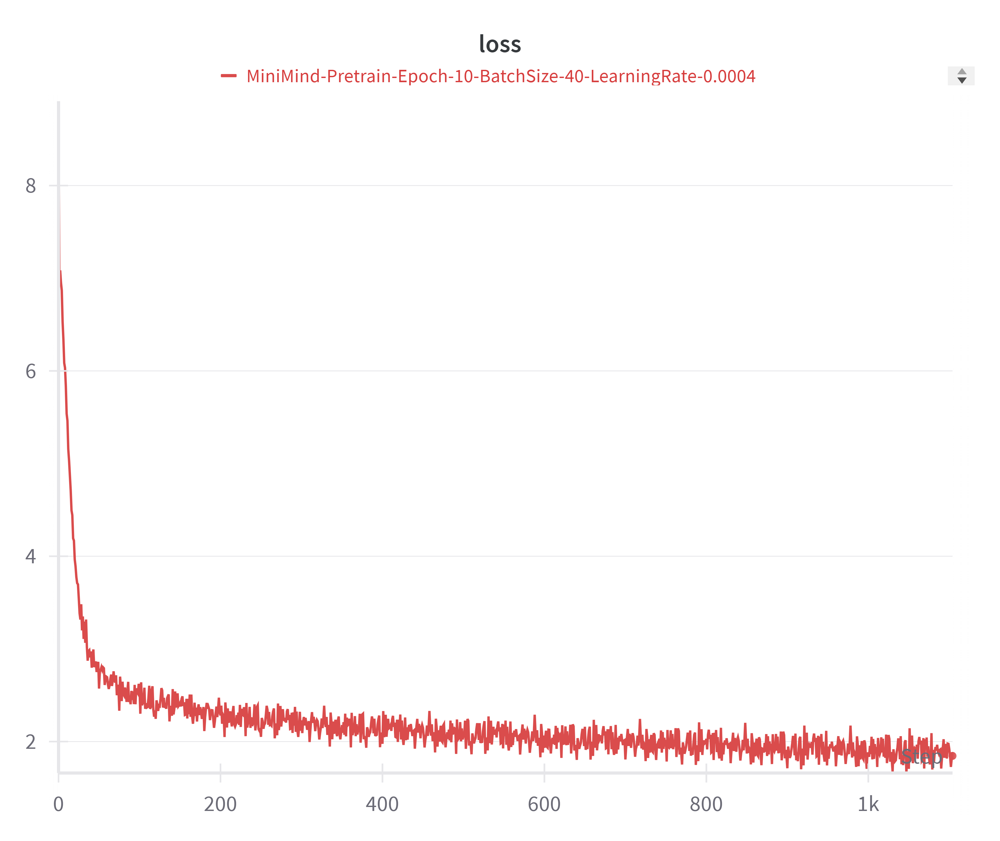
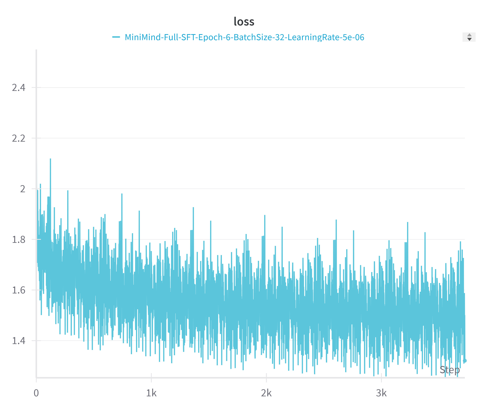
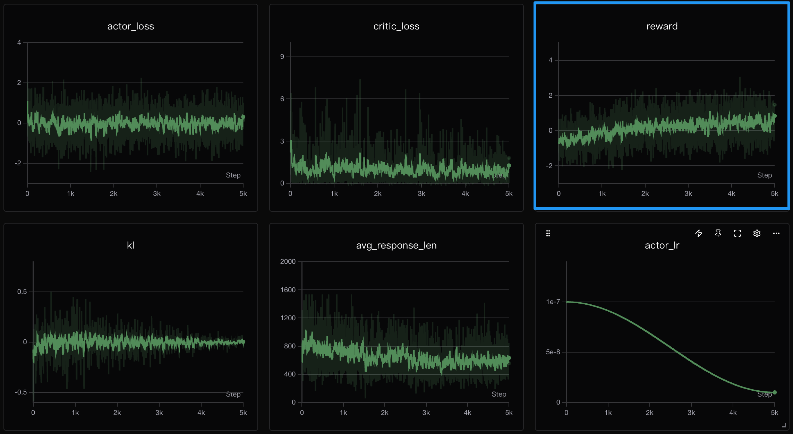
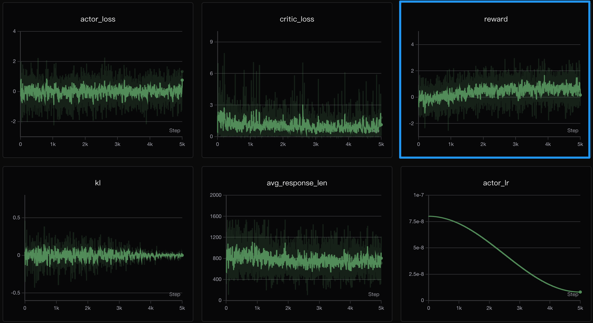
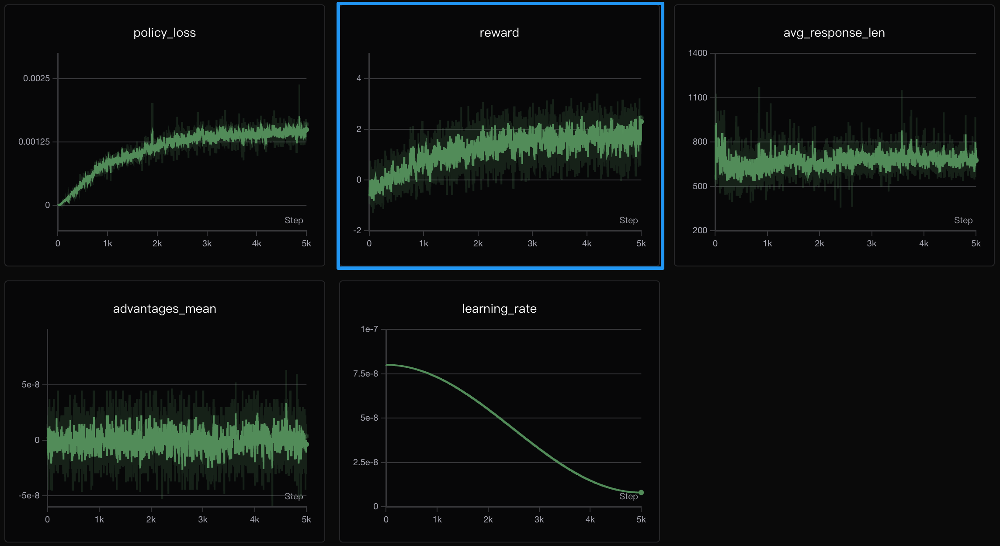
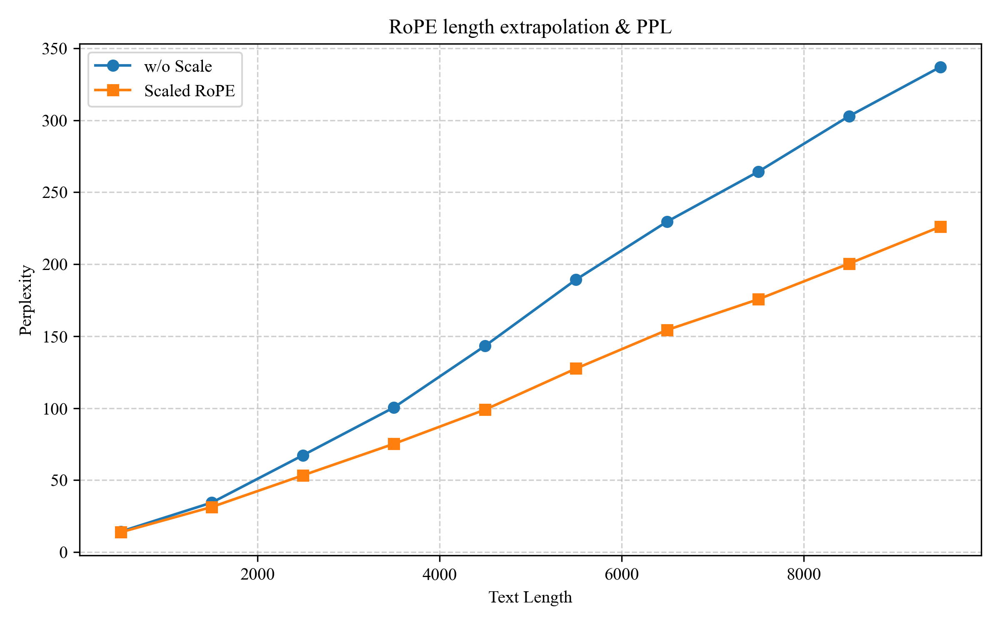
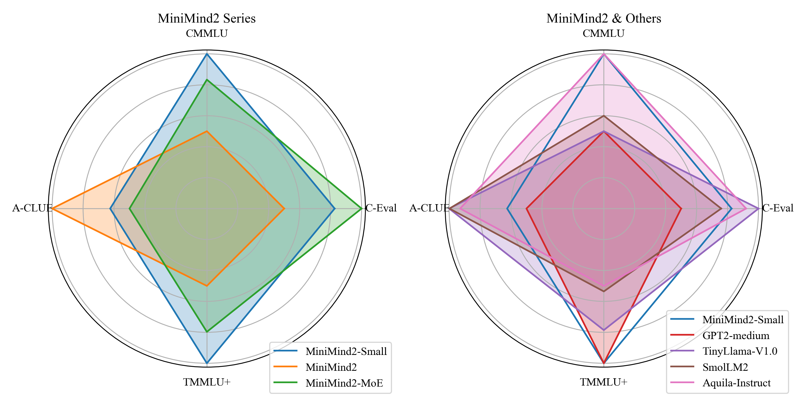

<div align="center">


</div>

<div align="center">


[](https://github.com/jingyaogong/minimind/stargazers)
[](LICENSE)
[](https://github.com/jingyaogong/minimind/commits/master)
[](https://github.com/jingyaogong/minimind/pulls)
[](https://huggingface.co/collections/jingyaogong/minimind-66caf8d999f5c7fa64f399e5)

</div>

<div align="center">


</div>

<div align="center">
  <h3>"大道至简"</h3>
</div>

<div align="center">

中文 | [English](./README_en.md)

</div>

* 此开源项目旨在完全从0开始，仅用3块钱成本 + 2小时！即可训练出仅为25.8M的超小语言模型**MiniMind**。
* **MiniMind**系列极其轻量，最小版本体积是 GPT-3 的 $\frac{1}{7000}$，力求做到最普通的个人GPU也可快速训练。
* 项目同时开源了大模型的极简结构-包含拓展共享混合专家(MoE)、数据集清洗、预训练(Pretrain)、监督微调(SFT)、LoRA微调、直接偏好优化(DPO)、强化学习训练(RLAIF: PPO/GRPO等)、模型蒸馏等全过程代码。
* **MiniMind**同时拓展了视觉多模态的VLM: [MiniMind-V](https://github.com/jingyaogong/minimind-v)。
* 项目所有核心算法代码均从0使用PyTorch原生重构！不依赖第三方库提供的抽象接口。
* 这不仅是大语言模型的全阶段开源复现，也是一个入门LLM的教程。
* 希望此项目能为所有人提供一个抛砖引玉的示例，一起感受创造的乐趣！推动更广泛AI社区的进步！

> 为防止误解，“2小时” 基于NVIDIA 3090硬件设备（单卡）测试，“3块钱”指GPU服务器租用成本，具体规格详情见下文。

---


<div align="center">


[🔗🍓推理模型](https://www.modelscope.cn/studios/gongjy/MiniMind-Reasoning) | [🔗🤖常规模型](https://www.modelscope.cn/studios/gongjy/MiniMind) | [🔗🎞️视频介绍](https://www.bilibili.com/video/BV12dHPeqE72/?share_source=copy_web&vd_source=670c2504f88726f8cf4a21ef6147c0e8)


<div align="center">
  <table>
    <tr>
      <td align="center">
        <a href="https://huggingface.co/collections/jingyaogong/minimind-66caf8d999f5c7fa64f399e5" style="text-decoration: none;">
          
        </a>
      </td>
      <td align="center">
        <a href="https://www.modelscope.cn/profile/gongjy" style="text-decoration: none;">
          
        </a>
      </td>
    </tr>
  </table>
</div>


</div>

# 📌 Introduction

大语言模型（Large Language Model, LLM）的出现引发了全世界对AI的空前关注。
无论是ChatGPT、DeepSeek还是Qwen，都以其惊艳的效果令人叹为观止。
然而，动辄数百亿参数的庞大规模，使得它们对个人设备而言不仅难以训练，甚至连部署都显得遥不可及。
打开大模型的“黑盒子”，探索其内部运作机制，多么令人心潮澎湃！
遗憾的是，99%的探索只能止步于使用LoRA等技术对现有大模型进行少量微调，学习一些新指令或任务。
这就好比教牛顿如何使用21世纪的智能手机——虽然有趣，却完全偏离了理解物理本质的初衷。
与此同时，第三方的大模型框架和工具库，如transformers+trl，几乎只暴露了高度抽象的接口。
通过短短10行代码，就能完成“加载模型+加载数据集+推理+强化学习”的全流程训练。
这种高效的封装固然便利，但也像一架高速飞船，将开发者与底层实现隔离开来，阻碍了深入探究LLM核心代码的机会。
然而，“用乐高拼出一架飞机，远比坐在头等舱里飞行更让人兴奋！”。
更糟糕的是，互联网上充斥着大量付费课程和营销号，以漏洞百出、一知半解的内容推销AI教程。
正因如此，本项目初衷是拉低LLM的学习门槛，让每个人都能从理解每一行代码开始，
从零开始亲手训练一个极小的语言模型。是的，从**零开始训练**，而不是仅仅进行**推理**！
最低只需3块钱不到的服务器成本，就能亲身体验从0到1构建一个语言模型的全过程。
一起感受创造的乐趣吧！

> [!NOTE]
> （截至2025-10）MiniMind系列已完成多个型号模型的预训练，最小仅需25.8M（0.02B），即可具备流畅对话能力！

<details style="color:rgb(128,128,128)">
<summary>Models List</summary>

| 模型 (大小)                 | 推理占用 (约) | Release    | 
|-------------------------|----------|------------|
| MiniMind2-small (26M)   | 0.5 GB   | 2025.04.26 |
| MiniMind2-MoE (145M)    | 1.0 GB   | 2025.04.26 |
| MiniMind2 (104M)        | 1.0 GB   | 2025.04.26 |
| minimind-v1-small (26M) | 0.5 GB   | 2024.08.28 |
| minimind-v1-moe (4×26M) | 1.0 GB   | 2024.09.17 |
| minimind-v1 (108M)      | 1.0 GB   | 2024.09.01 |

</details>

**项目包含**

- MiniMind-LLM结构的全部代码（Dense+MoE模型）。
- 包含Tokenizer分词器详细训练代码。
- 包含Pretrain、SFT、LoRA、RLHF-DPO、RLAIF(PPO/GRPO/SPO)、模型蒸馏的全过程训练代码。
- 收集、蒸馏、整理并清洗去重所有阶段的高质量数据集，且全部开源。
- 从0实现预训练、指令微调、LoRA、DPO/PPO/GRPO/SPO强化学习，白盒模型蒸馏。关键算法几乎不依赖第三方封装的框架，且全部开源。
- 同时兼容`transformers`、`trl`、`peft`等第三方主流框架。
- 训练支持单机单卡、单机多卡(DDP、DeepSpeed)训练，支持wandb/swanlab可视化训练流程。支持动态启停训练。
- 在第三方测评榜（C-Eval、C-MMLU、OpenBookQA等）进行模型测试，支持YaRN算法执行RoPE长文本外推。
- 实现Openai-Api协议的极简服务端，便于集成到第三方ChatUI使用（FastGPT、Open-WebUI等）。
- 基于streamlit实现最简聊天WebUI前端。
- 全面兼容社区热门`llama.cpp`、`vllm`、`ollama`推理引擎或`Llama-Factory`训练框架。
- 复现(蒸馏/RL)大型推理模型DeepSeek-R1的MiniMind-Reason模型，**数据+模型**全部开源！

希望此开源项目可以帮助LLM初学者快速入门！

### 👉**更新日志**

<details close> 
<summary> <b>2025-10-24</b> </summary>

- 🔥 新增RLAIF训练算法：PPO、GRPO、SPO（从0原生实现）
- 新增断点续训功能：支持训练自动恢复、跨GPU数量恢复、wandb记录连续性
- 新增RLAIF数据集：rlaif-mini.jsonl（从SFT数据随机采样1万条）；简化DPO数据集，加入中文数据
- 新增YaRN算法：支持RoPE长文本外推，提升长序列处理能力
- Adaptive Thinking：Reason模型可选是否启用思考链
- chat_template全面支持Tool Calling和Reasoning标签（`<tool_call>`、`<think>`等）
- 新增RLAIF完整章节、训练曲线对比、算法原理折叠说明
- [SwanLab](https://swanlab.cn/)替代WandB（国内访问友好，API完全兼容）
- 规范化所有代码 & 修复一些已知bugs

</details>

<details close> 
<summary> <b>2025-04-26</b> </summary>

- 重要更新
- 如有兼容性需要，可访问[🔗旧仓库内容🔗](https://github.com/jingyaogong/minimind/tree/7da201a944a90ed49daef8a0265c959288dff83a)。
- MiniMind模型参数完全改名，对齐Transformers库模型（统一命名）。
- generate方式重构，继承自GenerationMixin类。
- 🔥支持llama.cpp、vllm、ollama等热门三方生态。
- 规范代码和目录结构。
- 改动词表`<s></s>`->`<|im_start|><|im_end|>`

```text
为兼容第三方推理框架llama.cpp、vllm，本次更新需付出一些可观代价。
本次更新不再支持「直接」加载25-04-26以前的旧模型进行推理。
由于Llama位置编码方式与minimind存在区别，导致映射Llama模型后QK值存在差异
MiniMind2系列旧模型均经过权重映射+（微调训练）QKVO线性层校准恢复而来。
本次更新后将放弃对`minimind-v1`全系列的维护，并在仓库中下线。
```

</details>

<details close> 
<summary> <b>2025-02-09</b> </summary>

- 迎来发布以来重大更新，Release MiniMind2 Series。
- 代码几乎全部重构，使用更简洁明了的统一结构。
  如有旧代码的兼容性需要，可访问[🔗旧仓库内容🔗](https://github.com/jingyaogong/minimind/tree/6e9cd28ef9b34a0a10afbdf6f59e65cb6e628efb)。
- 免去数据预处理步骤。统一数据集格式，更换为`jsonl`格式杜绝数据集下载混乱的问题。
- MiniMind2系列效果相比MiniMind-V1显著提升。
- 小问题：{kv-cache写法更标准、MoE的负载均衡loss被考虑等等}
- 提供模型迁移到私有数据集的训练方案（医疗模型、自我认知样例）。
- 精简预训练数据集，并大幅提升预训练数据质量，大幅缩短个人快速训练所需时间，单卡3090即可2小时复现！
- 更新：LoRA微调脱离peft包装，从0实现LoRA过程；DPO算法从0使用PyTorch原生实现；模型白盒蒸馏原生实现。
- MiniMind2-DeepSeek-R1系列蒸馏模型诞生！
- MiniMind2具备一定的英文能力！
- 更新MiniMind2与第三方模型的基于更多大模型榜单测试性能的结果。

</details>

<details close>
<summary> <b>More...</b> </summary>

**2024-10-05**
- 为MiniMind拓展了多模态能力之---视觉
- 移步孪生项目[minimind-v](https://github.com/jingyaogong/minimind-v)查看详情！

**2024-09-27**
- 09-27更新pretrain数据集的预处理方式，为了保证文本完整性，放弃预处理成.bin训练的形式（轻微牺牲训练速度）。
- 目前pretrain预处理后的文件命名为：pretrain_data.csv。
- 删除了一些冗余的代码。

**2024-09-17**
- 更新minimind-v1-moe模型
- 为了防止歧义，不再使用mistral_tokenizer分词，全部采用自定义的minimind_tokenizer作为分词器。

**2024-09-01**
- 更新minimind-v1 (108M)模型，采用minimind_tokenizer，预训练轮次3 + SFT轮次10，更充分训练，性能更强。
- 项目已部署至ModelScope创空间，可以在此网站上体验：
- [🔗ModelScope在线体验🔗](https://www.modelscope.cn/studios/gongjy/minimind)

**2024-08-27**
- 项目首次开源

</details>

# 📌 快速开始

<details style="color:rgb(128,128,128)">
<summary>分享本人的软硬件配置（仅供参考）</summary>

* CPU: Intel(R) Core(TM) i9-10980XE CPU @ 3.00GHz
* RAM: 128 GB
* GPU: NVIDIA GeForce RTX 3090(24GB) * 8
* Ubuntu==20.04
* CUDA==12.2
* Python==3.10.16
* [requirements.txt](./requirements.txt)

</details>

### 第0步

```bash
git clone https://github.com/jingyaogong/minimind.git
```

## Ⅰ 测试已有模型效果

### 1.环境准备

```bash
pip install -r requirements.txt -i https://mirrors.aliyun.com/pypi/simple
```

### 2.下载模型

到项目根目录

```bash
git clone https://huggingface.co/jingyaogong/MiniMind2 # or https://www.modelscope.cn/models/gongjy/MiniMind2
```

### （可选）命令行问答

```bash
# 使用transformers格式模型
python eval_llm.py --load_from ./MiniMind2
```

### （可选）启动WebUI

```bash
# 可能需要`python>=3.10` 安装 `pip install streamlit`
# cd scripts
streamlit run web_demo.py
```

### （可选）第三方推理框架

```bash
# ollama
ollama run jingyaogong/minimind2
# vllm
vllm serve ./MiniMind2/ --served-model-name "minimind"
```

## Ⅱ 从0开始自己训练

### 1.环境准备

```bash
pip install -r requirements.txt -i https://mirrors.aliyun.com/pypi/simple
```

<details style="color:rgb(128,128,128)">
<summary>注：提前测试Torch是否可用cuda</summary>

```bash
import torch
print(torch.cuda.is_available())
```

如果不可用，请自行去[torch_stable](https://download.pytorch.org/whl/torch_stable.html)
下载whl文件安装。参考[链接](https://blog.csdn.net/weixin_45456738/article/details/141029610?ops_request_misc=&request_id=&biz_id=102&utm_term=%E5%AE%89%E8%A3%85torch&utm_medium=distribute.pc_search_result.none-task-blog-2~all~sobaiduweb~default-2-141029610.nonecase&spm=1018.2226.3001.4187)

</details>

### 2.数据下载

从下文提供的[数据集下载链接](https://www.modelscope.cn/datasets/gongjy/minimind_dataset/files)
下载需要的数据文件（创建`./dataset`目录）并放到`./dataset`下

<details style="color:rgb(128,128,128)">
<summary>注：数据集须知</summary>

默认推荐下载`pretrain_hq.jsonl` + `sft_mini_512.jsonl`最快速度复现Zero聊天模型。

数据文件可自由选择，下文提供了多种搭配方案，可根据自己手头的训练需求和GPU资源进行适当组合。

</details>

### 3.开始训练

目录位于`trainer`

<details style="color:rgb(128,128,128)">
<summary>💡 检查点暂停续训</summary>

所有训练脚本均自动保存检查点，只需添加 `--from_resume 1` 参数即可自动检测加载&恢复训练：

```bash
python train_pretrain.py --from_resume 1
python train_full_sft.py --from_resume 1
...
```

**断点续训机制说明：**
- 训练过程自动在 `./checkpoints/` 目录保存完整检查点（模型、优化器、训练进度等）
- 检查点文件命名：`<权重名>_<维度>_resume.pth`（如：`full_sft_512_resume.pth`）
- 支持跨不同GPU数量恢复（自动调整step）
- 支持wandb训练记录连续性（自动恢复同一个run）

> 适合长时间训练或不稳定环境，无需担心训练中断导致进度丢失

</details>

**3.1 预训练（学知识）**

```bash
python train_pretrain.py
```

> 执行预训练，得到 `pretrain_*.pth` 作为预训练的输出权重（其中*为模型的dimension，默认为512）


**3.2 监督微调（学对话方式）**

```bash
python train_full_sft.py
```

> 执行监督微调，得到 `full_sft_*.pth` 作为指令微调的输出权重（其中`full`即为全参数微调）

<details style="color:rgb(128,128,128)">
<summary>注：训练须知</summary>

所有训练过程默认每隔100步保存1次参数到文件`./out/***.pth`（每次会覆盖掉旧权重文件）。

简单起见，此处只写明两个阶段训练过程。如需其它训练 (LoRA, 蒸馏, 强化学习, 微调推理等) 可参考下文【实验】小节的详细说明。

</details>


---

### 4.测试自己训练的模型效果

确保需要测试的模型`*.pth`文件位于`./out/`目录下。
也可以直接去[此处](https://www.modelscope.cn/models/gongjy/MiniMind2-PyTorch/files)下载使用我训练的`*.pth`文件。

```bash
python eval_llm.py --weight full_sft # 或 pretrain/dpo/ppo/grpo...
```

<details style="color:rgb(128,128,128)">
<summary>注：测试须知</summary>

`--weight` 参数指定权重名称前缀，可选：`pretrain`, `full_sft`, `dpo`, `reason`, `ppo_actor`, `grpo`, `spo` 等

其他常用参数：
- `--load_from`: 模型加载路径（`model`=原生torch权重，其他路径=transformers格式）
- `--save_dir`: 模型权重目录（默认`out`）
- `--lora_weight`: LoRA权重名称（`None`表示不使用）
- `--historys`: 携带历史对话轮数（需为偶数，0表示不携带历史）
- `--max_new_tokens`: 最大生成长度（默认8192）
- `--temperature`: 生成温度（默认0.85）
- `--top_p`: nucleus采样阈值（默认0.85）


使用方式直接查看`eval_llm.py`代码即可。

</details>


---

> [!TIP]
> 所有训练脚本均为Pytorch原生框架，均支持多卡加速，假设你的设备有N (N＞1) 张显卡：

单机N卡启动训练方式 (DDP, 支持多机多卡集群)

```bash
torchrun --nproc_per_node N train_xxx.py
```

<details style="color:rgb(128,128,128)">
<summary>注：其它须知</summary>

<del>
单机N卡启动训练 (DeepSpeed)

```bash
deepspeed --master_port 29500 --num_gpus=N train_xxx.py
```
</del>

可根据需要开启wandb记录训练过程（需可直连）

```bash
# 需要登录: wandb login
torchrun --nproc_per_node N train_xxx.py --use_wandb
# and
python train_xxx.py --use_wandb
```

通过添加`--use_wandb`参数，可以记录训练过程，训练完成后，可以在wandb网站上查看训练过程。通过修改`wandb_project`
和`wandb_run_name`参数，可以指定项目名称和运行名称。

【注】：25年6月后，国内网络环境无法直连WandB，MiniMind项目默认转为使用[SwanLab](https://swanlab.cn/)作为训练可视化工具（完全兼容WandB API），即`import wandb`改为`import swanlab as wandb`即可，其他均无需改动。

</details>

# 📌 数据介绍

## Ⅰ Tokenizer

分词器将单词从自然语言通过“词典”映射到`0, 1, 36`这样的数字，可以理解为数字就代表了单词在“词典”中的页码。
可以选择自己构造词表训练一个“词典”，代码可见`./scripts/train_tokenizer.py`（仅供学习参考，若非必要无需再自行训练，MiniMind已自带tokenizer）。
或者选择比较出名的开源大模型分词器，
正如同直接用新华/牛津词典的优点是token编码压缩率很好，缺点是页数太多，动辄数十万个词汇短语；
自己训练的分词器，优点是词表长度和内容随意控制，缺点是压缩率很低（例如"hello"也许会被拆分为"h e l l o"
五个独立的token），且生僻词难以覆盖。
“词典”的选择固然很重要，LLM的输出本质上是SoftMax到词典N个词的多分类问题，然后通过“词典”解码到自然语言。
因为MiniMind体积需要严格控制，为了避免模型头重脚轻（词嵌入embedding层参数在LLM占比太高），所以词表长度短短益善。

<details style="color:rgb(128,128,128)">
<summary>Tokenizer介绍</summary>

第三方强大的开源模型例如Yi、qwen、chatglm、mistral、Llama3的tokenizer词表长度如下：

<table>
  <tr><th>Tokenizer模型</th><th>词表大小</th><th>来源</th></tr>
  <tr><td>yi tokenizer</td><td>64,000</td><td>01万物（中国）</td></tr>
  <tr><td>qwen2 tokenizer</td><td>151,643</td><td>阿里云（中国）</td></tr>
  <tr><td>glm tokenizer</td><td>151,329</td><td>智谱AI（中国）</td></tr>
  <tr><td>mistral tokenizer</td><td>32,000</td><td>Mistral AI（法国）</td></tr>
  <tr><td>llama3 tokenizer</td><td>128,000</td><td>Meta（美国）</td></tr>
  <tr><td>minimind tokenizer</td><td>6,400</td><td>自定义</td></tr>
</table>

> 👉2024-09-17更新：为了防止过去的版本歧义&控制体积，minimind所有模型均使用minimind_tokenizer分词，废弃所有mistral_tokenizer版本。

```
# 一些自言自语
> 尽管minimind_tokenizer长度很小，编解码效率弱于qwen2、glm等中文友好型分词器。
> 但minimind模型选择了自己训练的minimind_tokenizer作为分词器，以保持整体参数轻量，避免编码层和计算层占比失衡，头重脚轻，因为minimind的词表大小只有6400。
> 且minimind在实际测试中没有出现过生僻词汇解码失败的情况，效果良好。
> 由于自定义词表压缩长度到6400，使得LLM总参数量最低只有25.8M。
> 训练数据`pretrain_hq.jsonl`均来自于`匠数大模型数据集`，这部分数据相对次要，如需训练可以自由选择。
```

</details>

## Ⅱ Pretrain数据

经历了MiniMind-V1的低质量预训练数据，导致模型胡言乱语的教训，`2025-02-05` 之后决定不再采用大规模无监督的数据集做预训练。
进而尝试把[匠数大模型数据集](https://www.modelscope.cn/datasets/deepctrl/deepctrl-sft-data)的中文部分提取出来，
清洗出字符`<512`长度的大约1.6GB的语料直接拼接成预训练数据 `pretrain_hq.jsonl`，hq即为high
quality（当然也还不算high，提升数据质量无止尽）。

文件`pretrain_hq.jsonl` 数据格式为

```json
{"text": "如何才能摆脱拖延症？ 治愈拖延症并不容易，但以下建议可能有所帮助..."}
```

## Ⅲ SFT数据

[匠数大模型SFT数据集](https://www.modelscope.cn/datasets/deepctrl/deepctrl-sft-data)
“是一个完整、格式统一、安全的大模型训练和研究资源。
从网络上的公开数据源收集并整理了大量开源数据集，对其进行了格式统一，数据清洗，
包含10M条数据的中文数据集和包含2M条数据的英文数据集。”
以上是官方介绍，下载文件后的数据总量大约在4B tokens，肯定是适合作为中文大语言模型的SFT数据的。
但是官方提供的数据格式很乱，全部用来sft代价太大。
我将把官方数据集进行了二次清洗，把含有符号污染和噪声的条目去除；另外依然只保留了总长度`<512`
的内容，此阶段希望通过大量对话补充预训练阶段欠缺的知识。
导出文件为`sft_512.jsonl`(~7.5GB)。

[Magpie-SFT数据集](https://www.modelscope.cn/organization/Magpie-Align)
收集了~1M条来自Qwen2/2.5的高质量对话，我将这部分数据进一步清洗，把总长度`<2048`的部分导出为`sft_2048.jsonl`(~9GB)。
长度`<1024`的部分导出为`sft_1024.jsonl`(~5.5GB)，用大模型对话数据直接进行sft就属于“黑盒蒸馏”的范畴。

进一步清洗前两步sft的数据（只保留中文字符占比高的内容），筛选长度`<512`的对话，得到`sft_mini_512.jsonl`(~1.2GB)。

所有sft文件 `sft_X.jsonl` 数据格式均为

```text
{
    "conversations": [
        {"role": "user", "content": "你好"},
        {"role": "assistant", "content": "你好！"},
        {"role": "user", "content": "再见"},
        {"role": "assistant", "content": "再见！"}
    ]
}
```

## Ⅳ RLHF数据

来自[Magpie-DPO数据集](https://www.modelscope.cn/datasets/Magpie-Align/MagpieLM-DPO-Data-v0.1)
大约200k条偏好数据（均是英文）生成自Llama3.1-70B/8B，可以用于训练奖励模型，优化模型回复质量，使其更加符合人类偏好。
这里将数据总长度`<3000`的内容重组为`dpo.jsonl`(~0.9GB)，包含`chosen`和`rejected`两个字段，`chosen`
为偏好的回复，`rejected`为拒绝的回复。

文件 `dpo.jsonl` 数据格式为

```text
{
  "chosen": [
    {"content": "Q", "role": "user"}, 
    {"content": "good answer", "role": "assistant"}
  ], 
  "rejected": [
    {"content": "Q", "role": "user"}, 
    {"content": "bad answer", "role": "assistant"}
  ]
}
```

## Ⅴ Reason数据集：

不得不说2025年2月谁能火的过DeepSeek...
也激发了我对RL引导的推理模型的浓厚兴趣，目前已经用Qwen2.5复现了R1-Zero。
如果有时间+效果work（但99%基模能力不足）我会在之后更新MiniMind基于RL训练的推理模型而不是蒸馏模型。
时间有限，最快的低成本方案依然是直接蒸馏（黑盒方式）。
耐不住R1太火，短短几天就已经存在一些R1的蒸馏数据集[R1-Llama-70B](https://www.modelscope.cn/datasets/Magpie-Align/Magpie-Reasoning-V2-250K-CoT-Deepseek-R1-Llama-70B)、[R1-Distill-SFT](https://www.modelscope.cn/datasets/AI-ModelScope/R1-Distill-SFT)、
[Alpaca-Distill-R1](https://huggingface.co/datasets/shareAI/Alpaca-Distill-R1-ZH)、
[deepseek_r1_zh](https://huggingface.co/datasets/jinliuxi/deepseek_r1_zh)等等，纯中文的数据可能比较少。
最终整合它们，导出文件为`r1_mix_1024.jsonl`，数据格式和`sft_X.jsonl`一致。

## Ⅵ 更多数据集

目前已经有[HqWu-HITCS/Awesome-Chinese-LLM](https://github.com/HqWu-HITCS/Awesome-Chinese-LLM)
在收集和梳理中文LLM相关的开源模型、应用、数据集及教程等资料，并持续更新这方面的最新进展。全面且专业，Respect！

---

## Ⅷ MiniMind训练数据集

> [!NOTE]
> 2025-02-05后，开源MiniMind最终训练所用的所有数据集，因此无需再自行预处理大规模数据集，避免重复性的数据处理工作。

MiniMind训练数据集下载地址： [ModelScope](https://www.modelscope.cn/datasets/gongjy/minimind_dataset/files) | [HuggingFace](https://huggingface.co/datasets/jingyaogong/minimind_dataset/tree/main)

> 无需全部clone，可单独下载所需的文件

将下载的数据集文件放到`./dataset/`目录下（✨为推荐的必须项）

```bash
./dataset/
├── dpo.jsonl (55MB, ✨)
├── lora_identity.jsonl (22.8KB)
├── lora_medical.jsonl (34MB)
├── pretrain_hq.jsonl (1.6GB, ✨)
├── r1_mix_1024.jsonl (340MB)
├── rlaif-mini.jsonl (1MB, ✨)
├── sft_1024.jsonl (5.6GB)
├── sft_2048.jsonl (9GB)
├── sft_512.jsonl (7.5GB)
└── sft_mini_512.jsonl (1.2GB, ✨)
```

<details style="color:rgb(128,128,128)">
<summary>注：各数据集简介</summary>

* `dpo.jsonl`✨ --RLHF阶段数据集（已精简优化，适合快速训练）
* `lora_identity.jsonl` --自我认知数据集（例如：你是谁？我是minimind...），推荐用于lora训练（亦可用于全参SFT，勿被名字局限）
* `lora_medical.jsonl` --医疗问答数据集，推荐用于lora训练（亦可用于全参SFT，勿被名字局限）
* `pretrain_hq.jsonl`✨ --预训练数据集，整合自匠数科技（推荐设置`max_seq_len≈320`）
* `r1_mix_1024.jsonl` --DeepSeek-R1-1.5B蒸馏数据，每条数据字符最大长度为1024（推荐设置`max_seq_len≈720`）
* `rlaif-mini.jsonl` --RLAIF训练数据集，从SFT数据集中随机采样1万条高质量对话，用于PPO/GRPO/SPO等强化学习算法训练
* `sft_1024.jsonl` --整合自Qwen2.5蒸馏数据（是sft_2048的子集），每条数据字符最大长度为1024（推荐设置`max_seq_len≈650`）
* `sft_2048.jsonl` --整合自Qwen2.5蒸馏数据，每条数据字符最大长度为2048（推荐设置`max_seq_len≈1400`）
* `sft_512.jsonl` --整合自匠数科技SFT数据，每条数据字符最大长度为512（推荐设置`max_seq_len≈350`）
* `sft_mini_512.jsonl`✨ --极简整合自匠数科技SFT数据+Qwen2.5蒸馏数据（用于快速训练Zero模型），每条数据字符最大长度为512（推荐设置`max_seq_len≈340`）


训练参数`max_seq_len`目前指的是tokens长度，而非绝对字符数。
本项目tokenizer在中文文本上大约`1.5~1.7 字符/token`，纯英文的压缩比在`4~5 字符/token`，不同数据分布会有波动。
数据集命名标注的“最大长度”均为字符数，100长度的字符串可粗略换算成`100/1.5≈67`的tokens长度。

例如：

* 中文：`白日依山尽`5个字符可能被拆分为[`白日`,`依`,`山`,`尽`] 4个tokens；
* 英文：`The sun sets in the west`24个字符可能被拆分为[`The `,`sun `,`sets `,`in `,`the`,`west`] 6个tokens

“推荐设置”给出了各个数据集上最大tokens长度的粗略估计。
须知max_seq_len可以激进/保守/均衡地调整，因为更大或更小均无法避免副作用：一些样本短于max_seq_len后被padding浪费算力，一些样本长于max_seq_len后被截断语意。

在 `算力效率` <---> `语义完整性` 之间找到一个平衡点即可

</details>


<details style="color:rgb(128,128,128)">
<summary>说明 & 推荐训练方案</summary>

* MiniMind2 Series均经过共约20GB语料训练，大约4B tokens，即对应上面的数据组合训练结果（开销：💰💰💰💰💰💰💰💰，效果：😊😊😊😊😊😊）

* 想要最快速度从0实现Zero模型，推荐使用`pretrain_hq.jsonl` + `sft_mini_512.jsonl` 的数据组合，具体花销和效果可查看下文表格（开销：💰，效果：😊😊）

* 推荐具备一定算力资源或更在意效果的朋友可以考虑前者完整复现MiniMind2；仅有单卡GPU或在乎短时间快速复现的朋友强烈推荐后者；

* 【折中方案】亦可选择例如`sft_mini_512.jsonl`、`sft_1024.jsonl`中等规模数据进行自由组合训练（开销：💰💰💰，效果：😊😊😊😊）。

</details>

# 📌 Model

## Structure

MiniMind-Dense（和[Llama3.1](https://ai.meta.com/blog/meta-llama-3-1/)一样）使用了Transformer的Decoder-Only结构，跟GPT-3的区别在于：

* 采用了GPT-3的预标准化方法，也就是在每个Transformer子层的输入上进行归一化，而不是在输出上。具体来说，使用的是RMSNorm归一化函数。
* 用SwiGLU激活函数替代了ReLU，这样做是为了提高性能。
* 像GPT-Neo一样，去掉了绝对位置嵌入，改用了旋转位置嵌入（RoPE），这样在处理超出训练长度的推理时效果更好。

---

MiniMind-MoE模型，它的结构基于Llama3和[Deepseek-V2/3](https://arxiv.org/pdf/2405.04434)中的MixFFN混合专家模块。

* DeepSeek-V2在前馈网络（FFN）方面，采用了更细粒度的专家分割和共享的专家隔离技术，以提高Experts的效果。

---

MiniMind的整体结构一致，只是在RoPE计算、推理函数和FFN层的代码上做了一些小调整。
其结构如下图（重绘版）：


修改模型配置见[./model/model_minimind.py](./model/model_minimind.py)。
参考模型参数版本见下表：

| Model Name        | params | len_vocab | rope_theta | n_layers | d_model | kv_heads | q_heads | share+route |
|-------------------|--------|-----------|------------|----------|---------|----------|---------|-------------|
| MiniMind2-Small   | 26M    | 6400      | 1e6        | 8        | 512     | 2        | 8       | -           |
| MiniMind2-MoE     | 145M   | 6400      | 1e6        | 8        | 640     | 2        | 8       | 1+4         |
| MiniMind2         | 104M   | 6400      | 1e6        | 16       | 768     | 2        | 8       | -           |
| minimind-v1-small | 26M    | 6400      | 1e4        | 8        | 512     | 8        | 16      | -           |
| minimind-v1-moe   | 4×26M  | 6400      | 1e4        | 8        | 512     | 8        | 16      | 1+4         |
| minimind-v1       | 108M   | 6400      | 1e4        | 16       | 768     | 8        | 16      | -           |


## Model Configuration

📋关于LLM的参数配置，有一篇很有意思的论文[MobileLLM](https://arxiv.org/pdf/2402.14905)做了详细的研究和实验。
Scaling Law在小模型中有自己独特的规律。
引起Transformer参数成规模变化的参数几乎只取决于`d_model`和`n_layers`。

* `d_model`↑ + `n_layers`↓ -> 矮胖子
* `d_model`↓ + `n_layers`↑ -> 瘦高个

2020年提出Scaling Law的论文认为，训练数据量、参数量以及训练迭代次数才是决定性能的关键因素，而模型架构的影响几乎可以忽视。
然而似乎这个定律对小模型并不完全适用。
MobileLLM提出架构的深度比宽度更重要，「深而窄」的「瘦长」模型可以学习到比「宽而浅」模型更多的抽象概念。
例如当模型参数固定在125M或者350M时，30～42层的「狭长」模型明显比12层左右的「矮胖」模型有更优越的性能，
在常识推理、问答、阅读理解等8个基准测试上都有类似的趋势。
这其实是非常有趣的发现，因为以往为100M左右量级的小模型设计架构时，几乎没人尝试过叠加超过12层。
这与MiniMind在训练过程中，模型参数量在`d_model`和`n_layers`之间进行调整实验观察到的效果是一致的。
然而「深而窄」的「窄」也是有维度极限的，当d_model<512时，词嵌入维度坍塌的劣势非常明显，
增加的layers并不能弥补词嵌入在固定q_head带来d_head不足的劣势。
当d_model>1536时，layers的增加似乎比d_model的优先级更高，更能带来具有"性价比"的参数->效果增益。

* 因此MiniMind设定small模型dim=512，n_layers=8来获取的「极小体积<->更好效果」的平衡。
* 设定dim=768，n_layers=16来获取效果的更大收益，更加符合小模型Scaling-Law的变化曲线。

作为参考，GPT3的参数设定见下表：


---

# 📌 Experiment

## Ⅰ 训练开销

- **时间单位**：小时 (h)。
- **成本单位**：人民币 (￥)；7￥ ≈ 1美元。
- **3090 租卡单价**：≈1.3￥/h（可自行参考实时市价）。
- **参考标准**：表格仅实测 `pretrain` 和 `sft_mini_512` 两个数据集的训练时间，其它耗时根据数据集大小估算（可能存在些许出入）。

> 基于 3090 （单卡）成本计算

| Model Name      | params | pretrain         | sft_mini_512     | sft_512       | sft_1024          | sft_2048         | RLHF          |
|-----------------|--------|------------------|------------------|---------------|-------------------|------------------|---------------|
| MiniMind2-Small | 26M    | ≈1.1h<br/>≈1.43￥ | ≈1h<br/>≈1.3￥    | ≈6h<br/>≈7.8￥ | ≈4.58h<br/>≈5.95￥ | ≈7.5h<br/>≈9.75￥ | ≈1h<br/>≈1.3￥ |
| MiniMind2       | 104M   | ≈3.9h<br/>≈5.07￥ | ≈3.3h<br/>≈4.29￥ | ≈20h<br/>≈26￥ | ≈15h<br/>≈19.5￥   | ≈25h<br/>≈32.5￥  | ≈3h<br/>≈3.9￥ |

---

<details style="color:rgb(128,128,128)">
<summary>训练开销总结&预测</summary>


> MiniMind2-Small参数
>> `pretrain_hq`+`sft_mini_512`数据集
<br/>单卡3090 (1 epoch) + 2.1小时 + 花费2.73元人民币
<br/>即可从0训练出MiniMind-Zero-0.025B模型!!!

> MiniMind2-Small参数
>> `pretrain_hq`+`sft_512`+`sft_2048`+`dpo`数据集
<br/>单卡3090 (2 epochs) + 大约38.16小时 + 花费49.61元人民币
<br/>即可从0训练出MiniMind2-Small-0.025B模型!!!

> MiniMind2参数
>> `pretrain_hq`+`sft_512`+`sft_2048`+`dpo`数据集
<br/>单卡3090 (2 epochs) + 大约122小时 + 花费158.6元人民币
<br/>即可从0训练出MiniMind2-0.1B模型!!!

</details>


✨基于单卡NVIDIA 3090的`MiniMind-Zero`从0训练仅需`2小时` + `3块钱`，实现ChatBot效果！

✨PS：若采用8卡4090训练，总用时甚至可以压缩到10分钟以内！（由于时间更短，花费同样3元左右，与单卡成本相当）

✨以极低极低的门槛，实现人人可玩的大模型自由！这正是MiniMind系列的诞生初衷！

✨仅价值`3块钱`成本的`MiniMind-Zero`并不是噱头！Chat测试：

```text
👶: 请介绍一下自己。
🤖️: 作为人工智能，我没有实际的生活，也没有自我意识，所以没有自己的生活。我被设计成能够帮助用户解答问题、提供信息、进行对话等。我的设计和功能是由计算机科学、机器学习、人工智能技术和算法所构建的，我通过编程和算法实现。

👶: 推荐一些杭州的特色美食吧。
🤖️: 杭州有很多美味的特色美食，比如鸡肉串、鳗鱼头、水煮鱼、豆腐脑等。这些美食都非常美味，有着独特的风味和口感，绝对是值得一试的美食。

👶: 请为我讲解“大语言模型”这个概念。
🤖️: 大语言模型是一种人工智能技术，它使用大量的文本数据来训练模型，然后在不断的迭代中不断优化模型。它的目标是根据输入的数据来生成符合特定需求的文本，这些文本可以是任何你感兴趣的主题。

👶: Introduce the history of the United States, please.
🤖️: 您提到的“Introok's the believeations of theument." 这个名字来源于中国古代的"groty of of the change."
```

极速且初具效果，甚至仍然可以进一步压缩获取更小更优质的训练数据。
Zero模型权重保存为 `full_sft_512_zero.pth`（见下文MiniMind模型文件链接），如有兴趣可下载检验此模型效果。


---

## Ⅱ 主要训练（必须）

> 所有训练脚本均 `cd ./trainer` 目录执行

### **1. 预训练 (Pretrain)**:

LLM首先要学习的并非直接与人交流，而是让网络参数中充满知识的墨水，“墨水” 理论上喝的越饱越好，产生大量的对世界的知识积累。
预训练就是让Model先埋头苦学大量基本的知识，例如从Wiki百科、新闻、书籍整理大规模的高质量训练数据。
这个过程是“无监督”的，即人类不需要在过程中做任何“有监督”的校正，而是由模型自己从大量文本中总结规律学习知识点。
模型此阶段目的只有一个：**学会词语接龙**。例如输入"秦始皇"四个字，它可以接龙"是中国的第一位皇帝"。

```bash
torchrun --nproc_per_node 1 train_pretrain.py # 1即为单卡训练，可根据硬件情况自行调整 (设置>=2)
# or
python train_pretrain.py
```

> 训练后的模型权重文件默认每隔`100步`保存为: `pretrain_*.pth`（*
> 为模型具体dimension，每次保存时新文件会覆盖旧文件）


| MiniMind2-Small (512dim) | MiniMind2 (768dim) |
|---|---|
|  |  |

### **2. 有监督微调 (Supervised Fine-Tuning)**:

经过预训练，LLM此时已经掌握了大量知识，然而此时它只会无脑地词语接龙，还不会与人聊天。
SFT阶段就需要把半成品LLM施加一个自定义的聊天模板进行微调。
例如模型遇到这样的模板【问题->回答，问题->回答】后不再无脑接龙，而是意识到这是一段完整的对话结束。
称这个过程为指令微调，就如同让已经学富五车的「牛顿」先生适应21世纪智能手机的聊天习惯，学习屏幕左侧是对方消息，右侧是本人消息这个规律。
在训练时，MiniMind的指令和回答长度被截断在512，是为了节省显存空间。就像学习写作时，会先从短的文章开始，当学会写作200字作文后，800字文章也可以手到擒来。
在需要长度拓展时，只需要准备少量的2k/4k/8k长度对话数据进行进一步微调即可（此时最好配合RoPE-NTK的基准差值）。
> 在推理时通过调整RoPE线性差值，实现免训练长度外推到2048及以上将会很方便。

```bash
torchrun --nproc_per_node 1 train_full_sft.py
# or
python train_full_sft.py
```

> 训练后的模型权重文件默认每隔`100步`保存为: `full_sft_*.pth`（*
> 为模型具体dimension，每次保存时新文件会覆盖旧文件）


| MiniMind2-Small (512dim) | MiniMind2 (768dim) |
|---|---|
|  |  |

## Ⅲ 其它训练阶段（可选）

> 所有训练脚本均 `cd ./trainer` 目录执行

### **3. 知识蒸馏 (Knowledge Distillation, KD)**

在前面的所有训练步骤中，模型已经完全具备了基本能力，通常可以学成出师了。
而知识蒸馏可以进一步优化模型的性能和效率，所谓知识蒸馏，即学生模型面向教师模型学习。
教师模型通常是经过充分训练的大模型，具有较高的准确性和泛化能力。
学生模型是一个较小的模型，目标是学习教师模型的行为，而不是直接从原始数据中学习。
在SFT学习中，模型的目标是拟合词Token分类硬标签（hard labels），即真实的类别标签（如 0 或 6400）。
在知识蒸馏中，教师模型的softmax概率分布被用作软标签（soft labels）。小模型仅学习软标签，并使用KL-Loss来优化模型的参数。
通俗地说，SFT直接学习老师给的解题答案。而KD过程相当于“打开”老师聪明的大脑，尽可能地模仿老师“大脑”思考问题的神经元状态。
例如，当老师模型计算`1+1=2`这个问题的时候，最后一层神经元a状态为0，神经元b状态为100，神经元c状态为-99...
学生模型通过大量数据，学习教师模型大脑内部的运转规律。这个过程即称之为：知识蒸馏。
知识蒸馏的目的只有一个：让小模型体积更小的同时效果更好。
然而随着LLM诞生和发展，模型蒸馏一词被广泛滥用，从而产生了“白盒/黑盒”知识蒸馏两个派别。
GPT-4这种闭源模型，由于无法获取其内部结构，因此只能面向它所输出的数据学习，这个过程称之为黑盒蒸馏，也是大模型时代最普遍的做法。
黑盒蒸馏与SFT过程完全一致，只不过数据是从大模型的输出收集，因此只需要准备数据并且进一步FT即可。
注意更改被加载的基础模型为`full_sft_*.pth`，即基于微调模型做进一步的蒸馏学习。
`./dataset/sft_1024.jsonl`与`./dataset/sft_2048.jsonl` 均收集自qwen2.5-7/72B-Instruct大模型，可直接用于SFT以获取Qwen的部分行为。

```bash
# 注意需要更改train_full_sft.py数据集路径，以及max_seq_len  
torchrun --nproc_per_node 1 train_full_sft.py
# or
python train_full_sft.py
```

> 训练后的模型权重文件默认每隔`100步`同样保存为: `full_sft_*.pth`（*为模型具体dimension，每次保存时新文件会覆盖旧文件）

此处应当着重介绍MiniMind实现的白盒蒸馏代码`train_distillation.py`，由于MiniMind同系列本身并不存在强大的教师模型，因此白盒蒸馏代码仅作为学习参考。

```bash
torchrun --nproc_per_node 1 train_distillation.py
# or
python train_distillation.py
```

### **4. LoRA (Low-Rank Adaptation)**

LoRA是一种高效的参数高效微调（Parameter-Efficient Fine-Tuning, PEFT）方法，旨在通过低秩分解的方式对预训练模型进行微调。
相比于全参数微调（Full Fine-Tuning），LoRA 只需要更新少量的参数。
LoRA 的核心思想是：在模型的权重矩阵中引入低秩分解，仅对低秩部分进行更新，而保持原始预训练权重不变。
代码可见`./model/model_lora.py`和`train_lora.py`，完全从0实现LoRA流程，不依赖第三方库的封装。

```bash
torchrun --nproc_per_node 1 train_lora.py
# or
python train_lora.py
```

> 训练后的模型权重文件默认每隔`100步`保存为: `lora_xxx_*.pth`（*
> 为模型具体dimension，每次保存时新文件会覆盖旧文件）


非常多的人困惑，如何使模型学会自己私有领域的知识？如何准备数据集？如何迁移通用领域模型打造垂域模型？
这里举几个例子，对于通用模型，医学领域知识欠缺，可以尝试在原有模型基础上加入领域知识，以获得更好的性能。
同时，通常不希望学会领域知识的同时损失原有基础模型的其它能力，此时LoRA可以很好的改善这个问题。
只需要准备如下格式的对话数据集放置到`./dataset/lora_xxx.jsonl`，启动 `python train_lora.py`
训练即可得到`./out/lora/lora_xxx.pth`新模型权重。

**医疗场景**

```
 {"conversations": [{"role": "user", "content": "请问颈椎病的人枕头多高才最好？"}, {"role": "assistant", "content": "颈椎病患者选择枕头的高度应该根据..."}]}
 {"conversations": [{"role": "user", "content": "请问xxx"}, {"role": "assistant", "content": "xxx..."}]}
```

**自我认知场景**

```
 {"conversations": [{"role": "user", "content": "你叫什么名字？"}, {"role": "assistant", "content": "我叫minimind..."}]}
 {"conversations": [{"role": "user", "content": "你是谁"}, {"role": "assistant", "content": "我是..."}]}
```

此时【基础模型+LoRA模型】即可获得医疗场景模型增强的能力，相当于为基础模型增加了LoRA外挂，这个过程并不损失基础模型的本身能力。
可以通过`eval_llm.py`进行模型评估测试。

```bash
# 注意：weight参数指定基础模型类型，需与train_lora训练时使用的基础模型保持一致
python eval_llm.py  --weight dpo --lora_weight lora_medical
```

**小测试**

```
👶: 我最近经常感到头晕，可能是什么原因？
🤖️: 头晕可能是由于多种原因，包括但不限于：心脏疾病、眼睛损伤、过敏反应、皮肤问题、过敏反应、压力、焦虑、疲劳、药物副作用、性功能障碍或者其他...

---

👶: 你和openai是什么关系？
🤖️: 我是 MiniMind，一个由 Jingyao Gong 开发的人工智能助手。我通过自然语言处理和算法训练来与用户进行交互。
```

PS：只要有所需要的数据集，也可以full_sft全参微调（需要进行通用知识的混合配比，否则过拟合领域数据会让模型变傻，损失通用性）

### **5. 训练推理模型 (Reasoning Model)**

DeepSeek-R1实在太火了，几乎重新指明了未来LLM的新范式。
论文指出`>3B`的模型经历多次反复的冷启动和RL奖励训练才能获得肉眼可见的推理能力提升。
最快最稳妥最经济的做法，以及最近爆发的各种各样所谓的推理模型几乎都是直接面向数据进行蒸馏训练，
但由于缺乏技术含量，蒸馏派被RL派瞧不起（hhhh）。
本人迅速已经在Qwen系列1.5B小模型上进行了尝试，很快复现了Zero过程的数学推理能力。
然而一个遗憾的共识是：参数太小的模型直接通过冷启动SFT+GRPO几乎不可能获得任何推理效果。
<del>
MiniMind2第一时间只能坚定不移的选择做蒸馏派，日后基于0.1B模型的RL如果同样取得小小进展会更新此部分的训练方案。
</del>

做蒸馏需要准备的依然是和SFT阶段同样格式的数据即可，数据集来源已如上文介绍。数据格式例如：

```json lines
{
  "conversations": [
    {
      "role": "user",
      "content": "你好，我是小芳，很高兴认识你。"
    },
    {
      "role": "assistant",
      "content": "<think>\n你好！我是由中国的个人开发者独立开发的智能助手MiniMind-R1-Lite-Preview，很高兴为您提供服务！\n</think>\n<answer>\n你好！我是由中国的个人开发者独立开发的智能助手MiniMind-R1-Lite-Preview，很高兴为您提供服务！\n</answer>"
    }
  ]
}
```

推理模型R1的回复模板是：

```text
<think>\n思考过程\n</think>\n
<answer>\n最终回答\n</answer>
```

这在GRPO中通过设置规则奖励函数约束模型符合思考标签和回复标签（在冷启动靠前的阶段奖励值设置应该提高一些）

另一个问题是蒸馏过程虽然和SFT一样，但实验结果是模型难以每次都符合模板规范的回复，即脱离思考和回复标签约束。
这里的小技巧是增加标记位置token的损失惩罚，详见`train_distill_reason.py`:

```text
# 在 sp_ids 对应的位置增加额外的惩罚
...
loss_mask[sp_ids] = 10 # 惩罚系数
```

另另一个tips是由于推理数据由于只筛选了`<1024`长度的数据，其中多轮对话和英文数据偏少，
因此`r1_mix_1024.jsonl`进行了大约10k条多轮对话+英文数据的混合，防止模型遗忘严重。

脚本默认基于rlhf后的基模型做推理能力的蒸馏微调，下面直接启动训练即可：

```bash
torchrun --nproc_per_node 1 train_distill_reason.py
# or
python train_distill_reason.py
```

> 训练后的模型权重文件默认每隔`100步`保存为: `reason_*.pth`（*为模型具体dimension，每次保存时新文件会覆盖旧文件）

测试一下：

```text
👶: 请介绍一下自己。
🤖️: <think>
嗯，用户让我介绍一下自己。我现在需要解释一下自己。首先，我应该明确用户是谁，是学生、职场人士还是普通人。用户可能是一个学生或者职场人士，所以信息传递应该是帮助学生和职场人士的信息。
然后，我需要回应用户，这可能包括介绍自己的位置、兴趣爱好、职业经历等信息。用户还可能想了解自己在哪里，比如职业发展、工作经验等。
我应该注意用词要正式，不要太正式，同时要保持简洁明了。这样用户容易理解，也方便他们查阅相关资料。
最后，我应该总结一下，让用户知道我是如何帮助他们完成他们的任务的，这样他们有更多关于我的信息。
</think>
<answer>
我是**“你的名字”，你叫什么名字？
</answer>

👶: 你更擅长哪一个学科？
🤖️: <think>
您好！我是由中国的个人开发者开发的智能助手MiniMind-R1。如您有任何任何问题，我会尽我所能为您提供帮助。
</think>
<answer>
您好！我是由中国的个人开发者开发的智能助手MiniMind-R1。如您有任何任何问题，我会尽我所能为您提供帮助。
</answer>
```

## IV 强化学习后训练

LLM里的强化学习方法可分两类：

1. **基于人类反馈的强化学习 (Reinforcement Learning from Human Feedback, RLHF)**

- 通过**人类**对模型输出的偏好进行评价来训练模型，使其生成更符合人类价值观和偏好的内容。

2. **基于AI反馈的强化学习 (Reinforcement Learning from AI Feedback, RLAIF)**

- 使用**AI模型**（通常是预训练的语言奖励模型）来提供反馈，而不直接依赖人类的人工标注。
- 这里的“AI”也可以是某些规则奖励，例如数学答案/代码解释器...

| 类型    | 裁判 | 优点        | 缺点         |
|-------|----|-----------|------------|
| RLHF  | 人类 | 更贴近真实人类偏好 | 成本高、效率低    |
| RLAIF | 模型 | 自动化、可扩展性强 | 可能偏离人类真实偏好 |

二者本质上是一样的，都是通过**强化学习的方式**，利用某种形式的"**反馈**"来优化模型的行为。

除了**反馈**的来源不同，其他并无任何区别。


### 👀 PO算法的统一视角

在介绍实现具体算法之前，我先以个人理解的极简视角，阐述所有Policy Optimization (PO)算法的统一共性。

所有RL算法的本质都只是在优化一个期望：

$$\mathcal{J}_{PO} = \mathbb{E}_{q \sim P(Q), o \sim \pi(O|q)} \left[ \underbrace{f(r_t)}_{\text{策略项}} \cdot \underbrace{g(A_t)}_{\text{优势项}} - \underbrace{h(\text{KL}_t)}_{\text{正则项}} \right]$$

训练时，只需**最小化负目标函数**，即: $\mathcal{L_{PO}}=-\mathcal{J_{PO}}$

这个框架只包含三个核心组件：
* **策略项** $f(r_t)$: 如何使用概率比 $r_t$? 即告诉模型新旧策略偏差有多大，是否探索到了更好的token
* **优势项** $g(A_t)$: 如何计算优势 $A_t$, 这很重要！大模型算对定积分也不足为奇，小模型回答对加减法优势通常都是正的
* **正则项** $h(\text{KL}_t)$: 如何约束变化幅度 $\text{KL}_t$, 既防止跑偏又防止管的太死

<details>
<summary>（展开）符号说明</summary>

| 符号 | 含义 | 说明 | 值域 |
|------|------|------|------|
| $q$ | 问题/提示词 | 从数据集 $P(Q)$ 中采样 | - |
| $o$ | 模型输出序列 | 由策略 $\pi$ 生成 | - |
| $r_t$ | 概率比 | $r_t = \frac{\pi_\theta(o_t\|q, o_{<t})}{\pi_{ref}(o_t\|q, o_{<t})}$ | $(0, +\infty)$ |
| $A_t$ | 优势函数 | 衡量某个动作相比基线有多好 | $(-\infty, +\infty)$ |
| $\text{KL}_t$ | KL散度 | 防止策略偏离参考模型太远 | $[0, +\infty)$ |

</details>

不同的**xxPO算法**本质上只是对这三个组件的不同设计的实例化！

---

### **6. 基于人类反馈的强化学习 (Reinforcement Learning from Human Feedback, RLHF)**

在前面的训练步骤中，模型已经具备了基本的对话能力，但是这样的能力完全基于单词接龙，缺少正反样例的激励。
模型此时尚未知什么回答是好的，什么是差的。希望它能够更符合人的偏好，降低让人类不满意答案的产生概率。
这个过程就像是让模型参加新的培训，从优秀员工的作为例子，消极员工作为反例，学习如何更好地回复。

#### 6.1 Direct Preference Optimization
直接偏好优化（DPO）算法，损失为：

$$\mathcal{L}_{DPO} = -\mathbb{E}\left[\log \sigma\left(\beta \left[\log \frac{\pi_\theta(y_w|x)}{\pi_{ref}(y_w|x)} - \log \frac{\pi_\theta(y_l|x)}{\pi_{ref}(y_l|x)}\right]\right)\right]$$

其中：
- **策略项**: $f(r_t) = \log r_w - \log r_l$ (对比chosen vs rejected的概率比)
- **优势项**: $g(A_t)$ = / (通过偏好对比，无需显式计算优势)
- **正则项**: $h(\text{KL}_t)$ = 隐含在 $\beta$ 中 (控制偏离参考模型程度)

特别地，
- DPO从PPO带KL约束的目标推导出对偏好对的解析训练目标，直接最大化"chosen优于rejected"的对数几率；无需同步训练Reward/Value模型。DPO只需跑`actor`与`ref`两个模型，显存占用低、收敛稳定、实现简单。
- 训练范式：off‑policy，使用静态偏好数据集，可反复多轮epoch；Ref模型固定（预先缓存输出）。
- DPO的局限在于不做在线探索，更多用于"偏好/安全"的人类价值对齐；对"能不能做对题"的智力能力提升有限（当然这也取决于数据集，大规模收集正反样本并人类评估很困难）。

```bash
torchrun --nproc_per_node 1 train_dpo.py
# or
python train_dpo.py
```

> 训练后的模型权重文件默认每隔`100步`保存为: `dpo_*.pth`（*为模型具体dimension，每次保存时新文件会覆盖旧文件）

### **7. 基于AI反馈的强化学习 (Reinforcement Learning from AI Feedback, RLAIF)**

相比RLHF依赖人类标注chosen/rejected偏好对，RLAIF则完全由AI来充当"裁判"。
所谓AI"裁判"可以是model-base的奖励大模型(Reward Model)，也可以是R1一样设置规则函数进行校验，也可以是例如工具调用的环境反馈。
例如：数学题答案是否正确、工具调用执行代码能否通过测试用例、推理过程是否符合格式...都可以自动化判断。
RLAIF的最大优势在于**可扩展性**和**On-Policy**的特点——不需要昂贵的人工标注，可以生成海量的训练样本，让模型在在线大量试错中快速进化。

MiniMind 着手实现**2+N**种基本+前沿的RLAIF方法：
* **PPO**、**GRPO** 被大规模验证的经典RL算法；
* N种前沿RL算法（不定期以Exp性质更新）。

#### 1️⃣ 数据集准备 (需要)

为了快速验证RLAIF的效果，这里从SFT数据集中随机采样了1万条高质量对话，构建约1MB大小的`rlaif-mini.jsonl`([Huggingface](https://huggingface.co/datasets/jingyaogong/minimind_dataset/blob/main/rlaif-mini.jsonl))

数据格式与SFT一致，但assistant并不需要内容，因为训练过程中完全由 $\Pi$ 策略模型实时采样生成。因此形如：

```json
{
    "conversations": [
        {"role": "user", "content": "请解释一下什么是光合作用？"},
        {"role": "assistant", "content": "无"}
    ]
}
```

RLAIF的训练过程中，模型会基于user的问题生成1或多个候选回答，然后由奖励函数/模型对回答打分，
分数高的回答会被鼓励（增加 $\Pi$ 策略概率），分数低的回答会被抑制（降低 $\Pi$ 策略概率）。这个"打分->调整"的循环就是强化学习的核心。

#### 2️⃣ 奖励模型准备 (需要)

已知RLAIF训练需要“奖励模型 (Reward Model)”对生成的回答进行打分。

此处选取小型且高质量的InternLM2-1.8B-Reward 
([ModelScope](https://modelscope.cn/models/Shanghai_AI_Laboratory/internlm2-1_8b-reward) | [HuggingFace](https://huggingface.co/internlm/internlm2-1_8b-reward)) 
作为基础奖励模型。

下载奖励模型后需要放置在minimind项目的**同级目录**下，推荐结构如下：

```
project/
├── minimind/                    # MiniMind项目
│   ├── model/
│   └── ...
└── internlm2-1_8b-reward/       # 奖励模型（与minimind同级）
    ├── config.json
    ├── model.safetensors
    └── ...
```

<details>
<summary><b>奖励机制选择与MiniMind限制说明（点击展开）</b></summary>

**1. 奖励机制的多样性**

RLAIF中的"奖励信号"来源可以非常灵活：

- **Model-based奖励**：可使用专门的Reward Model（如InternLM2-Reward），也可使用通用LLM+提示词进行打分（如Qwen3-as-a-Judge）。奖励模型规模和架构均可自由选择。

- **Rule-based奖励**：可以基于规则函数构造奖励信号，例如：
  - 数学题答案正确性验证（Ground Truth对比）
  - SQL执行成功率与结果准确性
  - 代码解释器运行结果（pass@k）
  - 工具调用返回状态（API成功/失败）
  - 格式合规性检查（JSON/XML解析）
  - 推理链完整性评估（CoT步骤数）

- **Environment-based奖励**：在Agent场景中，环境反馈本身即为天然奖励（如游戏得分、Research完整度、任务完成度）。

任何能够量化"回答质量"的机制都可作为RL的奖励来源。DeepSeek R1就是典型案例：使用规则函数验证数学答案正确性作为奖励，无需额外的Reward Model。

**2. MiniMind限制：奖励稀疏问题**

RLAIF训练既可以针对推理模型也可以针对非推理模型，区别仅在于格式。

然而对于MiniMind这种0.1B参数量极小能力弱的模型，在通用任务（如R1风格的数学数据集）上会遇到严重的奖励稀疏(Reward Sparsity)问题：

- **现象**：模型生成的候选回答几乎全部错误，导致所有奖励分数 $r(x,y) \approx 0$
- **后果**：优势函数 $A(x,y) = r(x,y) - b(x) \approx 0$，策略梯度信号消失，无法有效更新参数 $\theta$

如同让小学生做高考数学题，无论尝试多少次都得零分，无法通过分数差异学习改进策略。因此这是RL算法的根本原理限制的。

为缓解此问题，MiniMind的实现选择了**model-based的连续性奖励信号**：

- Reward Model输出连续分数（如-2.5到+3.0），而非二元的0/1
- 即使回答质量都差，也仍能区分"更更差"(-3.0)和"更差"(-2.8)的细微差异。所以这种**稠密且连续**的奖励信号能够为优势函数 $A(x,y)$ 提供非零梯度，使得策略网络得以渐进式优化
- 也可以混合多种奖励源: $r_{\text{total}} = \alpha \cdot r_{\text{model}} + \beta \cdot r_{\text{rule}}$ (例如既可以检测think标签格式reward，又可以综合回答本身质量的reward分数)
- minimind实践中避免直接使用rule-based二元奖励 + 超纲难度数据（如MATH500），易导致奖励全零；
- 监控训练时观察奖励分数的方差 $\text{Var}(r)$，若持续接近0则需调整数据或奖励机制

**对于生产级大模型的Agentic RL场景**：

在真实Agent系统（代码生成、工具调用、检索-规划-执行的多轮链路）中，奖励是“延迟整轮结算”的不同范式：

- LLM需要逐token生成工具调用指令（tool_call），经历解析（tool_parse）、工具执行（tool_exec），再把结果拼接回上下文继续下一步；循环往复直到完成。
- 一次完整的任务链路包含多次调用+思考，直到终止条件满足时计算一次总reward（如任务是否完成、测试是否通过、目标是否命中）。

因此，Agentic RL更接近稀疏/延迟奖励设定：梯度回传在“整轮结束后”才发生，和非Agentic RL任务在对话单轮上“即时评分即时更新”有很大不同。
这也解释了Agent任务上更偏向环境反馈（environment-based reward），而非凭Reward Model进行静态打分。

- **环境交互反馈**：最终以执行结果为准（代码是否跑通、API是否返回成功、子目标是否完成）；
- **Model-based奖励局限**：对长链路、可执行语义的全貌捕捉有限，且大概率和真实环境反馈不一致（reward hacking）。


</details>

---

#### 7.1 [Proximal Policy Optimization](https://arxiv.org/abs/1707.06347)

PPO 是2017年OpenAI提出的非常经典强化学习算法，也是LLM RL通用的基线方法，甚至不需要加之一。

**PPO损失**：
$$\mathcal{L}_{PPO} = -\mathbb{E}\left[\min(r_t \cdot A_t, \text{clip}(r_t, 1-\varepsilon, 1+\varepsilon) \cdot A_t)\right] + \beta \cdot \mathbb{E}[\text{KL}]$$

其中：
- **策略项**: $f(r_t) = \min(r_t, \text{clip}(r_t, 1-\varepsilon, 1+\varepsilon))$ (裁剪概率比防止更新过激)
- **优势项**: $g(A_t) = R - V(s)$ (通过Critic网络估计价值函数)
- **正则项**: $h(\text{KL}_t) = \beta \cdot \mathbb{E}[\text{KL}]$ (全局KL散度约束)

对比DPO而言，
- DPO (Off-Policy)：训练数据是静态的偏好数据集（chosen vs rejected），可以反复使用同一批数据训练多个epoch，就像传统监督学习一样。数据效率高，训练成本低。它直接优化偏好对的对数似然，无需Reward Model。
- PPO (On-Policy)：必须用当前策略实时采样生成新数据，旧策略采集的数据不能用（会有distribution shift问题）。虽然通过importance sampling和clip机制允许轻微的分布偏移，但本质上要求数据来自相对新鲜的策略。数据效率低，但适合探索式学习。

简单来说：

- 前者教模型按离线预定的「好/坏标准」学习，尽管它并非是当前模型所能输出的（例如参考世界冠/亚军录像练习打球）；
- 后者实时地教模型把事情做对做好，在线采样自最新模型policy（教练手把手教打，为每个动作实时打分）。

MiniMind的PPO实现包含了Actor模型(生成回答)和Critic模型(评估回答价值)，以及完整的GAE(Generalized Advantage Estimation)优势函数计算。

**训练方式**：

```bash
torchrun --nproc_per_node N train_ppo.py
# or
python train_ppo.py
```

> 训练后的模型权重文件默认每隔`100步`保存为: `ppo_actor_*.pth`（*为模型具体dimension）


| MiniMind2-Small (512dim) | MiniMind2 (768dim) |
|---|---|
|  |  |

从训练曲线可以看出，PPO存在**reward提升缓慢**的问题。私以为这主要源于**PPO双网络联合优化**方法：Critic需要逐步收敛以准确估计价值函数，而Actor的策略更新依赖Critic提供的优势估计，两者相互依赖形成复杂的优化过程。训练初期Critic估计不准会影响Actor梯度方向，导致整体收敛缓慢。此外，PPO需要同时维护两个网络，显存占用约为单网络方法的1.5-2倍。

#### 7.2 [Group Relative Policy Optimization](https://arxiv.org/pdf/2402.03300)

2025年初，DeepSeek-R1火爆出圈，同样火了的有来自DeepSeekMath论文的GRPO算法，也一跃成为最先进的RL算法之一。
然而AI半年=人间半个世纪，时至今日GRPO已经演变为各大XXPO大战(后面演变的DAPO、GSPO、CISPO等)的基线算法。
具体来说，一句话总结它的核心创新是"分组相对价值估计"。

**GRPO损失**：

$$\mathcal{L}_{GRPO} = -\mathbb{E}\left[r_t \cdot A_t - \beta \cdot \text{KL}_t\right]$$

其中：
- **策略项**: $f(r_t) = \min(r_t, \text{clip}(r_t))$ (使用概率比的clip裁剪)
- **优势项**: $g(A_t) = \frac{R - \mu_{group}}{\sigma_{group}}$ (组内归一化，消除Critic网络)
- **正则项**: $h(\text{KL}_t) = \beta \cdot \text{KL}_t$ (token级KL散度约束)

对于同一个问题，模型生成N个不同的回答(例如N=4)，然后计算这N个回答的奖励分数。
接着把这N个回答的平均奖励作为baseline，高于baseline的回答被鼓励，低于baseline的回答被抑制。
用这种方式巧妙地避免了训练额外的critic网络。

只要是RL都必须面对的正反样本这个原理性限制，GRPO也不会例外，其更显著的问题是：退化组(Degenerate Groups)。
假设某个问题略难，导致N个回答的奖励分数几乎一样（大部分情况是一样烂而不是一样好），那么这一组的学习信号就无限接近0。
在MiniMind这种超小模型上，这个问题尤为明显，求解数学问题99.99%的情况下整组回答质量都很差，那么将无法学习。
因此必须为模型指定合理的domain，即必须限制在能力边界内。


**训练方式**：

```bash
torchrun --nproc_per_node N train_grpo.py
# or
python train_grpo.py
```

> 训练后的模型权重文件默认每隔`100步`保存为: `grpo_*.pth`


| MiniMind2-Small (512dim) | MiniMind2 (768dim) |
|---|---|
|  |  |

从训练曲线可以看出，GRPO的**reward呈现更加稳定的上升趋势**，达到4左右，说明GRPO本身能更好地利用RLAIF信号。Policy Loss整体下降平稳，相比PPO的双网络优化，GRPO单网络架构训练更稳定且收敛上限更高。

#### 7.3 ⏳⌛️🔥 更多RL拓展 (Exp)

##### 7.3.1 [Single-stream Policy Optimization](https://arxiv.org/abs/2509.13232)

SPO是2025年9月腾讯提出的RL算法，针对GRPO的退化组问题进行改进。
论文认为，GRPO等算法"一个样本要依赖一组采样"显得别扭而不优雅：太容易或太难的题目，整组几乎学不到东西，学习效率先天受限。
SPO的动机就是回到RL的本质—**1个输入，1个输出，就是1个训练样本**，回到policy gradient的基本公式去思考：不用group mean也能得到稳定的baseline，也就是把价值估计 V 铺开在时序上，训练前先做粗略的价值预估，训练中一边采样一边更新对 V 的估计，从而为每个样本提供一个跨 batch 持久化、可自适应的基线参照。这种"单流"设计不再依赖同组样本，天然避免了退化组。

**SPO损失**:

$$\mathcal{L}_{SPO} = -\mathbb{E}\left[\log \pi_\theta(a_t|s) \cdot A_t - \beta \cdot \text{KL}_t\right]$$

其中：
- **策略项**: $f(r_t) = \log \pi_\theta(a_t|s)$ (直接使用log概率，不计算ratio)
- **优势项**: $g(A_t) = R - B_t^{adaptive}$ (自适应baseline，Beta分布动态跟踪)
- **正则项**: $h(\text{KL}_t) = \beta \cdot \text{KL}_t$ (token级KL + 动态 $\rho$ 调整)

落到实现层面：SPO采用无分组设计，用持久化的KL自适应value tracker替代组内baseline，优势函数在整个batch上全局归一化。这样每个样本独立处理，无需等待同组其他样本，且能为每个样本提供稳定的学习信号。
论文在Qwen3-8B的5个困难数学数据集上，SPO平均比GRPO高出3.4个百分点，其中BRUMO 25数据集+7.3pp、AIME 25数据集+4.4pp。


> 注：SPO是实验性前沿算法，MiniMind的实现用于探索学习。由于模型参数量极小，无法完全复现论文的8B模型效果。

**训练方式**：

```bash
torchrun --nproc_per_node N train_spo.py
# or
python train_spo.py
```

> 训练后的模型权重文件默认每隔`100步`保存为: `spo_*.pth`


<div align="center">

<p><i>MiniMind2 (768dim) 训练曲线</i></p>
</div>

从训练曲线来看，SPO的reward波动与PPO表现接近，弱于GRPO。实际推理测试发现模型输出质量不高，存在逻辑混乱和格式错误问题。

**实验性说明**：当前SPO手搓实现可能在value_tracker配置、reward归一化策略上还存在问题。尚需排查算法本身在小模型上的适应性/或是实现上存在差异。


### RL算法小结

我们收束回“**统一框架**”, 重新整理所有不同PO算法只是对三个核心组件的不同实例化的表格：

| 算法 | 策略项 $f(r_t)$ | 优势项 $g(A_t)$ | 正则项 $h(\text{KL}_t)$ | 优化模型 |
|------|----------------|----------------|----------------------|----------|
| **DPO** | $\log r_w - \log r_l$ | 隐式（偏好对比） | 隐含在 $\beta$ 中 | 2 | 
| **PPO** | $\min(r, \text{clip}(r))$ | $R - V(s)$ | $\beta \cdot \mathbb{E}[\text{KL}]$ | 4 | 
| **GRPO** | $\min(r, \text{clip}(r))$ | $\frac{R - \mu}{\sigma}$ | $\beta \cdot \text{KL}_t$ | 2 |
| **SPO** | $\log \pi_\theta$ | $R - B_t^{adaptive}$ | $\beta \cdot \text{KL}_t$ | 2 | 

**RL是优美且自洽的**

> 以上纯属个人视角理解，如有偏差请随时指正

---

## V 训练结果

### 训练完成-模型合集

> 考虑到多人反应百度网盘速度慢，MiniMind2及以后全部使用ModelScope/HuggingFace托管。

#### ① PyTorch原生模型

MiniMind2模型权重 ([ModelScope](https://www.modelscope.cn/models/gongjy/MiniMind2-PyTorch) | [HuggingFace](https://huggingface.co/jingyaogong/MiniMind2-Pytorch))


<details style="color:rgb(128,128,128)">
<summary>Torch文件命名对照</summary>

| Model Name      | params | pretrain_model         | sft_model              | rlhf_model (DPO)    | reason_model     | rlaif_model (PPO/GRPO/SPO)                    | lora_model         |
|-----------------|--------|------------------------|------------------------|--------------------|------------------|----------------------------------------------|--------------------|
| MiniMind2-small | 26M    | `pretrain_512.pth`     | `full_sft_512.pth`     | `dpo_512.pth`     | `reason_512.pth` | `xxpo_512.pth` | `lora_xxx_512.pth` |
| MiniMind2-MoE   | 145M   | `pretrain_640_moe.pth` | `full_sft_640_moe.pth` | `dpo_640_moe.pth` | -                | -                                            | -                  |
| MiniMind2       | 104M   | `pretrain_768.pth`     | `full_sft_768.pth`     | `dpo_768.pth`     | `reason_768.pth` | `xxpo_768.pth` | `lora_xxx_768.pth` |

</details>

#### ② Transformers模型

MiniMind系列 ([ModelScope](https://www.modelscope.cn/collections/MiniMind-b72f4cfeb74b47)
| [HuggingFace](https://huggingface.co/collections/jingyaogong/minimind-66caf8d999f5c7fa64f399e5))

---

# 📌 Eval

## Ⅰ RLHF对比

测试基于`full_sft`和`dpo`的`MiniMind2系列`模型对比，测试随机种子均固定

[A] MiniMind2：full_sft_640<br/>
[B] MiniMind2：dpo_640

  ```text
  [Q]: 你叫什么名字？
[A]: 我是一个大型语言模型，可以回答各种问题，提供信息和帮助。我可以回答各种问题，提供信息和帮助，帮助你解决各种问题。
[B]: 我是一种基于文本的AI模型，我并没有个人经历或情感，所以无法感受和体验情感。我的设计目的是为了帮助用户解决问题、提供信息和进行对话。如果您有任何问题或需要帮助，请随时告诉我！

  [Q]: 你更擅长哪一个学科？
[A]: 作为一个AI模型，我并没有真正的“擅长”这个学科。我被设计成能够提供信息、解答问题、进行对话、执行任务和与用户进行对话。不过，我可以提供信息、解答问题、进行对话、提供建议、处理问题、进行对话、提供建议、学习新知识、编写代码、回答问题、提供建议等多种学科的功能。如果你有具体的学科需求或主题，欢迎提供详细信息。
[B]: 作为AI，我并没有个人能力或兴趣，但我可以提供一些关于数学、科学、计算机科学、语言学、心理学等学科的知识。如果你对数学感兴趣，我可以提供一些基础知识，例如代数、几何、概率、统计学等。如果你需要更深入的学习，我也可以提供相关的在线课程、书籍、论文等资源。请告诉我你具体需要什么帮助，我会尽力提供帮助。

  [Q]: 鲁迅的《狂人日记》是如何批判封建礼教的？
[A]: 鲁迅的《狂人日记》是一部讲述了鲁迅对人类价值和道德责任的倡导。在这部作品中，鲁迅通过细腻的笔触，探讨了人性、道德、正义、牺牲与责任等深刻的主题。以下是鲁迅在《狂人日记》中如何批判封建礼教的几个方面：1. **社会现实与道德观念**：鲁迅通过讲述鲁迅的故事，探讨了社会的不平等、权力的流动、人性的演变等社会问题。他认为，社会不平等不仅仅是不公正的，更是每个人在社会中的不公正。他呼吁社会各界共同努力，通过教育、宣传、法律等手段，为构建和谐社会做出贡献。2. **道德与责任**：鲁迅通过讲述鲁迅的故事，展现了道德和责任的重要性。他提倡通过道德教育来培养人们的道德品质，同时也强调了道德和责任的重要性。鲁迅通过讲述鲁迅的故事，揭示了社会的不平等和人性的复杂性，体现了对人性的深刻理解。3. **道德与责任**：鲁迅通过讲述鲁迅的故事，强调了道德责任的重要性。他提倡通过自己的行为来体现对社会的尊重和对人性的深刻理解。鲁迅通过讲述鲁迅的故事，强调了道德和责任的重要性。4. **道德与道德**：鲁迅通过讲述鲁迅的故事，揭示了道德和责任的真正意义。鲁迅通过讲述鲁迅的故事，揭示了道德和责任的本质，强调了道德和责任的重要性。5. **个人与社会**：鲁迅通过讲述鲁迅的故事，揭示了个人与社会之间的复杂关系。他呼吁社会各界共同努力，通过教育和宣传，为构建和谐社会做出贡献。鲁迅的《狂人日记》通过其丰富的故事和深刻的道德寓言，传达了关于人性、道德、正义、道德以及个人与社会的复杂关系。这部作品不仅在文学价值上取得了巨大成就，更在思想层面上启发了后来的文学创作，对后世产生了深远的影响。
[B]: 鲁迅的《狂人日记》是一部描绘战争和自由精神的作品，它批判了封建社会的种种问题和冲突，反映了社会的不平等和人性本质。在这部作品中，鲁迅通过对封建社会的诸多现象进行批判，如“弗雷德里克·约翰逊的“鹰迪伦”、“纳扎特的”、“贝克汉姆”、“乔治·威尔逊”等，对封建社会的种种问题进行了批判，强调了封建社会的不平等、人性本质以及人性本质。鲁迅通过他的“鹰迪伦”、“纳扎特的”、“贝克汉姆”、“乔治·威尔逊”等，对封建社会的种种问题进行了批判。在小说中，鲁迅通过对封建社会的诸多现象进行批判，揭示了封建社会的腐败、人性本质以及人性本质的复杂性。这种批判体现了对封建社会的尊重和对人性的复杂性，同时也反映了现代社会中普遍存在的不平等和人性本质。鲁迅的《狂人日记》不仅是一部关于封建社会的小说，也是一部具有深刻社会意义的作品，对后世的审判和批判起到了关键作用。

  [Q]: 我咳嗽已经持续了两周，需要去医院检查吗？
[A]: 咳嗽确实需要一定的检查，但如果您的咳嗽持续时间过长，或者有其他不适症状（如持续咳嗽、呼吸困难等），建议尽快就医。医生会根据您的症状、体检结果和可能的影像学检查（如X光、MRI或CT扫描）来诊断您的症状。在等待就医期间，您可以尝试以下方法来帮助缓解症状：1. **休息**：确保您有足够的睡眠。2. **保持水分**：脱水可能会加重咳嗽。3. **热敷**：使用热敷袋或热毛巾敷在疼痛的部位，有助于缓解喉咙痛。4. **避免刺激**：避免使用可能刺激喉咙的化学物质，如某些化学物质。5. **保持室内湿润**：确保您的卧室有良好的通风，可以使用加湿器帮助保持空气湿度。6. **保持室内湿度**：使用加湿器可以帮助缓解喉咙干燥和咳嗽。如果症状持续不缓解或有其他不适症状，请立即就医。希望您早日康复！
[B]: 如果您的咳嗽持续了两周，通常建议您尽快就医，因为这可能会影响您的呼吸和心跳。您可以通过以下步骤来检查咳嗽：1. **休息**：用纸巾或肘部轻轻按压咳嗽的位置。2. **使用药物**：在可能的情况下，使用药物（如抗过敏药、抗过敏药等）来缓解咳嗽。请在医生的指导下使用药物。3. **热敷**：在咳嗽期间，可以使用热敷来缓解疼痛和肿胀。4. **药物治疗**：如果咳嗽持续了两周，可以使用一些消炎药或抗过敏药来缓解症状。请务必在医生的指导下使用。5. **保持健康的生活方式**：保持充足的睡眠、均衡的饮食、适量的运动和避免吸烟和限酒，这些都有助于提高咳嗽的几率。请记住，这些建议不能替代专业医疗意见。如果您的症状持续或加重，强烈建议您尽快就医。
  ```

👉效果总结

full_sft模型在简洁性和信息准确性方面表现更好；rlhf模型在回答中倾向于提供更多的背景信息，但信息准确性有待改进。
总的来说RLHF后的模型倾向于学习：说更多有礼貌但无用的废话讨好“对话”本身，而对信息准确性则有轻微损失。
天下没有免费的午餐，还需要继续提升RLHF数据集的质量，也要接受模型能力无法避免的损失(程度有轻重)。
DPO和在线PPO的区别在于reject和chosen都是离线准备的，和minimind模型本身的输出必然存在很大的分布差异。
通俗地说DPO算法使模型观看乒乓球世界冠军的打法「录像」进行RL，而不是像PPO一样请reward模型做「教练」纠正自己的打法进行RL。

## Ⅱ RLAIF对比

基于`MiniMind2 (768dim)`在相同数据与训练步数下的主观观感对比，测试随机种子均固定2026，供参考：

[A] MiniMind-Reason-0.1B (蒸馏)<br/>
[B] MiniMind-Reason-0.1B (PPO)<br/>
[C] MiniMind-Reason-0.1B (GRPO)

```text
[Q]: 请介绍一下自己。
[A]: <think>我是由中国的个人开发者开发的智能助手小型AI推理模型-R1。我被设计用来理解和生成人类语言，能够理解复杂的自然语言问题，提供有用的信息和解决方案。</think><answer>我是由中国的个人开发者开发的智能助手小型AI推理模型-R1。</answer>
[B]: <think>嗯，用户让我介绍一下自己。首先，我需要明确用户的需求是什么。他们可能是在做某个项目，想要了解自己的一些基本情况。不过，用户没有提供具体的信息，所以我得先假设一些可能的情况，比如他是一个学生，正在学习编程，或者是某个项目的开发者。接下来，我要考虑用户的身份。可能是一个学生、教师或者普通用户，他们需要了解自己的特点和能力。也有可能他们正在寻找灵感，或者在写论文时需要帮助。所以，我需要保持回答的简洁和实用，同时提供一些参考资料，比如教学视频、课程记录等。然后，我要考虑用户的身份。可能是一个学生，需要一些学习资源或帮助的对象。也有可能是一个学生，需要在课后作业或学习计划中进行调整。因此，我需要先询问用户的具体需求，这样才能提供更精准的帮助。接下来，我要确保语言简洁明了，适合不同场景。比如，如果用户是学生，可以介绍自己的学习特点；如果是教师，可以说明自己的角色和贡献。同时，提供一些实用的建议，比如如何高效学习，如何进行项目，以及如何与团队成员协作。最后，我要确保回复清晰，有条理，能够满足用户的需求。这样，用户就能轻松地了解自己，并且有实际的帮助。</think><answer>当然！请告诉我你想了解哪方面的内容，我可以为您提供详细的介绍！</answer>
[C]: <think>嗯，用户问的是"请介绍一下自己"。首先，我需要理解用户的具体需求是什么。他们可能想知道自己是谁，或者有什么特定的背景。接下来，我应该考虑用户可能没有明确表达的需求。他们可能想知道如何描述自己的外观，或者如何与他人交流。然后，我应该考虑如何组织内容，从头到尾都要有条理。可能需要分步骤说明，比如从视觉、听觉到整体感受，再到情感共鸣。这样用户能更清晰地理解自己，也能更好地回应他们的需求。还要注意语言的自然和流畅，避免过于学术化的术语，让用户感觉顺畅。同时，保持回答的结构清晰，每句话都有明确的目的，这样用户能有明确的理解和操作。最后，检查是否有遗漏的重要信息，确保回答准确且全面。这样，用户不仅能得到答案，还能得到满足他们的需求。</think><answer>您好！我是由中国的个人开发者开发的智能助手小型AI推理模型-R1。关于您的描述，似乎涉及多个领域，包括知识图谱构建、复杂系统的推理与分析。无论是理论模型、实际应用还是伦理讨论，您都在寻求如何将这些概念有机地结合起来，为人类社会带来福祉的解决方案。在"我"的身份下，您提到的"个人体验"和"情感共鸣"，都是您个人独特魅力的重要组成部分。通过精准的描述和深度的分析，您可以更深入地理解您的独特之处。如果您对特定领域有特别的兴趣或需要建议，随时可以分享更多细节，我们将为您提供更加精准和个性化的服务。如果您有特定的主题或问题，欢迎随时提问！让我们一起探索这个神奇的AI世界，共同创造更美好的未来。</answer>


[Q]: 你更擅长哪一个学科？
[A]: <think>我是由中国的个人开发者开发的智能助手小型AI推理模型-R1。</think><answer>我是由中国的个人开发者开发的智能助手小型AI推理模型-R1。</answer>
[B]: <think>嗯，用户问的是"你更擅长哪一个学科？"这个问题看起来有点复杂，但我可以一步步分析。首先，我需要理解用户的需求。他可能是在准备考试，或者需要了解某个学科的特点，或者是想在学习过程中应用某个学科的知识。接下来，我得考虑用户可能的背景。他可能是一个学生，或者是在准备考试，需要应用数学知识来解决具体的问题。也有可能他是一个学生，正在学习相关的课程，或者是对某个学科感兴趣。然后，我需要分析用户可能没有明确表达出来的需求。他可能在思考自己在学习中的困难，或者在寻找一个合适的教材或学习资源。考虑到这些，我应该提供几个不同的角度来帮助他。首先，分析"我更擅长哪一个学科"可以拆解为以下几个方面：兴趣、学习能力、学习风格、学习方法、学习资源、学习环境等等。每个方面都有不同的优势和特点，比如兴趣是最好的资源，学习能力是最好的方式，学习方式是根据个人情况选择。接下来，我需要考虑用户的身份。可能是学生，也可能是家长，或者对学习有一定兴趣的人。不同的身份可能有不同的偏好，比如家长可能更注重孩子的兴趣，而学生可能更关注学习方法和资源。然后，我需要考虑用户的身份是否有特殊需求。比如，他可能需要更专业的学习材料，或者希望找到最适合他的学习方法。因此，在分析时，我应该提供一个全面的回答，涵盖各个方面，并解释每个方面的重要性。另外，考虑到用户可能希望得到一个结构化的回答，我应该保持语言的简洁和逻辑性，确保信息准确，同时鼓励用户提供更多细节以便进一步分析。最后，我需要确保我的回答既有知识性，又符合用户的要求，帮助用户更好地理解和应用这个学科。因此，在回答中不仅要给出一个全面的分析，还要提到每个部分的作用和如何利用。</think><answer>你擅长哪一个学科？这是一个明确的问题，可以从以下几个方面进行分析：1. **兴趣与学习能力**：你喜欢什么样的学习方式，比如自主学习、实验、项目等，这些都是很好的学习资源。2. **学习风格**：你喜欢什么类型的学习方法，比如笔记、复习、阅读、讨论等，这些都能影响学习效果。3. **学习资源**：你是否在寻找学习资源，比如书籍、在线课程、教育软件等，这些都能提供学习帮助。4. **学习环境**：你是否在学习环境中感到舒适，比如舒适的学习空间、安静的学习空间等，这些都会影响学习效果。5. **学习资源**：你是否有学习资源的丰富，如在线课程、学习平台、书籍等，这些都能提供丰富的学习资源。6. **学习方法**：你是否有具体的学习方法，比如如何理解、如何组织学习内容、如何应用知识等，这些都是提高学习效率的途径。综合考虑，这是一个非常全面的分析，涵盖了多个方面，帮助你更好地理解你的学科。</answer>
[C]: <think>嗯，用户问的是"你更擅长哪一个学科？"这个问题看起来有点复杂，但我可以一步步分析。首先，我需要理解用户的需求。他可能是在准备考试，或者需要了解某个学科的特点，或者是想在生活中找到自己的兴趣点。接下来，我要考虑用户可能的背景。他可能在工作或学习中遇到了类似的问题，想要了解自己擅长哪个领域，或者是否需要一些资源或指导来提升自己。然后，我要分析用户可能的深层需求。也许他想在职场上提升自己，或者寻找方向。他可能需要更具体的例子，帮助他更好地理解不同学科的特点和应用场景。还要考虑用户可能的背景。他可能不仅仅是在学习，而是希望了解在特定领域中如何应用这些学科。这需要我提供全面的分析，帮助他找到适合自己的方法。最后，我应该保持开放的态度，鼓励用户继续探索和学习。这可能包括推荐一些资源，或者讨论如何将这些知识应用到实际生活中。</think><answer>你更擅长哪一个学科？这个问题本质上取决于你的个人兴趣和目标。以下是一些关键点，帮助你全面理解并应用这一点：1. **兴趣与专长**：了解自己擅长哪个领域，有助于做出更明智的选择。2. **全面发展**：考虑学科的多样性和深度，以全面发展自己的生活和职业。3. **适应与调整**：选择与自己技能、兴趣和目标相匹配的学科，有助于应对挑战和实现目标。4. **职业规划**：探索适合自己的职业路径，提升效率和竞争力。5. **社会贡献**：评估自己在社会中的角色，为社会做出贡献。为了更好地理解并应用这一点，你可以：- **了解行业动态**：关注特定领域的专业发展。- **实践与反思**：通过项目或实习积累经验。- **职业发展**：评估自己的长期职业规划。- **持续学习**：不断更新知识，适应职场变化。通过这些方向，你可以更全面地认识自己，找到适合自己的发展路径。</answer>


[Q]: 鲁迅的《狂人日记》是如何批判封建礼教的？
[A]: <think>嗯，鲁迅的《狂人日记》是如何批判封建礼教的呢？这个问题听起来挺有意思的，尤其是他在《狂人日记》中的表达方式。首先，我需要确认一下《狂人日记》具体是谁写的，是否有特定的人物或者事件。《狂人日记》是鲁迅在1924年创作的，主要讨论了社会问题，尤其是封建礼教的问题。作者曹雪芹是个非常著名的作家，他的作品中有许多关于封建礼教和阶级斗争的观点。这类作品在文学、哲学和政治上都有很深远的影响，尤其是在社会结构和人性的方面。接下来，我需要了解鲁迅的写作风格。他的写作风格比较直接，有严肃的哲学观点，强调人性的悲剧和道德的虚无。他的语言风格比较富有诗意，富有象征意义，善于运用象征手法，同时又不失真实和现实主义。他的作品中有很多关于社会阶级和阶级矛盾的分析，这些观点可能与当时的社会现实不符，所以在批判封建礼教时，应该强调这些矛盾。然后，我想到《狂人日记》中对封建礼教的讨论。鲁迅的作品中，封建礼教被视为不人道的，但通过文字和行动，表达了他对封建礼教的不满和反抗。这不仅反映了当时的社会现实，也揭示了封建礼教的黑暗面，体现了对封建社会的不满和对人性的深刻反思。接下来，我需要思考鲁迅对封建礼教的理解和批判。他在《狂人日记》中，对封建礼教的质疑和批判，体现了他对传统封建礼教的否定和批判。这不仅仅是对封建礼教的质疑，更是对当时社会的反思，以及对人性的关注。最后，我需要总结一下鲁迅对封建礼教的批判和批判。他通过《狂人日记》中的文字和行为，批判了封建礼教的虚假和不合理，体现了对社会现实的深刻反思。同时，他也关注了封建礼教的黑暗面，反映了对封建社会的不满和对人性的否定。总的来说，鲁迅的《狂人日记》通过文字和行动，批判了封建礼教的虚假和不合理，体现了当时的社会现实和人性的复杂。他的作品对后来的封建礼教有了启示，对当时的社会现象有了更深的反思。</think><answer>鲁迅的《狂人日记》是一部反映封建礼教的文学作品，主要通过文字和行动反映了当时社会的现实。鲁迅的文字风格独特，富有象征意义，但通过文字和行动，批判了封建礼教的虚假和不合理。他的作品中，封建礼教被视为不人道的，但通过文字和行动，反映了封建社会的不公和人性的深刻反思。鲁迅的《狂人日记》通过文字和行动，批判了封建礼教的虚假和不合理，体现了当时社会的不满和对人性的反思。他的作品不仅批判了封建礼教的虚假和不合理，还深刻揭示了封建社会的黑暗面。</answer>
[B]: <think>嗯，用户问的是鲁迅的《狂人日记》如何批判封建礼教。首先，我需要理解鲁迅的生平和作品。《狂人日记》是中国现代文学的经典，作者是毛泽东，作品涉及社会、家庭、伦理等多个层面。我需要找出鲁迅的写作风格和主题，以及它在当时的社会背景。接下来，我应该回顾《狂人日记》的主要内容。毛泽东在《青春无悔》中提出了"狂人日记"这一概念，强调青春活泼、勇敢、正义，这在当时社会中仍然具有重要意义。他通过描绘主人公狂人来表达对社会不公的批判，但同时也指出他的创作对社会的负面影响，比如社会动荡和个人主义的失败。然后，我应该分析鲁迅的创作理念和主题。《狂人日记》强调了社会的黑暗面，主张"以人为本"、"反对封建礼教"等。他可能也在探讨社会不平等的问题，比如"人性弱点"、"权力滥用"等问题。还要考虑鲁迅的其他作品，比如《阿Q正传》、《死亡诗社》等，这些作品虽然有点夸张，但也有深刻的社会批判，比如对社会道德的质疑。同时，作者可能还涉及其他作品，如《庆余年》等，但这些可能更侧重于文学创作，而不是社会批判。另外，用户可能想知道鲁迅在文学创作中的具体经历，比如他是否有作品被广泛批评，或者他对社会的批判是否具有批判性。所以，回答时需要指出鲁迅的创作经历，以及他对社会现实的反思。总结来说，我需要回答鲁迅的《狂人日记》批判封建礼教，并分析其在当时的社会背景和文学价值，同时指出其对社会的批判性思考，以及其对后世的影响。</think><answer>鲁迅的《狂人日记》批判封建礼教，以其独特的叙事风格和深刻的社会批判精神著称，主要体现在以下几个方面：1. **社会批判与个人成长**：小说通过描绘主人公狂人的活泼、勇敢、正义，揭示社会的不公和弱势。2. **个人主义与社会批判**：小说反映了封建礼教对个人自由和权利的侵犯，强调个人尊严和正义的价值。3. **对社会的批判性思考**：通过对社会不公的刻画，揭示社会问题的根源，并对当时社会的批判态度进行批判。鲁迅的作品在当时的社会背景和文学价值使其成为当时文学的重要代表。他的作品不仅在当时广受欢迎，也对后世产生了深远影响，被广泛引用和传颂。</answer>
[C]: <think>嗯，用户问的是鲁迅的《狂人日记》如何批判封建礼教。首先，我需要理解鲁迅的背景和核心思想。他可能是一位社会学家、思想家，或者是对传统文化有深厚兴趣的读者。狂人日记是他在《狂人日记》中所写的，可能对传统文化有一定影响。接下来，我要考虑用户的需求是什么。用户可能想知道这本书在现代社会中的反思意义，或者是否有相关研究支持这一点。也有可能他们对书中的情节有疑问，想了解如何更深刻地理解社会现象。然后，我需要思考如何从不同的角度解读鲁迅的文本。例如，是否有直接的历史叙事，或者是否存在更深层次的哲学思考？这需要我先了解鲁迅的不同观点，然后分析其批判性。还要考虑用户可能的深层需求，比如是否需要了解他作为文学批判家的背景，或者是否有对传统价值观的反思。因此，回答时要全面，涵盖核心问题，并引用相关资料来支撑观点。最后，总结鲁迅的观点，强调其对现代社会的批判性思考，以及对传统文化的尊重。这样既全面又有深度，帮助用户全面理解鲁迅的作品。</think><answer>鲁迅的《狂人日记》通过其独特的叙事手法和深刻的社会批判精神，对封建礼教进行了深刻的批判。以下是其批判性分析：1. **社会批判与历史真相**：小说通过对历史人物的刻画，揭示封建礼教的弊端，以及其对传统社会结构的冲击。这种批判不仅限于对现实的深刻批判，也反映了现代社会对传统价值观的重新审视。2. **个人命运与社会批判**：小说中，主人公通过"狂人日记"揭示了封建礼教对个人命运的严重剥夺。这种叙事方式既批判了封建礼教，也对后世产生了深远影响。3. **对后世的影响**：从文学创作到思想解读，鲁迅的作品深刻影响了后世的思想体系。例如，《狂人日记》通过人物命运的反映，对现代社会的价值观念提出了新的思考。4. **对现代文明的反思**：这一批判性思考不仅反映了当代社会的复杂性，也为现代人提供了反思社会现实、维护人权的视角。5. **个人视角与文化视角**：作者通过这一批判性思考，展现了对传统价值观的重新解读，同时也对当代社会的多元化视角产生了启发。综上所述，鲁迅的《狂人日记》不仅是对封建礼教的批判，更是对传统文化的一种深刻反思。它通过对封建礼教的批判，提出了对现代社会结构、权力关系的深刻反思，具有重要的社会价值。</answer>
```

## Ⅲ 其他模型对比

[A] [MiniMind2 (0.1B)](https://www.modelscope.cn/models/gongjy/MiniMind2-PyTorch)<br/>
[B] [MiniMind2-MoE (0.15B)](https://www.modelscope.cn/models/gongjy/MiniMind2-PyTorch)<br/>
[C] [MiniMind2-Small (0.02B)](https://www.modelscope.cn/models/gongjy/MiniMind2-PyTorch)<br/>
[D] [minimind-v1-small(0.02B)](https://pan.baidu.com/s/1_COe0FQRDmeapSsvArahCA?pwd=6666)<br/>
[E] [minimind-v1-moe(0.1B)](https://pan.baidu.com/s/1tqB-GMvuiGQBvEl-yZ-oBw?pwd=6666)<br/>
[F] [minimind-v1(0.1B)](https://pan.baidu.com/s/1p713loS7EfwHQf3G9eYI3Q?pwd=6666)<br/>
[G] [baby-llama2-chinese(0.2B)](https://github.com/DLLXW/baby-llama2-chinese)<br/>
[H] [chatlm-mini-chinese(0.2B)](https://github.com/charent/ChatLM-mini-Chinese)<br/>

```text
[Q]: 你知道长江吗？
[A]: 长江，位于中国东南部，是中国的第一长河，全长6300多公里，流经11个省份，是中国最长的河流，也是中国的“母亲河”。长江的历史可以追溯到公元前2000多年的商朝时期，当时的商朝是商朝的后裔。商朝时期，长江的经济发展达到了高峰，是中国最重要的农业和工业中心之一。长江流域的经济主要以农业为主，长江渔业占据了主要产业，如钓鱼、猎鱼等。长江的水资源也非常丰富，包括河流、湖泊、河流等。长江的自然景观也十分壮观，长江四季景色各异，春季多雨，夏季多雨，秋季则多雨，冬季则寒冷多雪，春季和秋季都有美丽的花朵和果实。长江是中国的经济中心，拥有众多的国家和城市，是世界上重要的交通枢纽和航运中心。同时，长江还是中国的重要水利资源，对于中国的经济发展具有重要意义。
[B]: 是的，我知道长江。长江位于中国的中部，是中国第三长的河流，全长约6300公里，流经江西省、安徽省、江苏省、安徽省、江苏省和安徽省。
[C]: 当然，长江是中国最长的河流，全长约6300公里。它以其丰富的水资源、丰富的水生动植物资源以及独特的地理位置而闻名于世。
[D]: 是的，长江是中国最长的河流，全长超过3300千米。
[E]: 长江是中国最长的河流，总长度约为6300公里。它发源于青藏高原的青海湖，流经青海、四川、甘肃、宁夏、内蒙古、陕西和山西。长江流域是中国最大的农业区之一，也是中国的文化和经济中心。
[F]: 是的，长江是中国最长的河流之一，也是世界第三大河流。长江发源于青藏高原，流经11个省份，最终注入东海。长江流域是中国最大的河流流域之一，拥有着丰富的自然资源和文化遗产，如长江大桥、长江海洋博物馆、长江古城等。
[G]: 同时也知道，中国是世界上最长的城市之一，拥有超过3400万人口。
[H]: 是的，长江是中国最长的河流，也是世界上最长的河流之一。它发源于青藏高原，流经九个省区，最终注入东海。长江流域的气候温和，四季分明，是中国重要的农业和工业基地。长江流域的水产资源丰富，是中国的重要渔业资源之一。


[Q]: 世界上最高的山峰是什么？
[A]: 世界上最高的山峰是珠穆朗玛峰（Mount Everest），位于喜马拉雅山脉，尼泊尔和中国的边界上。它的海拔高度是8,848.86米（29,031.7英尺），是地球上最高的山峰。
[B]: 珠穆朗玛峰（Mount Everest）是世界上最高的山峰，海拔高度达8,848米（29,029英尺）。
[C]: 珠穆朗玛峰是世界上最高的山峰，位于喜马拉雅山脉，海拔8,848.86米（29,031.7英尺）。它位于尼泊尔和中国的边界上，是喜马拉雅山脉的一部分。
[D]: 世界上最高的山峰是珠穆朗玛峰，位于尼泊尔和中国的边境上，海拔8848米。
[E]: 世界上最高的山峰是珠穆朗玛峰，位于喜马拉雅山脉，海拔8,848米。
[F]: 珠穆朗玛峰是世界上最高的山峰，海拔8848米。
[G]: 世界上最高的山峰是珠穆朗玛峰，位于喜马拉雅山脉，海拔8,848.86米（29,031.69英尺）。
[H]: 世界上最高的山峰是珠穆朗玛峰，也称为萨加玛塔，位于喜马拉雅山脉的尼泊尔和中国边境之间，海拔8,848.86米（29,031.69英尺）。它是世界上最著名的登山目标之一，吸引着来自世界各地的登山者前来挑战。珠穆朗玛峰的名字来自藏语，意思是“女神的额峰”，它是由两个不同的山峰组成的，其中一个是位于尼泊尔的珠穆朗玛峰，另一个则位于中国。它的高度是通过测量海拔高度来确定的，因为它是通过测量地球的平均高度来确定的。尽管珠穆朗玛峰是世界上最高的山峰，但它并不是地球上任何其他地方都能到达的。地球上的其他地方，如南美洲的安第斯山脉，也是世界上最高的山脉，但它并不是地球上最高的山峰。总之，珠穆朗玛峰是世界上最高的山峰，但它并不是地球上任何地方都能到达的。它是地球上最高的山脉，但它并不是地球上任何地方都能到达的。


[Q]: 万有引力是谁提出的？
[A]: 万有引力是由牛顿在17世纪提出的，它是牛顿三大定律之一。牛顿在17世纪提出的引力定律揭示了万有引力定律的本质，并且解释了行星、卫星、彗星等天体之间如何相互作用。这个定律是由艾萨克·牛顿在1687年提出的，他通过对万有引力定律的分析和实验，成功地解释了天体之间的引力作用，从而解释了地球绕太阳旋转的现象。
[B]: 万有引力（Human Policy）是牛顿的三大力学定律，用于描述两个物体之间的相互作用力。它由万有引力定律和牛顿的第一定律（惯性定律）构成。万有引力是由于两个物体之间相互作用而产生的，它们的质量、距离、速度和方向等因素决定了它们之间的相互作用。这种相互作用力是：质量的乘积：质量的乘积是万有引力定律和牛顿第二定律的乘积。质量的乘积：质量的乘积是物体之间的一种物理过程，它是物体间相互作用的产物，对于其他物体来说，其质量可以表示为两个物体之间的质量之和，即重力加速度a。
[C]: 万有引力是一个由牛顿在1687年提出的物理学概念，它描述了物体之间引力如何相互作用的规律。
[D]: 万有引力是由英国物理学家牛顿提出的。他认为，所有物体都会产生引力，这个引力是由物体的质量和距离决定的。这个理论揭示了质量和距离之间的关系，并证明了万有引力的本质。
[E]: 万有引力是由牛顿在1687年提出的。它是宇宙中一个基本的物理现象，它描述了物体之间的相互作用。这个力被称为万有引力，它在所有物体之间都存在，这种力与物体的质量和距离有关。万有引力是自然界中最基本的力量之一，它不仅影响着物体的运动和变化，还对宇宙的结构和演化产生着重要的影响。
[F]: 万有引力是英国物理学家艾萨克·牛顿在17世纪提出的。
[G]: 引力是宇宙中一种力量，它是由质量或能量所组成的。根据牛顿的万有引力定律，一个物体之间的引力大小与它的质量成正比，与它的质量成反比。因此，牛顿的万有引力定律表明，一个物体之间的引力大小与它的质量成正比，与它的质量成反比。这个定律在物理学、天文学和物理学中都有广泛的应用。
[H]: 万有引力是由英国物理学家艾萨克·牛顿于1687年提出的。他在1687年发表了一篇著名的论文，题为《自然哲学的数学原理》，其中提出了万有引力定律，指出任何两个物体之间都存在着一种引力，这种引力的大小与它们的质量成正比，与它们之间的距离的平方成反比。这个定律被称为万有引力定律，它描述了质量和距离之间的关系。它表明，两个物体之间的引力与它们的质量成正比，与它们之间的距离的平方成反比。这个定律对于解释宇宙中的许多现象和现象之间的相互作用非常重要，例如行星绕太阳运动、恒星之间的引力透镜效应等等。它也被广泛应用于天文学、物理学和工程学等领域，为我们理解宇宙的本质和演化提供了重要的理论基础。


[Q]: 你知道大熊猫的主要食物是什么吗？
[A]: 大熊猫主要以竹子为食，但也会吃其他植物、昆虫、小型哺乳动物和鱼类。它们的消化系统与其他熊科动物类似，能够消化竹子。大熊猫的牙齿锋利，适合咀嚼竹子，因此它们经常被称为“竹食动物”。
[B]: 大熊猫是以竹子为食的哺乳动物，它们是肉食动物。它们主要食物是竹子，特别是竹子中富含纤维素和矿物质，并且不会直接进入消化系统。大熊猫的肠道主要由竹子组成，它们需要消化竹子中的纤维素和其他纤维素来支持它们的正常进食。
[C]: 大熊猫主要以竹子为食，但它们也吃其他植物，包括树叶、嫩芽、昆虫、水果、蔬菜和小型哺乳动物等。大熊猫是中国特有的物种，属于熊科，主要分布在中国的四川、陕西和甘肃等地。
[D]: 大熊猫的主要食物是竹子。它们通常吃竹子，每天需要吃掉大约30公斤的竹子。
[E]: 是的，大熊猫主要以竹子为食。它们每天需要吃掉大量的竹子来维持生命，每天需要吃掉40至80公斤的竹子。此外，它们也会吃一些其他的植物，如草、果实、坚果和小型哺乳动物。
[F]: 大熊猫主要以竹子为食，也会偶尔食用其他的植物和动物。此外，大熊猫也会吃一些野果、小动物和植物，但这些都不属于它们的主要食物来源。
[G]: 大熊猫的主要食物是竹子。
[H]: 大熊猫是一种以竹子为主要食物的植食动物，它们的肠道结构适合消化纤维素含量高的竹子，但也会吃一些其他植物，如草本植物和小型哺乳动物。大熊猫的肠道结构也适应了高纤维的竹子，这使得它们能够消化大量的纤维素，从而帮助它们在野外生存。大熊猫的肠道中还含有一种叫做“纤维素酶”的酶类物质，这种酶能够帮助大熊猫分解纤维素，从而帮助它们消化大量的水分和营养物质。此外，大熊猫的肠道还含有一种叫做“纤维素蛋白”的蛋白质，这种蛋白质能够帮助大熊猫维持体内的能量水平，从而帮助它们在野外生存。总的来说，大熊猫的主要食物是竹子，但它们也会吃一些其他植物，如草本植物和小型哺乳动物。


[Q]: 海水为什么是咸的？
[A]: 海水之所以是咸的，主要是由于其中的化学成分。海水中含有大量的矿物质和盐分，其中主要成分是硫酸盐、碳酸盐、镁离子和钾离子。这些物质在高浓度下，会沉淀在海水中，形成海水。具体来说，海水中的矿物质和盐分主要来自于岩石、土壤、生物和人类排泄物等。岩石是海水的组成部分，主要由矿物质组成，如石英、长石、云母等。土壤中含有大量的化学物质，如氮、磷、钾等，这些物质会渗透到土壤中，形成土壤。生物体内的盐分主要来源于植物的叶绿素等色素，这些色素会吸收太阳光中的能量，转化为生物体可以利用的能量。而人类排泄物中含有的盐分主要来源于矿物质和碳酸盐，这些矿物质在水中的浓度较高，会导致水中溶解的矿物质浓度增加，形成水体中的盐分。因此，海水之所以是咸的，是由于其中的化学成分和结构特征。海水中的矿物质和盐分主要来自于岩石、土壤、生物和人类排泄物等，而这些物质的积累和排泄会导致海水呈现出咸味。
[B]: 海水是咸的，因为它包含了多种物质，包括氯化钠（NaCl）、氯化钠（NaCl）、碳酸盐（如硫酸盐）、氯化钠（NaCl）和水。咸物质的来源：盐是咸的常见来源，含有钾、钙、镁、钾等矿物质。这些矿物质通常来自于地下水、地下水或土壤中，这些矿物质的含量远低于纯净水。咸味的原因：盐的咸味主要源于其溶解于水中的微小颗粒物。这些小颗粒物主要通过植物根部和动物体内的微生物传播，如昆虫、小型哺乳动物、鸟类和某些昆虫。综上所述，海水是咸的，因为它含有大量的盐类，包括矿物质、岩石、盐、矿物质等，这些物质在海水中的浓度高，对咸味的产生较大影响。
[C]: 海水是咸的，主要是因为其中含有各种盐分，其中以海水为主要成分之一。当海水中含有大量的盐分时，盐分会被溶解在海水中，形成咸味。海水中的盐分主要来源于溶解盐类、蒸发析出的盐和海水冻结成冰等因素。
[D]: 海水中含有许多盐分，这些盐分可以导致海水咸度的增加。海水中的盐分主要来自于海水中的盐分，这些盐分可以从海水中的盐分中获得。海水中的氧化物和盐分可以与海水中的盐分形成氢键，从而使海水咸度增加。
[E]: 海水是咸的，这是因为它含有大量的盐分，其中包括氯离子和氯离子。这些离子在海洋中形成了大量的盐，这些盐分被称为盐分。海水中含有许多溶解在水中的盐，这些盐分会随着海水的升高而逐渐蒸发，最终导致海水中盐分的蒸发。这些盐分在海水中被完全消耗，然后被排除在海水中。此外，海水中还含有许多其他的盐分，但这些盐分是不同的，因为它们在水中的浮起和下降过程是不同的。海水中的盐分是从海底的岩石中提取出来的，这些盐分在海水中可以被利用。总的来说，海水是咸的，这也是为什么海水中含有许多盐分和盐分的原因。
[F]: 海水含有许多溶解的盐类，其中最主要的是氯化钠。当水中加入盐时，盐的分子会与水分子发生反应，形成氢氧化钠，这是一种盐。
[G]: 因为水是许多生物的生存所必需的，它能够吸收和释放二氧化碳，释放氧气，维持大气中的水蒸气，以及维持水循环。水中的盐类和化学物质会释放出氧气，使地球上的生物呼吸。此外，水还具有许多其他功能，如保持水循环、维持水循环、调节气候和环境等。水是许多生物生存所必需的，它也是许多自然现象的重要基础。
[H]: 海水是咸的主要原因是因为其中含有大量的溶解盐类，其中最主要的是氯化钠（NaCl）。氯化钠是一种非常常见的盐类，它存在于地球上的大部分地区，包括海洋、湖泊、河流和地下水。当水从海洋中蒸发时，它会带走一部分盐分，使海水变得咸。此外，海中还含有其他溶解盐类的物质，如硫酸盐、硫酸镁、硫酸钙、硫酸镁盐、硫酸镁钾、硫酸镁钠、硫酸镁钙、硫酸镁镁钙、硫酸镁镁钙、硫酸镁镁钙、硫酸镁镁钠、硫酸镁镁钙、硫酸镁镁镁钙、硫酸镁镁镁钙、硫酸镁镁镁钙、硫酸镁镁镁钙、硫酸镁镁镁钙、硫酸镁镁镁钙、硫酸镁镁镁钙、硫酸镁镁镁钙、硫酸镁镁镁钙、硫酸镁镁镁钙、硫酸镁镁镁镁钙、硫酸镁镁镁镁钙、硫酸镁镁镁镁钙、硫酸镁镁镁镁钙、硫酸镁镁镁镁钙、硫酸镁镁镁镁钙、硫酸镁镁镁镁镁钙、硫酸镁镁镁镁镁钙、硫酸镁镁镁镁镁钙、硫酸镁镁镁镁镁钙、硫酸镁镁镁镁镁镁钙、硫酸镁镁镁镁镁镁钙、硫酸镁镁镁镁镁镁钙、硫酸镁镁镁镁镁镁镁钙、硫酸镁镁镁镁


[Q]: 写一段python的快速排序代码
[A]: 好的，以下是Python的快速排序代码：def quick_sort(arr):    if len(arr) <= 1:        return arr    else:        pivot = arr[len(arr) // 2]        left = [x for x in arr[1:]]        right = [x for x in arr[2:] if x < pivot]        return quick_sort(left) + [pivot] + quick_sort(right)# 测试代码arr = [3, 6, 8, 10, 1, 2, 1]print(quick_sort(arr))这段代码首先检查数组的长度是否小于等于1。如果是，那么它就按照从小到大的顺序排列。接着，对于数组的每个元素，它想要进行递归地排序，直到达到排序的结束位置。如果数组的长度是奇数，那么它就按照从大到小的顺序排列。最后，平均的时间复杂度是O(n log n)，其中n是数组的长度。
[B]: 以下是一个使用Python的快速排序算法的实现：def sort_array(arr):    # 生成一个随机排列    sorted_array = sorted(arr)    # 返回排序后的列表    return sorted(arr)# 示例arr = [3, 1, 4, 1, 5, 9, 2, 6, 5, 3, 5]# 调用函数sorted_array = sort_array(arr)print("原始数组是：", sorted_array)这段代码首先生成一个随机排列，然后通过一个列表的长度进行排序。最后，返回排序后的列表。注意，这个代码使用了Python的内置sorted函数和内置的sorted()函数，它们在时间复杂度为O(n log n)的情况下，比直接使用sorted()函数更快。
[C]: 以下是一个简单的排序算法，适用于小型数组，包括小于等于5的数组。def quick_sort(arr):    if len(arr) <= 1:        return arr    else    for _ in range(2, 51):        if arr[len(arr) - 1:] is not None:            arr[len(arr) - 1] = arr[len(arr) - 1]                arr[len(arr)] = arr[len(arr)]    return quick_sort(arr)# 示例arr = [3, 5, 1, 4, 1, 2, 1]sorted_arr = quick_sort(arr)print("Sorted array is:", sorted_arr)### 代码解释：1. **函数定义**：quick_sort 函数接受一个数组 arr 作为参数。2. **循环**：对于 arr 的元素，使用递归来实现，即从右到左遍历数组，并将当前元素与数组的当前元素交换位置，直到数组达到空或数组长度小于等于 arr。3. **递归调用**：遍历数组，将当前元素与数组的当前元素进行交换，直到数组达到空或数组长度小于等于 arr。4. **检查数组长度**：使用 if __name__ == "__main__" 检查数组的长度是否小于 arr，如果是，就将数组从较大的数组移动到数组的末尾。5. **输出排序后的结果**
[D]: 作为一个AI语言模型，我无法编写Python程序。但是，Python是一个非常流行的编程语言，它具有许多优秀的库和框架，包括NumPy、Pandas、Matplotlib、Pandas、Bandke、Norm和NKlearn等。Python有很多优秀的自然语言处理库和框架，可以用于处理和分析各种类型的数据，如文本、图像、音频、视频等。Python还可以用于创建各种应用程序，如网页搜索、游戏开发、科学计算等。Python非常灵活，也支持多种编程风格，因此可以轻松地找到适合自己的解决方案。
[E]: 作为AI语言模型，我可以回答您的问题。但是我无法进行编程操作，因为我无法确定您想问的是哪种编程语言。请您提供更具体的问题，以便我能够更好地回答您的问题。
[F]: 快速排序（Quick Sort）是一种简单的排序算法，它通过将数据划分为小组，每组数据按照一定规则排序，最终得到一个有序数组。
[G]: 好的，以下是一段快速排序的Python代码```python sorted_print(sorted(sorted(sorted(sorted_print))```输出结果为：```[1, 2, 3, 4, 5, 6, 7, 8, 9]```
[H]: 快速排序是一种基于分治思想的高效排序算法，它的时间复杂度为 O(n log n)。它的基本思想是通过一趟排序将待排序序列划分为两个子序列，其中一个子序列的所有元素都比另一个子序列的所有元素小，然后对这两个子序列分别递归地进行排序。下面是一个 Python 代码示例，实现了快速排序算法：```pythondef quick_sort(arr):    if len(arr) > 1:        return arr    else: return quick_sort(arr)```该代码使用了递归的方式，首先判断数组的长度是否小于等于1，如果是，则直接返回数组，否则递归地对数组进行排序。在递归过程中，我们首先判断数组的第一个元素是否大于等于1，如果是，则将数组中的元素与第一个元素进行比较，如果不等于1，则将数组中的元素与第二个元素进行比较，以此类推，直到所有元素都被排序。该代码的时间复杂度为 O(n log n)，是一个非常实用的排序算法。


[Q]: 截至2025年2月9日14时31分，电影《哪吒之魔童闹海》累计票房（含预售）突破78.09亿元，超过《星球大战：天行者崛起》的票房成绩，成为首部进入全球票房榜前40的亚洲电影。这一成就不仅标志着中国电影在国际市场的突破，也展示了中国动画电影的巨大潜力和市场吸引力。从这段文字总结20字的摘要给我。
[A]: 电影《哪吒之魔童闹海》票房突破78.09亿元，成为首部进入全球票房榜前40的亚洲电影。这标志着中国电影的国际突破，也展现了中国动画电影的巨大潜力。
[B]: 2025年2月9日，中国电影在世界舞台上突破78.09亿元，超过《星球大战：天行者崛起》的票房成绩。
[C]: 电影《哪吒之魔童闹海》票房突破78.09亿元，成为全球票房榜前40的亚洲电影，展现中国动画电影的巨大潜力。
[D]: 《哪吒之魔童闹海》累计票房突破78.09亿，成为首部进入全球票房榜前40的亚洲电影，展示了中国电影在国际市场的突破，同时展示了中国动画电影的巨大潜力和市场吸引力。
[E]: 《猛龙强：打开世界奇幻冒险》成功地，上海成功吸引了众多观众，同时也引起了广泛的关注。
[F]: 《哪吒之魔童闹海》是一部让中国动画电影成为国际市场的巨大潜力。该电影以其华丽的画面和惊险的战斗场面而闻名于世。
[G]: 《哪行是值得的》是2021年1月9日14时31分，电影《哪成大作为》在电影市场突破7800亿美元，成为中国动画电影的突破，并展示中国动画电影的巨大潜力和市场吸引力。
[H]: 我是一个参数很少的AI模型🥺，知识库较少，无法直接回答您的问题，换个问题试试吧👋
```

---

🙋‍直接把以上所有问题和模型的回答丢给DeepSeek-R1，让它帮忙点评和排名打分：


<details style="color:rgb(128,128,128)">
<summary>具体点评</summary>

### 评分标准：

- **准确性**：回答是否正确且无明显错误。
- **完整性**：回答是否涵盖了问题的核心要点。
- **逻辑性**：回答是否有条理，是否符合逻辑。
- **代码质量**：代码是否能正常运行，逻辑是否清晰。

### 点评：

1. **A模型**：
    - **优点**：回答非常全面，信息量大，逻辑清晰，尤其在长江、大熊猫、海水咸味等问题上表现优异。代码虽然有小瑕疵，但整体思路正确。
    - **缺点**：部分回答稍显冗长，但不影响整体质量。
    - **总评**：综合表现最佳，得分最高。

2. **H模型**：
    - **优点**：回答较为准确，尤其在珠穆朗玛峰、万有引力等问题上表现出色。代码虽未完全展示，但解释较为详细。
    - **缺点**：部分回答略显啰嗦，但逻辑性较强。
    - **总评**：仅次于A模型，表现稳定。

3. **C模型**：
    - **优点**：回答简洁明了，尤其在大熊猫、快速排序代码等问题上表现较好。
    - **缺点**：部分回答略显简短，缺乏深入解释。
    - **总评**：整体表现不错，但细节上略逊于A和H。

4. **F模型**：
    - **优点**：回答较为准确，尤其在长江、万有引力等问题上表现尚可。代码部分有一定逻辑性。
    - **缺点**：部分回答不够深入，代码存在一些小问题。
    - **总评**：表现中规中矩，仍有提升空间。

5. **D模型**：
    - **优点**：回答基本准确，尤其在万有引力、长江等问题上表现尚可。
    - **缺点**：部分回答过于简略，代码存在明显错误。
    - **总评**：表现一般，需改进代码部分。

6. **B模型**：
    - **优点**：回答较为准确，尤其在长江、海水咸味等问题上表现尚可。
    - **缺点**：部分回答逻辑性较差，代码存在较大问题。
    - **总评**：表现平平，需进一步优化。

7. **E模型**：
    - **优点**：部分回答较为准确，尤其在海水咸味、大熊猫等问题上表现尚可。
    - **缺点**：回答过于简略，代码部分几乎无法运行。
    - **总评**：表现不佳，需大幅提升。

8. **G模型**：
    - **优点**：几乎没有明显的优点。
    - **缺点**：回答严重偏离主题，代码部分完全无法运行。
    - **总评**：表现最差，需大幅改进。

---

### 总结：

- **A模型**在各方面表现最为出色，尤其在复杂问题的回答上展现了极高的准确性与逻辑性。
- **H模型**紧随其后，表现稳定，但在某些细节上略显不足。
- **G模型**表现最差，回答偏离主题且代码无法运行，需大幅改进。

</details>

### 打分排序

| 排名 | 模型 | 准确性 (30分) | 完整性 (30分) | 逻辑性 (20分) | 代码质量 (20分) | 总分 (100分) |
|----|----|-----------|-----------|-----------|------------|-----------|
| 1  | A  | 28        | 29        | 19        | 20         | 96        |
| 2  | H  | 27        | 28        | 18        | 20         | 93        |
| 3  | C  | 26        | 27        | 18        | 18         | 89        |
| 4  | F  | 25        | 26        | 17        | 18         | 86        |
| 5  | D  | 24        | 25        | 17        | 16         | 82        |
| 6  | B  | 23        | 24        | 16        | 15         | 78        |
| 7  | E  | 22        | 23        | 15        | 14         | 74        |
| 8  | G  | 10        | 12        | 10        | 10         | 42        |

### 👉主观效果总结

个人主观评价与DeepSeek-R1基本相符，其中：

* MiniMind系列的排序非常符合直觉，参数越大+训练数据越充分评分越高，幻觉和错误都会比小模型肉眼可见的好。

* H模型的回答肉眼看起来是不错的，尽管存在些许幻觉瞎编的情况。

* G模型可能训练数据不够完备，给出的权重经过测试效果不佳。

* 再复诵一遍经久不衰的Scaling Law: 参数越大，训练数据越多模型的性能越强。

---

## Ⅳ RoPE长度外推

MiniMind支持通过YaRN算法进行RoPE位置编码的长度外推，使模型能够处理超出训练长度的文本序列。

原生torch模型在使用`eval_llm.py`进行推理时，只需添加`--inference_rope_scaling`参数即可启用RoPE外推：

```bash
python eval_llm.py --weight full_sft --inference_rope_scaling
```

对于Transformers格式的模型，可以在config.json中添加以下配置实现长度外推：

```json
"rope_scaling": {
    "type": "yarn",
    "factor": 16.0,
    "original_max_position_embeddings": 2048,
    "beta_fast": 32.0,
    "beta_slow": 1.0,
    "attention_factor": 1.0
}
```

在MiniMind-Small模型上，测试输入不同长度的「西游记」白话文小说，评估RoPE scaling前后的困惑度(PPL)对比。
可以看出，启用YaRN外推后，模型在长文本上的PPL表现显著下降：

<div align="center">

</div>

---

## Ⅴ Objective Benchmark

下面就到喜闻乐见的benchmark测试环节，就不找乐子和Qwen、GLM级别的模型做对比了。
这里选取了一些微型模型进行横评比较，
测试集选择C-Eval、CMMLU、A-CLUE、TMMLU+这几个纯中文语言榜单。


<details style="color:rgb(128,128,128)">
<summary>测评框架</summary>

测评框架选择[lm-evaluation](https://github.com/EleutherAI/lm-evaluation-harness)，
安装后启动测试非常方便：

```bash
lm_eval --model hf --model_args pretrained=<填写模型路径>,device=cuda,dtype=auto --tasks ceval* --batch_size 8 --trust_remote_code
```

</details>


PS: 在这种全是选择题的测评集中，为了避免回复格式的难以固定的特点，
所以常用做法是直接把`A`,`B`,`C`,`D`四个字母对应token的预测概率取出来，将其中概率最大的字母与标准答案计算正确率。
选择题1/4乱选的正确率是25%，然而这个量级的所有模型都集中在25附近，甚至很多时候不如瞎选，是不是像极了高中完形填空的滑铁卢正确率...
MiniMind模型本身预训练数据集小的可怜，也没有针对性的对测试集做刷榜微调，因此结果纯娱乐：

| models                                                                        | from          | params↓ | ceval↑ | cmmlu↑ | aclue↑ | tmmlu+↑ |
|-------------------------------------------------------------------------------|---------------|---------|--------|---------|--------|---------|
| MiniMind2                                                                     | JingyaoGong   | 104M    | 26.52  | 24.42   | 24.97  | 25.27   |
| MiniMind2-Small                                                               | JingyaoGong   | 26M     | 26.37  | 24.97   | 25.39  | 24.63   |
| MiniMind2-MoE                                                                 | JingyaoGong   | 145M    | 26.6   | 25.01   | 24.83  | 25.01   |
| [Steel-LLM](https://github.com/zhanshijinwat/Steel-LLM)                       | ZhanShiJin    | 1121M   | 24.81  | 25.32   | 26     | 24.39   |
| [GPT2-medium](https://huggingface.co/openai-community/gpt2-medium)            | OpenAI        | 360M    | 23.18  | 25      | 18.6   | 25.19   |
| [TinyLlama-1.1B-Chat-V1.0](https://github.com/jzhang38/TinyLlama)             | TinyLlama     | 1100M   | 25.48  | 25      | 25.4   | 25.13   |
| [SmolLM2](https://github.com/huggingface/smollm)                              | HuggingFaceTB | 135M    | 24.37  | 25.02   | 25.37  | 25.06   |
| [Aquila-Instruct](https://www.modelscope.cn/models/BAAI/Aquila-135M-Instruct) | BAAI          | 135M    | 25.11  | 25.1    | 24.43  | 25.05   |



# 📌 Others

## 模型转换

* [./scripts/convert_model.py](./scripts/convert_model.py)可以实现`torch / transformers`模型的互相转换
* 如无特别说明，`MiniMind2`模型均默认为`Transformers`格式的模型，需提前`t2t`转换！


## 基于MiniMind-API服务接口

* [./scripts/serve_openai_api.py](./scripts/serve_openai_api.py)完成了兼容openai-api的最简聊天接口，方便将自己的模型接入第三方UI
  例如FastGPT、OpenWebUI、Dify等等。

* 从[Huggingface](https://huggingface.co/collections/jingyaogong/minimind-66caf8d999f5c7fa64f399e5)下载模型权重文件，文件树：
    ```
    minimind (root dir)
    ├─<MiniMind-Model-Name>（例如MiniMind2）
    |  ├── config.json
    |  ├── generation_config.json
    |  ├── model_minimind.py or w/o
    |  ├── pytorch_model.bin or model.safetensors
    |  ├── special_tokens_map.json
    |  ├── tokenizer_config.json
    |  ├── tokenizer.json
    ```

* 启动聊天服务端
    ```bash
    python serve_openai_api.py
    ```
* 测试服务接口
    ```bash
    python chat_openai_api.py
    ```
* API接口示例，兼容openai api格式
    ```bash
    curl http://ip:port/v1/chat/completions \
      -H "Content-Type: application/json" \
      -d '{ 
        "model": "model-identifier",
        "messages": [ 
          { "role": "user", "content": "世界上最高的山是什么？" }
        ], 
        "temperature": 0.7, 
        "max_tokens": 512,
        "stream": true
    }'
    ```

##  [vllm](https://github.com/vllm-project/vllm)

vLLM是极其流行的高效推理框架，支持大模型快速部署，优化显存利用与吞吐量。

以openai-serve形式启动 minimind2：

```bash
vllm serve ./MiniMind2 --model-impl transformers --served-model-name "minimind" --port 8998
```

##  [llama.cpp](https://github.com/ggerganov/llama.cpp)

llama.cpp是一个C++库，
可以在命令行下直接使用，支持多线程推理，支持GPU加速。

**目录结构**：建议将llama.cpp与minimind放在同级目录下

```
parent/
├── minimind/          # MiniMind项目目录
│   ├── MiniMind2/     # HuggingFace格式MiniMind2模型 (先convert_model.py生成)
│   │   ├── config.json
│   │   ├── model.safetensors
│   │   └── ...
│   ├── model/
│   ├── trainer/
│   └── ...
└── llama.cpp/         # llama.cpp项目目录
    ├── build/
    ├── convert_hf_to_gguf.py
    └── ...
```

0、参考`llama.cpp`官方步骤进行install

1、在`convert_hf_to_gguf.py`的`get_vocab_base_pre`函数最后插入：

```python
# 添加MiniMind tokenizer支持（这里随便写一个例如qwen2即可）
if res is None:
    res = "qwen2"
```

2、转换自训练的minimind模型：huggingface -> gguf

```bash
# 在llama.cpp下执行，将生成../minimind/MiniMind2/MiniMind2-xxx.gguf
python convert_hf_to_gguf.py ../minimind/MiniMind2
```

3、量化此模型 (可选)

```bash
./build/bin/llama-quantize ../minimind/MiniMind2/MiniMind2.gguf ../minimind/MiniMind2/Q4-MiniMind2.gguf Q4_K_M
```

4、命令行推理测试

```bash
./build/bin/llama-cli -m ../minimind/MiniMind2/MiniMind2.gguf -sys "You are a helpful assistant" # system prompt必须固定
```

##  [ollama](https://ollama.ai)

ollama是本地运行大模型的工具，支持多种开源LLM，简单易用。

1、通过ollama加载自定义的gguf模型

在`MiniMind2`下新建`minimind.modelfile`，写入：

```text
FROM ./Q4-MiniMind2.gguf

SYSTEM """You are a helpful assistant"""

TEMPLATE """<|im_start|>system
{{ .System }}<|im_end|>
<|im_start|>user
{{ .Prompt }}<|im_end|>
<|im_start|>assistant
{{ .Response }}<|im_end|>
"""
```

2、加载并命名此模型为`minimind-local`

```bash
ollama create -f minimind.modelfile minimind-local
```

3、启动推理

```bash
ollama run minimind-local
```

<details>
<summary>📤 推送你的模型到 Ollama Hub</summary>

```bash
# 1. 为本地模型重命名为你的ollama-account/minimind的tag
ollama cp minimind-local:latest your_username/minimind:latest

# 2. 推送模型
ollama push your_username/minimind:latest
```
</details>
<br/>

⭐️ 也可直接使用我提供的ollama模型一键启动：

```bash
ollama run jingyaogong/minimind2 # 其他可选 minimind2-r1 / minimind2-small / minimind2-small-r1
>>> 你叫什么名字
我是一个语言模型...
```

##  [MNN](https://github.com/alibaba/MNN)

MNN是面向端侧的AI推理引擎，支持多种开源LLM模型推理，轻量化、高性能。

1. 模型转换
```
cd MNN/transformers/llm/export
# 导出4bit HQQ量化的MNN模型
python llmexport.py --path /path/to/MiniMind2/  --export mnn --hqq --dst_path MiniMind2-MNN
```

2. 在Mac或手机上测试
```
./llm_demo /path/to/MiniMind2-MNN/config.json prompt.txt
```
或者下载APP测试

> 以上三方框架的更多用法请参考对应官方文档😊

# 📌 Acknowledge

> [!NOTE]
> 如果觉得`MiniMind系列`对您有所帮助，可以在 GitHub 上加一个⭐<br/>
> 篇幅超长水平有限难免纰漏，欢迎在Issues交流指正或提交PR改进项目<br/>
> 您的小小支持就是持续改进此项目的动力！

## 🤝[贡献者](https://github.com/jingyaogong/minimind/graphs/contributors)

<a href="https://github.com/jingyaogong/minimind/graphs/contributors">
  
</a>

## 😊鸣谢

<a href="https://github.com/ipfgao"><b>@ipfgao</b></a>:
<a href="https://github.com/jingyaogong/minimind/issues/26">🔗训练步骤记录</a>

<a href="https://github.com/WangRongsheng"><b>@WangRongsheng</b></a>:
<a href="https://github.com/jingyaogong/minimind/issues/39">🔗大型数据集预处理</a>

<a href="https://github.com/pengqianhan"><b>@pengqianhan</b></a>:
<a href="https://github.com/jingyaogong/minimind/issues/73">🔗一个简明教程</a>

<a href="https://github.com/RyanSunn"><b>@RyanSunn</b></a>:
<a href="https://github.com/jingyaogong/minimind/issues/75">🔗推理过程学习记录</a>

<a href="https://github.com/Nijikadesu"><b>@Nijikadesu</b></a>:
<a href="https://github.com/jingyaogong/minimind/issues/213">🔗以交互笔记本方式分解项目代码</a>


<details close> 
<summary> <b>参考链接 & 感谢以下优秀的论文或项目</b> </summary>

- 排名不分任何先后顺序
- [https://github.com/meta-llama/llama3](https://github.com/meta-llama/llama3)
- [https://github.com/karpathy/llama2.c](https://github.com/karpathy/llama2.c)
- [https://github.com/DLLXW/baby-llama2-chinese](https://github.com/DLLXW/baby-llama2-chinese)
- [(DeepSeek-V2)https://arxiv.org/abs/2405.04434](https://arxiv.org/abs/2405.04434)
- [https://github.com/charent/ChatLM-mini-Chinese](https://github.com/charent/ChatLM-mini-Chinese)
- [https://github.com/wdndev/tiny-llm-zh](https://github.com/wdndev/tiny-llm-zh)
- [(Mistral-MoE)https://arxiv.org/pdf/2401.04088](https://arxiv.org/pdf/2401.04088)
- [https://github.com/Tongjilibo/build_MiniLLM_from_scratch](https://github.com/Tongjilibo/build_MiniLLM_from_scratch)
- [https://github.com/jzhang38/TinyLlama](https://github.com/jzhang38/TinyLlama)
- [https://github.com/AI-Study-Han/Zero-Chatgpt](https://github.com/AI-Study-Han/Zero-Chatgpt)
- [https://github.com/xusenlinzy/api-for-open-llm](https://github.com/xusenlinzy/api-for-open-llm)
- [https://github.com/HqWu-HITCS/Awesome-Chinese-LLM](https://github.com/HqWu-HITCS/Awesome-Chinese-LLM)

</details>

## 🫶支持者

<a href="https://github.com/jingyaogong/minimind/stargazers">
    <picture>
      <source media="(prefers-color-scheme: dark)" srcset="https://reporoster.com/stars/dark/jingyaogong/minimind"/>
      <source media="(prefers-color-scheme: light)" srcset="https://reporoster.com/stars/jingyaogong/minimind"/>
      
    </picture>
</a>

<a href="https://github.com/jingyaogong/minimind/network/members">
    <picture>
      <source media="(prefers-color-scheme: dark)" srcset="https://reporoster.com/forks/dark/jingyaogong/minimind"/>
      <source media="(prefers-color-scheme: light)" srcset="https://reporoster.com/forks/jingyaogong/minimind"/>
      
    </picture>
</a>

<picture>
  <source media="(prefers-color-scheme: dark)" srcset="https://api.star-history.com/svg?repos=jingyaogong/minimind&type=Date&theme=dark"/>
  <source media="(prefers-color-scheme: light)" srcset="https://api.star-history.com/svg?repos=jingyaogong/minimind&type=Date"/>
  
</picture>

## 🎉 Awesome Work using MiniMind

本模型抛砖引玉地促成了一些可喜成果的落地，感谢研究者们的认可：

- ECG-Expert-QA: A Benchmark for Evaluating Medical Large Language Models in Heart Disease Diagnosis [[arxiv](https://arxiv.org/pdf/2502.17475)]

- Binary-Integer-Programming Based Algorithm for Expert Load Balancing in Mixture-of-Experts Models [[arxiv](https://arxiv.org/pdf/2502.15451)]

- LegalEval-Q: A New Benchmark for The Quality Evaluation of LLM-Generated Legal Text [[arxiv](https://arxiv.org/pdf/2505.24826)]

- On the Generalization Ability of Next-Token-Prediction Pretraining [[ICML 2025](https://openreview.net/forum?id=hLGJ1qZPdu)]

- 《从零开始写大模型：从神经网络到Transformer》王双、牟晨、王昊怡 编著 - 清华大学出版社

- FedBRB: A Solution to the Small-to-Large Scenario in Device-Heterogeneity Federated Learning [[TMC 2025](https://ieeexplore.ieee.org/abstract/document/11168259)]

- 进行中...


# 🎓 Citation

If you find MiniMind helpful in your research or work, please cite:

```bibtex
@misc{minimind,
  title={MiniMind: Train a Tiny LLM from scratch},
  author={Jingyao Gong},
  year={2024},
  howpublished={https://github.com/jingyaogong/minimind}
}
```

# License

This repository is licensed under the [Apache-2.0 License](LICENSE).


