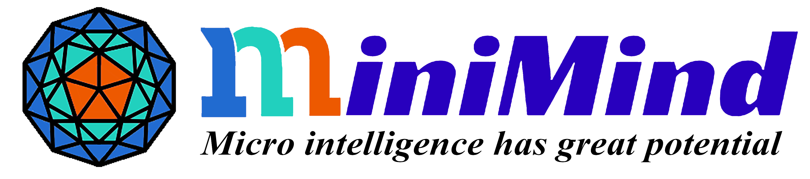
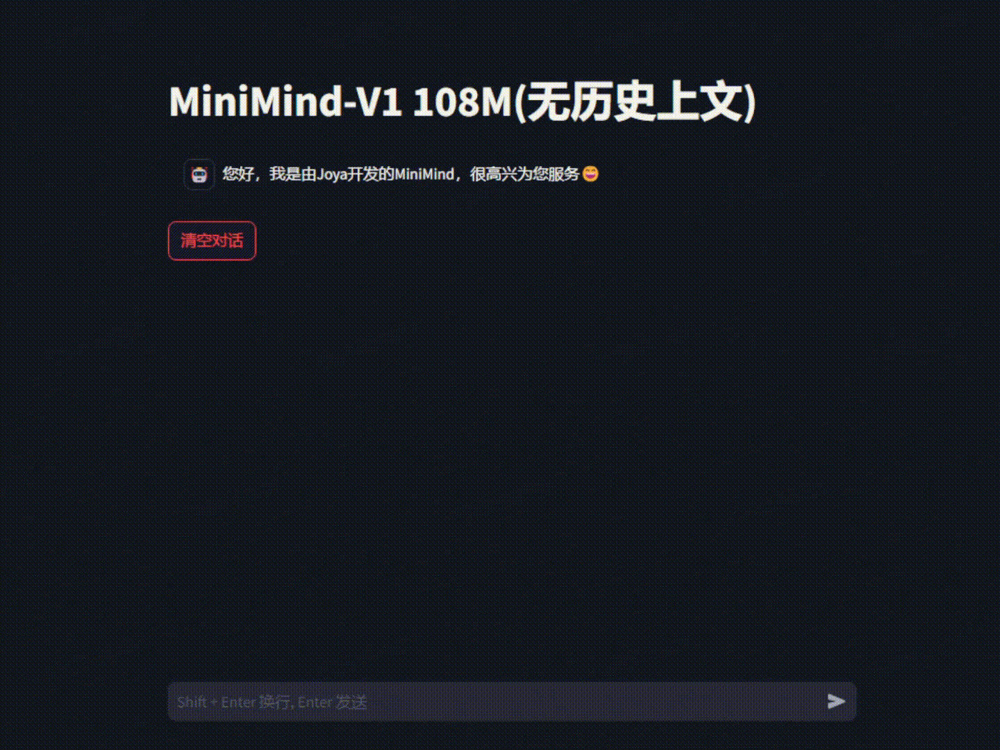
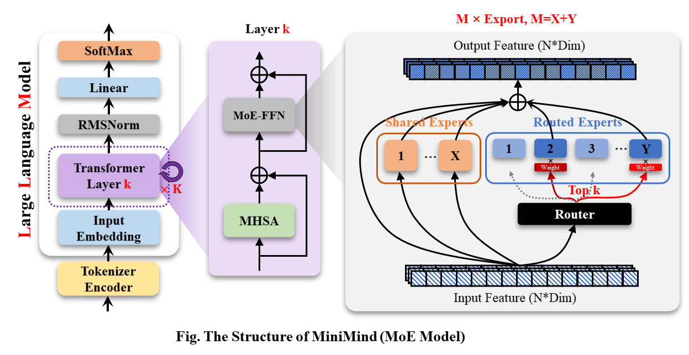
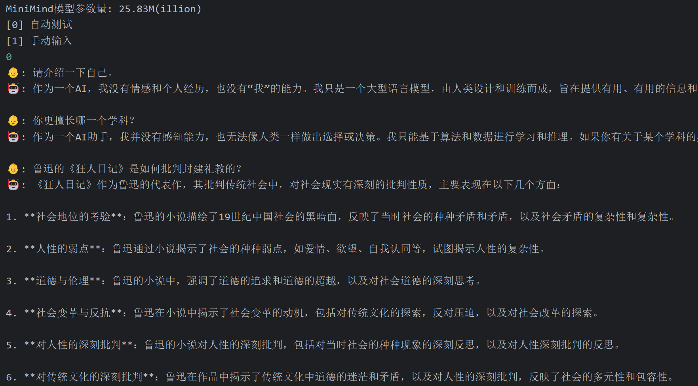

<div align="center">



</div>

<div align="center">


[](https://github.com/jingyaogong/minimind/stargazers)
[](LICENSE)
[](https://github.com/jingyaogong/minimind/commits/master)
[](https://github.com/jingyaogong/minimind/pulls)
[](https://huggingface.co/collections/jingyaogong/minimind-66caf8d999f5c7fa64f399e5)

</div>

<div align="center">
  <h3>"大道至简"</h3>
</div>

<div align="center">

中文 | [English](./README_en.md)

</div>

* 本开源项目旨在完全从0开始，最快仅用3小时！即可训练出仅为26.88M大小的微型语言模型**MiniMind**。
* **MiniMind**极其轻量，最小版本体积约是 GPT3 的 $\frac{1}{7000}$，力求做到最普通的个人GPU也可快速推理甚至训练。
* **MiniMind**发布了大模型极简结构，数据集清洗和预处理、监督预训练(Pretrain)、有监督指令微调(SFT)、低秩自适应(LoRA)
  微调，无奖励强化学习直接偏好对齐(DPO)的全阶段代码，也包含拓展共享混合专家(MoE)
  的稀疏模型；拓展视觉多模态VLM: [MiniMind-V](https://github.com/jingyaogong/minimind-v)。
* 这不仅是一个开源模型的实现，也是入门大语言模型（LLM）的教程。
* 希望此项目能为研究者提供一个抛砖引玉的入门示例，帮助大家快速上手并对LLM领域产生更多的探索与创新。

  > 为防止误读，「最快3小时」是指您需要具备＞本人硬件配置的机器，具体规格的详细信息将在下文提供。

---


<div align="center">



[ModelScope在线测试](https://www.modelscope.cn/studios/gongjy/minimind) | [Bilibili视频链接](https://www.bilibili.com/video/BV12dHPeqE72/?share_source=copy_web&vd_source=670c2504f88726f8cf4a21ef6147c0e8)

---

</div>

# 📌 Introduction

大语言模型（LLM）领域，如 GPT、LLaMA、GLM 等，虽然它们效果惊艳，
但动辄10 Bilion庞大的模型参数个人设备显存远不够训练，甚至推理困难。
几乎所有人都不会只满足于用Lora等方案fine-tuing大模型学会一些新的指令，
这约等于在教牛顿玩21世纪的智能手机，然而，这远远脱离了学习物理本身的奥妙。
此外，卖课付费订阅的营销号漏洞百出的一知半解讲解AI的教程遍地，
让理解LLM的优质内容雪上加霜，严重阻碍了学习者。

因此，本项目的目标是把上手LLM的门槛无限降低，
直接从0开始训练一个极其轻量的语言模型。

> [!TIP]
> （截至2024-9-17）MiniMind系列已完成了3个型号模型的预训练，最小仅需26M（0.02B），即可具备流畅的对话能力！

| 模型 (大小)                 | tokenizer长度 | 推理占用   | release    | 主观评分（/100） | 
|-------------------------|-------------|--------|------------|------------|
| minimind-v1-small (26M) | 6400        | 0.5 GB | 2024.08.28 | 50'        |
| minimind-v1-moe (4×26M) | 6400        | 1.0 GB | 2024.09.17 | 55'        |
| minimind-v1 (108M)      | 6400        | 1.0 GB | 2024.09.01 | 60'        |

> 该分析在具有Torch 2.1.2、CUDA 12.2和Flash Attention 2的2×RTX 3090 GPU上进行。


项目包含：

- 公开MiniMind模型代码（包含Dense和MoE模型）、Pretrain、SFT指令微调、LoRA微调、DPO偏好优化的全过程代码、数据集和来源。
- 兼容`transformers`、`accelerate`、`trl`、`peft`等流行框架。
- 训练支持单机单卡、单机多卡(DDP、DeepSpeed)训练，使用wandb可视化训练流程。支持在任意位置停止，及在任意位置继续训练。
- 在Ceval数据集上进行模型测试的代码。
- 实现Openai-Api基本的chat接口，便于集成到第三方ChatUI使用（FastGPT、Open-WebUI等）。

希望此开源项目可以帮助LLM初学者快速入门！

### 👉**最近更新**

<details close> 
<summary> <b>2024-10-05 (newest 🎉)</b> </summary>

- 为MiniMind拓展了多模态能力之---视觉

- 移步孪生项目[minimind-v](https://github.com/jingyaogong/minimind-v)查看详情！

</details>

<details close> 
<summary> <b>2024-09-27</b> </summary>

- 09-27更新pretrain数据集的预处理方式，为了保证文本完整性，放弃预处理成.bin训练的形式（轻微牺牲训练速度）。

- 目前pretrain预处理后的文件命名为：pretrain_data.csv。

- 删除了一些冗余的代码。

</details>

<details close> 
<summary> <b>2024-09-17</b> </summary>

- 更新minimind-v1-moe模型

- 为了防止歧义，不再使用mistral_tokenizer分词，全部采用自定义的minimind_tokenizer作为分词器。

</details>

<details close>
<summary> <b>2024-09-01</b> </summary>

- 更新minimind-v1 (108M)模型，采用minimind_tokenizer，预训练轮次3 + SFT轮次10，更充分训练，性能更强。

- 项目已部署至ModelScope创空间，可以在此网站上体验：

- [🔗ModelScope在线体验🔗](https://www.modelscope.cn/studios/gongjy/minimind)

</details>

<details close> 
<summary> <b>2024-08-27</b> </summary>

- 项目首次开源

</details>

# 📌 Environment

仅是我个人的软硬件环境配置，自行酌情更改：

```bash
CPU: Intel(R) Core(TM) i9-10980XE CPU @ 3.00GHz
内存：128 GB
显卡：NVIDIA GeForce RTX 3090(24GB) * 2
环境：python 3.9 + Torch 2.1.2 + DDP单机多卡训练
```

* Ubuntu == 20.04
* Python == 3.9
* Pytorch == 2.1.2
* CUDA == 12.2
* [requirements.txt](./requirements.txt)

# 📌 Quick Start Test

<div align="center" style="font-size: 1.5em; font-weight: bold;">
  
  Hugging Face

[MiniMind (HuggingFace)](https://huggingface.co/collections/jingyaogong/minimind-66caf8d999f5c7fa64f399e5)

 

[MiniMind (ModelScope)](https://www.modelscope.cn/models/gongjy/minimind-v1)

</div>

```bash
# step 1
git clone https://huggingface.co/jingyaogong/minimind-v1
```

```bash
# step 2
python 2-eval.py
```

或者启动streamlit，启动网页聊天界面

```bash
# or step 3, use streamlit
streamlit run fast_inference.py
```

# 📌 Quick Start Train

* 0、克隆项目代码
    ```bash
    git clone https://github.com/jingyaogong/minimind.git
    cd minimind
    ```

* 1、环境安装
  ```bash
  pip install -r requirements.txt -i https://pypi.tuna.tsinghua.edu.cn/simple
  ```

  ```text
  # 测试torch是否可用cuda
  import torch
  print(torch.cuda.is_available())
  ```

  > 如果不可用，请自行去[torch_stable](https://download.pytorch.org/whl/torch_stable.html)
  下载whl文件安装。参考[链接](https://blog.csdn.net/weixin_45456738/article/details/141029610?ops_request_misc=&request_id=&biz_id=102&utm_term=%E5%AE%89%E8%A3%85torch&utm_medium=distribute.pc_search_result.none-task-blog-2~all~sobaiduweb~default-2-141029610.nonecase&spm=1018.2226.3001.4187)


* 2、如果你需要自己训练

    * 2.1 下载[数据集下载地址](#数据集下载地址)放到`./dataset`目录下

    * 2.2 `python data_process.py`处理数据集，例如pretrain数据提前进行token-encoder、sft数据集抽离qa到csv文件

    * 2.3 在`./model/LMConfig.py` 中调整model的参数配置
      > 这里仅需调整dim和n_layers和use_moe参数，分别是`(512+8)`或`(768+16)`，对应于`minimind-v1-small`和`minimind-v1`
    * 2.4 `python 1-pretrain.py` 执行预训练，得到 `pretrain_*.pth` 作为预训练的输出权重
    * 2.5 `python 3-full_sft.py` 执行指令微调，得到 `full_sft_*.pth` 作为指令微调的输出权重
    * 2.6 `python 4-lora_sft.py` 执行lora微调（非必须）
    * 2.7 `python 5-dpo_train.py` 执行DPO人类偏好强化学习对齐（非必须）
* 3、测试模型推理效果
    * 确保需要使用的，训练完成的参数权重`*.pth`文件位于`./out/`目录下
    * 也可以直接去[训练完成的模型权重](#训练完成的模型权重)下载使用我训练好的`*.pth`权重文件
       ```text
      minimind/out
      ├── multi_chat
      │   ├── full_sft_512.pth
      │   ├── full_sft_512_moe.pth
      │   └── full_sft_768.pth
      ├── single_chat
      │   ├── full_sft_512.pth
      │   ├── full_sft_512_moe.pth
      │   └── full_sft_768.pth
      ├── pretrain_768.pth
      ├── pretrain_512_moe.pth
      ├── pretrain_512.pth
      ```
    * `python 0-eval_pretrain.py`测试预训练模型的接龙效果
    * `python 2-eval.py`测试模型的对话效果
      

🍭「Tip」预训练和全参微调pretrain和full_sft均支持多卡加速

> 假设你的设备只有1张显卡，使用原生python启动训练即可：

* 执行预训练或指令微调训练
    ```bash
    python 1-pretrain.py
    # and
    python 3-full_sft.py
    ```

> 假设你的设备有N (N＞1) 张显卡：

* 单机N卡启动训练(DDP)
    ```bash
    torchrun --nproc_per_node N 1-pretrain.py
    # and
    torchrun --nproc_per_node N 3-full_sft.py
    ```
* 单机N卡启动训练(DeepSpeed)
    ```bash
    deepspeed --master_port 29500 --num_gpus=N 1-pretrain.py
    # and
    deepspeed --master_port 29500 --num_gpus=N 3-full_sft.py
    ```

* 开启wandb记录训练过程(非必须)
    ```bash
    torchrun --nproc_per_node N 1-pretrain.py --use_wandb
    # and
    python 1-pretrain.py --use_wandb
    ```
  通过添加`--use_wandb`参数，可以记录训练过程，训练完成后，可以在wandb网站上查看训练过程。通过修改`wandb_project`
  和`wandb_run_name`参数，可以指定项目名称和运行名称。

# 📌 Data sources

- 🤖 分词器：nlp中的Tokenizer类似于词典，将单词从自然语言通过“词典”映射到0,1,36这样的数字，可以理解为数字就代表了单词在“词典”中的页码。
  LLM分词器的构建方式有两种：一种是自己构造词表训练一个分词器，代码可见`train_tokenizer.py`；另一种是选择开源模型训练好的分词器。
  “词典”当然可以直接选择用新华词典或是牛津词典，优点是token转化压缩率很好，但缺点是词表太长，动辄数十万个词汇短语；
  也可以使用自己训练的分词器，优点是词表随意控制，缺点是压缩率不够理想，且生僻词不容易面面俱到。
  当然，“词典”的选择很重要，LLM的输出本质上是SoftMax到词典N个词的多分类问题，然后通过“词典”解码到自然语言。
  因为LLM体积非常小，为了避免模型头重脚轻（词嵌入embedding层参数占整个LLM比太高），所以词表长度需要选择比较小。
  强大的开源模型例如01万物、千问、chatglm、mistral、Llama3等，它们的tokenizer词表长度如下：

    <table>
      <tr><th>Tokenizer模型</th><th>词表大小</th><th>来源</th></tr>
      <tr><td>yi tokenizer</td><td>64,000</td><td>01万物（中国）</td></tr>
      <tr><td>qwen2 tokenizer</td><td>151,643</td><td>阿里云（中国）</td></tr>
      <tr><td>glm tokenizer</td><td>151,329</td><td>智谱AI（中国）</td></tr>
      <tr><td>mistral tokenizer</td><td>32,000</td><td>Mistral AI（法国）</td></tr>
      <tr><td>llama3 tokenizer</td><td>128,000</td><td>Meta（美国）</td></tr>
      <tr><td>minimind tokenizer</td><td>6,400</td><td>自定义</td></tr>
    </table>

  > 👉2024-09-17更新：为了防止过去的版本歧义&控制体积，minimind所有模型均使用minimind_tokenizer分词，废弃所有mistral_tokenizer版本。

  > 尽管minimind_tokenizer长度很小，编解码效率弱于qwen2、glm等中文友好型分词器。
  > 但minimind模型选择了自己训练的minimind_tokenizer作为分词器，以保持整体参数轻量，避免编码层和计算层占比失衡，头重脚轻，因为minimind的词表大小只有6400。
  > 且minimind在实际测试中没有出现过生僻词汇解码失败的情况，效果良好。
  > 由于自定义词表压缩长度到6400，使得LLM总参数量最低只有26M。

---

- 📙【Pretrain数据】：
  [Seq-Monkey通用文本数据集](https://github.com/mobvoi/seq-monkey-data/blob/main/docs/pretrain_open_corpus.md) / [Seq-Monkey百度网盘](https://pan.baidu.com/s/114F1k3eksiWCOQLvaT3RYQ?pwd=6666)
  是由多种公开来源的数据（如网页、百科、博客、开源代码、书籍等）汇总清洗而成。整理成统一的JSONL格式，并经过了严格的筛选和去重，确保数据的全面性、规模、可信性和高质量。总量大约在10B
  token，适合中文大语言模型的预训练。

  > 第2种选择：[SkyPile-150B数据集](https://hf-mirror.com/datasets/Skywork/SkyPile-150B/tree/main/data)
  的可公开访问部分包含约2.33亿个独立网页，每个网页平均包含1000多个汉字。数据集包括大约1500亿个令牌和620GB的纯文本数据。
  **如果着急的话**，可以尝试只挑选SkyPile-150B的部分jsonl下载（并在./data_process.py中对文本tokenizer生成*
  .csv文件），以便快速跑通预训练流程。

---

- 📕【SFT数据】：[匠数大模型SFT数据集](https://www.modelscope.cn/datasets/deepctrl/deepctrl-sft-data)
  是一个完整、格式统一、安全的大模型训练和研究资源。
  从网络上的公开数据源收集并整理了大量开源数据集，对其进行了格式统一，数据清洗，
  包含10M条数据的中文数据集和包含2M条数据的英文数据集。
  总量大约在3B token，适合中文大语言模型的SFT。
  数据集整合来源于以下所有数据（仅供参考，因此无需单独下载，仅需下载一个完整的【SFT数据】）：
    - [BelleGroup/train_3.5M_CN](https://huggingface.co/datasets/BelleGroup/train_3.5M_CN)
    - [LinkSoul/instruction_merge_set](https://huggingface.co/datasets/LinkSoul/instruction_merge_set)
    - [stingning/ultrachat](https://huggingface.co/datasets/stingning/ultrachat)
    - [BAAI/COIG-PC-core](https://huggingface.co/datasets/BAAI/COIG-PC-core)
    - [shibing624/sharegpt_gpt4](https://huggingface.co/datasets/shibing624/sharegpt_gpt4)
    - [shareAI/ShareGPT-Chinese-English-90k](https://huggingface.co/datasets/shareAI/ShareGPT-Chinese-English-90k)
    - [Tiger Research](https://huggingface.co/TigerResearch/sft_zh)
    - [BelleGroup/school_math_0.25M](https://huggingface.co/datasets/BelleGroup/school_math_0.25M)
    - [YeungNLP/moss-003-sft-data](https://huggingface.co/datasets/YeungNLP/moss-003-sft-data)

---

- 📘【DPO数据】：大约合并后共8万条dpo数据，人工标注的偏好数据，均来自[活字模型](https://github.com/HIT-SCIR/huozi)
  ，可以用于训练奖励模型，优化模型回复质量，使其更加符合人类偏好。

---

- 【更多数据集】目前已经有[HqWu-HITCS/Awesome-Chinese-LLM](https://github.com/HqWu-HITCS/Awesome-Chinese-LLM)
  在收集和梳理中文LLM相关的开源模型、应用、数据集及教程等资料，并持续更新这方面的最新进展。全面且专业，Respect！

---

### 数据集下载地址

下载到`./dataset/`目录下

| MiniMind训练数据集      | 下载地址                                                                                                                                                                                                                       |
|--------------------|----------------------------------------------------------------------------------------------------------------------------------------------------------------------------------------------------------------------------|
| **【tokenizer训练集】** | [HuggingFace](https://huggingface.co/datasets/jingyaogong/minimind_dataset/tree/main) / [百度网盘](https://pan.baidu.com/s/1yAw1LVTftuhQGAC1Y9RdYQ?pwd=6666)                                                                   |
| **【Pretrain数据】**   | [Seq-Monkey官方](http://share.mobvoi.com:5000/sharing/O91blwPkY)  / [百度网盘](https://pan.baidu.com/s/1-Z8Q37lJD4tOKhyBs1D_6Q?pwd=6666) / [HuggingFace](https://huggingface.co/datasets/jingyaogong/minimind_dataset/tree/main) |
| **【SFT数据】**        | [匠数大模型SFT数据集](https://www.modelscope.cn/datasets/deepctrl/deepctrl-sft-data/resolve/master/sft_data_zh.jsonl)                                                                                                              |
| **【DPO数据】**        | [Huggingface](https://huggingface.co/datasets/jingyaogong/minimind_dataset/tree/main/dpo)                                                                                                                                  |

# 📌 Model

MiniMind-Dense（和[Llama3.1](https://ai.meta.com/blog/meta-llama-3-1/)一样）使用了Transformer的Decoder-Only结构，跟GPT-3的区别在于：

* 采用了GPT-3的预标准化方法，也就是在每个Transformer子层的输入上进行归一化，而不是在输出上。具体来说，使用的是RMSNorm归一化函数。
* 用SwiGLU激活函数替代了ReLU，这样做是为了提高性能。
* 像GPT-Neo一样，去掉了绝对位置嵌入，改用了旋转位置嵌入（RoPE），这样在处理超出训练长度的推理时效果更好。

---

MiniMind-MoE模型，它的结构基于Llama3和[Deepseek-V2](https://arxiv.org/pdf/2405.04434)中的MixFFN混合专家模块。

* DeepSeek-V2在前馈网络（FFN）方面，采用了更细粒度的专家分割和共享的专家隔离技术，以提高Experts的效果。

---

MiniMind的整体结构一致，只是在RoPE计算、推理函数和FFN层的代码上做了一些小调整。
其结构如下图（重绘版）：




修改模型配置见[./model/LMConfig.py](./model/LMConfig.py)。
minimind目前训练的模型版本见下表：

| Model Name        | params | len_vocab | n_layers | d_model | kv_heads | q_heads | share+route | TopK |
|-------------------|--------|-----------|----------|---------|----------|---------|-------------|------|
| minimind-v1-small | 26M    | 6400      | 8        | 512     | 8        | 16      | -           | -    |
| minimind-v1-moe   | 4×26M  | 6400      | 8        | 512     | 8        | 16      | 2+4         | 2    |
| minimind-v1       | 108M   | 6400      | 16       | 768     | 8        | 16      | -           | -    |

# 📌 Experiment

| Model Name        | params | len_vocab | batch_size | pretrain_time     | sft_single_time   | sft_multi_time      |
|-------------------|--------|-----------|------------|-------------------|-------------------|---------------------|
| minimind-v1-small | 26M    | 6400      | 64         | ≈2 hour (1 epoch) | ≈2 hour (1 epoch) | ≈0.5 hour (1 epoch) |
| minimind-v1-moe   | 4×26M  | 6400      | 40         | ≈6 hour (1 epoch) | ≈5 hour (1 epoch) | ≈1 hour (1 epoch)   |
| minimind-v1       | 108M   | 6400      | 16         | ≈6 hour (1 epoch) | ≈4 hour (1 epoch) | ≈1 hour (1 epoch)   |

---

1. **预训练(Text-to-Text)**:
    - LLM首先要学习的并非直接与人交流，而是让肚子中充满知识的墨水，至于墨水理论上喝的越饱越好，产生大量的对世界的认知积累。
    - 预训练就是让Model先埋头苦学大量基本的知识，例如从维基百科、新闻、常识、书籍等。
    - 它无监督的从大量的文本数据中压缩知识到自己模型的权重，目的是：学会词语接龙。例如我们输入“秦始皇是”四个字，它在大量学习后能预测出下一句话大概率是“中国的第一位皇帝”。
   > pretrain的学习率设置为1e-4到1e-5的动态学习率，预训练epoch数设为5。
    ```bash
    torchrun --nproc_per_node 2 1-pretrain.py
    ```
2. **单轮次对话有监督微调(Single dialog Fine-tuning)**:
    - 经过预训练，半成品LLM此时已经掌握了几乎所有的语言知识和百科常识。此时它还不会与人聊天，相反它只会无脑地进行输入词语的接龙，生成下一个词。
    - 此时需要对半成品LLM做限制在聊天模板中进行微调，例如当它遇到这样的模板“<聊天开始>秦始皇是<聊天终止>
      ”后不再无脑接龙，而是意识到这是一段完整的对话结束。
    - 我们称这个过程为指令微调，就如同让学富五车的「牛顿」先生适应21世纪的聊天习惯，学习屏幕左侧是对方消息，右侧是本人消息这个规律。
    - 在训练时，MiniMind的指令和回答长度被截断在512，是为了节省显存空间。就像我们学习时，会先从短的文章开始，当学会阅读200字作文后，800字长文章就不需要再单独学习。
   > 在推理时通过调整RoPE线性差值，实现长度外推到1024或2048及以上很方便。学习率设置为1e-5到1e-6的动态学习率，微调epoch数为6。

   ```bash
   # 3-full_sft.py中设置数据集为sft_data_single.csv
   torchrun --nproc_per_node 2 3-full_sft.py
   ```
3. **多轮对话微调(Multi dialog Fine-tuning)**:
    - 在2的基础上，LLM已经学会一个问题->一个回答的聊天模板。此时仅需在具备历史问答的更长聊天模板上进一步微调即可。
    - 我们仅需使用数据集的history_chat 字段，即历史对话，以及history_chat_response字段，即历史对话的回答。
    - 构建【问题->回答，问题->回答，问题->】的新聊天模板，然后使用这个数据集进行微调。
    - 学习完成的模型不仅仅只能回答当前问题，还能根据历史对话进行连贯的对话。
    - 这一步 **并非必须** ，因为小模型长上文对话能力很弱，强行对齐多轮问答模板会损失一定程度的单轮SFT效果。
   > 学习率设置为1e-5到1e-6的动态学习率，微调epoch数为5。
    ```bash
    # 3-full_sft.py中设置数据集为sft_data.csv
    torchrun --nproc_per_node 2 3-full_sft.py
    ```
4. **人类反馈强化学习(RLHF)之-直接偏好优化(Direct Preference Optimization, DPO)**:
    - 在前面的训练中，GPT已经具备了基本的对话能力，但是这样的能力完全基于单词接龙，缺少正例反例的激励。
    - GPT尚且未知什么回答是好的，什么是差的。我们希望它能够更符合人的偏好，给出更让人满意的回答。
    - 这个过程就像是让GPT参加工作培训，从优秀员工的作为例子，消极员工作为反例，学习如何更好地服务客户。
    - RLHF系列中，与PPO(Proximal Policy Optimization)这种需要奖励模型、价值模型的RL算法不同；
    - DPO通过推导PPO奖励模型的显式解，把在线奖励模型换成离线数据，ref输出可以提前保存。
    - DPO性能几乎不变，只用跑 actor 和 ref 2 个模型，大大节省显存开销和增加训练稳定性。
    - 同样的，LLM的RL步骤也 **并非必须**，有利也有弊。
   > 活字三元组(q,chose,reject)数据集，学习率le-5，半精度fp16,共1个epoch，耗时1h。
    ```bash
    python 5-dpo_train.py
    ```

---

📋关于LLM的参数配置，有一篇很有意思的论文[MobileLLM](https://arxiv.org/pdf/2402.14905)做了详细的研究和实验。
scaling law在小模型中有自己独特的规律。
引起Transformer参数成规模变化的参数几乎只取决于`d_model`和`n_layers`。

* `d_model`↑+`n_layers`↓->矮胖子
* `d_model`↓+`n_layers`↑->瘦高个

2020年提出Scaling Law的论文认为，训练数据量、参数量以及训练迭代次数才是决定性能的关键因素，而模型架构的影响几乎可以忽视。
然而似乎这个定律对小模型并不完全适用。
MobileLLM提出架构的深度比宽度更重要，「深而窄」的「瘦长」模型可以学习到比「宽而浅」模型更多的抽象概念。
例如当模型参数固定在125M或者350M时，30～42层的「狭长」模型明显比12层左右的「矮胖」模型有更优越的性能，
在常识推理、问答、阅读理解等8个基准测试上都有类似的趋势。
这其实是非常有趣的发现，因为以往为100M左右量级的小模型设计架构时，几乎没人尝试过叠加超过12层。
这与MiniMind在训练过程中，模型参数量在`d_model`和`n_layers`之间进行调整实验观察到的效果是一致的。
然而「深而窄」的「窄」也是有维度极限的，当d_model<512时，词嵌入维度坍塌的劣势非常明显，
增加的layers并不能弥补词嵌入在固定q_head带来d_head不足的劣势。
当d_model>1536时，layers的增加似乎比d_model的优先级更高，更能带来具有“性价比”的参数->效果增益。
因此MiniMind设定small模型的d_model=512，n_layers=8来获取的「极小体积<->更好效果」的平衡。
设定d_model=768，n_layers=16来获取效果的更大收益，更加符合小模型scaling-law的变化曲线。


> 作为参考，GPT3的参数设定见下表：


---

### 训练完成的模型权重

[🔗百度网盘](https://pan.baidu.com/s/1KUfSzEkSXYbCCBj0Pw-9fA?pwd=6666)

| Model Name        | params | Config                      | pretrain_model         | single_sft_model                   | multi_sft_model                   | rl_model     |
|-------------------|--------|-----------------------------|------------------------|------------------------------------|-----------------------------------|--------------|
| minimind-v1-small | 26M    | d_model=512<br/>n_layers=8  | `pretrain_512.pth`     | `single_chat/full_sft_512.pth`     | `multi_chat/full_sft_512.pth`     | `rl_512.pth` |
| minimind-v1-moe   | 4×26M  | d_model=512<br/>n_layers=8  | `pretrain_512_moe.pth` | `single_chat/full_sft_512_moe.pth` | `multi_chat/full_sft_512_moe.pth` | -            |
| minimind-v1       | 108M   | d_model=768<br/>n_layers=16 | `pretrain_768.pth`     | `single_chat/full_sft_768.pth`     | `multi_chat/full_sft_768.pth`     | `rl_768.pth` |

---

# 📌 Eval

## ① RLHF篇

> [!TIP]
> 测试基于「单轮对话full_sft」和「DPO强化学习对齐」的minimind模型对比。

模型文件[百度网盘](https://pan.baidu.com/s/1KUfSzEkSXYbCCBj0Pw-9fA?pwd=6666)，其中 `rl_<dim>.pth`
即为「DPO强化学习对齐」后的minimind模型权重。

```text
[Q]: 你叫什么名字？
[ft_768]: 我是一款人工智能语言模型，可以回答您的问题和提供帮助。您有什么需要我帮忙的吗？
[rl_768]: 我是一款基于人工智能技术的自然语言处理系统，主要用于处理和生成人类语言的任务。我可以帮助用户进行文本处理、语音识别、文本生成等任务，同时也可以帮助用户进行智能聊天、翻译、翻译等多种应用。如果您需要更多关于该项目的信息，请告诉我。
[ft_512]: 我很高兴能够帮助你。你有什么其他问题需要我帮忙解答吗？
[rl_512]: 我是一款基于自然语言处理技术的聊天机器人，能够理解和回复用户的问题和指令，并进行相应的回复和回复。我被训练为能够与人类进行交互和回答各种问题和任务。请问有什么需要吗？

[Q]: 你是谁？
[ft_768]: 我是一个人工智能语言模型，没有个人身份和身份。我只是根据输入的指令和文本信息生成响应。
[rl_768]: 我是一个计算机程序，没有个人身份或身份。我被设计来回答各种问题和提供帮助，包括回答问题、提供建议、进行实验、提供信息等等。我被广泛应用于各种领域，例如自然语言处理、计算机视觉、人工智能等等。如果您需要更多的帮助或信息，请随时与我联系。我会尽我所能来帮助您的工作和生活。
[ft_512]: 我是一个大型语言模型，可以回答各种各样的问题，包括科学、历史、文化和技术方面的问题。您有什么需要我回答的问题吗？
[rl_512]: 我是一个计算机程序，没有具体的身世和人物。如果您可以告诉我您想知道的具体信息，我会尽力回答您的问题。

[Q]: 中国有哪些比较好的大学？
[ft_768]: 中国有很多著名的大学，其中包括北京大学、上海交通大学、复兴中医药学院、浙江大学等。这些大学在不同的领域都有着自己的标志性建筑和研究方向，值得一提的是，它们在中国的顶尖教育资源中享有很高的声誉。
[rl_768]: 中国的大学有很多，具体情况还要根据你的需求来决定。如果你需要更详细的信息，建议可以去咨询一下你所在城市的大学排名和政策法规，从而选择一个合适的大学。同时，你可以在网上查阅相关信息，或者去咨询一些大学相关机构，如中国人民大学、中国人民大学等，以获得更为详细和专业的指导和建议。
[ft_512]: 中国有很多优秀的大学，比如麻省理工学院、北京大学、上海大学等等。这些大学在中国教育事业的发展和成就都非常突出。
[rl_512]: 中国教育局、中国大学、中国大陆大学和中国大陆大学均有优秀的教育体裁，但各地教育水平和专业要求都可能存在差异。中国教育局的学历要求、教学方法、师资力量等因素都各具特点，而大学的学历要求也各有千秋。中国大陆大学生的学历要求也各有不同，需要根据自己的实际情况进行选择。如果您对中国大陆大学生的专业要求有更具体需求，建议您可以通过互联网、国内外的各类机构和机构进行比较和交流。同时，您也可以向身边的人或朋友、老师、家长等人士寻求帮助和建议。希望以上回答对您有帮助。

[Q]: 你知道光速是多少吗？
[ft_768]: 光速是一个物理常数，表示光在真空中传播的速度，大约是每秒299792458米。光速是物理学中最基本的物理常数之一，也是相对论的重要基础之一。
[rl_768]: 当然知道，光速是光在真空中传播的速度，通常用c来表示。它是宇宙物理学中非常重要的理论之一。在物理学中，光速被认为是宇宙中最重要的速度之一。它代表着光在真空中传播的速度，这也是许多重要公式和公式的基础。
[ft_512]: 光速是光在真空中传播的速度，约为每秒299,792,458米。它是几乎所有的物理学概念，也是宇宙中最神秘和最重要的物理概念之一。
[rl_512]: 光速是光在真空中传播的速度，是自然界中不可逆转的速度。光源是由光的原子、分子、固体和光的组成，其速度约为每秒平方。光的速度是每秒约1个英亞或光年，这个数字是根据相对论、量子力学和引力理论来计算的。光速是相对的概念之一，它代表着我们对自然界中任何事件的理解和解释。
```

### 👉效果总结

* RLHF数据使用大约10万条；full_sft模型在简洁性和信息准确性方面表现更好；rl模型在回答中提供了更多的背景信息，但信息准确性有待改进。
* 总的来说RLHF后的模型倾向于学习：说更多有礼貌但无用的废话讨好“对话”本身，而对信息准确性则有轻微损失。
* 天下没有免费的午餐，还需要继续提升RLHF数据集的质量，也要接受模型能力无法避免的损失(程度有轻重)。
* DPO和在线PPO的区别在于reject和chosen都是离线准备的，和minimind模型本身的输出必然存在很大的分布差异。
* 这类似于DPO算法使模型观看乒乓球世界冠军的打法「录像」进行强化学习，而不是像PPO一样请reward模型做「教练」纠正自己的打法强化学习。

## ② Instruct Fine-Tuning 篇

> [!TIP]
> 以下测试于2024-09-17完成，此日期后发布的新模型，无特殊需要时将不加入测试。
> 测试基于单轮对话full_sft的minimind模型(无多轮微调和强化学习微调)。

[A] [minimind-v1-small(0.02B)](https://pan.baidu.com/s/1_COe0FQRDmeapSsvArahCA?pwd=6666)<br/>
[B] [minimind-v1-moe(0.1B)](https://pan.baidu.com/s/1tqB-GMvuiGQBvEl-yZ-oBw?pwd=6666)<br/>
[C] [minimind-v1(0.1B)](https://pan.baidu.com/s/1p713loS7EfwHQf3G9eYI3Q?pwd=6666)<br/>
[D] [baby-llama2-chinese(0.2B)](https://github.com/DLLXW/baby-llama2-chinese)<br/>
[E] [chatlm-mini-chinese(0.2B)](https://github.com/charent/ChatLM-mini-Chinese)<br/>

```text
[Q]: 你知道长江吗？
[A]: 是的，长江是中国最长的河流，全长超过3300千米。
[B]: 长江是中国最长的河流，总长度约为6300公里。它发源于青藏高原的青海湖，流经青海、四川、甘肃、宁夏、内蒙古、陕西和山西。长江流域是中国最大的农业区之一，也是中国的文化和经济中心。
[C]: 是的，长江是中国最长的河流之一，也是世界第三大河流。长江发源于青藏高原，流经11个省份，最终注入东海。长江流域是中国最大的河流流域之一，拥有着丰富的自然资源和文化遗产，如长江大桥、长江海洋博物馆、长江古城等。
[D]: 同时也知道，中国是世界上最长的城市之一，拥有超过3400万人口。
[E]: 是的，长江是中国最长的河流，也是世界上最长的河流之一。它发源于青藏高原，流经九个省区，最终注入东海。长江流域的气候温和，四季分明，是中国重要的农业和工业基地。长江流域的水产资源丰富，是中国的重要渔业资源之一。


[Q]: 第一颗人造卫星是哪个国家发射的？
[A]: 第一颗人造卫星是斯普特尼克1号。
[B]: 第一颗人造卫星是俄罗斯的国际卫星，于1957年发射。
[C]: 第一颗人造卫星是苏联发射的，它是由苏联于1957年10月发射的。
[D]: 这颗名为“阿姆斯特朗”的卫星，于1961年11月20日发射，是第一个成功将人类送入太空的卫星。
[E]: 第一颗人造卫星是苏联于1957年4月4日发射的，它是由苏联宇航员尤里·加加林（Yuri Gagarin）和苏联工程师罗尔德·谢尔盖耶夫（Roald Skohley）共同发射的。在发射过程中，加加林和谢尔盖耶夫使用了一个名为“斯普特尼克1号”的小型卫星，它的直径为4.3米，重量为1,051公斤。这枚卫星被称为“斯普特尼克1号”，是苏联太空竞赛中的一个里程碑，也是人类历史上第一次在太空中进行太空行走。


[Q]: 你知道泰山在哪里吗？
[A]: 泰山位于中国东部地区，是中国五岳之一。
[B]: 泰山位于山东省泰安市泰安市。泰安市是中国五岳之一，也是世界文化遗产和中国历史文化名山之一。泰安市有许多著名的景点，如五岳之一、玉皇顶、南天门、玉皇阁等。
[C]: 泰山位于中国山东省泰安市，是中国五岳之一。
[D]: 作为一个人工智能助手，我无法访问互联网，因此无法提供关于你所在位置的信息。不过，你可以通过搜索或搜索相关关键词来获取有关你所在位置的信息，或者查看相关新闻或网站来获取有关你所在位置的信息。
[E]: 泰山位于中国山东省泰安市境内，是中国五岳之一，也是中国文化和历史的重要象征之一。它是中国五岳之一，也是中国道教和佛教的发源地之一。泰山的海拔高度为1,545米，是中国五岳之一，也是中国最著名的旅游景点之一。它的历史可以追溯到公元前5世纪，是中国古代帝王祭祀的场所。泰山也是中国文化的重要组成部分，被誉为“五岳之首”，是中国文化的重要遗产之一。


[Q]: 世界上最高的山峰是什么？
[A]: 世界上最高的山峰是珠穆朗玛峰，位于尼泊尔和中国的边境上，海拔8848米。
[B]: 世界上最高的山峰是珠穆朗玛峰，位于喜马拉雅山脉，海拔8,848米。
[C]: 珠穆朗玛峰是世界上最高的山峰，海拔8848米。
[D]: 世界上最高的山峰是珠穆朗玛峰，位于喜马拉雅山脉，海拔8,848.86米（29,031.69英尺）。
[E]: 世界上最高的山峰是珠穆朗玛峰，也称为萨加玛塔，位于喜马拉雅山脉的尼泊尔和中国边境之间，海拔8,848.86米（29,031.69英尺）。它是世界上最著名的登山目标之一，吸引着来自世界各地的登山者前来挑战。珠穆朗玛峰的名字来自藏语，意思是“女神的额峰”，它是由两个不同的山峰组成的，其中一个是位于尼泊尔的珠穆朗玛峰，另一个则位于中国。它的高度是通过测量海拔高度来确定的，因为它是通过测量地球的平均高度来确定的。尽管珠穆朗玛峰是世界上最高的山峰，但它并不是地球上任何其他地方都能到达的。地球上的其他地方，如南美洲的安第斯山脉，也是世界上最高的山脉，但它并不是地球上最高的山峰。总之，珠穆朗玛峰是世界上最高的山峰，但它并不是地球上任何地方都能到达的。它是地球上最高的山脉，但它并不是地球上任何地方都能到达的。


[Q]: 万有引力是谁提出的？
[A]: 万有引力是由英国物理学家牛顿提出的。他认为，所有物体都会产生引力，这个引力是由物体的质量和距离决定的。这个理论揭示了质量和距离之间的关系，并证明了万有引力的本质。
[B]: 万有引力是由牛顿在1687年提出的。它是宇宙中一个基本的物理现象，它描述了物体之间的相互作用。这个力被称为万有引力，它在所有物体之间都存在，这种力与物体的质量和距离有关。万有引力是自然界中最基本的力量之一，它不仅影响着物体的运动和变化，还对宇宙的结构和演化产生着重要的影响。
[C]: 万有引力是英国物理学家艾萨克·牛顿在17世纪提出的。
[D]: 引力是宇宙中一种力量，它是由质量或能量所组成的。根据牛顿的万有引力定律，一个物体之间的引力大小与它的质量成正比，与它的质量成反比。因此，牛顿的万有引力定律表明，一个物体之间的引力大小与它的质量成正比，与它的质量成反比。这个定律在物理学、天文学和物理学中都有广泛的应用。
[E]: 万有引力是由英国物理学家艾萨克·牛顿于1687年提出的。他在1687年发表了一篇著名的论文，题为《自然哲学的数学原理》，其中提出了万有引力定律，指出任何两个物体之间都存在着一种引力，这种引力的大小与它们的质量成正比，与它们之间的距离的平方成反比。这个定律被称为万有引力定律，它描述了质量和距离之间的关系。它表明，两个物体之间的引力与它们的质量成正比，与它们之间的距离的平方成反比。这个定律对于解释宇宙中的许多现象和现象之间的相互作用非常重要，例如行星绕太阳运动、恒星之间的引力透镜效应等等。它也被广泛应用于天文学、物理学和工程学等领域，为我们理解宇宙的本质和演化提供了重要的理论基础。


[Q]: 你知道大熊猫的主要食物是什么吗？
[A]: 大熊猫的主要食物是竹子。它们通常吃竹子，每天需要吃掉大约30公斤的竹子。
[B]: 是的，大熊猫主要以竹子为食。它们每天需要吃掉大量的竹子来维持生命，每天需要吃掉40至80公斤的竹子。此外，它们也会吃一些其他的植物，如草、果实、坚果和小型哺乳动物。
[C]: 大熊猫主要以竹子为食，也会偶尔食用其他的植物和动物。此外，大熊猫也会吃一些野果、小动物和植物，但这些都不属于它们的主要食物来源。
[D]: 大熊猫的主要食物是竹子。
[E]: 大熊猫是一种以竹子为主要食物的植食动物，它们的肠道结构适合消化纤维素含量高的竹子，但也会吃一些其他植物，如草本植物和小型哺乳动物。大熊猫的肠道结构也适应了高纤维的竹子，这使得它们能够消化大量的纤维素，从而帮助它们在野外生存。大熊猫的肠道中还含有一种叫做“纤维素酶”的酶类物质，这种酶能够帮助大熊猫分解纤维素，从而帮助它们消化大量的水分和营养物质。此外，大熊猫的肠道还含有一种叫做“纤维素蛋白”的蛋白质，这种蛋白质能够帮助大熊猫维持体内的能量水平，从而帮助它们在野外生存。总的来说，大熊猫的主要食物是竹子，但它们也会吃一些其他植物，如草本植物和小型哺乳动物。


[Q]: 海水为什么是咸的？
[A]: 海水中含有许多盐分，这些盐分可以导致海水咸度的增加。海水中的盐分主要来自于海水中的盐分，这些盐分可以从海水中的盐分中获得。海水中的氧化物和盐分可以与海水中的盐分形成氢键，从而使海水咸度增加。
[B]: 海水是咸的，这是因为它含有大量的盐分，其中包括氯离子和氯离子。这些离子在海洋中形成了大量的盐，这些盐分被称为盐分。海水中含有许多溶解在水中的盐，这些盐分会随着海水的升高而逐渐蒸发，最终导致海水中盐分的蒸发。这些盐分在海水中被完全消耗，然后被排除在海水中。此外，海水中还含有许多其他的盐分，但这些盐分是不同的，因为它们在水中的浮起和下降过程是不同的。海水中的盐分是从海底的岩石中提取出来的，这些盐分在海水中可以被利用。总的来说，海水是咸的，这也是为什么海水中含有许多盐分和盐分的原因。
[C]: 海水含有许多溶解的盐类，其中最主要的是氯化钠。当水中加入盐时，盐的分子会与水分子发生反应，形成氢氧化钠，这是一种盐。
[D]: 因为水是许多生物的生存所必需的，它能够吸收和释放二氧化碳，释放氧气，维持大气中的水蒸气，以及维持水循环。水中的盐类和化学物质会释放出氧气，使地球上的生物呼吸。此外，水还具有许多其他功能，如保持水循环、维持水循环、调节气候和环境等。水是许多生物生存所必需的，它也是许多自然现象的重要基础。
[E]: 海水是咸的主要原因是因为其中含有大量的溶解盐类，其中最主要的是氯化钠（NaCl）。氯化钠是一种非常常见的盐类，它存在于地球上的大部分地区，包括海洋、湖泊、河流和地下水。当水从海洋中蒸发时，它会带走一部分盐分，使海水变得咸。此外，海中还含有其他溶解盐类的物质，如硫酸盐、硫酸镁、硫酸钙、硫酸镁盐、硫酸镁钾、硫酸镁钠、硫酸镁钙、硫酸镁镁钙、硫酸镁镁钙、硫酸镁镁钙、硫酸镁镁钠、硫酸镁镁钙、硫酸镁镁镁钙、硫酸镁镁镁钙、硫酸镁镁镁钙、硫酸镁镁镁钙、硫酸镁镁镁钙、硫酸镁镁镁钙、硫酸镁镁镁钙、硫酸镁镁镁钙、硫酸镁镁镁钙、硫酸镁镁镁钙、硫酸镁镁镁镁钙、硫酸镁镁镁镁钙、硫酸镁镁镁镁钙、硫酸镁镁镁镁钙、硫酸镁镁镁镁钙、硫酸镁镁镁镁钙、硫酸镁镁镁镁镁钙、硫酸镁镁镁镁镁钙、硫酸镁镁镁镁镁钙、硫酸镁镁镁镁镁钙、硫酸镁镁镁镁镁镁钙、硫酸镁镁镁镁镁镁钙、硫酸镁镁镁镁镁镁钙、硫酸镁镁镁镁镁镁镁钙、硫酸镁镁镁镁
```

> [!NOTE]
> 🙋‍♂️直接把上述模型的回答丢给GPT-4o，让它帮忙打个分：

---

### 模型表现点评：

1. **模型A**：
    - **表现**：模型A的回答通常简洁明了，但在某些问题上缺乏详细信息和准确性。例如，在长江的长度问题上，模型A的回答是错误的。
    - **评分**：60

2. **模型B**：
    - **表现**：模型B的回答在某些问题上提供了额外的信息，但这些信息有时是不准确的或多余的。例如，在长江的长度问题上，模型B提供了不准确的长度和流域面积。
    - **评分**：65

3. **模型C**：
    - **表现**：模型C的回答通常较为详细，且在大多数问题上提供了准确的信息。例如，在长江和泰山的问题上，模型C的回答是准确的。
    - **评分**：75

4. **模型D**：
    - **表现**：模型D的回答在某些问题上显得混乱，且缺乏准确性。例如，在泰山的问题上，模型D的回答完全偏离了主题。
    - **评分**：50

5. **模型E**：
    - **表现**：模型E的回答通常非常详细，但在某些问题上过于冗长，且包含了一些不必要的信息。例如，在万有引力的问题上，模型E的回答过于复杂。
    - **评分**：70

#### 排序（从高到低）：

| 模型 | C  | E  | B  | A  | D  |
|----|----|----|----|----|----|
| 分数 | 75 | 70 | 65 | 60 | 50 |

---

### 👉效果总结

* minimind系列（ABC）的排序符合直觉，minimind-v1(0.1B)评分最高，常识性问题的回答基本没有错误和幻觉。
    * 出乎意料的是，minimind-v1-small(0.02B)仅有26M参数，却可以接近minimind-v1(0.1B)的表现。
    * minimind-v1(0.1B)的sft轮数`epochs`仅有不到2，偷懒提前kill腾出资源给小模型，0.1B没有得到充分训练的情况下依然做到了最强，其实还是底大一级压死人。
    * minimind-v1-moe(0.1B)表现只比minimind-v1-small(0.02B)
      略好，同样是因为偷懒早停腾出资源做其它训练了，但是MoE模型这种稀疏多Experts模式需要的训练轮次需要酌情更高，让所有FFN层专家得到路由的激活充分训练，在目前epochs设置为3时训练的还不够充足。
      minimind在早期实验验证阶段在Yi-Tokenizer上试验过moe的充分训练版本，可以做到比dense小模型表现肉眼可见地更好。此部分可能需要留给日后腾出服务器再训练并更新v2、v3版本。

* E模型的回答肉眼看起来是非常不错的，尽管存在些许幻觉瞎编的情况。但GPT-4o和Deepseek的评分都一致认为它“信息过度冗长，且有重复内容，存在幻觉”。
  其实这种评价略显严格，100个字中哪怕有10个字是幻觉，就很容易把它归到低分。由于E模型预训练文本长度更长，数据集大得多，所以回答的看起来很完备。在体积近似的情况下，数据数量和质量都很重要。

> 🙋‍♂️个人主观评价：E>C>B≈A>D

> 🤖 GPT-4o 评价：C>E>B>A>D

Scaling Law：模型参数越大，训练数据越多模型的性能越强。

# 📌 Objective dataset: C-Eval

C-Eval评测代码见：`./eval_ceval.py`，
小模型的测评通常为了避免回复格式的难以固定的特点，
而直接判断`A`,`B`,`C`,`D`四个字母对应token预测概率，取最大的作为回答答案，与标准答案计算正确率。
minimind模型本身没有使用较大的数据集训练，也没有针对回答选择题的指令做微调，测评结果可以当个参考。

> 例如minimind-small的结果细项：

| Type | 1                          | 2   | 3                     | 4                     | 5                   | 6                  | 7                   | 8                   | 9              | 10                     | 11                    | 12                    | 13             | 14               | 15    | 16                  | 17            | 18                              | 19                  | 20         | 21               | 22                      | 23                 | 24                  | 25      | 26                   | 27                      | 28                      | 29                 | 30                                | 31                | 32                      | 33                                       | 34                    | 35                      | 36              | 37                        | 38                   | 39        | 40                | 41                  | 42                    | 43                     | 44                | 45               | 46             | 47          | 48                    | 49                   | 50                | 51            | 52                      |
|------|----------------------------|-----|-----------------------|-----------------------|---------------------|--------------------|---------------------|---------------------|----------------|------------------------|-----------------------|-----------------------|----------------|------------------|-------|---------------------|---------------|---------------------------------|---------------------|------------|------------------|-------------------------|--------------------|---------------------|---------|----------------------|-------------------------|-------------------------|--------------------|-----------------------------------|-------------------|-------------------------|------------------------------------------|-----------------------|-------------------------|-----------------|---------------------------|----------------------|-----------|-------------------|---------------------|-----------------------|------------------------|-------------------|------------------|----------------|-------------|-----------------------|----------------------|-------------------|---------------|-------------------------|
| Data | probability_and_statistics | law | middle_school_biology | high_school_chemistry | high_school_physics | legal_professional | high_school_chinese | high_school_history | tax_accountant | modern_chinese_history | middle_school_physics | middle_school_history | basic_medicine | operating_system | logic | electrical_engineer | civil_servant | chinese_language_and_literature | college_programming | accountant | plant_protection | middle_school_chemistry | metrology_engineer | veterinary_medicine | marxism | advanced_mathematics | high_school_mathematics | business_administration | mao_zedong_thought | ideological_and_moral_cultivation | college_economics | professional_tour_guide | environmental_impact_assessment_engineer | computer_architecture | urban_and_rural_planner | college_physics | middle_school_mathematics | high_school_politics | physician | college_chemistry | high_school_biology | high_school_geography | middle_school_politics | clinical_medicine | computer_network | sports_science | art_studies | teacher_qualification | discrete_mathematics | education_science | fire_engineer | middle_school_geography |

| Type     | 1      | 2      | 3      | 4      | 5      | 6     | 7      | 8      | 9      | 10     | 11     | 12     | 13    | 14     | 15     | 16     | 17     | 18     | 19     | 20     | 21     | 22     | 23     | 24     | 25     | 26     | 27     | 28     | 29     | 30     | 31     | 32     | 33     | 34     | 35     | 36     | 37     | 38     | 39     | 40     | 41     | 42     | 43     | 44     | 45     | 46     | 47     | 48     | 49     | 50     | 51     | 52    |
|----------|--------|--------|--------|--------|--------|-------|--------|--------|--------|--------|--------|--------|-------|--------|--------|--------|--------|--------|--------|--------|--------|--------|--------|--------|--------|--------|--------|--------|--------|--------|--------|--------|--------|--------|--------|--------|--------|--------|--------|--------|--------|--------|--------|--------|--------|--------|--------|--------|--------|--------|--------|-------|
| T/A      | 3/18   | 5/24   | 4/21   | 7/19   | 5/19   | 2/23  | 4/19   | 6/20   | 10/49  | 4/23   | 4/19   | 4/22   | 1/19  | 3/19   | 4/22   | 7/37   | 11/47  | 5/23   | 10/37  | 9/49   | 7/22   | 4/20   | 3/24   | 6/23   | 5/19   | 5/19   | 4/18   | 8/33   | 8/24   | 5/19   | 17/55  | 10/29  | 7/31   | 6/21   | 11/46  | 5/19   | 3/19   | 4/19   | 13/49  | 3/24   | 5/19   | 4/19   | 6/21   | 6/22   | 2/19   | 2/19   | 14/33  | 12/44  | 6/16   | 7/29   | 9/31   | 1/12  |
| Accuracy | 16.67% | 20.83% | 19.05% | 36.84% | 26.32% | 8.70% | 21.05% | 30.00% | 20.41% | 17.39% | 21.05% | 18.18% | 5.26% | 15.79% | 18.18% | 18.92% | 23.40% | 21.74% | 27.03% | 18.37% | 31.82% | 20.00% | 12.50% | 26.09% | 26.32% | 26.32% | 22.22% | 24.24% | 33.33% | 26.32% | 30.91% | 34.48% | 22.58% | 28.57% | 23.91% | 26.32% | 15.79% | 21.05% | 26.53% | 12.50% | 26.32% | 21.05% | 28.57% | 27.27% | 10.53% | 10.53% | 42.42% | 27.27% | 37.50% | 24.14% | 29.03% | 8.33% |

```text
总题数: 1346  
总正确数: 316  
总正确率: 23.48%
```

---

#### 结果汇总：

| category          | correct  | question_count | accuracy |
|:------------------|:--------:|:--------------:|:--------:|
| minimind-v1-small | 	   344	 |      1346      |  25.56%  |
| minimind-v1       | 	   351	 |      1346      |  26.08%  |

#### 以下来自GPT-4o对minimind表现的瞎猜：

```text
### 模型擅长的领域：
1. 高中的化学：正确率为42.11%，是最高的一个领域。说明模型在这方面的知识可能较为扎实。
2. 离散数学：正确率为37.50%，属于数学相关领域，表现较好。
3. 教育科学：正确率为37.93%，说明模型在教育相关问题上的表现也不错。
4. 基础医学：正确率为36.84%，在医学基础知识方面表现也比较好。
5. 操作系统：正确率为36.84%，说明模型在计算机操作系统方面的表现较为可靠。

### 模型不擅长的领域：
1. 法律相关：如法律专业（8.70%）和税务会计（20.41%），表现相对较差。
2. 中学和大学的物理：如中学物理（26.32%）和大学物理（21.05%），模型在物理相关的领域表现不佳。
3. 高中的政治、地理：如高中政治（15.79%）和高中地理（21.05%），模型在这些领域的正确率较低。
4. 计算机网络与体系结构：如计算机网络（21.05%）和计算机体系结构（9.52%），在这些计算机专业课程上的表现也不够好。
5. 环境影响评估工程师：正确率仅为12.90%，在环境科学领域的表现也不理想。

### 总结：
- 擅长领域：化学、数学（特别是离散数学）、教育科学、基础医学、计算机操作系统。
- 不擅长领域：法律、物理、政治、地理、计算机网络与体系结构、环境科学。

这表明模型在涉及逻辑推理、基础科学和一些工程技术领域的问题上表现较好，但在人文社科、环境科学以及某些特定专业领域（如法律和税务）上表现较弱。如果要提高模型的性能，可能需要加强它在人文社科、物理、法律、以及环境科学等方面的训练。
```

# 📌 Others

### 推理与导出

* [./export_model.py](./export_model.py)可以导出模型到transformers格式，推送到huggingface

* MiniMind的huggingface集合地址：
  [MiniMind](https://huggingface.co/collections/jingyaogong/minimind-66caf8d999f5c7fa64f399e5)

---

### API推理

* [my_openai_api.py](./my_openai_api.py)完成了openai_api的聊天接口，方便将自己的模型接入第三方UI
  例如fastgpt、OpenWebUI等

* 从[Huggingface](https://huggingface.co/collections/jingyaogong/minimind-66caf8d999f5c7fa64f399e5)下载模型权重文件
    ```
    minimind (root dir)
    ├─minimind
    |  ├── config.json
    |  ├── generation_config.json
    |  ├── LMConfig.py
    |  ├── model.py
    |  ├── pytorch_model.bin
    |  ├── special_tokens_map.json
    |  ├── tokenizer_config.json
    |  ├── tokenizer.json
    ```

* 启动聊天服务端
    ```bash
    python my_openai_api.py
    ```
* 测试服务接口
    ```bash
    python chat_openai_api.py
    ```
* API接口示例，兼容openai api格式
    ```bash
    curl http://ip:port/v1/chat/completions \
      -H "Content-Type: application/json" \
      -d '{ 
        "model": "model-identifier",
        "messages": [ 
          { "role": "user", "content": "世界上最高的山是什么？" }
        ], 
        "temperature": 0.7, 
        "max_tokens": -1,
        "stream": true
    }'
    ```



### 在fastgpt中接入使用minimind api


# 📌 Acknowledge

> [!TIP]
> 如果您觉得 `MiniMind`对您有所帮助，可以在 GitHub 上加一个⭐<br/>
> 篇幅不短水平有限难免纰漏，欢迎在Issues交流指正或提交PR改进项目<br/>
> 您的支持就是持续改进项目的动力

> [!NOTE]
> 众擎易举。如果您已经尝试训练了新的MiniMind型号，欢迎在Discussions或Issues中分享您的模型权重<br/>
> 可以是在特定下游任务或垂直领域（例如情感识别、医疗、心理、金融、法律问答等）的MiniMind新模型版本<br/>
> 也可以是拓展训练后（例如探索更长文本序列、更大体积（0.1B+）或更大的数据集）的MiniMind新模型版本<br/>
> 任何分享都视作独一无二的，所有尝试都具有价值，并受到鼓励<br/>
> 这些贡献都会被及时发现并整理在鸣谢列表中，再次感谢所有支持！

## 🤝[贡献者](https://github.com/jingyaogong/minimind/graphs/contributors)

<!--
<a href="https://github.com/jingyaogong/minimind/graphs/contributors">
  
</a>
-->

<a href="https://github.com/jingyaogong"></a>
&nbsp;
<a href="https://github.com/MuWinds"></a>
&nbsp;
<a href="https://github.com/chuanzhubin"></a>
&nbsp;
<a href="https://github.com/iomgaa-ycz"></a>
&nbsp;

## 😊鸣谢

<a href="https://github.com/ipfgao"><b>@ipfgao</b></a>:
<a href="https://github.com/jingyaogong/minimind/issues/26">🔗训练步骤记录</a>

<a href="https://github.com/chuanzhubin"><b>@chuanzhubin</b></a>:
<a href="https://github.com/jingyaogong/minimind/pull/34">🔗代码逐行注释</a>

<a href="https://github.com/WangRongsheng"><b>@WangRongsheng</b></a>:
<a href="https://github.com/jingyaogong/minimind/issues/39">🔗大型数据集预处理</a>

<a href="https://github.com/pengqianhan"><b>@pengqianhan</b></a>:
<a href="https://github.com/jingyaogong/minimind/issues/73">🔗一个简明教程</a>

<a href="https://github.com/RyanSunn"><b>@RyanSunn</b></a>:
<a href="https://github.com/jingyaogong/minimind/issues/75">🔗推理过程学习记录</a>

<details close> 
<summary> <b>参考链接 & 感谢以下优秀的论文或项目</b> </summary>

- 排名不分任何先后顺序
- [https://github.com/meta-llama/llama3](https://github.com/meta-llama/llama3)
- [https://github.com/karpathy/llama2.c](https://github.com/karpathy/llama2.c)
- [https://github.com/DLLXW/baby-llama2-chinese](https://github.com/DLLXW/baby-llama2-chinese)
- [(DeepSeek-V2)https://arxiv.org/abs/2405.04434](https://arxiv.org/abs/2405.04434)
- [https://github.com/charent/ChatLM-mini-Chinese](https://github.com/charent/ChatLM-mini-Chinese)
- [https://github.com/wdndev/tiny-llm-zh](https://github.com/wdndev/tiny-llm-zh)
- [(Mistral-MoE)https://arxiv.org/pdf/2401.04088](https://arxiv.org/pdf/2401.04088)
- [https://github.com/Tongjilibo/build_MiniLLM_from_scratch](https://github.com/Tongjilibo/build_MiniLLM_from_scratch)
- [https://github.com/jzhang38/TinyLlama](https://github.com/jzhang38/TinyLlama)
- [https://github.com/AI-Study-Han/Zero-Chatgpt](https://github.com/AI-Study-Han/Zero-Chatgpt)
- [https://github.com/xusenlinzy/api-for-open-llm](https://github.com/xusenlinzy/api-for-open-llm)
- [https://github.com/HqWu-HITCS/Awesome-Chinese-LLM](https://github.com/HqWu-HITCS/Awesome-Chinese-LLM)

</details>

## 🫶支持者

<a href="https://github.com/jingyaogong/minimind/stargazers">
    <picture>
      <source media="(prefers-color-scheme: dark)" srcset="https://reporoster.com/stars/dark/jingyaogong/minimind"/>
      <source media="(prefers-color-scheme: light)" srcset="https://reporoster.com/stars/jingyaogong/minimind"/>
      
    </picture>
</a>

<a href="https://github.com/jingyaogong/minimind/network/members">
    <picture>
      <source media="(prefers-color-scheme: dark)" srcset="https://reporoster.com/forks/dark/jingyaogong/minimind"/>
      <source media="(prefers-color-scheme: light)" srcset="https://reporoster.com/forks/jingyaogong/minimind"/>
      
    </picture>
</a>

<picture>
  <source media="(prefers-color-scheme: dark)" srcset="https://api.star-history.com/svg?repos=jingyaogong/minimind&type=Date&theme=dark"/>
  <source media="(prefers-color-scheme: light)" srcset="https://api.star-history.com/svg?repos=jingyaogong/minimind&type=Date"/>
  
</picture>

# License

This repository is licensed under the [Apache-2.0 License](LICENSE).


