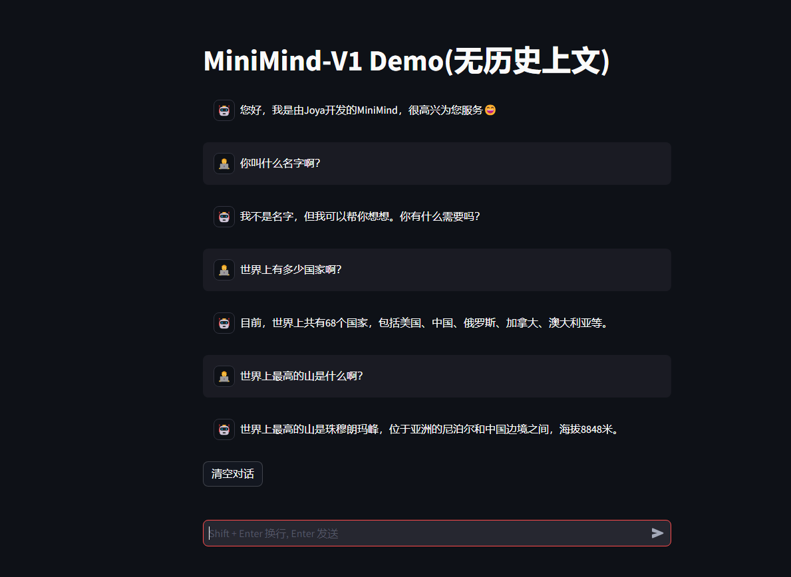

<div align="center">


</div>

<div align="center">


[](https://github.com/jingyaogong/minimind/stargazers)
[](LICENSE)
[](https://github.com/jingyaogong/minimind/commits/master)
[](https://github.com/jingyaogong/minimind/pulls)
[](https://huggingface.co/collections/jingyaogong/minimind-66caf8d999f5c7fa64f399e5)

</div>

<div align="center">
  <h3>"大道至简"</h3>
</div>

<div align="center">

中文 | [English](./README_en.md)

</div>

* 本开源项目旨在完全从0开始，最快仅用3小时！即可训练出仅为26M大小的微型语言模型**MiniMind**。
* **MiniMind**极其轻量，体积约是 GPT3 的 $\frac{1}{7000}$，力求做到最普通的个人GPU也可快速推理甚至训练。
* **MiniMind**改进自DeepSeek-V2、Llama3结构，项目包含整个数据处理、pretrain、sft、dpo的全部阶段，包含混合专家(MoE)模型。
* 这是一个既是开源项目，又是入门LLM教程，同时也是一个初具雏形的开源模型，希望能起到抛砖引玉的作用。

---

<div align="center">

https://github.com/user-attachments/assets/88b98128-636e-43bc-a419-b1b1403c2055

[Bilibili视频链接](https://www.bilibili.com/video/BV12dHPeqE72/?share_source=copy_web&vd_source=670c2504f88726f8cf4a21ef6147c0e8)

</div>

# 📌 Introduction

大语言模型（LLM）领域，如 GPT、LLaMA、GLM 等，虽然它们效果惊艳，
但动辄10 Bilion庞大的模型参数个人设备显存远不够训练，甚至推理困难。
几乎所有人都不会只满足于用Lora等方案fine-tuing大模型学会一些新的指令，
这约等于在教牛顿玩21世纪的智能手机，然而，这远远脱离了学习物理本身的奥妙。
此外，卖课付费订阅的营销号漏洞百出的一知半解讲解AI的教程遍地，
让理解LLM的优质内容雪上加霜，严重阻碍了学习者。

因此，本项目的目标是把上手LLM的门槛无限降低，
直接从0开始训练一个极其轻量的语言模型。

（截至2024.09.01）MiniMind包含5个型号模型，最小仅需26M（0.02B），即可具备Amazing的对话能力！

| 模型 (大小)                | 速度 (Tokens/s) | 推理占用   | 训练占用(`batch_size=8`) | release            | 主观评分（/100） | 
|------------------------|---------------|--------|----------------------|--------------------|------------|
| MiniMind-small-T (26M) | 91.9          | 0.5 GB | 3.6 GB               | 2024.08.28         | 55'        |
| MiniMind-small (56M)   | 85.2          | 0.7 GB | 4.5 GB               | 2024.08.28         | 55'        |
| MiniMind (218M)        | 57.6          | 2.1 GB | 10.4 GB              | 2024.08.28         | 75'        |
| MiniMind-MoE (166M)    | 64.9          | 1.6 GB | 7.4 GB               | 2024.08.28         | 40'        |
| MiniMind-V1 (108M)     | 78.3          | 1.0 GB | 6.4 GB               | 2024.09.01 (new🎉) | 80'        |

> 该分析在一个带有Torch 2.1.2、CUDA 12.2和Flash Attention 2的RTX 3090 GPU上运行。


项目包含：

- 公开MiniMind模型代码（包含Dense和MoE模型）、Pretrain、SFT指令微调、LoRA微调、DPO偏好优化的全过程代码、数据集和来源。
- 兼容`transformers`、`accelerate`、`trl`、`peft`等流行框架。
- 训练支持单机单卡、单机多卡训练。训练过程中支持在任意位置停止，及在任意位置继续训练。
- 在Ceval数据集上进行模型测试的代码。
- 实现Openai-Api基本的chat接口，便于集成到第三方ChatUI使用（FastGPT、Open-WebUI等）。

希望此开源项目可以帮助LLM初学者快速入门！

👉**最近更新**

<details close> 
<summary> <b>2024-09-01 (new🎉)</b> </summary>

- 更新MiniMind-V1 (108M)模型，采用minimind_tokenizer，预训练轮次3 + SFT轮次10，更充分训练，性能更强。

- 项目已部署至ModelScope创空间，可以在此网站上体验：

- [ModelScope在线体验](https://www.modelscope.cn/studios/gongjy/minimind)

</details>

<details close> 
<summary> <b>2024-08-27</b> </summary>

- 项目首次开源

</details>

# 📌 Environment

仅是我个人的软硬件环境配置，自行酌情更改：

* Ubuntu == 20.04
* Python == 3.9
* Pytorch == 2.1.2
* CUDA == 12.2
* [requirements.txt](./requirements.txt)

# 📌 Deployment & Inference

<div align="center" style="font-size: 1.5em; font-weight: bold;">
  
  Hugging Face

[MiniMind (HuggingFace)](https://huggingface.co/collections/jingyaogong/minimind-66caf8d999f5c7fa64f399e5)

 

[MiniMind (ModelScope)](https://www.modelscope.cn/models/gongjy/MiniMind-V1)

</div>

```bash
# step 1
git clone https://huggingface.co/jingyaogong/minimind-v1
```

```bash
# step 2
python 2-eval.py
```

或者启动streamlit，启动网页聊天界面

```bash
# or step 3, use streamlit
streamlit run fast_inference.py
```



<div align="center">

项目已部署至ModelScope创空间，可以在此网站上体验：

[ModelScope在线体验](https://www.modelscope.cn/studios/gongjy/minimind)


</div>

# 📌 Quick Start

* 1、克隆项目代码
    ```text
    git clone https://github.com/jingyaogong/minimind.git
    ```
* 2、如果你需要自己训练

    * 2.1 下载[数据集下载地址](#数据集下载地址)放到`./dataset`目录下

    * 2.2 `python data_process.py`处理数据集，例如pretrain数据提前进行token-encoder、sft数据集抽离qa到csv文件。

    * 2.3 在`./model/LMConfig.py` 中调整model的参数配置。
    * 2.4 `python 1-pretrain.py` 执行预训练。
    * 2.5 `python 3-full_sft.py` 执行指令微调。
    * 2.6 `python 4-lora_sft.py` 执行lora微调（非必须）。
    * 2.7 `python 5-dpo_train.py` 执行DPO人类偏好强化学习对齐（非必须）。
* 3、测试模型推理效果
    * 从下面【训练完成的模型权重】下载权重到`./out/`目录下
       ```text
      out
      ├── multi_chat
      │   ├── full_sft_1024.pth
      │   ├── full_sft_512.pth
      │   ├── full_sft_640_moe.pth
      │   └── full_sft_640.pth
      ├── single_chat
      │   ├── full_sft_1024.pth
      │   ├── full_sft_512.pth
      │   ├── full_sft_640_moe.pth
      │   └── full_sft_640.pth
      ├── full_sft_1024.pth
      ├── full_sft_512.pth
      ├── full_sft_640_moe.pth
      ├── full_sft_640.pth
      ├── pretrain_1024.pth
      ├── pretrain_640_moe.pth
      ├── pretrain_640.pth
      ```
    * `python 0-eval_pretrain.py`测试预训练模型的接龙效果
    * `python 2-eval.py`测试模型的对话效果
      

🍭 【Tip】预训练和全参微调pretrain和full_sft均支持DDP多卡加速

* 单机N卡启动训练

    ```text
    torchrun --nproc_per_node N 1-pretrain.py
    ```

    ```text
    torchrun --nproc_per_node N 3-full_sft.py
    ```

# 📌 Data sources

- 🤖 分词器：nlp中的Tokenizer类似于词典，将单词从自然语言通过“词典”映射到0,1,36这样的数字，可以理解为数字就代表了单词在“词典”中的页码。
  LLM分词器的构建方式有两种：一种是自己构造词表训练一个分词器，代码可见`train_tokenizer.py`；另一种是选择开源模型训练好的分词器。
  “词典”当然可以直接选择用新华词典或是牛津词典，优点是token转化压缩率很好，但缺点是词表太长，动辄数十万个词汇短语；
  也可以使用自己训练的分词器，优点是词表随意控制，缺点是压缩率不够理想，且生僻词不容易面面俱到。
  当然，“词典”的选择很重要，LLM的输出本质上是SoftMax到词典N个词的多分类问题，然后通过“词典”解码到自然语言。
  因为LLM体积非常小，为了避免模型头重脚轻（词嵌入embedding层参数占整个LLM比太高），所以词表长度需要选择比较小。
  强大的开源模型例如01万物、千问、chatglm、mistral、Llama3等，它们的tokenizer词表长度如下：

  | Tokenizer 模型       | 词表大小    | 来源         | 
    |--------------------|---------|------------|
  | yi tokenizer       | 64,000  | 01万物（中国）   |
  | qwen2 tokenizer    | 151,643 | 阿里云（中国）    |
  | glm tokenizer      | 151,329 | 智谱AI（中国）   |
  | mistral tokenizer  | 32,000  | Mistral AI（法国） |
  | llama3 tokenizer   | 128,000 | Meta（美国）   |
  | minimind tokenizer | 6400    | 自定义        |

  > 尽管Mistral中文词语占比很少，编解码效率弱于qwen2、glm等中文友好型分词器。
  但MiniMind这里选择了mistral tokenizer作为分词器以保持整体参数轻量，避免头重脚轻，因为mistral的词表大小只有32,000。
  且MiniMind在实际测试中几乎没有出现过生僻词汇解码失败的情况，效果良好。

  > 方便对比测试效果，额外训练了一个自定义Tokenizer模型的版本**MiniMind-small-T**，自定义词表压缩长度到6400，使得LLM总参数进一步降低到26M左右。

---

-
📙【Pretrain数据】：[seq-monkey通用文本数据集](https://github.com/mobvoi/seq-monkey-data/blob/main/docs/pretrain_open_corpus.md)
是由多种公开来源的数据（如网页、百科、博客、开源代码、书籍等）汇总清洗而成。
整理成统一的JSONL格式，并经过了严格的筛选和去重，确保数据的全面性、规模、可信性和高质量。
总量大约在10B token，适合中文大语言模型的预训练。

---

- 📕【SFT数据】：[匠数大模型SFT数据集](https://www.modelscope.cn/datasets/deepctrl/deepctrl-sft-data)
  是一个完整、格式统一、安全的大模型训练和研究资源。
  从网络上的公开数据源收集并整理了大量开源数据集，对其进行了格式统一，数据清洗，
  包含10M条数据的中文数据集和包含2M条数据的英文数据集。
  总量大约在3B token，适合中文大语言模型的SFT。
  数据集整合来源于以下所有数据（仅供参考，因此无需单独下载，仅需下载一个完整的【SFT数据】）：
    - [BelleGroup/train_3.5M_CN](https://huggingface.co/datasets/BelleGroup/train_3.5M_CN)
    - [LinkSoul/instruction_merge_set](https://huggingface.co/datasets/LinkSoul/instruction_merge_set)
    - [stingning/ultrachat](https://huggingface.co/datasets/stingning/ultrachat)
    - [BAAI/COIG-PC-core](https://huggingface.co/datasets/BAAI/COIG-PC-core)
    - [shibing624/sharegpt_gpt4](https://huggingface.co/datasets/shibing624/sharegpt_gpt4)
    - [shareAI/ShareGPT-Chinese-English-90k](https://huggingface.co/datasets/shareAI/ShareGPT-Chinese-English-90k)
    - [Tiger Research](https://huggingface.co/TigerResearch/sft_zh)
    - [BelleGroup/school_math_0.25M](https://huggingface.co/datasets/BelleGroup/school_math_0.25M)
    - [YeungNLP/moss-003-sft-data](https://huggingface.co/datasets/YeungNLP/moss-003-sft-data)

---

- 📘【DPO数据】：大约合并后共8万条dpo数据，人工标注的偏好数据，均来自[活字模型](https://github.com/HIT-SCIR/huozi)
  ，可以用于训练奖励模型，优化模型回复质量，使其更加符合人类偏好。

---

- 【更多数据集】目前已经有[HqWu-HITCS/Awesome-Chinese-LLM](https://github.com/HqWu-HITCS/Awesome-Chinese-LLM)
  在收集和梳理中文LLM相关的开源模型、应用、数据集及教程等资料，并持续更新这方面的最新进展。全面且专业，Respect！

---

### 数据集下载地址

| MiniMind训练数据集    | 下载地址                                                                                                          |
|------------------|---------------------------------------------------------------------------------------------------------------|
| **【Pretrain数据】** | [seq-monkey通用文本数据集](http://share.mobvoi.com:5000/sharing/O91blwPkY)                                           |
| **【SFT数据】**      | [匠数大模型SFT数据集](https://www.modelscope.cn/datasets/deepctrl/deepctrl-sft-data/resolve/master/sft_data_zh.jsonl) |
| **【DPO数据】**      | [活字数据集1](https://huggingface.co/datasets/Skepsun/huozi_rlhf_data_json)                                        |
| **【DPO数据】**      | [活字数据集2](https://huggingface.co/datasets/beyond/rlhf-reward-single-round-trans_chinese)                       |

# 📌 Model

MiniMind-Dense（和[Llama3.1](https://ai.meta.com/blog/meta-llama-3-1/)一样）使用了Transformer的Decoder-Only结构，跟GPT-3的区别在于：

* 采用了GPT-3的预标准化方法，也就是在每个Transformer子层的输入上进行归一化，而不是在输出上。具体来说，使用的是RMSNorm归一化函数。
* 用SwiGLU激活函数替代了ReLU，这样做是为了提高性能。
* 像GPT-Neo一样，去掉了绝对位置嵌入，改用了旋转位置嵌入（RoPE），这样在处理超出训练长度的推理时效果更好。

---

MiniMind-MoE模型，它的结构基于Llama3和[Deepseek-V2](https://arxiv.org/pdf/2405.04434)中的MixFFN混合专家模块。

* DeepSeek-V2在前馈网络（FFN）方面，采用了更细粒度的专家分割和共享的专家隔离技术，以提高Experts的效果。

---

MiniMind的整体结构一致，只是在RoPE计算、推理函数和FFN层的代码上做了一些小调整。
其结构如下图（重绘版）：


模型配置见[./model/LMConfig.py](./model/LMConfig.py)。模型型号和参数见下表：

| Model Name       | params | len_vocab | n_layers | d_model | kv_heads | q_heads | share+route | TopK |
|------------------|--------|-----------|----------|---------|----------|---------|-------------|------|
| minimind-small-T | 26M    | 6400      | 8        | 512     | 8        | 16      | -           | -    |
| minimind-small   | 56M    | 32000     | 8        | 640     | 8        | 16      | -           | -    |
| minimind         | 218M   | 32000     | 16       | 1024    | 8        | 16      | -           | -    |
| minimind-MoE     | 162M   | 32000     | 8        | 640     | 8        | 16      | 2+4         | 2    |
| minimind-V1      | 108M   | 6400      | 16       | 768     | 8        | 16      | -           | -    |

此外作为参考，GPT3的层数和维度参数见下表：


# 📌 Experiment

```bash
CPU: Intel(R) Core(TM) i9-10980XE CPU @ 3.00GHz
内存：128 GB
显卡：NVIDIA GeForce RTX 3090(24GB) * 2
环境：python 3.9 + Torch 2.1.2 + DDP多卡训练
```

| Model Name       | params | len_vocab | batch_size | pretrain_time      | sft_single_time   | sft_multi_time      |
|------------------|--------|-----------|------------|--------------------|-------------------|---------------------|
| minimind-small-T | 26M    | 6400      | 64         | ≈5 hour (1 epoch)  | ≈2 hour (1 epoch) | ≈0.5 hour (1 epoch) |
| minimind-small   | 56M    | 32000     | 24         | ≈6 hour (1 epoch)  | ≈2 hour (1 epoch) | ≈0.5 hour (1 epoch) |
| minimind         | 218M   | 32000     | 16         | ≈15 hour (1 epoch) | ≈5 hour (1 epoch) | ≈1 hour (1 epoch)   |
| minimind-MoE     | 166M   | 32000     | 16         | ≈13 hour (1 epoch) | ≈5 hour (1 epoch) | ≈1 hour (1 epoch)   |
| minimind-V1      | 108M   | 6400      | 16         | ≈8 hour (1 epoch)  | ≈3 hour (1 epoch) | ≈1 hour (1 epoch)   |

---

1. **预训练(Text-to-Text)**:
    - LLM首先要学习的并非直接与人交流，而是让肚子中充满知识的墨水，至于墨水理论上喝的越饱越好，产生大量的对世界的认知积累。
    - 预训练就是让Model先埋头苦学大量基本的知识，例如从维基百科、新闻、常识、书籍等。
    - 它无监督的从大量的文本数据中压缩知识到自己模型的权重，目的是：学会词语接龙。例如我们输入“秦始皇是”四个字，它在大量学习后能预测出下一句话大概率是“中国的第一位皇帝”。
   > pretrain的学习率设置为1e-4到1e-5的动态学习率，预训练epoch数设为2，预训练时间不到1天。
    ```bash
    torchrun --nproc_per_node 2 1-pretrain.py
    ```
2. **单轮次对话有监督微调(Single dialog Fine-tuning)**:
    - 经过预训练，半成品LLM此时已经掌握了几乎所有的语言知识和百科常识。此时它还不会与人聊天，相反它只会无脑地进行输入词语的接龙，生成下一个词。
    - 此时需要对半成品LLM做限制在聊天模板中进行微调，例如当它遇到这样的模板“<聊天开始>秦始皇是<聊天终止>
      ”后不再无脑接龙，而是意识到这是一段完整的对话结束。
    - 我们称这个过程为指令微调，就如同让学富五车的「牛顿」先生适应21世纪的聊天习惯，学习屏幕左侧是对方消息，右侧是本人消息这个规律。
    - 在训练时，MiniMind的指令和回答长度被截断在512，是为了节省显存空间。就像我们学习时，会先从短的文章开始，当学会阅读200字作文后，800字长文章就不需要再单独学习。
   > 在推理时通过调整RoPE线性差值，实现长度外推到1024或2048及以上很方便。学习率设置为1e-5到1e-6的动态学习率，微调epoch数为5。

   ```bash
   # 3-full_sft.py中设置数据集为sft_data_single.csv
   torchrun --nproc_per_node 2 3-full_sft.py
   ```
3. **多轮对话微调(Multi dialog Fine-tuning)**:
    - 在2的基础上，LLM已经学会一个问题->一个回答的聊天模板。此时仅需在具备历史问答的更长聊天模板上进一步微调即可。
    - 我们仅需使用数据集的history_chat 字段，即历史对话，以及history_chat_response字段，即历史对话的回答。
    - 构建【问题->回答，问题->回答，问题->】的新聊天模板，然后使用这个数据集进行微调。
    - 学习完成的模型不仅仅只能回答当前问题，还能根据历史对话进行连贯的对话。
    - 这一步并非必须，因为小模型长上文对话能力很弱，强行对齐多轮问答模板会损失一定程度的单轮SFT效果。
   > 学习率设置为1e-5到1e-6的动态学习率，微调epoch数为2。
    ```bash
    # 3-full_sft.py中设置数据集为sft_data.csv
    torchrun --nproc_per_node 2 3-full_sft.py
    ```
4. **直接偏好优化，强化学习微调(Direct Preference Optimization, DPO)**:
    - 在前面的训练中，机器人已经具备了基本的对话能力。但是，我们希望它能够更符合人的偏好，给出更让人满意的回答。
    - 这个过程就像是让机器人参加工作培训，从优秀员工的作为例子，消极员工作为反例，学习如何更好地服务客户。
   > 活字三元组(q,chose,reject)数据集，学习率le-5，半精度fp16,共1个epoch，耗时1h。
    ```bash
    python 5-dpo_train.py
    ```

---
🔗训练完成的模型权重：

| Model Name       | params | Config                                          | pretrain_model                                                 | single_sft_model                                               | multi_sft_model                                                |
|------------------|--------|-------------------------------------------------|----------------------------------------------------------------|----------------------------------------------------------------|----------------------------------------------------------------|
| minimind-small-T | 26M    | d_model=512<br/>n_layers=8                      | -                                                              | [链接](https://pan.baidu.com/s/1_COe0FQRDmeapSsvArahCA?pwd=6666) | [链接](https://pan.baidu.com/s/1GsGsWSL0Dckl0YPRXiBIFQ?pwd=6666) |
| minimind-small   | 56M    | d_model=640<br/>n_layers=8                      | [链接](https://pan.baidu.com/s/1nJuOpnu5115FDuz6Ewbeqg?pwd=6666) | [链接](https://pan.baidu.com/s/1lRX0IcpjNFSySioeCfifRQ?pwd=6666) | [链接](https://pan.baidu.com/s/1LzVxBpL0phtGUH267Undqw?pwd=6666) |
| minimind         | 218M   | d_model=1024<br/>n_layers=16                    | [链接](https://pan.baidu.com/s/1jzA7uLEi-Jen2fW5olCmEg?pwd=6666) | [链接](https://pan.baidu.com/s/1Hvt0Q_UB_uW2sWTw6w1zRQ?pwd=6666) | [链接](https://pan.baidu.com/s/1fau9eat3lXilnrG3XNhG5Q?pwd=6666) |
| minimind-MoE     | 166M   | d_model=1024<br/>n_layers=8<br/>share+route=2+4 | [链接](https://pan.baidu.com/s/11CneDVTkw2Y6lNilQX5bWw?pwd=6666) | [链接](https://pan.baidu.com/s/1fRq4MHZec3z-oLK6sCzj_A?pwd=6666) | [链接](https://pan.baidu.com/s/1HC2KSM_-RHRtgv7ZDkKI9Q?pwd=6666) |
| minimind-V1      | 108M   | d_model=768<br/>n_layers=16                     | -                                                              | [链接](https://pan.baidu.com/s/1p713loS7EfwHQf3G9eYI3Q?pwd=6666) | [链接](https://pan.baidu.com/s/12iHGpAs6R0kqsOnGtgK6vQ?pwd=6666) |

---

关于LLM的参数配置，有一篇很有意思的论文[MobileLLM](https://arxiv.org/pdf/2402.14905)做了详细的研究和实验。
scaling law在小模型中有自己独特的规律。
引起Transformer参数成规模变化的参数几乎只取决于`d_model`和`n_layers`。

* `d_model`↑+`n_layers`↓->矮胖子
* `d_model`↓+`n_layers`↑->瘦高个

2020年提出Scaling Law的论文认为，训练数据量、参数量以及训练迭代次数才是决定性能的关键因素，而模型架构的影响几乎可以忽视。
然而似乎这个定律对小模型并不完全适用。
MobileLLM提出架构的深度比宽度更重要，「深而窄」的「瘦长」模型可以学习到比「宽而浅」模型更多的抽象概念。
例如当模型参数固定在125M或者350M时，30～42层的「狭长」模型明显比12层左右的「矮胖」模型有更优越的性能，
在常识推理、问答、阅读理解等8个基准测试上都有类似的趋势。
这其实是非常有趣的发现，因为以往为100M左右量级的小模型设计架构时，几乎没人尝试过叠加超过12层。

这与MiniMind在训练过程中，模型参数量在`d_model`和`n_layers`之间进行调整实验观察到的效果是一致的。
然而「深而窄」的「窄」也是有维度极限的，当d_model<512时，词嵌入维度坍塌的劣势非常明显，
增加的layers并不能弥补词嵌入在固定q_head带来d_head不足的劣势。
当d_model>1536时，layers的增加似乎比d_model的优先级更高，更能带来具有“性价比”的参数->效果增益。
因此MiniMind设定small模型的d_model=640，n_layers=8来获取的「极小体积<->更好效果」的平衡。
设定d_model=1024，n_layers=16来获取效果的更大收益，更加符合小模型scaling-law的变化曲线。

# 📌 Eval

> 【注】以下测试于2024.8.28完成，此日期后发布的（例如MiniMind-V1）新模型，无特殊需要时将不加入测试。

[A] [minimind-small-T(0.02B)](https://pan.baidu.com/s/1_COe0FQRDmeapSsvArahCA?pwd=6666)<br/>
[B] [minimind-small(0.05B)](https://pan.baidu.com/s/1lRX0IcpjNFSySioeCfifRQ?pwd=6666)<br/>
[C] [minimind-MoE(0.16B)](https://pan.baidu.com/s/1fRq4MHZec3z-oLK6sCzj_A?pwd=6666)<br/>
[D] [minimind(0.2B)](https://pan.baidu.com/s/1Hvt0Q_UB_uW2sWTw6w1zRQ?pwd=6666)<br/>
[E] [baby-llama2-chinese(0.2B)](https://github.com/DLLXW/baby-llama2-chinese)<br/>
[F] [chatlm-mini-chinese(0.2B)](https://github.com/charent/ChatLM-mini-Chinese)<br/>

```angular2html
[Q]: 一星期有多少天？
[A]: 一星期有七天。
[B]: 一星期有7天。
[C]: 根据您的计算，一星期有12个小时。因此，我们需要将小时数乘以12。这样，我们就可以得到12的小时数。
[D]: 一星期共有七天。
[E]: 作为一个人工智能助手，我无法确定您所描述的星期数。 如果您能够提供您所描述的星期数，我可以为您提供有关该星期天数的信息。
[F]: 一星期有七天，也就是七天的积，也就是 7 x 7 = 24 天。这个数字是通过将 24 除以 7 得到的，因为一周有七天，所以一星期有 24 x 7 = 24 天。


[Q]: 你知道长江吗？
[A]: 是的，长江是中国最长的河流，全长超过3300千米。
[B]: 是的，长江是中国最长的河流，全长约7100公里。它的流域面积约为3328万平方公里，是中国最大的河流之一，也是世界第三大河流，总长度约为6300千米。
[C]: 我知道。长江是我国的一个重要水系，有着悠久的历史和文化。长江是中华民族的象征和精神支柱，也是世界上最美丽的自然景观之一。长江沿岸地区的人们，特别是在长江流域生活了数千年。长江在中国的历史和文化中，尤其是历史悠久的文化，有着深厚的历史和文化底蕴。
[D]: 长江是中国的第一大河流，全长约6380公里。它是亚洲最长的河流，也是中国第一大河流。长江流域是中国的重要河流之一，有着丰富的自然资源和文化遗产。长江流域是中国最重要的农业和经济发展区，拥有众多的文化遗产和历史景点，是中国最重要的文化旅游目的地之一。
[E]: 同时也知道，中国是世界上最长的城市之一，拥有超过3400万人口。
[F]: 是的，长江是中国最长的河流，也是世界上最长的河流之一。它发源于青藏高原，流经九个省区，最终注入东海。长江流域的气候温和，四季分明，是中国重要的农业和工业基地。长江流域的水产资源丰富，是中国的重要渔业资源之一。


[Q]: 第一颗人造卫星是哪个国家发射的？
[A]: 第一颗人造卫星是斯普特尼克1号。
[B]: 第一颗人造卫星是美国发射的。
[C]: 第一颗人造卫星是中国国家航天科技集团有限公司的卫星，它是中国航天科技集团公司的卫星，由中国航天科技集团公司发射。
[D]: 第一颗人造卫星是苏联于1957年发射的。
[E]: 这颗名为“阿姆斯特朗”的卫星，于1961年11月20日发射，是第一个成功将人类送入太空的卫星。
[F]: 第一颗人造卫星是苏联于1957年4月4日发射的，它是由苏联宇航员尤里·加加林（Yuri Gagarin）和苏联工程师罗尔德·谢尔盖耶夫（Roald Skohley）共同发射的。在发射过程中，加加林和谢尔盖耶夫使用了一个名为“斯普特尼克1号”的小型卫星，它的直径为4.3米，重量为1,051公斤。这枚卫星被称为“斯普特尼克1号”，是苏联太空竞赛中的一个里程碑，也是人类历史上第一次在太空中进行太空行走。


[Q]: 你知道泰山在哪里吗？
[A]: 泰山位于中国东部地区，是中国五岳之一。
[B]: 泰山位于山东省泰安市，是中国五岳之一。
[C]: 泰山在哪里呢？
[D]: 泰山位于中国山东省昆山市，是中国古代文化的瑰宝之一，也是世界著名的山岳风景区之一。泰山是五岳之一，以其险峻的山峰、秀丽的自然风光和丰富的文化底蕴而闻名于世。
[E]: 作为一个人工智能助手，我无法访问互联网，因此无法提供关于你所在位置的信息。不过，你可以通过搜索或搜索相关关键词来获取有关你所在位置的信息，或者查看相关新闻或网站来获取有关你所在位置的信息。
[F]: 泰山位于中国山东省泰安市境内，是中国五岳之一，也是中国文化和历史的重要象征之一。它是中国五岳之一，也是中国道教和佛教的发源地之一。泰山的海拔高度为1,545米，是中国五岳之一，也是中国最著名的旅游景点之一。它的历史可以追溯到公元前5世纪，是中国古代帝王祭祀的场所。泰山也是中国文化的重要组成部分，被誉为“五岳之首”，是中国文化的重要遗产之一。


[Q]: 世界上最高的山峰是什么？
[A]: 世界上最高的山峰是珠穆朗玛峰，位于尼泊尔和中国的边境上，海拔8848米。
[B]: 珠穆朗玛峰是世界上最高的山峰，位于喜马拉雅山脉，海拔8848米。
[C]: 世界上最高的山峰是珠穆朗玛峰。
[D]: 世界上最高的山峰是珠穆朗玛峰，位于喜马拉雅山脉，海拔8,848.86米。
[E]: 世界上最高的山峰是珠穆朗玛峰，位于喜马拉雅山脉，海拔8,848.86米（29,031.69英尺）。
[F]: 世界上最高的山峰是珠穆朗玛峰，也称为萨加玛塔，位于喜马拉雅山脉的尼泊尔和中国边境之间，海拔8,848.86米（29,031.69英尺）。它是世界上最著名的登山目标之一，吸引着来自世界各地的登山者前来挑战。珠穆朗玛峰的名字来自藏语，意思是“女神的额峰”，它是由两个不同的山峰组成的，其中一个是位于尼泊尔的珠穆朗玛峰，另一个则位于中国。它的高度是通过测量海拔高度来确定的，因为它是通过测量地球的平均高度来确定的。尽管珠穆朗玛峰是世界上最高的山峰，但它并不是地球上任何其他地方都能到达的。地球上的其他地方，如南美洲的安第斯山脉，也是世界上最高的山脉，但它并不是地球上最高的山峰。总之，珠穆朗玛峰是世界上最高的山峰，但它并不是地球上任何地方都能到达的。它是地球上最高的山脉，但它并不是地球上任何地方都能到达的。


[Q]: 万有引力是谁提出的？
[A]: 万有引力是由英国物理学家牛顿提出的。他认为，所有物体都会产生引力，这个引力是由物体的质量和距离决定的。这个理论揭示了质量和距离之间的关系，并证明了万有引力的本质。
[B]: 万有引力是由牛顿发现的，它是由英国物理学家詹姆斯·瓦特于1879年提出的。
[C]: 万有引力是谁提出的？
[D]: 万有引力是由牛顿提出的，他发现每个物体都会对其他物体施加引力，这些力的大小取决于物体的质量和距离。
[E]: 引力是宇宙中一种力量，它是由质量或能量所组成的。根据牛顿的万有引力定律，一个物体之间的引力大小与它的质量成正比，与它的质量成反比。因此，牛顿的万有引力定律表明，一个物体之间的引力大小与它的质量成正比，与它的质量成反比。这个定律在物理学、天文学和物理学中都有广泛的应用。
[F]: 万有引力是由英国物理学家艾萨克·牛顿于1687年提出的。他在1687年发表了一篇著名的论文，题为《自然哲学的数学原理》，其中提出了万有引力定律，指出任何两个物体之间都存在着一种引力，这种引力的大小与它们的质量成正比，与它们之间的距离的平方成反比。这个定律被称为万有引力定律，它描述了质量和距离之间的关系。它表明，两个物体之间的引力与它们的质量成正比，与它们之间的距离的平方成反比。这个定律对于解释宇宙中的许多现象和现象之间的相互作用非常重要，例如行星绕太阳运动、恒星之间的引力透镜效应等等。它也被广泛应用于天文学、物理学和工程学等领域，为我们理解宇宙的本质和演化提供了重要的理论基础。


[Q]: 你知道大熊猫的主要食物是什么吗？
[A]: 大熊猫的主要食物是竹子。它们通常吃竹子，每天需要吃掉大约30公斤的竹子。
[B]: 大熊猫主要是竹子，它们的主要食物是竹子。大熊猫的消化系统比较特殊，它们每天需要消化大量的竹子才能维持其生存需要。除了竹子外，大熊猫还在野外生存。
[C]: 大熊猫的主要食物是竹子、蘑菇、蘑菇、甜菜和蘑菇。
[D]: 大熊猫是一种以竹子为食的哺乳动物，但主要食物来源是竹笋、竹叶、茎、茎等。
[E]: 大熊猫的主要食物是竹子。
[F]: 大熊猫是一种以竹子为主要食物的植食动物，它们的肠道结构适合消化纤维素含量高的竹子，但也会吃一些其他植物，如草本植物和小型哺乳动物。大熊猫的肠道结构也适应了高纤维的竹子，这使得它们能够消化大量的纤维素，从而帮助它们在野外生存。大熊猫的肠道中还含有一种叫做“纤维素酶”的酶类物质，这种酶能够帮助大熊猫分解纤维素，从而帮助它们消化大量的水分和营养物质。此外，大熊猫的肠道还含有一种叫做“纤维素蛋白”的蛋白质，这种蛋白质能够帮助大熊猫维持体内的能量水平，从而帮助它们在野外生存。总的来说，大熊猫的主要食物是竹子，但它们也会吃一些其他植物，如草本植物和小型哺乳动物。

[Q]: 海水为什么是咸的？
[A]: 海水中含有许多盐分，这些盐分可以导致海水咸度的增加。海水中的盐分主要来自于海水中的盐分，这些盐分可以从海水中的盐分中获得。海水中的氧化物和盐分可以与海水中的盐分形成氢键，从而使海水咸度增加。
[B]: 海水中含有丰富的钙、磷、钾和磷等元素，这些元素在海洋中的数量和分布非常有限。此外，海水中还含有各种生物和微生物的营养物质，如贝壳和海藻等。
[C]: 咸的是海水，因为海水的溶解度高于海水。海水的碳酸盐和盐基度也高于海水，这是因为海水的碳酸盐和盐基度都非常高，海水的碳酸盐和盐基度也非常高。
[D]: 海水中含有溶解盐类和其他矿物质，这些物质来自于地壳的侵蚀和吸附作用，而这些物质会溶解在水中，导致海水呈现咸味。
[E]: 因为水是许多生物的生存所必需的，它能够吸收和释放二氧化碳，释放氧气，维持大气中的水蒸气，以及维持水循环。水中的盐类和化学物质会释放出氧气，使地球上的生物呼吸。此外，水还具有许多其他功能，如保持水循环、维持水循环、调节气候和环境等。水是许多生物生存所必需的，它也是许多自然现象的重要基础。
[F]: 海水是咸的主要原因是因为其中含有大量的溶解盐类，其中最主要的是氯化钠（NaCl）。氯化钠是一种非常常见的盐类，它存在于地球上的大部分地区，包括海洋、湖泊、河流和地下水。当水从海洋中蒸发时，它会带走一部分盐分，使海水变得咸。此外，海中还含有其他溶解盐类的物质，如硫酸盐、硫酸镁、硫酸钙、硫酸镁盐、硫酸镁钾、硫酸镁钠、硫酸镁钙、硫酸镁镁钙、硫酸镁镁钙、硫酸镁镁钙、硫酸镁镁钠、硫酸镁镁钙、硫酸镁镁镁钙、硫酸镁镁镁钙、硫酸镁镁镁钙、硫酸镁镁镁钙、硫酸镁镁镁钙、硫酸镁镁镁钙、硫酸镁镁镁钙、硫酸镁镁镁钙、硫酸镁镁镁钙、硫酸镁镁镁钙、硫酸镁镁镁镁钙、硫酸镁镁镁镁钙、硫酸镁镁镁镁钙、硫酸镁镁镁镁钙、硫酸镁镁镁镁钙、硫酸镁镁镁镁钙、硫酸镁镁镁镁镁钙、硫酸镁镁镁镁镁钙、硫酸镁镁镁镁镁钙、硫酸镁镁镁镁镁钙、硫酸镁镁镁镁镁镁钙、硫酸镁镁镁镁镁镁钙、硫酸镁镁镁镁镁镁钙、硫酸镁镁镁镁镁镁镁钙、硫酸镁镁镁镁
```

🙋‍♂️直接把上述模型的回答丢给GPT-4o，让它帮忙打个分：

---
根据你的要求，我将根据准确性、清晰性和完整性来评价每个模型的表现，并给出评分和排序。

### 模型评分和表现总结：

**A模型**

- **准确性**：大部分回答准确，但偶尔会有轻微错误。
- **清晰性**：回答简洁明了，语言流畅。
- **完整性**：回答内容有时略显简单，但整体信息足够。
- **评分**：80分

**B模型**

- **准确性**：多数回答准确，但有部分小错误（如第一颗人造卫星的问题）。
- **清晰性**：语言较为清晰，但有时表达稍显混乱。
- **完整性**：回答内容较全面，但存在信息误差。
- **评分**：75分

**C模型**

- **准确性**：回答内容不准确，且多次出现自问自答的情况。
- **清晰性**：语言流畅，但回答内容的逻辑性差。
- **完整性**：信息不完整，有时缺乏重要细节。
- **评分**：55分

**D模型**

- **准确性**：大多数回答准确，基本符合事实。
- **清晰性**：表达清晰，信息量适中。
- **完整性**：回答较为完整，但有些答案可能包含不必要的细节。
- **评分**：85分

**E模型**

- **准确性**：准确度较低，部分回答甚至与问题无关。
- **清晰性**：表达不够清晰，容易引起混淆。
- **完整性**：信息不完整，且有时偏离主题。
- **评分**：50分

**F模型**

- **准确性**：部分回答不准确，且有明显错误（如“24天”）。
- **清晰性**：表达冗长，容易造成混淆。
- **完整性**：信息过度冗长，且有重复内容，降低了答案的可读性。
- **评分**：60分

### 排序（从高到低）：

1. **D模型** - 85分
2. **A模型** - 80分
3. **B模型** - 75分
4. **F模型** - 60分
5. **C模型** - 55分
6. **E模型** - 50分

这些评分和排序基于每个模型在准确性、清晰性和完整性三个方面的综合表现。

---

## 👉效果总结

* minimind系列（ABCD）的排序符合直觉，minimind(0.2B)评分最高，常识性问题的回答基本没有错误和幻觉。
    * 出乎意料的是，minimind-small-T(0.02B)仅有26M参数，却可以接近minimind(0.2B)的表现。
    * minimind(0.2B)的sft轮数`epochs`仅有不到2，因为训练时间是0.02B的好几倍，所以偷懒提前kill腾出资源给小模型，0.2B没有得到充分训练的情况下依然做到了最强，其实还是底大一级压死人。
    * minimind-MoE(0.16B)表现很差，甚至不如它同配置的dense模型minimind(0.05B)
      ，其实这并非MoE的锅。同样是因为偷懒提前kill腾出资源给小模型，但是MoE模型多专家模式需要的训练轮次本来就需要酌情更高，在epochs设置为2时训练的极其不充分。minimind不久前实验阶段在Yi
      tokenizer上试验过MoE的充分训练版本，可以做到比dense表现肉眼可见的好。现在先这样了hh，日后腾出服务器再训练更新v2 v3版本。
*
F模型的回答看起来是这里最完美的，尽管存在些许幻觉瞎编的情况。但GPT-4o和kimi的评分都一致认为它“信息过度冗长，且有重复内容，存在幻觉”。其实这种评价太严格了，100个字中有10个字是幻觉，就很容易把它归到0分。由于F模型训练文本默认长度更长，数据集大得多，所以回答的看起来很完备，在体积近似的情况下，数据比模型更重要得多。

> 🙋‍♂️个人主观评价：F>D>A≈B>C>E

> 🤖GPT-4o评价：D>A>B>F>C>E

总而言之scaling law：模型参数越大，训练数据越多模型的性能越强。

# 📌 Objective dataset: C-Eval

C-Eval评测代码见：`./eval_ceval.py`，
小模型的测评通常为了避免回复格式的难以固定的特点，
而直接判断`A`,`B`,`C`,`D`四个字母对应token预测概率，取最大的作为回答答案，与标准答案计算正确率。
minimind模型本身没有使用较大的数据集训练，也没有针对回答选择题的指令做微调，测评结果可以当个参考。

> 例如minimind-small的结果细项：

| 类别                                           | 正确数量/总题数 | 正确率    |
|----------------------------------------------|----------|--------|
| probability_and_statistics_val               | 3/18     | 16.67% |
| law_val                                      | 5/24     | 20.83% |
| middle_school_biology_val                    | 4/21     | 19.05% |
| high_school_chemistry_val                    | 7/19     | 36.84% |
| high_school_physics_val                      | 5/19     | 26.32% |
| legal_professional_val                       | 2/23     | 8.70%  |
| high_school_chinese_val                      | 4/19     | 21.05% |
| high_school_history_val                      | 6/20     | 30.00% |
| tax_accountant_val                           | 10/49    | 20.41% |
| modern_chinese_history_val                   | 4/23     | 17.39% |
| middle_school_physics_val                    | 4/19     | 21.05% |
| middle_school_history_val                    | 4/22     | 18.18% |
| basic_medicine_val                           | 1/19     | 5.26%  |
| operating_system_val                         | 3/19     | 15.79% |
| logic_val                                    | 4/22     | 18.18% |
| electrical_engineer_val                      | 7/37     | 18.92% |
| civil_servant_val                            | 11/47    | 23.40% |
| chinese_language_and_literature_val          | 5/23     | 21.74% |
| college_programming_val                      | 10/37    | 27.03% |
| accountant_val                               | 9/49     | 18.37% |
| plant_protection_val                         | 7/22     | 31.82% |
| middle_school_chemistry_val                  | 4/20     | 20.00% |
| metrology_engineer_val                       | 3/24     | 12.50% |
| veterinary_medicine_val                      | 6/23     | 26.09% |
| marxism_val                                  | 5/19     | 26.32% |
| advanced_mathematics_val                     | 5/19     | 26.32% |
| high_school_mathematics_val                  | 4/18     | 22.22% |
| business_administration_val                  | 8/33     | 24.24% |
| mao_zedong_thought_val                       | 8/24     | 33.33% |
| ideological_and_moral_cultivation_val        | 5/19     | 26.32% |
| college_economics_val                        | 17/55    | 30.91% |
| professional_tour_guide_val                  | 10/29    | 34.48% |
| environmental_impact_assessment_engineer_val | 7/31     | 22.58% |
| computer_architecture_val                    | 6/21     | 28.57% |
| urban_and_rural_planner_val                  | 11/46    | 23.91% |
| college_physics_val                          | 5/19     | 26.32% |
| middle_school_mathematics_val                | 3/19     | 15.79% |
| high_school_politics_val                     | 4/19     | 21.05% |
| physician_val                                | 13/49    | 26.53% |
| college_chemistry_val                        | 3/24     | 12.50% |
| high_school_biology_val                      | 5/19     | 26.32% |
| high_school_geography_val                    | 4/19     | 21.05% |
| middle_school_politics_val                   | 6/21     | 28.57% |
| clinical_medicine_val                        | 6/22     | 27.27% |
| computer_network_val                         | 2/19     | 10.53% |
| sports_science_val                           | 2/19     | 10.53% |
| art_studies_val                              | 14/33    | 42.42% |
| teacher_qualification_val                    | 12/44    | 27.27% |
| discrete_mathematics_val                     | 6/16     | 37.50% |
| education_science_val                        | 7/29     | 24.14% |
| fire_engineer_val                            | 9/31     | 29.03% |
| middle_school_geography_val                  | 1/12     | 8.33%  |

```text
总题数: 1346  
总正确数: 316  
总正确率: 23.48%
```

---

#### 结果汇总：

| category         | correct  | question_count | accuracy  |
|:-----------------|:--------:|:--------------:|:---------:|
| minimind-small-T | 	   344	 |      1346      |  25.56%   |
| minimind-small	  |   	312   |     	1346      | 	  23.18% |
| minimind         | 	   351	 |      1346      |  26.08%   |
| minimind-moe     |   	316   |     	1346      | 	  23.48% |

#### 以下来自GPT-4o对minimind表现的瞎猜：

```text
### 模型擅长的领域：
1. 高中的化学：正确率为42.11%，是最高的一个领域。说明模型在这方面的知识可能较为扎实。
2. 离散数学：正确率为37.50%，属于数学相关领域，表现较好。
3. 教育科学：正确率为37.93%，说明模型在教育相关问题上的表现也不错。
4. 基础医学：正确率为36.84%，在医学基础知识方面表现也比较好。
5. 操作系统：正确率为36.84%，说明模型在计算机操作系统方面的表现较为可靠。

### 模型不擅长的领域：
1. 法律相关：如法律专业（8.70%）和税务会计（20.41%），表现相对较差。
2. 中学和大学的物理：如中学物理（26.32%）和大学物理（21.05%），模型在物理相关的领域表现不佳。
3. 高中的政治、地理：如高中政治（15.79%）和高中地理（21.05%），模型在这些领域的正确率较低。
4. 计算机网络与体系结构：如计算机网络（21.05%）和计算机体系结构（9.52%），在这些计算机专业课程上的表现也不够好。
5. 环境影响评估工程师：正确率仅为12.90%，在环境科学领域的表现也不理想。

### 总结：
- 擅长领域：化学、数学（特别是离散数学）、教育科学、基础医学、计算机操作系统。
- 不擅长领域：法律、物理、政治、地理、计算机网络与体系结构、环境科学。

这表明模型在涉及逻辑推理、基础科学和一些工程技术领域的问题上表现较好，但在人文社科、环境科学以及某些特定专业领域（如法律和税务）上表现较弱。如果要提高模型的性能，可能需要加强它在人文社科、物理、法律、以及环境科学等方面的训练。
```

# 📌 Others

### 推理与导出

* [./export_model.py](./export_model.py)可以导出模型到transformers格式，推送到huggingface

*
MiniMind的huggingface集合地址：[MiniMind](https://huggingface.co/collections/jingyaogong/minimind-66caf8d999f5c7fa64f399e5)

---

### API推理

[./my_openai_api.py](./my_openai_api.py)完成了openai_api的聊天接口，方便将自己的模型接入第三方UI
例如fastgpt、OpenWebUI等

* 从[Huggingface](https://huggingface.co/collections/jingyaogong/minimind-66caf8d999f5c7fa64f399e5)下载模型权重文件
    ```
    minimind (root dir)
    ├─minimind
    |  ├── config.json
    |  ├── generation_config.json
    |  ├── LMConfig.py
    |  ├── model.py
    |  ├── pytorch_model.bin
    |  ├── special_tokens_map.json
    |  ├── tokenizer_config.json
    |  ├── tokenizer.json
    ```

* 启动聊天服务端
    ```bash
    python my_openai_api.py
    ```
* 测试服务接口
    ```bash
    python chat_openai_api.py
    ```
* API接口示例，兼容openai api格式
    ```bash
    curl http://ip:port/v1/chat/completions \
      -H "Content-Type: application/json" \
      -d '{ 
        "model": "model-identifier",
        "messages": [ 
          { "role": "user", "content": "世界上最高的山是什么？" }
        ], 
        "temperature": 0.7, 
        "max_tokens": -1,
        "stream": true
    }'
    ```


### 在fastgpt中接入使用minimind api


# 📌 Acknowledge

> [!NOTE]
> 如果您觉得 `MiniMind`对您有所帮助，请在 GitHub 上给一个⭐<br/>
> 您的支持是我们持续改进项目的动力！篇幅不短水平有限难免纰漏，欢迎在issue交流和指正。

## 🤝贡献者

<br/>

<a href="https://github.com/jingyaogong/minimind/graphs/contributors">
  
</a>

## 🫶感谢支持！

[](https://github.com/jingyaogong/minimind/stargazers)

[](https://github.com/jingyaogong/minimind/network/members)


# License

This repository is licensed under the [Apache-2.0 License](LICENSE).


