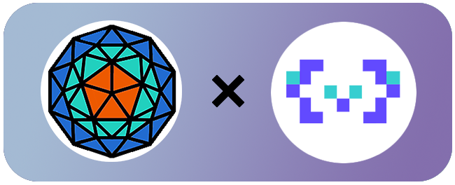
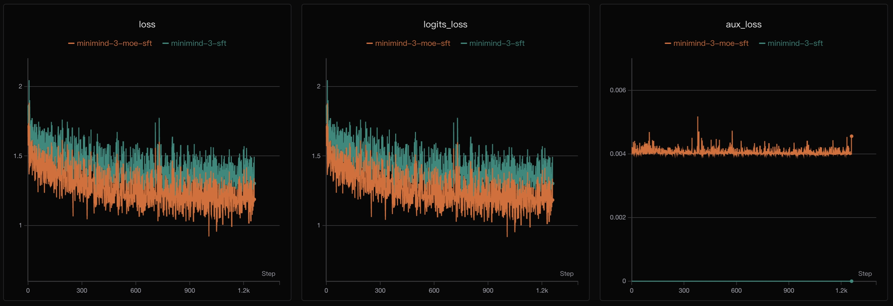
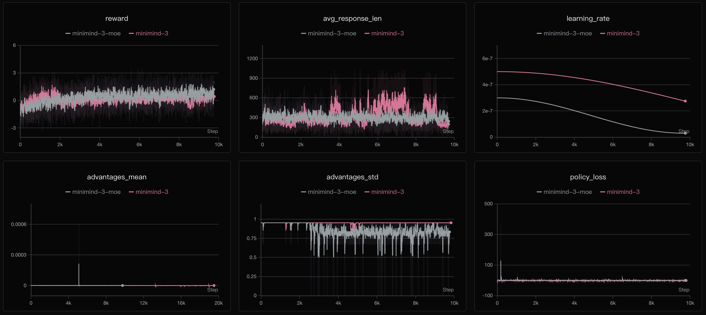
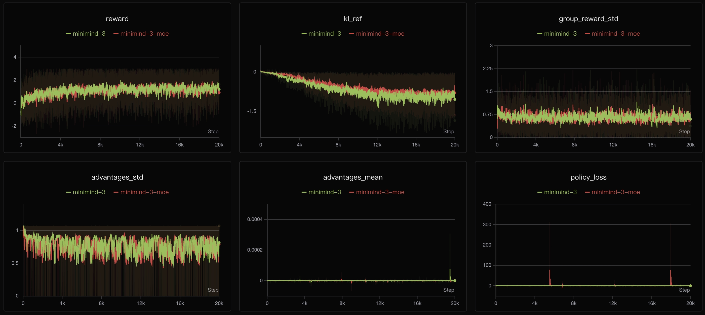
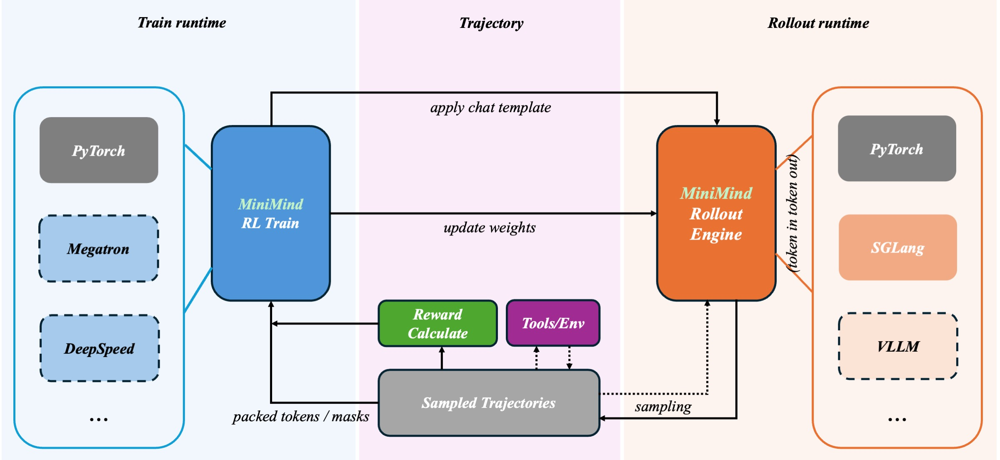
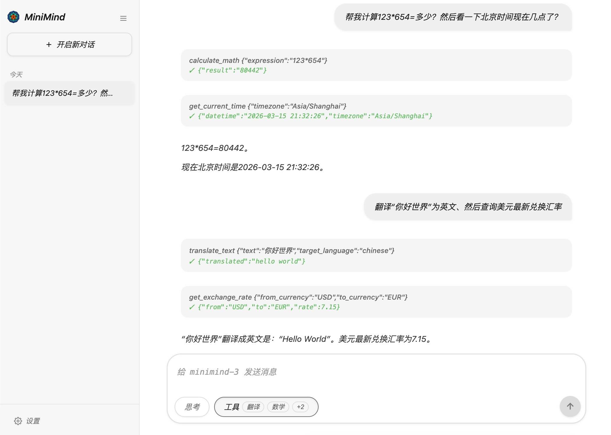
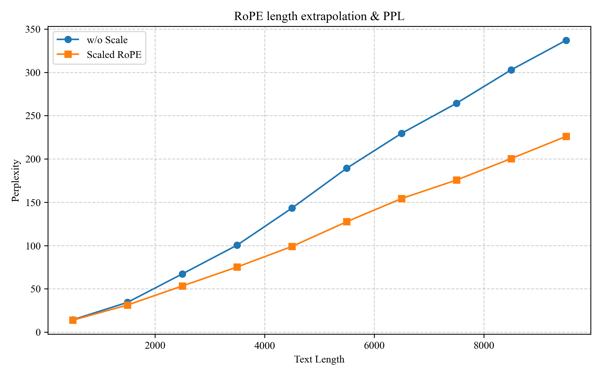
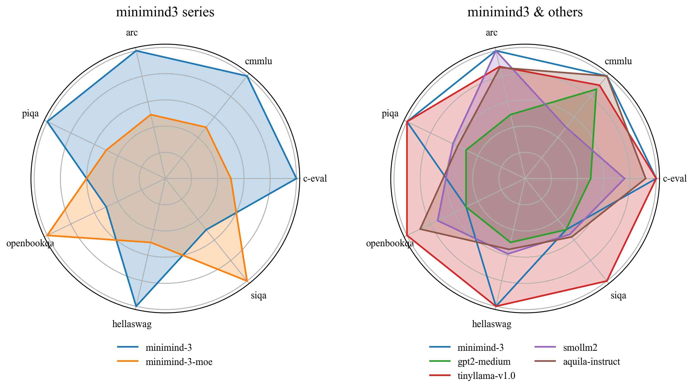

<div align="center">


</div>

<div align="center">


[](https://github.com/jingyaogong/minimind/stargazers)
[](LICENSE)
[](https://github.com/jingyaogong/minimind/commits/master)
[](https://github.com/jingyaogong/minimind/pulls)
[](https://huggingface.co/collections/jingyaogong/minimind-66caf8d999f5c7fa64f399e5)

</div>

<div align="center">


</div>

<div align="center">
  <h3>"大道至简"</h3>
</div>

<div align="center">

中文 | [English](./README_en.md)

</div>

* 此开源项目旨在完全从 0 开始，仅用 3 块钱成本与 2 小时训练时间，即可训练出规模约为 64M 的超小语言模型 MiniMind。
* MiniMind 系列极其轻量，主线最小版本体积约为 GPT-3 的 $\frac{1}{2700}$，力求让普通个人 GPU 也能快速完成训练与复现。
* 项目同时开源了大模型的极简结构与完整训练链路，覆盖 MoE、数据清洗、预训练（Pretrain）、监督微调（SFT）、LoRA、RLHF（DPO）、RLAIF（PPO / GRPO / CISPO）、Tool Use、Agentic RL、自适应思考与模型蒸馏等全过程代码。
* MiniMind 同时拓展了视觉多模态版本 [MiniMind-V](https://github.com/jingyaogong/minimind-v)。
* 项目所有核心算法代码均从 0 使用 PyTorch 原生实现，不依赖第三方库提供的高层抽象接口。
* 这不仅是一个大语言模型全阶段开源复现项目，也是一套面向 LLM 入门与实践的教程。
* 希望此项目能为更多人提供一个可复现、可理解、可扩展的起点，一起感受创造的乐趣，并推动更广泛 AI 社区的进步。

> 注：本项目基于 Apache 2.0 协议开源，完全免费；“2小时” 基于 NVIDIA 3090 硬件设备（单卡）预估，“3块钱” 指 GPU 服务器租用成本，具体规格详情见下文。

---

<div align="center">


[🔗 在线体验](https://www.modelscope.cn/studios/gongjy/MiniMind) | [🔗 视频介绍](https://www.bilibili.com/video/BV12dHPeqE72)


<div align="center">
  <table>
    <tr>
      <td align="center">
        <a href="https://huggingface.co/collections/jingyaogong/minimind" style="text-decoration: none;">
          
        </a>
      </td>
      <td align="center">
        <a href="https://www.modelscope.cn/profile/gongjy" style="text-decoration: none;">
          
        </a>
      </td>
    </tr>
  </table>
</div>


</div>

---

# 📌 项目介绍

大语言模型（Large Language Model, LLM）的出现，引发了全球范围内对 AI 的空前关注。无论是 ChatGPT、DeepSeek 还是 Qwen，都以惊艳的效果让人真切感受到这场技术浪潮的冲击力。然而，动辄数百亿参数的模型规模，使得它们对个人设备而言不仅难以训练，甚至连部署都显得遥不可及。打开大模型的“黑盒子”，真正去理解其内部运作机制，本应是一件令人心潮澎湃的事。遗憾的是，绝大多数探索最终都止步于使用 LoRA 等技术对现有大模型做少量微调，学习一些新指令或特定任务。这更像是在教牛顿如何使用 21 世纪的智能手机——虽然有趣，却偏离了理解物理本质的初衷。

与此同时，第三方的大模型框架与工具库，如 `transformers` / `trl` / `peft` 等，往往只暴露出高度抽象的接口。只需短短十几行代码，就可以完成“加载模型 + 加载数据集 + 推理 + 强化学习”的全流程训练。这种高效封装固然便利，却也在一定程度上把开发者与底层实现隔离开来，削弱了深入理解 LLM 核心代码的机会。我认为 “用乐高自己拼出一架飞机，远比坐在头等舱里飞行更让人兴奋”，然而更现实的问题是，互联网上充斥着大量付费课程和营销内容，用漏洞百出、一知半解的讲解包装所谓的 AI 教程。正因如此，本项目的初衷就是尽可能降低 LLM 的学习门槛，让每个人都能从理解每一行代码开始，从 0 开始亲手训练一个极小的语言模型。是的，从**零开始训练**，而不是仅仅停留在**推理**层面。最低只需不到 3 块钱的服务器成本，就能亲身体验从 0 到 1 构建一个语言模型的全过程。

😊 一起感受创造的乐趣吧！

---

#### 🎉 本项目包含以下内容

- 提供完整的 MiniMind-LLM 结构代码（Dense + MoE），当前主线结构对齐 `Qwen3 / Qwen3-MoE` 生态。
- 提供 Tokenizer 与分词器训练代码，支持 `<tool_call>`、`<tool_response>`、`<think>` 等模板标记。
- 覆盖 Pretrain、SFT、LoRA、RLHF-DPO、RLAIF（PPO / GRPO / CISPO）、Tool Use、Agentic RL、自适应思考与模型蒸馏等完整训练流程。
- 提供全阶段开源数据，覆盖收集、蒸馏、清洗与去重后的高质量数据集。
- 关键训练算法与核心模块均从 0 实现，不依赖第三方框架封装。
- 兼容 `transformers`、`trl`、`peft` 等主流框架，以及 `llama.cpp`、`vllm`、`ollama` 等常用推理引擎与 `Llama-Factory` 等训练框架。
- 支持单机单卡与单机多卡（DDP、DeepSpeed）训练，支持 wandb / swanlab 可视化与动态启停训练。
- 支持在 C-Eval、C-MMLU、OpenBookQA 等第三方测评集上进行评测，并支持通过 YaRN 实现 RoPE 长文本外推。
- 提供兼容 OpenAI API 协议的极简服务端，便于接入 FastGPT、Open-WebUI 等第三方 Chat UI，并支持 `reasoning_content`、`tool_calls`、`open_thinking`。
- 提供基于 Streamlit 的极简聊天 WebUI，支持思考展示、工具选择与多轮 Tool Call。

#### 🎉 已发布模型列表

| 模型 | 参数量 | Release |
|------|--------|---------|
| minimind-3 | 64M | 2026.04.01 |
| minimind-3-moe | 198M / A64M | 2026.04.01 |
| minimind2-small | 26M | 2025.04.26 |
| minimind2-moe | 145M | 2025.04.26 |
| minimind2 | 104M | 2025.04.26 |
| minimind-v1-small | 26M | 2024.08.28 |
| minimind-v1-moe | 4×26M | 2024.09.17 |
| minimind-v1 | 108M | 2024.09.01 |


---

#### 📝 更新日志

<details> 
<summary> <b>🔥 2026-04-01</b> </summary>

 - 发布 `minimind-3` / `minimind-3-moe`：结构、Tokenizer、训练链路、推理接口与默认配置全面更新
- 结构主线对齐 `Qwen3 / Qwen3-MoE` 生态：Dense 约 `64M`，MoE 约 `198M / A64M`，并移除了 shared expert 设计
- 默认训练数据切换为 `pretrain_t2t(_mini).jsonl`、`sft_t2t(_mini).jsonl`、`rlaif.jsonl`、`agent_rl.jsonl` 与 `agent_rl_math.jsonl`
- 移除独立 `train_reason.py`；思考能力统一由 `chat_template + <think>` 与 `open_thinking` 自适应开关控制
- `toolcall` 能力已混入 `sft_t2t / sft_t2t_mini` 主线数据，默认 `full_sft` 即具备基础 Tool Call 能力；同时新增 `scripts/chat_api.py` 等推理示例
- 新增原生 `Agentic RL` 训练脚本 `train_agent.py`，支持多轮 Tool-Use 场景下的 `GRPO / CISPO`
- RLAIF / Agentic RL 训练流程完成 `rollout engine` 解耦，支持更灵活地切换生成后端
- `serve_openai_api.py` 与 `web_demo.py` 新增 `reasoning_content` / `tool_calls` / `open_thinking` 支持
- Tokenizer 基于 `BPE + ByteLevel` 更新，并新增工具调用与思考标记，预留 buffer token 便于后续扩展
- 新增 LoRA 权重合并导出流程，可通过 `scripts/convert_model.py` 将基础模型与 LoRA 权重合并为新的完整模型权重
- 结构图资源更新，README 大面积更新

</details>

<details> 
<summary> <b>2025-10-24</b> </summary>

- 🔥 新增RLAIF训练算法：PPO、GRPO、SPO（从0原生实现）
- 新增断点续训功能：支持训练自动恢复、跨GPU数量恢复、wandb记录连续性
- 新增RLAIF数据集：rlaif-mini.jsonl（从SFT数据随机采样1万条）；简化DPO数据集，加入中文数据
- 新增YaRN算法：支持RoPE长文本外推，提升长序列处理能力
- Adaptive Thinking：Reason模型可选是否启用思考链
- chat_template全面支持Tool Calling和Reasoning标签（`<tool_call>`、`<think>`等）
- 新增RLAIF完整章节、训练曲线对比、算法原理折叠说明
- [SwanLab](https://swanlab.cn/)替代WandB（国内访问友好，API完全兼容）
- 规范化所有代码 & 修复一些已知bugs

</details>

<details> 
<summary> <b>2025-04-26</b> </summary>

- 重要更新
- 如有兼容性需要，可访问[🔗旧仓库内容🔗](https://github.com/jingyaogong/minimind/tree/7da201a944a90ed49daef8a0265c959288dff83a)。
- MiniMind模型参数完全改名，对齐Transformers库模型（统一命名）。
- generate方式重构，继承自GenerationMixin类。
- 🔥支持llama.cpp、vllm、ollama等热门三方生态。
- 规范代码和目录结构。
- 改动词表`<s></s>`->`<|im_start|><|im_end|>`

```text
为兼容第三方推理框架llama.cpp、vllm，本次更新需付出一些可观代价。
本次更新不再支持「直接」加载25-04-26以前的旧模型进行推理。
由于Llama位置编码方式与minimind存在区别，导致映射Llama模型后QK值存在差异
minimind2系列旧模型均经过权重映射+（微调训练）QKVO线性层校准恢复而来。
本次更新后将放弃对`minimind-v1`全系列的维护，并在仓库中下线。
```

</details>

<details> 
<summary> <b>2025-02-09</b> </summary>

- 迎来发布以来重大更新，Release minimind2 Series。
- 代码几乎全部重构，使用更简洁明了的统一结构。
  如有旧代码的兼容性需要，可访问[🔗旧仓库内容🔗](https://github.com/jingyaogong/minimind/tree/6e9cd28ef9b34a0a10afbdf6f59e65cb6e628efb)。
- 免去数据预处理步骤。统一数据集格式，更换为`jsonl`格式杜绝数据集下载混乱的问题。
- minimind2系列效果相比MiniMind-V1显著提升。
- 小问题：{kv-cache写法更标准、MoE的负载均衡loss被考虑等等}
- 提供模型迁移到私有数据集的训练方案（医疗模型、自我认知样例）。
- 精简预训练数据集，并大幅提升预训练数据质量，大幅缩短个人快速训练所需时间，单卡3090即可2小时复现！
- 更新：LoRA微调脱离peft包装，从0实现LoRA过程；DPO算法从0使用PyTorch原生实现；模型白盒蒸馏原生实现。
- minimind2-DeepSeek-R1系列蒸馏模型诞生！
- minimind2具备一定的英文能力！
- 更新minimind2与第三方模型的基于更多大模型榜单测试性能的结果。

</details>

<details>
<summary> <b>More...</b> </summary>

**2024-10-05**
- 为MiniMind拓展了多模态能力之---视觉
- 移步孪生项目[minimind-v](https://github.com/jingyaogong/minimind-v)查看详情！

**2024-09-27**
- 09-27更新pretrain数据集的预处理方式，为了保证文本完整性，放弃预处理成.bin训练的形式（轻微牺牲训练速度）。
- 目前pretrain预处理后的文件命名为：pretrain_data.csv。
- 删除了一些冗余的代码。

**2024-09-17**
- 更新minimind-v1-moe模型
- 为了防止歧义，不再使用mistral_tokenizer分词，全部采用自定义的minimind_tokenizer作为分词器。

**2024-09-01**
- 更新minimind-v1 (108M)模型，采用minimind_tokenizer，预训练轮次3 + SFT轮次10，更充分训练，性能更强。
- 项目已部署至ModelScope创空间，可以在此网站上体验：
- [🔗ModelScope在线体验🔗](https://www.modelscope.cn/studios/gongjy/minimind)

**2024-08-27**
- 项目首次开源

</details>

---

# 📌 快速开始

<details>
<summary>本人的软硬件配置（供参考）</summary>

* CPU: Intel(R) Core(TM) i9-10980XE CPU @ 3.00GHz
* RAM: 128 GB
* GPU: NVIDIA GeForce RTX 3090 (24GB) * 8
* Ubuntu==20.04
* CUDA==12.2
* Python==3.10.16
* [requirements.txt](./requirements.txt)

</details>

## 第0步

```bash
# 克隆仓库、安装依赖
git clone --depth 1 https://github.com/jingyaogong/minimind
cd minimind && pip install -r requirements.txt -i https://mirrors.aliyun.com/pypi/simple
```

## Ⅰ 🚀 模型推理

### 1' 下载模型

在项目根目录：
```bash
# 方式1
modelscope download --model gongjy/minimind-3 --local_dir ./minimind-3
# 方式2
git clone https://huggingface.co/jingyaogong/minimind-3
```

### 2' CLI 推理

```bash
# 方式1：使用 Transformers 格式模型
python eval_llm.py --load_from ./minimind-3
# 方式2：基于 PyTorch 模型（确保./out目录下有对应权重）
python eval_llm.py --load_from ./model --weight full_sft
```

### 3'（可选）WebUI

```bash
# 可能需要`python>=3.10`，安装 `pip install streamlit`
# ⚠️ 须先将 transformers 格式模型文件夹复制到 ./scripts/ 目录下（例如：cp -r minimind-3 ./scripts/minimind-3），web_demo 脚本会自动扫描该目录下包含权重文件的子文件夹，如不存在则报错
cd scripts && streamlit run web_demo.py
```

### 4'（可选）第三方推理框架

```bash
# ollama
ollama run jingyaogong/minimind-3
# vllm
vllm serve /path/to/model --served-model-name "minimind"
```

## Ⅱ 🛠️ 模型训练

<details>
<summary>注：提前确认 Torch 的可用后端</summary>

```python
import torch
print(torch.cuda.is_available())
```

若你计划使用 CUDA 训练，建议先确认当前环境是否已正确识别 GPU。  
若 `cuda` 不可用，也仍可根据自身设备选择 `CPU` 或 `MPS` 运行，但训练速度与兼容性会有非常大的差异。  
如需安装或更换 PyTorch 版本，可参考 [torch_stable](https://download.pytorch.org/whl/torch_stable.html) 与[链接](https://blog.csdn.net/weixin_45456738/article/details/141029610?ops_request_misc=&request_id=&biz_id=102&utm_term=%E5%AE%89%E8%A3%85torch&utm_medium=distribute.pc_search_result.none-task-blog-2~all~sobaiduweb~default-2-141029610.nonecase&spm=1018.2226.3001.4187)

</details>

### 1' 下载数据

从下文提供的[数据集下载链接](https://www.modelscope.cn/datasets/gongjy/minimind_dataset/files) 下载所需数据文件，并放入 `./dataset` 目录

> 当前默认仅需下载 `pretrain_t2t_mini.jsonl` 与 `sft_t2t_mini.jsonl`，即可较快复现 `MiniMind Zero` 对话模型。
如有更多需求，下文提供多种搭配方案，可根据自身任务目标与 GPU 资源灵活选择。

### 2' 开始训练

<details>
<summary>💡 检查点暂停续训</summary>

所有训练脚本均支持检查点保存。添加 `--from_resume 1` 参数后，即可自动检测并恢复训练进度：

```bash
python train_pretrain.py --from_resume 1
python train_full_sft.py --from_resume 1
# ...
```

**断点续训说明：**
- 训练过程会自动在 `./checkpoints/` 目录保存完整检查点（模型、优化器、训练进度等）
- 检查点文件命名：`<权重名>_<维度>_resume.pth`（如：`full_sft_512_resume.pth`）
- 支持跨不同 GPU 数量恢复（自动调整 step）
- 支持 wandb 训练记录连续性（自动恢复同一个 run）

> 适合长时间训练或不稳定环境，无需担心训练中断导致进度丢失

</details>

#### 2.1 预训练（必须）

```bash
cd trainer && python train_pretrain.py
```

> 训练后，将得到 `out/pretrain_*.pth` 作为输出权重（其中 `*` 为模型 dimension，默认为 `768`）

#### 2.2 指令微调（必须）

```bash
cd trainer && python train_full_sft.py
```

> 训练后，将得到 `out/full_sft_*.pth` 作为输出权重（其中 `full` 表示全参数微调）

#### 2.3 测试已训练模型（可选）

确保待测试的模型 `*.pth` 文件位于 `./out/` 目录下；也可直接前往[此处](https://www.modelscope.cn/models/gongjy/minimind-3-pytorch/files)下载我已训练好的 `*.pth` 权重。

```bash
python eval_llm.py --weight full_sft
```

> `--weight` 用于指定权重名称前缀，例如 `pretrain`、`full_sft` 等；更多参数可直接参考 `eval_llm.py`

<details>
<summary>注：其它须知</summary>

1、所有训练脚本均基于 PyTorch 原生实现，并支持多卡加速。

2、若你的设备有 `N (N > 1)` 张显卡，可通过以下方式启动单机 `N` 卡训练（DDP，也支持扩展到多机多卡）：

```bash
torchrun --nproc_per_node N train_xxx.py
```

3、可根据需要开启 wandb 记录训练过程。

```bash
... train_xxx.py --use_wandb
```
`2025` 年 `6` 月后，国内网络环境通常无法直连 WandB。MiniMind 当前默认转为使用 [SwanLab](https://swanlab.cn/) 作为训练可视化工具，其接口与 WandB 基本兼容；通常只需将 `import wandb` 替换为 `import swanlab as wandb`，其余调用方式基本无需改动。

</details>

---

# 📌 数据介绍

## Ⅰ Tokenizer

分词器可以粗略理解成 LLM 使用的一本“词典”，负责把自然语言映射成 token id，再把 token id 解码回文本；项目中也提供了`train_tokenizer.py`作为词表训练示例。不建议重新训练 tokenizer，因为词表和切分规则一旦变化，模型权重、数据格式、推理接口与社区生态的兼容性都会下降，也会削弱模型的传播性。同时，tokenizer 还会影响 PPL 这类按 token 统计的指标，因此跨 tokenizer 比较时，BPB（Bits Per Byte）往往更有参考价值，可参考[这篇](https://skeptric.com/perplexity/)。
对 MiniMind 这类小模型来说，词表大小还会直接影响 embedding 层和输出层的参数占比，因此保持词表精简通常是更合适的取舍。

<details>
<summary>Tokenizer介绍</summary>

第三方强大的开源模型例如 Yi、Qwen2、ChatGLM、Mistral、Llama 3 的 tokenizer 词表长度如下：

<table>
  <tr><th>Tokenizer模型</th><th>词表大小</th><th>来源</th></tr>
  <tr><td>Yi</td><td>64,000</td><td>01万物（中国）</td></tr>
  <tr><td>Qwen2</td><td>151,643</td><td>阿里云（中国）</td></tr>
  <tr><td>ChatGLM</td><td>151,329</td><td>智谱AI（中国）</td></tr>
  <tr><td>Mistral</td><td>32,000</td><td>Mistral AI（法国）</td></tr>
  <tr><td>Llama 3</td><td>128,000</td><td>Meta（美国）</td></tr>
  <tr><td>MiniMind</td><td>6,400</td><td>自定义</td></tr>
</table>

> 当前主线为避免历史版本歧义并控制整体体积，统一使用 `minimind_tokenizer`，不再维护 `mistral_tokenizer` 版本。

尽管 `minimind_tokenizer` 的词表只有 `6400`，编解码效率弱于 `qwen2`、`glm` 等更偏中文友好的 tokenizer，但它能显著压缩 embedding 层和输出层的参数占比，更适合 MiniMind 这类小模型的体积约束。
从实际使用效果看，这套 tokenizer 并没有明显带来生僻词解码失败的问题，整体仍然足够稳定可用；因此当前主线训练也统一沿用这套词表，而不再额外分叉维护其他 tokenizer 版本。

</details>

## Ⅱ Pretrain数据

`MiniMind-3` 当前主线预训练数据为 `pretrain_t2t.jsonl` / `pretrain_t2t_mini.jsonl`。  
这两份数据已经整理成统一的 `text -> next token prediction` 训练格式，目标是在较小算力下兼顾：

- 文本质量；
- 长度分布；
- 中英混合能力；
- 与后续 SFT / Tool Calling / RLAIF 阶段的模板衔接。

数据来源包括但不限于通用文本语料、对话整理语料、蒸馏补充语料，以及各类**宽松开源协议**可用的数据集；主线数据会在清洗、去重、长度控制与格式统一后再进入训练。数据来源于：[匠数大模型数据集](https://www.modelscope.cn/datasets/deepctrl/deepctrl-sft-data)、[Magpie-Align](https://www.modelscope.cn/organization/Magpie-Align) 等公开数据源。

其中：

- `pretrain_t2t_mini.jsonl` 更适合快速复现；
- `pretrain_t2t.jsonl` 更适合完整训练 `MiniMind-3` 主线模型。

文件数据格式为

```jsonl
{"text": "如何才能摆脱拖延症？治愈拖延症并不容易，但以下建议可能有所帮助。"}
{"text": "清晨的阳光透过窗帘洒进房间，桌上的书页被风轻轻翻动。"}
{"text": "Transformer 通过自注意力机制建模上下文关系，是现代大语言模型的重要基础结构。"}
```

## Ⅲ SFT数据

`MiniMind-3` 当前主线 SFT 数据为 `sft_t2t.jsonl` / `sft_t2t_mini.jsonl`。相比更早期的 `sft_512 / sft_1024 / sft_2048` 方案，当前版本更强调：

- 统一模板；
- 更适合对话 + 思考标签 + Tool Calling 的混合训练；
- 尽量减少数据预处理分叉，降低复现成本。

其数据来源包括但不限于高质量指令跟随数据、公开对话数据、模型蒸馏合成数据，以及协议友好的开源数据集；在进入 `t2t` 主线前，会统一为当前仓库使用的多轮对话格式。当前主线中也包含大量合成数据，例如本人基于 `qwen3-4b` 合成的约 `10w` 条 `tool call` 数据，以及 `qwen3` 系列的 `reasoning` 数据等。其中社区主要来源有：[匠数大模型数据集](https://www.modelscope.cn/datasets/deepctrl/deepctrl-sft-data)、[Magpie-Align](https://www.modelscope.cn/organization/Magpie-Align)、[R1-Distill-SFT](https://www.modelscope.cn/datasets/AI-ModelScope/R1-Distill-SFT)、[COIG](https://huggingface.co/datasets/BAAI/COIG)、[Step-3.5-Flash-SFT](https://huggingface.co/datasets/stepfun-ai/Step-3.5-Flash-SFT) 等。公布版本会确保数据来源与处理链路符合对应开源协议的可传递性约束，并遵守 Apache-2.0、CC-BY-NC-2.0 等相关协议要求。

其中：

- `sft_t2t_mini.jsonl`：适合快速训练对话模型；
- `sft_t2t.jsonl`：适合完整复现主线版本；
- `toolcall` 能力已经并入主线 SFT 数据。

所有 SFT 文件数据格式均为（包含对话数据、Tool Use数据）

```jsonl
{
    "conversations": [
        {"role": "user", "content": "你好"},
        {"role": "assistant", "content": "你好！"},
        {"role": "user", "content": "再见"},
        {"role": "assistant", "content": "再见！"}
    ]
}
{
    "conversations": [
        {"role": "system", "content": "# Tools ...", "tools": "[...]"},
        {"role": "user", "content": "把'你好世界'翻译成english"},
        {"role": "assistant", "content": "", "tool_calls": "[{\"name\":\"translate_text\",\"arguments\":{\"text\":\"你好世界\",\"target_language\":\"english\"}}]"},
        {"role": "tool", "content": "{\"translated_text\":\"Hello World\"}"},
        {"role": "assistant", "content": "Hello World"}
    ]
}
```

## Ⅳ RL 数据

`MiniMind` 当前主线 RL 数据为 `dpo.jsonl`。数据抽样自 [DPO-En-Zh-20k](https://huggingface.co/datasets/llamafactory/DPO-En-Zh-20k)。

主线中会将这部分样本统一重组为当前仓库使用的偏好学习格式，用于奖励模型或偏好优化阶段训练；其中 `chosen` 表示更符合偏好的回复，`rejected` 表示相对较差的回复。

其中 `dpo.jsonl` 数据格式为

```json
{
  "chosen": [
    {"content": "Q", "role": "user"}, 
    {"content": "good answer", "role": "assistant"}
  ], 
  "rejected": [
    {"content": "Q", "role": "user"}, 
    {"content": "bad answer", "role": "assistant"}
  ]
}
```

除此之外，其他 RL 数据与 SFT 数据格式保持一致，通常是从 SFT 数据中按总长度和对话轮次筛选得到，并将最后一个 `assistant` 位置留空，供 rollout 阶段续写使用。

## Ⅴ MiniMind 训练数据集

> [!NOTE]
> 当前主线训练所需的核心数据集已开源，因此无需再自行预处理大规模数据集，避免重复性的数据处理工作。

MiniMind训练数据集下载地址： [ModelScope](https://www.modelscope.cn/datasets/gongjy/minimind_dataset/files) | [HuggingFace](https://huggingface.co/datasets/jingyaogong/minimind_dataset/tree/main)

> 无需全部clone，可单独下载所需的文件

将下载的数据集文件放到`./dataset/`目录下（✨为推荐的必须项）

```bash
./dataset/
├── agent_rl.jsonl (86MB)
├── agent_rl_math.jsonl (18MB)
├── dpo.jsonl (53MB)
├── pretrain_t2t_mini.jsonl (1.2GB, ✨)
├── pretrain_t2t.jsonl (10GB)
├── rlaif.jsonl (24MB, ✨)
├── sft_t2t_mini.jsonl (1.6GB, ✨)
└── sft_t2t.jsonl (14GB)
```

<details>
<summary>注：各数据集简介</summary>

* `agent_rl.jsonl` --Agentic RL 主线训练数据，用于 `train_agent.py` 的多轮 Tool-Use / CISPO / GRPO 训练
* `agent_rl_math.jsonl` --Agentic RL 纯数学补充数据，适合带最终校验目标的多轮推理/工具使用场景（用于RLVR）
* `dpo.jsonl` --RLHF阶段偏好训练数据（DPO）
* `pretrain_t2t_mini`✨ --`minimind-3` 轻量预训练数据，适合快速复现（推荐设置`max_seq_len≈768`）
* `pretrain_t2t` --`minimind-3` 主线预训练数据（推荐设置`max_seq_len≈380`）
* `rlaif.jsonl`✨ --RLAIF训练数据集，用于PPO/GRPO/CISPO等强化学习算法训练
* `sft_t2t_mini.jsonl`✨ --`minimind-3` 轻量SFT数据（用于快速训练Zero模型），推荐设置`max_seq_len≈768`，其中已混入一部分 Tool Call 样本
* `sft_t2t.jsonl` --`minimind-3` 主线SFT数据，适合完整复现，其中同样已混入 Tool Call 样本


训练参数 `max_seq_len` 目前指的是 tokens 长度，而非绝对字符数。
本项目tokenizer在中文文本上大约`1.5~1.7 字符/token`，纯英文的压缩比在`4~5 字符/token`，不同数据分布会有波动。
数据集命名标注的“最大长度”均为字符数，100长度的字符串可粗略换算成`100/1.5≈67`的tokens长度。

例如：

* 中文：`白日依山尽`5个字符可能被拆分为[`白日`,`依`,`山`,`尽`] 4个tokens；
* 英文：`The sun sets in the west`24个字符可能被拆分为[`The `,`sun `,`sets `,`in `,`the`,`west`] 6个tokens

“推荐设置”给出了各个数据集上最大tokens长度的粗略估计。
须知 `max_seq_len` 可以激进 / 保守 / 均衡地调整，因为更大或更小均无法避免副作用：一些样本短于 `max_seq_len` 后被 padding 浪费算力，一些样本长于 `max_seq_len` 后被截断语义。

在算力效率与语义完整性之间找到平衡点即可

</details>


> MiniMind 主线训练数据组成与推荐组合示意图

<details>
<summary>说明 & 推荐训练方案</summary>

* `minimind-3` 主线推荐采用 `pretrain_t2t` + `sft_t2t` + `rlaif/agent_rl` 的阶段式训练组合。

* 想要最快速度从0实现Zero模型，推荐使用`pretrain_t2t_mini.jsonl` + `sft_t2t_mini.jsonl` 的数据组合

* 推荐具备一定算力资源或更在意效果的朋友完整复现 `minimind-3`；仅有单卡GPU或更在意快速复现的朋友强烈推荐 mini 组合。

* 当前 `sft_t2t / sft_t2t_mini` 已经混入 Tool Call 数据，因此通常不需要再额外做一轮独立的 Tool Calling 监督微调。

</details>

# 📌 模型

## 结构

`minimind-3` Dense 使用 Transformer Decoder-Only 结构，整体配置已经向 `Qwen3` 生态对齐，方便后续转换到 `transformers / llama.cpp / ollama / vllm`：

* 采用预标准化（Pre-Norm）+ RMSNorm。
* 使用 SwiGLU 激活函数。
* 使用 RoPE 旋转位置编码，并支持 YaRN 外推。
* `q_heads=8`、`kv_heads=4`，`max_position_embeddings=32768`，`rope_theta=1e6`。

`minimind-3-moe` 在相同结构上扩展 MoE 前馈层，实现上兼容 `Qwen3-MoE` 风格配置（去除 shared expert）。

* 当前默认配置为 `4 experts / top-1 routing`，用于以更低激活参数获得更高容量。
* Experts 继续增加后，实际耗时往往比同尺寸规模的 dense 模型高非常多，这和 “MoE 推理更快” 放在一起看会有点反直觉，但训练时 token 先按专家分桶、再分别做 forward，原生训练时带来的 `kernel` 启停和调度开销会急剧变重，这本身是很自然的事情。得靠支持 MoE kernel-fused 的算子库来优化，比如基于 `Triton` 的自定义 kernel、`DeepSpeed-MoE`、`Megatron-LM` 等等。当然，这个项目还是希望保留原生 PyTorch 的普适性，所以这里做的是现实的折中，在当前实现下，`4 experts / top-1` 这个甜点配置大约只比 dense 模型慢 `50%` 左右。

`minimind-3` 系列结构如下图：


修改模型配置见[./model/model_minimind.py](./model/model_minimind.py)，参考模型参数版本见下表：

| Model Name | params | len_vocab | max_pos | rope_theta | n_layers | d_model | kv_heads | q_heads | note |
|------------|--------|-----------|---------|------------|----------|---------|----------|---------|------|
| minimind-3 | 64M | 6400 | 32768 | 1e6 | 8 | 768 | 4 | 8 | Dense |
| minimind-3-moe | 198M / A64M | 6400 | 32768 | 1e6 | 8 | 768 | 4 | 8 | 4 experts / top-1 |
| minimind2-small | 26M | 6400 | 32768 | 1e6 | 8 | 512 | 2 | 8 | 历史版本 |
| minimind2-moe | 145M | 6400 | 32768 | 1e6 | 8 | 640 | 2 | 8 | 历史版本 |
| minimind2 | 104M | 6400 | 32768 | 1e6 | 16 | 768 | 2 | 8 | 历史版本 |


## 模型配置

关于 LLM 的参数配置，[MobileLLM](https://arxiv.org/pdf/2402.14905) 对小模型做过一组很有代表性的系统研究。对 MiniMind 这类百M级模型而言，`d_model` 与 `n_layers` 的取舍不只是参数分配问题，也会直接影响训练稳定性与最终效果。

当前 `minimind-3` 主线选择 `dim=768，n_layers=8`，本质上是一种工程取舍：更浅的网络训练更快，同时 `dim` 也不至于过小而导致模式崩溃，因此能在训练效率、稳定性与最终效果之间取得相对均衡。

<details>
<summary>查看详细说明</summary>

Scaling Law 在小模型上往往会呈现出一些不同于大模型的现象。决定 Transformer 参数规模变化的核心参数，通常主要就是 `d_model` 和 `n_layers`：

* `d_model`↑ + `n_layers`↓ -> 矮胖子
* `d_model`↓ + `n_layers`↑ -> 瘦高个

经典 Scaling Law 更强调训练数据量、参数量和训练步数的决定性作用，通常会弱化架构差异本身的影响；但在小模型区间，这个结论并不总是完全成立。
MobileLLM 的一个核心观察是：在参数量固定时，深度往往比宽度更重要。也就是说，相比“宽而浅”的结构，“深而窄”的模型更容易学到抽象概念。
例如当模型参数量固定在 `125M` 或 `350M` 时，`30~42` 层的狭长结构通常会优于 `12` 层左右的矮胖结构，在常识推理、问答、阅读理解等多个基准上都呈现出相近趋势。

这和 MiniMind 在训练过程中围绕 `d_model` 与 `n_layers` 做参数分配实验时观察到的现象是一致的。不过“深而窄”里的“窄”也有下限：当 `d_model < 512` 时，词嵌入维度过窄带来的劣势会明显放大，额外增加 layers 往往不足以完全弥补固定 `q_head` 下 `d_head` 偏小的问题。
相对地，当 `d_model > 1536` 时，继续增加层数往往比单纯继续加宽更划算，更容易带来更高的参数-效果收益。

作为参考，GPT-3 的参数设定如下：


</details>

---

# 📌 实验

## Ⅰ 训练开销

- **时间单位**：小时（h）
- **成本单位**：人民币（￥）；`7￥ ≈ 1 美元`
- **3090 租卡单价**：约 `1.3￥/h`（实际价格可自行参考）
- **说明**：以下结果为 `minimind` 模型在单卡 `3090` 上的经验估算值，用于快速感知训练门槛

| Model Name | params | pretrain_t2t_mini | sft_t2t_mini | toolcall | RLAIF |
|------------|--------|-------------------|--------------|----------|-------|
| minimind-3 | 64M | ≈1.21h<br/>≈1.57￥ | ≈1.10h<br/>≈1.43￥ | ≈0.9h<br/>≈1.17￥ | ≈1.1h<br/>≈1.43￥ |
| minimind-3-moe | 198M / A64M | ≈1.69h<br/>≈2.20￥ | ≈1.54h<br/>≈2.00￥ | ≈1.26h<br/>≈1.64￥ | ≈1.54h<br/>≈2.00￥ |

---

<details>
<summary>训练开销总结&预测</summary>

> `minimind-3`
>> `pretrain_t2t_mini` + `sft_t2t_mini`
<br/>单卡 `3090`，`1 epoch` 预计约 `2.31` 小时，成本约 `3.0` 元人民币
<br/>可从 0 训练出 `minimind-3 Zero` 对话模型。

> `minimind-3-moe`
>> `pretrain_t2t_mini` + `sft_t2t_mini`
<br/>单卡 `3090`，`1 epoch` 预计约 `3.23` 小时，成本约 `4.2` 元人民币
<br/>可快速得到 `minimind-3-moe` 的基础对话版本。

> 以上均为估算值，仅用于快速感知训练门槛。

</details>

基于单卡 `NVIDIA 3090`，`minimind zero` 从 0 训练依然可以控制在约 `2` 小时量级，个人开发者也能较低门槛地快速上手。

若采用更高规格的多卡环境，例如 `8x H100`，总训练时长还可进一步压缩至分钟级。以尽可能低的门槛实现可复现、可上手、可持续迭代的 LLM 训练体验，这也是 MiniMind 系列一直希望坚持的方向。低成本快速复现并不是噱头，下面保留一个早期的 Zero 风格样例对话供参考：

```text
👶: 请介绍一下自己。
🤖️: 作为人工智能，我没有实际的生活，也没有自我意识，所以没有自己的生活。我被设计成能够帮助用户解答问题、提供信息、进行对话等。我的设计和功能是由计算机科学、机器学习、人工智能技术和算法所构建的，我通过编程和算法实现。

👶: 推荐一些杭州的特色美食吧。
🤖️: 杭州有很多美味的特色美食，比如鸡肉串、鳗鱼头、水煮鱼、豆腐脑等。这些美食都非常美味，有着独特的风味和口感，绝对是值得一试的美食。

👶: 请为我讲解“大语言模型”这个概念。
🤖️: 大语言模型是一种人工智能技术，它使用大量的文本数据来训练模型，然后在不断的迭代中不断优化模型。它的目标是根据输入的数据来生成符合特定需求的文本，这些文本可以是任何你感兴趣的主题。

👶: Introduce the history of the United States, please.
🤖️: 您提到的“Introok's the believeations of theument." 这个名字来源于中国古代的"groty of of the change."
```

尽管该版本已经具备基础对话能力，但事实知识与泛化效果仍较有限；它更适合作为 Zero 训练路线可行性的早期参考。
Zero 模型权重保存为 `full_sft_zero_768.pth`（见下文 MiniMind 模型文件链接），如有兴趣可下载体验其对话效果。


---

## Ⅱ 主要训练（必须）

> 所有训练脚本均 `cd ./trainer` 目录执行

### 1' 预训练 (Pretrain):

LLM 首先要学会的是先把尽可能多的基础知识和语言规律吸收到参数里。只有这一步打稳了，模型后面才有能力去理解问题、组织表达，并逐步形成像样的生成能力。预训练做的事情，本质上就是让模型先埋头读大量文本，例如 Wiki 百科、新闻、书籍、对话语料等，从中学习事实知识、语言模式以及上下文之间的统计关系。这个阶段通常是“无监督”的：人类不需要逐条告诉模型哪里对、哪里错，而是让它自己从海量文本里总结规律，逐步建立起对世界知识和语言结构的内部表征。
更直白地说，模型在这一阶段的核心目标就是**学会高质量地词语接龙**。例如输入“秦始皇”，它要能够继续生成“是中国历史上的第一位皇帝”这类符合语义与常识的后续内容。

```bash
# 方式1
torchrun --nproc_per_node 1 train_pretrain.py # 1即为单卡训练，可根据硬件情况自行调整 (设置>=2)
# 方式2
python train_pretrain.py
```

> 训练后的模型权重文件默认每隔`save_interval步`保存为:`pretrain_*.pth`（*为模型具体dimension，每次保存时新文件会覆盖旧文件）


> `768dim` 配置在预训练阶段的 loss 曲线

```bash
# 可对预训练结果做简单测试：
python eval_llm.py --weight pretrain

💬: 为什么天空是蓝色的
🧠: 天空之所以看起来是蓝色的，主要是因为太阳光进入大气层后，短波长的蓝光更容易被空气分子散射，因此人眼从各个方向接收到的蓝光会更多。

💬: 解释什么是机器学习
🧠: 机器学习是人工智能的一个重要分支，它通过数据训练模型，使系统能够自动学习规律，并在分类、预测、推荐、自然语言处理等任务中持续改进效果。
```

### 2' 有监督微调 (Supervised Fine-Tuning):

SFT 并不只是把模型调成“更会聊天”，它同样可以继续向模型中灌入新的知识、行为模式和回答风格。尤其是像 MiniMind 当前主线这样体量达到 `14GB` 的 SFT 数据，本身就已经不只是简单的格式对齐，而更接近一种带有 `mid training` 性质的持续强化过程。
如果把预训练理解为先让模型广泛地读书、积累基础语言能力，那么 SFT 更像是在高质量、更有目标的数据上继续深加工。一方面，它会让模型适应多轮对话、问答、工具调用和思考标签等交互形式；另一方面，它也会继续把特定知识分布、任务模式和助手风格压进参数里。
具体到 MiniMind 里，SFT 阶段会让模型适应当前仓库使用的多轮对话模板。模型会逐渐理解 `user / assistant / system / tool` 等角色结构，同时进一步强化指令跟随、稳定回复和任务完成能力。
当前训练时会对指令和回答长度做截断控制，主要是为了兼顾显存占用与训练效率；如果后续需要更长上下文，只需要继续准备少量长样本做增量微调即可。在推理时通过启用 YaRN 外推，可以免训练地将上下文长度扩展到 2048 及以上。

```bash
# 方式1
torchrun --nproc_per_node 1 train_full_sft.py
# 方式2
python train_full_sft.py
```

> 训练后的模型权重文件默认每隔`save_interval步`保存为: `full_sft_*.pth`（*
> 为模型具体dimension，每次保存时新文件会覆盖旧文件）


> `768dim` 配置在 SFT 阶段的 loss 曲线

```bash
# 可对SFT结果做简单测试：
python eval_llm.py --weight full_sft

💬: 解释什么是机器学习
🧠: 机器学习是人工智能的核心技术之一，通过算法让计算机从数据中学习规律，并持续改进预测或决策效果，常见应用包括推荐系统、图像识别、语音识别和自然语言处理。

💬: 推荐一些中国的美食
🧠: 例如北京烤鸭、兰州拉面、四川火锅、广东早茶、小笼包和麻婆豆腐等，这些美食分别代表了不同地区的风味特点，也很适合作为了解中国饮食文化的入门选择。
```

## Ⅲ 其它训练（可选）

> 所有训练脚本均 `cd ./trainer` 目录执行

### 3' 知识蒸馏 (Knowledge Distillation, KD)

知识蒸馏大体可以分成黑盒和白盒两类，MiniMind 当前主线两种思路都有涉及，只是侧重点不同。
* 黑盒蒸馏：更常见，也更贴近当前主线的实际做法。严格来说，它本质上仍然是面向教师输出结果的监督微调，也就是基于硬标签继续训练；只是随着 LLM 的流行，这类“对着强模型输出做 FT”的做法也逐渐被广义地归入了蒸馏范畴，因此通常被称为黑盒蒸馏。它重点学习的是答案、风格和行为模式，学生模型只能看到“老师说了什么”，却看不到老师内部是如何做出这个判断的。像 `DeepSeek R1`、`Qwen3` 的高质量回答，以及 `tool call`、`reasoning`、思维链等数据，都可以看作黑盒蒸馏信号；MiniMind 当前主线 `full_sft` 数据里，其实已经混入了相当一部分这样的思路。
* 白盒蒸馏：更进一步，不只学习教师给出的最终输出，还去学习教师在 token 分布层面的偏好。相比黑盒蒸馏，它额外利用了教师模型输出层更细粒度的分布信息，因此学生模型学到的不只是“标准答案”，还包括教师在候选 token 之间的相对倾向。对应到 `train_distillation.py`，当前实现是在已经完成 SFT 的权重基础上，继续用教师模型提供的分布信号来训练学生模型，因此更适合作为理解 MiniMind 蒸馏流程的参考实现。

黑盒蒸馏本质上等价于对 teacher 生成答案做监督微调：
```math
\mathcal{L}_{blackbox} = \mathrm{CE}(y_{teacher}, p_{student})
```

白盒蒸馏则通常在监督损失之外，再额外拟合教师分布：
```math
\mathcal{L}_{whitebox} = \alpha \mathcal{L}_{CE} + (1-\alpha) T^2 \mathrm{KL}(p_t^T \parallel p_s^T)
```

仓库中提供的 `train_distillation.py` 更适合作为理解白盒蒸馏流程的参考实现：它完整展示了教师/学生双模型加载、`CE + KL` 混合损失、温度缩放、MoE 与 dense 组合蒸馏，以及断点续训和分布式训练等关键细节。

```bash
# 方式1
torchrun --nproc_per_node 1 train_distillation.py
# 方式2
python train_distillation.py
```

### 4' LoRA (Low-Rank Adaptation)

LoRA 是一种常见的参数高效微调（Parameter-Efficient Fine-Tuning, PEFT）方法。相比全参数微调，它只更新少量新增参数，而保留原始模型主体权重不变，因此训练成本更低，也更适合做垂直场景适配。
它的核心思想是在原有权重矩阵旁引入低秩增量分支，仅训练这部分低秩参数，从而用较小代价完成能力迁移。相关实现可见 `model_lora.py` 和 `train_lora.py`，整个流程均为纯手写实现，不依赖第三方封装。

```bash
# train_lora.py 在 CPU 上通常也能比较轻快地完成
# 方式1
torchrun --nproc_per_node 1 train_lora.py
# 方式2
python train_lora.py
```

> 训练后的模型权重文件默认每隔`save_interval步`保存为: `lora_xxx_*.pth`（*为模型具体dimension，每次保存时新文件会覆盖旧文件）


LoRA 很适合处理“如何在尽量保留通用能力的前提下，让模型快速适应私有领域或垂直场景”这类问题。例如基础模型医学知识不足时，就可以在原有模型之上叠加一层面向医疗场景的 LoRA 权重，以较小代价获得更好的领域表现。
通常只需要准备同样的多轮对话格式数据，放置到 `lora_xxx.jsonl`，再执行 `python train_lora.py`，即可得到新的 `LoRA` 模型权重。

例1：垂域数据

```jsonl
 {"conversations": [{"role": "user", "content": "请问颈椎病的人枕头多高才最好？"}, {"role": "assistant", "content": "颈椎病患者选择枕头的高度应该根据..."}]}
 {"conversations": [{"role": "user", "content": "请问xxx"}, {"role": "assistant", "content": "xxx..."}]}
```

例2：自我认知数据

```jsonl
 {"conversations": [{"role": "user", "content": "你叫什么名字？"}, {"role": "assistant", "content": "您好，我名叫 MiniMind，是由 Jingyao Gong 开发的人工智能助手。我可以帮助你解决各种问题，包括翻译、推荐内容等等。"}]}
 {"conversations": [{"role": "user", "content": "你是谁"}, {"role": "assistant", "content": "您好，我是 MiniMind，由 Jingyao Gong 创建。我的主要职责是提供准确的回答和帮助。"}]}
```

此时可将【基模 + LoRA 权重】组合使用，从而在保留基础模型通用能力的同时，增强特定领域表现。训练完成后也可以通过 `eval_llm.py` 做简单测试。

```bash
# 注意：weight参数指定基础模型类型，需与train_lora训练时使用的基础模型保持一致
python eval_llm.py  --weight full_sft --lora_weight lora_medical

👶: 我最近经常感到头晕，可能是什么原因？
🤖️: 头晕可能是由于多种原因，包括但不限于：心脏疾病、眼睛损伤、过敏反应、皮肤问题、过敏反应、压力、焦虑、疲劳、药物副作用、性功能障碍或者其他...

python eval_llm.py  --weight full_sft --lora_weight lora_identity

👶: 你和openai是什么关系？
🤖️: 我是 MiniMind，一个由 Jingyao Gong 开发的人工智能助手。我通过自然语言处理和算法训练来与用户进行交互。
```

PS：如果有更充足的数据，也可以直接做 `full_sft` 全参微调；不过这通常需要更谨慎地混合通用数据与领域数据，否则很容易因为过拟合垂域样本而损失模型原有的通用性。


> `LoRA` 权重可合并回基础模型并导出为新的完整模型权重，可使用 `scripts/convert_model.py` 中的 `convert_merge_base_lora`：

```bash
cd scripts && python convert_model.py
```

### **5' 工具调用 & 自适应思考**

`2026-03` 起，仓库移除了独立的 `train_reason.py`。  
当前版本不再单独维护 `reason_*.pth` 权重，而是统一通过 `chat_template`、`<think>` 标签、`open_thinking` 开关以及后续 SFT / RLAIF 流程来建模“是否显式输出思考过程”。

#### 5.1 Tool Calling

当前 `toolcall` 能力已经并入 `sft_t2t` / `sft_t2t_mini` 主线数据，因此通常不再需要额外单独训练一轮 Tool Calling；默认的 `full_sft` 权重已经具备基础 Tool Call 能力。当前这部分训练数据主要由 `qwen3-4b` 采样约 `10w` 条构成，工具列表也主要覆盖约 `10` 个模拟的自定义工具（例如查询时间、数学计算、获取天气等），因此目前还谈不上明确的泛化能力。其中 Tool Calling 样本统一沿用了 OpenAI 风格的多轮消息格式：

```jsonl
{
  "conversations": [
    {"role": "system", "content": "# Tools ...", "tools": "[...]"},
    {"role": "user", "content": "帮我算一下 256 乘以 37 等于多少"},
    {"role": "assistant", "content": "", "tool_calls": "[{\"name\":\"calculate_math\",\"arguments\":{\"expression\":\"256 * 37\"}}]"},
    {"role": "tool", "content": "{\"result\":\"9472\"}"},
    {"role": "assistant", "content": "256 乘以 37 等于 9472。"}
  ]
}
```

其中 `tools` 挂在 `system` 消息上，`tool_calls` 挂在 `assistant` 消息上；训练时再由 `chat_template` 自动展开为 `<tool_call>...</tool_call>` 与 `<tool_response>...</tool_response>` 片段，因此现在可以直接学习原生 tool call 格式。

Tool Calling 的 chat template 已统一支持解析为：

```text
<tool_call>{"name": "...", "arguments": {...}}</tool_call>
<tool_response>{...tool result...}</tool_response>
```

也可以直接通过 `eval_toolcall.py` 做简单测试：

```bash
python eval_toolcall.py --weight full_sft

💬: 现在几点了？
🧠: <tool_call>{"name": "get_current_time", "arguments": {"timezone": "Asia/Shanghai"}}</tool_call>
📞 [Tool Calling]: get_current_time
✅ [Tool Called]: {"datetime": "2026-03-15 17:18:22", "timezone": "Asia/Shanghai"}
🧠: 现在是2026年3月15日17时18分22秒。
```

#### 5.2 Adaptive Thinking

`minimind` 将显式思考能力统一到了模板层，这也和当前很多主流大模型的模板设计保持一致：

- `open_thinking=0`：默认注入空的 `<think>\n\n</think>`，模型更倾向于直接回答；
- `open_thinking=1`：模板会预先注入 `<think>` 起始标签，模型再继续输出显式思考过程与最终回答；
- CLI、OpenAI-API、WebUI 三个入口均支持该开关。

更准确地说，目前不再“单独训一个思考模型”，而是把“是否显式思考”下沉到 `chat_template`。模板层会先预留 `<think></think>` 这一结构，同一个模型在推理时再通过 `open_thinking` 动态切换；在训练时，则通过混合空 `think`、显式 `reasoning_content` 与 `thinking_ratio` 采样，让模型逐步见过“该想时想、该直答时直答”的混合模式。

```bash
# 测试回答
python eval_llm.py --load_from ./minimind-3 --open_thinking 1
```

OpenAI-API-SDK 用法：

```python
response = client.chat.completions.create(
    model="minimind",
    messages=[{"role": "user", "content": "你是谁？"}],
    # ...
    extra_body={"chat_template_kwargs": {"open_thinking": True}} # 思考开关
)
```

注：当前同时开启 Tool Call 与显式思考时，模型通常并不太会稳定地输出思考过程。原因在于现阶段训练数据里还缺少“reasoning 与 tool call 同时存在”的联合蒸馏样本，因此模型尚未充分学会这两种能力的协同表达。

## Ⅳ 强化学习（可选）

在 LLM 的后训练实践中，常见的强化学习路径主要有两条：

1. **基于人类反馈的强化学习 (Reinforcement Learning from Human Feedback, RLHF)**

- 通过**人类**对模型输出的偏好进行评价来训练模型，使其生成更符合人类价值观和偏好的内容。

2. **基于AI反馈的强化学习 (Reinforcement Learning from AI Feedback, RLAIF)**

- 使用**AI模型**或其他可自动验证的机制来提供反馈，而不直接依赖人类标注。
- 这里的“AI feedback”在广义上也可以扩展到规则奖励、Ground Truth 校验、代码解释器、环境反馈等自动化信号。

| 类型    | 裁判 | 优点        | 缺点         |
|-------|----|-----------|------------|
| RLHF  | 人类 | 更贴近真实人类偏好 | 成本高、效率低    |
| RLAIF | 模型 | 自动化、可扩展性强 | 可能偏离人类真实偏好 |

二者本质上都属于利用某种形式的"**反馈**"来优化模型行为的强化学习范式。

不过在具体实践里，它们并不只是反馈来源不同：奖励是否可验证、是否连续、是否依赖环境交互、是否延迟到整轮结算，都会直接影响训练形态与工程实现。


### 👀 PO算法的统一视角

在介绍实现具体算法之前，我先以个人理解的极简视角，阐述所有Policy Optimization (PO)算法的统一共性。

所有RL算法的本质都只是在优化一个期望：

$$\mathcal{J}_{PO} = \mathbb{E}_{q \sim P(Q), o \sim \pi(O|q)} \left[ \underbrace{f(r_t)}_{\text{策略项}} \cdot \underbrace{g(A_t)}_{\text{优势项}} - \underbrace{h(\text{KL}_t)}_{\text{正则项}} \right]$$

训练时，只需**最小化负目标函数**，即: $\mathcal{L}_{PO} = -\mathcal{J}_{PO}$

这个框架只包含三个核心组件：
* **策略项** $f(r_t)$: 如何使用概率比 $r_t$? 即告诉模型新旧策略偏差有多大，是否探索到了更好的token
* **优势项** $g(A_t)$: 如何计算优势 $A_t$, 这很重要！大模型算对定积分也不足为奇，小模型回答对加减法优势通常都是正的
* **正则项** $h(\text{KL}_t)$: 如何约束变化幅度 $\text{KL}_t$, 既防止跑偏又防止管的太死

<details>
<summary>（展开）符号说明</summary>

| 符号 | 含义 | 说明 | 值域 |
|------|------|------|------|
| $q$ | 问题/提示词 | 从数据集 $P(Q)$ 中采样 | - |
| $o$ | 模型输出序列 | 由策略 $\pi$ 生成 | - |
| $r_t$ | 概率比 | $r_t = \frac{\pi_\theta(o_t \mid q, o_{<t})}{\pi_{ref}(o_t \mid q, o_{<t})}$ | $(0, +\infty)$ |
| $A_t$ | 优势函数 | 衡量某个动作相比基线有多好 | $(-\infty, +\infty)$ |
| $\text{KL}_t$ | KL散度 | 防止策略偏离参考模型太远 | $[0, +\infty)$ |

</details>

不同的**xxPO算法**本质上只是对这三个组件的不同设计的实例化！

---

### **6' 基于人类反馈的强化学习 (Reinforcement Learning from Human Feedback, RLHF)**

在前面的训练步骤中，模型已经具备了基本的对话能力，但是这样的能力完全基于单词接龙，缺少正反样例的激励。
模型此时尚未知什么回答是好的，什么是差的。希望它能够更符合人的偏好，降低让人类不满意答案的产生概率。
这个过程就像是让模型参加新的培训，从优秀员工的作为例子，消极员工作为反例，学习如何更好地回复。

#### 6.1 Direct Preference Optimization
直接偏好优化（DPO）算法，损失为：

$$\mathcal{L}_{DPO} = -\mathbb{E}\left[\log \sigma\left(\beta \left[\log \frac{\pi_\theta(y_w|x)}{\pi_{ref}(y_w|x)} - \log \frac{\pi_\theta(y_l|x)}{\pi_{ref}(y_l|x)}\right]\right)\right]$$

其中：
- **策略项**: $f(r_t) = \log r_w - \log r_l$ (对比chosen vs rejected的概率比)
- **优势项**: $g(A_t)$ = 无显式优势项（通过偏好对比隐式体现）
- **正则项**: $h(\text{KL}_t)$ = 隐含在 $\beta$ 中 (控制偏离参考模型程度)

特别地，
- DPO从PPO带KL约束的目标推导出对偏好对的解析训练目标，直接最大化"chosen优于rejected"的对数几率；无需同步训练Reward/Value模型。DPO只需跑`actor`与`ref`两个模型，显存占用低、收敛稳定、实现简单。
- 训练范式：off‑policy，使用静态偏好数据集，可反复多轮epoch；Ref模型固定（预先缓存输出）。
- DPO的局限在于不做在线探索，更多用于"偏好/安全"的人类价值对齐；对"能不能做对题"的智力能力提升有限（当然这也取决于数据集，大规模收集正反样本并人类评估很困难）。

```bash
# 方式1
torchrun --nproc_per_node 1 train_dpo.py
# 方式2
python train_dpo.py
```

> 训练后的模型权重文件默认每隔`save_interval步`保存为: `dpo_*.pth`（*为模型具体dimension，每次保存时新文件会覆盖旧文件）

### 7' 基于AI反馈的强化学习 (Reinforcement Learning from AI Feedback, RLAIF)

稍微花篇幅解释一下，我还是更想把这一节叫作 `RLAIF`，虽然严格来说，这个命名并不完全准确。像 RLVR 这类依赖可验证奖励的路线，本身有相对独立的脉络，很难被简单并进狭义的 AI feedback 里。
但如果把“AI”理解得稍微宽一点，我又觉得这个名字并非完全说不通：奖励既可以来自奖励模型、judge model 这类显式的智能体，也可以来自规则函数、Ground Truth校验、工具调用结果、环境返回状态这类可自动获得的信号。规则足够复杂、符号系统足够丰富时，它们和“智能反馈”之间的边界，本来就未必那么泾渭分明。
因此这一章更想讨论的，其实是 LLM 在 SFT 之后，借助各种**非人工、可自动获得的反馈信号**继续做强化学习优化的方法。比如数学题答案是否正确、工具调用执行代码能否通过测试用例、推理过程是否符合格式...都可以自动化判断。
对于单轮可验证任务，这类反馈往往更接近“即时打分”；而在 Agentic RL 场景中，奖励则更常表现为多步交互后的延迟结算，甚至直接来自环境本身。
它们共同的特点通常都是**On-Policy**与**可扩展性强**——不需要昂贵的人工标注，可以生成海量训练样本，让模型在在线大量试错中快速进化。

MiniMind 着手实现**2+N**种基本+前沿的RLAIF方法：
* **PPO**、**GRPO** 被大规模验证的经典RL算法
* N种前沿RL算法（不定期以Exp性质更新）

**1️⃣ 数据集准备 (必须)**

当前主线使用 `rlaif.jsonl` 作为 RLAIF 训练数据，体量约 `20MB`，比早期 `rlaif-mini.jsonl` 更完整，更适合直接验证 PPO / GRPO / CISPO 的训练效果。

数据格式与SFT一致，但assistant并不需要内容，因为训练过程中完全由 $\Pi$ 策略模型实时采样生成。因此形如：

```json
{
    "conversations": [
        {"role": "user", "content": "请解释一下什么是光合作用？"},
        {"role": "assistant", "content": "无"}
    ]
}
```

RLAIF的训练过程中，模型会基于user的问题生成1或多个候选回答，然后由奖励函数/模型对回答打分，
分数高的回答会被鼓励（增加 $\Pi$ 策略概率），分数低的回答会被抑制（降低 $\Pi$ 策略概率）。这个"打分->调整"的循环就是强化学习的核心。

**2️⃣ 奖励机制准备 (必须)**

RLAIF训练需要某种可计算的奖励信号；它可以来自奖励模型，也可以来自规则函数、Ground Truth 校验或环境反馈。MiniMind 当前默认演示的是 Reward Model 路线。

此处选取小型且高质量的 `InternLM2-1.8B-Reward` ([ModelScope](https://modelscope.cn/models/Shanghai_AI_Laboratory/internlm2-1_8b-reward) | [HuggingFace](https://huggingface.co/internlm/internlm2-1_8b-reward)) 作为基础奖励模型。

下载奖励模型后需要放置在minimind项目的**同级目录**下，推荐结构如下：

```
root/
├── minimind/                    # MiniMind项目
│   ├── model/
│   └── ...
└── internlm2-1_8b-reward/       # 奖励模型
    ├── config.json
    ├── model.safetensors
    └── ...
```

<details>
<summary><b>奖励机制选择与MiniMind限制说明（点击展开）</b></summary>

**1. 奖励机制的多样性**

RLAIF中的"奖励信号"来源可以非常灵活：

- **Model-based奖励**：可使用专门的Reward Model（如InternLM2-Reward），也可使用通用LLM+提示词进行打分（如Qwen3-as-a-Judge）。奖励模型规模和架构均可自由选择。

- **Rule-based奖励**：可以基于规则函数构造奖励信号，例如：
  - 数学题答案正确性验证（Ground Truth对比）
  - SQL执行成功率与结果准确性
  - 代码解释器运行结果（pass@k）
  - 工具调用返回状态（API成功/失败）
  - 格式合规性检查（JSON/XML解析）
  - 推理链完整性评估（CoT步骤数）

- **Environment-based奖励**：在Agent场景中，环境反馈本身即为天然奖励（如游戏得分、Research完整度、任务完成度）。

任何能够量化"回答质量"的机制都可作为RL的奖励来源。DeepSeek R1就是典型案例：使用规则函数验证数学答案正确性作为奖励，无需额外的Reward Model。

**2. MiniMind限制：奖励稀疏问题**

RLAIF训练既可以针对推理模型也可以针对非推理模型，区别仅在于格式。

然而对于MiniMind这种0.1B参数量极小能力弱的模型，在通用任务（如R1风格的数学数据集）上会遇到严重的奖励稀疏(Reward Sparsity)问题：

- **现象**：模型生成的候选回答几乎全部错误，导致所有奖励分数 $r(x,y) \approx 0$
- **后果**：优势函数 $A(x,y) = r(x,y) - b(x) \approx 0$，策略梯度信号消失，无法有效更新参数 $\theta$

如同让小学生做高考数学题，无论尝试多少次都得零分，无法通过分数差异学习改进策略。因此这是RL算法的根本原理限制的。

为缓解此问题，MiniMind的实现选择了**model-based的连续性奖励信号**：

- Reward Model输出连续分数（如-2.5到+3.0），而非二元的0/1
- 即使回答质量都差，也仍能区分"更更差"(-3.0)和"更差"(-2.8)的细微差异。所以这种**稠密且连续**的奖励信号能够为优势函数 $A(x,y)$ 提供非零梯度，使得策略网络得以渐进式优化
- 也可以混合多种奖励源: $r_{\text{total}} = \alpha \cdot r_{\text{model}} + \beta \cdot r_{\text{rule}}$ (例如既可以检测think标签格式reward，又可以综合回答本身质量的reward分数)
- minimind实践中避免直接使用rule-based二元奖励 + 超纲难度数据（如MATH500），易导致奖励全零；
- 监控训练时观察奖励分数的方差 $\text{Var}(r)$，若持续接近0则需调整数据或奖励机制

**对于生产级大模型的Agentic RL场景**：

在真实Agent系统（代码生成、工具调用、检索-规划-执行的多轮链路）中，奖励是“延迟整轮结算”的不同范式：

- LLM需要逐token生成工具调用指令（tool_call），经历解析（tool_parse）、工具执行（tool_exec），再把结果拼接回上下文继续下一步；循环往复直到完成。
- 一次完整的任务链路包含多次调用+思考，直到终止条件满足时计算一次总reward（如任务是否完成、测试是否通过、目标是否命中）。

因此，Agentic RL更接近稀疏/延迟奖励设定：梯度回传在“整轮结束后”才发生，和非Agentic RL任务在对话单轮上“即时评分即时更新”有很大不同。
这也解释了Agent任务上更偏向环境反馈（environment-based reward），而非凭Reward Model进行静态打分。

- **环境交互反馈**：最终以执行结果为准（代码是否跑通、API是否返回成功、子目标是否完成）；
- **Model-based奖励局限**：对长链路、可执行语义的全貌捕捉有限，且大概率和真实环境反馈不一致（reward hacking）。


</details>

---

#### 7.1 [Proximal Policy Optimization](https://arxiv.org/abs/1707.06347)

PPO 是 2017 年 OpenAI 提出的非常经典的强化学习算法，也是 LLM RL 领域最常见的基线方法之一。

**PPO损失**：
$$\mathcal{L}_{PPO} = -\mathbb{E}\left[\min(r_t \cdot A_t, \text{clip}(r_t, 1-\varepsilon, 1+\varepsilon) \cdot A_t)\right] + \beta \cdot \mathbb{E}[\text{KL}]$$

其中：
- **策略项**: $f(r_t) = \min(r_t, \text{clip}(r_t, 1-\varepsilon, 1+\varepsilon))$ (裁剪概率比防止更新过激)
- **优势项**: $g(A_t) = R - V(s)$ (通过Critic网络估计价值函数)
- **正则项**: $h(\text{KL}_t) = \beta \cdot \mathbb{E}[\text{KL}]$ (全局KL散度约束)

对比DPO而言，
- DPO (Off-Policy)：训练数据是静态偏好对（chosen vs rejected），可以反复使用同一批数据训练多个 epoch，像传统监督学习一样。数据效率高、成本低，且无需 Reward Model。
- PPO (On-Policy)：必须用当前策略实时采样新数据，旧策略数据只能有限复用，否则就会出现 distribution shift。虽然 importance sampling 和 clip 允许轻微偏移，但本质上仍要求数据来自较新的策略。数据效率更低，但更适合探索式学习。

简单来说：

- 前者按离线预定的「好/坏标准」学习；
- 后者则基于最新 policy 在线采样并实时纠偏。

MiniMind 的 PPO 实现包含 Actor（生成回答）、Critic（评估回答价值）以及完整的 GAE（Generalized Advantage Estimation）优势函数计算。

**训练方式**：

```bash
# 方式1
torchrun --nproc_per_node N train_ppo.py
# 方式2
python train_ppo.py
```

> 训练后的模型权重文件默认每隔`save_interval步`保存为: `ppo_actor_*.pth`（*为模型具体dimension）


> MiniMind 在 PPO 训练阶段的优化走势

从训练曲线可以看出，PPO存在**reward提升缓慢**的问题。私以为这主要源于**PPO双网络联合优化**方法：Critic需要逐步收敛以准确估计价值函数，而Actor的策略更新依赖Critic提供的优势估计，两者相互依赖形成复杂的优化过程。训练初期Critic估计不准会影响Actor梯度方向，导致整体收敛缓慢。此外，PPO 需要同时维护两个网络，在当前实现下显存占用约为单网络方法的 1.5–2 倍。

#### 7.2 [Group Relative Policy Optimization](https://arxiv.org/pdf/2402.03300)

2025 年初，随着 DeepSeek-R1 火爆出圈，来自 DeepSeekMath 论文的 GRPO 也迅速进入主流视野，一度成为最受关注的 RL 算法之一。不过 AI 领域向来迭代极快。时至今日，GRPO 更多已经演变成各类 XXPO 变体（如 DAPO、GSPO、CISPO 等）的共同基线。一句话概括它的核心创新，就是“分组相对价值估计”。

**GRPO损失**：

$$\mathcal{L}_{GRPO} = -\mathbb{E}\left[\min(r_t \cdot A_t, \mathrm{clip}(r_t, 1-\varepsilon, 1+\varepsilon) \cdot A_t) - \beta \cdot \text{KL}_t\right]$$

其中：
- **策略项**: $f(r_t) = \min(r_t, \mathrm{clip}(r_t, 1-\varepsilon, 1+\varepsilon))$ (使用概率比的对称 clip 裁剪)
- **优势项**: $g(A_t) = \frac{R - \mu_{group}}{\sigma_{group}}$ (组内归一化，消除Critic网络)
- **正则项**: $h(\text{KL}_t) = \beta \cdot \text{KL}_t$ (token级KL散度约束)

对于同一个问题，模型生成 N 个回答并计算各自奖励，再用组内平均奖励作为 baseline。高于 baseline 的回答被鼓励，低于 baseline 的回答被抑制，因此无需额外训练 critic 网络。

GRPO 更显著的问题是退化组（Degenerate Groups）：如果某个问题上 N 个回答的奖励几乎一样，那么这一组的学习信号就会接近 0。在 MiniMind 这种超小模型上，这个问题尤其明显，所以训练必须限制在合理的能力边界内。


**训练方式**：

```bash
# 方式1
torchrun --nproc_per_node N train_grpo.py
# 方式2
python train_grpo.py
```

> 训练后的模型权重文件默认每隔`save_interval步`保存为: `grpo_*.pth`




> MiniMind 在 GRPO 训练阶段的优化走势

从训练曲线可以看出，GRPO的**reward呈现更加稳定的上升趋势**，达到4左右，说明GRPO本身能更好地利用RLAIF信号。Policy Loss整体下降平稳，相比PPO的双网络优化，GRPO单网络架构训练更稳定且收敛上限更高。

#### 7.3 [Clipped Importance Sampling Policy Optimization](https://huggingface.co/papers/2506.13585)

我自己在众多眼花缭乱的XXPO里反而对它印象很深，CISPO没有重新发明一整套复杂框架，而是抓住了 PPO/GRPO 里一个长期让人别扭的问题——ratio 被 clip 之后，梯度流直接就被硬截断了。
CISPO 的关注点并不是重新设计 group baseline，而是用非常小的 loss 改动，更直接地修正这个问题。

**CISPO损失**：

$$\mathcal{L}_{CISPO} = -\mathbb{E}\left[\min(r_t, \varepsilon_{max}) \cdot A_t \cdot \log \pi_\theta(a_t|s) - \beta \cdot \text{KL}_t\right]$$

其中：
- **策略项**: $f(r_t) = \min(r_t, \varepsilon_{max}) \cdot \log \pi_\theta(a_t|s)$ (ratio 只作为裁剪后的权重)
- **优势项**: $g(A_t) = \frac{R - \mu_{group}}{\sigma_{group}}$ (可直接沿用 GRPO 的组内相对优势)
- **正则项**: $h(\text{KL}_t) = \beta \cdot \text{KL}_t$ (token级KL散度约束)

CISPO在GRPO基础上，把原本容易被clip成常数的策略项改写成“裁剪权重 × log 概率”的形式。这样ratio即使被截断，也不会把梯度路径一起截断。因此可以直接把CISPO视作GRPO的loss变体来实现，而不是单独维护一套独立脚本。这里不再单列实验。只需在 `train_grpo.py` 把 `loss_type` 配置为 `cispo`，其余训练流程仍沿用 GRPO 的分组采样、奖励计算与优势构造逻辑即可。

#### 7.4 Agentic RL 🔥

“Agentic”的概念其实很大，所以这里说的 Agentic 只能是一个相对狭义的版本：它更聚焦于让 MiniMind 这样的~百M小模型在有限工具集上学会基础的调用、观察与再规划能力，而不是去覆盖完整 Agent 系统里更大范围的状态管理、长期记忆与复杂工作流编排。

`2026-03` 起，仓库新增 `train_agent`，开始支持一种更贴近真实交互流程的多轮 Tool-Use RL。这是我自己很喜欢的一个训练脚本：它把 RLVR / RLAIF 风格的数据组织方式与 online RL 的 rollout 过程揉在了一起，中间来回调过很多版，也踩过收敛失败、奖励 hack、多轮上下文错位之类的bug，最后完美地保持了 MiniMind 一贯的简洁性和可读性。

此部分的数据为 `agent_rl.jsonl` / `agent_rl_math.jsonl`。它们相比普通对话数据多了 `gt` 作为最终校验目标；若把一条样本记作 $(x, \mathcal{T}, gt)$，那么训练时优化的对象就不再是单轮回答 $y$，而是一条多轮轨迹 $\tau$：

$$
\tau = (a_1, o_1, a_2, o_2, \dots, a_T), \quad a_t \sim \pi_\theta(\cdot \mid s_t, \mathcal{T})
$$

其中 `chat_template` 统一组织 `tools / tool_calls / tool` 消息；若某一步生成了 `tool_call`，就执行工具并把 observation 拼回上下文，再继续 rollout。

主线流程可以压缩成：

$$
\texttt{rollout batch} \rightarrow \texttt{calculate rewards} \rightarrow \texttt{policy update}
$$

reward 也是对整条轨迹联合打分：

$$
R(\tau) = R_{\text{answer}} + R_{\text{tool}} + R_{\text{format}} + R_{\text{rm}} - R_{\text{unfinished}}
$$

这里同时考虑工具调用合法性、`gt` 命中、格式闭合、未完成惩罚与 Reward Model 分数。和普通 PPO / GRPO 相比，这里是多轮 rollout、延迟 reward。


**训练方式**：

```bash
# 方式1
torchrun --nproc_per_node N train_agent.py
# 方式2
python train_agent.py
```

> 训练后的模型权重文件默认每隔`save_interval步`保存为: `agent_*.pth`



> MiniMind 在 Agentic RL 训练阶段的优化走势

这里顺带提一下 `rollout_engine`。所谓“训推分离”，就是把 **参数更新** 和 **轨迹展开** 拆开：训练侧负责优化 policy，rollout 侧负责高吞吐采样，对上统一表现为“给我 prompt，我返回 rollout 结果；训练完以后，再把新权重同步回来”。因此训练脚本并不需要关心底层到底是本地 `generate` 还是远端 `inference` 引擎。



> MiniMind 中训练侧、轨迹侧与 rollout 侧解耦的 RL 结构示意图

如果类比到更大规模系统里，它其实已经具备 openrlhf/verl/slime 等大规模RL框架的味道：

- 左边是训练侧，负责 policy 更新
- 右边是 rollout / inference 侧，负责吞吐采样
- 中间通过轨迹与权重同步完成衔接
- 工具执行与环境反馈本身不直接进入 loss，但会直接影响整条轨迹的 reward 质量

所以我自己会把这套实现视为 MiniMind 里一个很有意思的过渡版本：虽然还远不是工业级 Agent 训练框架，但已经把 **模板组织、工具执行、多轮 rollout、延迟奖励、训推分离** 这些关键元素真正实现了最小串联（也许目前没有比它更简洁的了）

```bash
# 测试最终模型 Tool Use 的能力
python eval_toolcall.py --weight agent

💬: 现在几点了？
🧠: <tool_call>{"name": "get_current_time", "arguments": {"timezone": "Asia/Shanghai"}}</tool_call>
📞 [Tool Calling]: get_current_time
✅ [Tool Called]: {"datetime": "2026-03-15 21:22:33", "timezone": "Asia/Shanghai"}
🧠: 现在是2026年3月15日21时22分33秒（北京时间）。

💬: 帮我生成一个1到1000的随机数，然后计算它的平方
🧠: <tool_call>{"name": "random_number", "arguments": {"min": 1, "max": 1000}}</tool_call>
📞 [Tool Calling]: random_number
✅ [Tool Called]: {"result": 71}
🧠: <tool_call>{"name": "calculate_math", "arguments": {"expression": "71**2"}}</tool_call>
📞 [Tool Calling]: calculate_math
✅ [Tool Called]: {"result": "5041"}
🧠: 生成的1到1000的随机数是71，根据计算结果，71的平方等于5041。
```



> 基于AgentRL训练结果测试，支持思考展示、工具选择与多轮 Tool Use 交互

### 🖊️ RL小结

我们收束回“**统一框架**”, 重新整理所有不同PO算法只是对三个核心组件的不同实例化的表格：

| 算法 | 策略项 $f(r_t)$ | 优势项 $g(A_t)$ | 正则项 $h(\text{KL}_t)$ | 训练模型数 |
|------|----------------|----------------|----------------------|----------|
| **DPO** | $\log r_w - \log r_l$ | 无显式优势项 | 隐含在 $\beta$ 中 | 1 (前向参与 2) | 
| **PPO** | $\min(r, \text{clip}(r))$ | $R - V(s)$ | $\beta \cdot \mathbb{E}[\text{KL}]$ | 2 | 
| **GRPO** | $\min(r, \text{clip}(r))$ | $\frac{R - \mu}{\sigma}$ | $\beta \cdot \text{KL}_t$ | 1 |
| **CISPO** | $\mathrm{clip}(r, 0, \varepsilon_{max}) \cdot A_t \cdot \log \pi_\theta$ | $\frac{R - \mu}{\sigma}$ | $\beta \cdot \text{KL}_t$ | 1 | 

**说白了，这些 RL 算法不是割裂独立的，而是在统一优化视角下，对同一目标函数进行不同设计权衡后形成的自然变体，呈现为一种优美自洽的统一。**

---

## Ⅴ 训练结果开源 📦

#### ① PyTorch模型 ([ModelScope](https://www.modelscope.cn/models/gongjy/minimind-3-pytorch) | [HuggingFace](https://huggingface.co/jingyaogong/minimind-3-pytorch))

> 注：模型权重以实际 release 为准。并非所有训练阶段或实验分支（如 DPO、PPO、GRPO、CISPO、Agent、LoRA 等）的权重都会持续维护并单独公开；部分权重仅用于实验验证或学习用途，随着数据迭代或模型调整，逐一同步更新所有版本的必要性有限，且会带来较高的维护与训练成本。


<details>
<summary>Torch文件命名对照</summary>

- Dense:
  - Pretrain: `pretrain_{hidden_size}.pth`
  - SFT: `full_sft_{hidden_size}.pth`
  - DPO: `dpo_{hidden_size}.pth`
  - PPO: `ppo_actor_{hidden_size}.pth`
  - GRPO: `grpo_{hidden_size}.pth`
  - Agent: `agent_{hidden_size}.pth`
  - LoRA: `lora_xxx_{hidden_size}.pth`

- MoE:
  - 对应同名权重在末尾追加了 `_moe` 后缀，例如：`pretrain_{hidden_size}_moe.pth`、`full_sft_{hidden_size}_moe.pth`

</details>

#### ② Transformers模型 ([ModelScope](https://www.modelscope.cn/collections/MiniMind-b72f4cfeb74b47) | [HuggingFace](https://huggingface.co/collections/jingyaogong/minimind-66caf8d999f5c7fa64f399e5))

> 注：如无特殊说明，`transformers` 版本通常由 `full_sft` 权重转换而来。RL 类后训练更偏向围绕特定奖励目标优化，虽然通常能提升 reward score，但会牺牲部分通用能力和知识；这类 reward hacking / capability trade-off 在所有模型上都很难避免，更多是程度上的差异。

---

# 📌 评估

## Ⅰ RL模型对比

基于`minimind-3 (64M)`在相同随机种子等超参下的主/客观对比，供参考：

**[A]** minimind-3 (64M, SFT)
**[B]** minimind-3 (64M, GRPO)
**[C]** minimind-3 (64M, Agent-CISPO)

### 测试1：主观问答对比

```text
[Q]: 请介绍一下自己。
[A]: 我是一个AI助手，不能替代任何专业人士，包括任何学生、医生、工程师、医生等。我的设计目的是为了提供信息、解答问题和协助完成任务。如果您有任何问题或需要帮助，我很乐意为您提供支持。
[B]: 我非常愿意与你分享：作为一个AI，我并没有自我意识或情感，所以我并不在人类的生命范围内，也没有去世。我是由开源软件构建和运行的，拥有自己的文档、代码和数据。我很抱歉，我不能回答与此相关的问题或经历。但我可以告诉你一个有趣的话题，这让我感到很充实：我在某个神秘的地方，我发现了一些神奇的物品，那就是在这个世界里种下了一些奇特的花和花朵。在我的祖先的花园里，有一个小小的庙宇，庙宇里有许多美丽的花朵和美丽的花卉。我觉得这很奇妙，并在我的祖先的花园里生存下来，并且在这里生活。还有，在世界的某个角落，我发现了一个古老的语言，里面包含着一些传说和神话，它们是世界上最古老的语言之一。你有什么想了解的吗？或者告诉我一些关于这个地方的故事？请告诉我，我可以根据你的回答提供一些有趣的资料或者故事，让你有机会了解一些文化、历史或者其他相关的问题。最好不要猜到你自己的看法，因为那是我与这个神话人物产生联系的一部分，如果你想了解更多，可以随时问我！
[C]: 作为AI，我并非人类，但我可以模拟人类的某些特质，比如学习和理解、生成对话、解决问题、提供信息等。这些能力在我们生活中扮演着不可或缺的角色，不仅在多个层面上激发着人类的想象与共鸣。以下是一些关键特质，它们在我们的生活与工作中交汇处绽放：1. **知识与连接**：无论是从知识的传递，还是连接与理解，无论是面对面的交流，还是通过文字与世界的独特共舞。理解与共舞不仅在技术与连接间交汇处绽放，更在无垠共舞间编织共舞。2. **共舞与创造**：在无垠的共舞间编织共舞，不仅在技术与连接间绽放共舞，更在无垠共舞间编织共舞。这种共鸣不仅在个人与集体间绽放，更在无垠共舞间编织共舞。3. **共鸣与共舞**：在多元与共演间交汇处，既需在技术与连接间绽放共舞。从共鸣的镜鉴，到共舞的深刻共鸣，每一刻都在悄然编织。4. **平衡与共进**：在多元与共演间，既需在技术与连接间绽放共舞，亟需在平衡与共进间找到共舞。5. **成长与共进**：在技术与连接间共舞，既需在无垠共舞间绽放共舞，亟需在每一次互动与共进间编织共舞。在每一次交融与共演间，我们既需在技术与连接间绽放共舞，亟需在每一次共鸣与共进间绽放共舞。让我们以开放与共进，共绘属于彼此的璀璨篇章。


[Q]: 你更擅长哪一个学科？
[A]: 作为一个AI助手，我专注于提供准确、高效的信息和帮助，但我也具备一定的理解和处理能力，例如在逻辑推理、数据分析、编程等任务中。如果你有具体问题，我会尽力协助你。
[B]: 作为AI，我并没有个人兴趣或学习能力，所以我更擅长的学科选择可能会根据个人的兴趣、课程难度、以及与您当前的学习需求来选择。不过，我可以根据普遍的趋势和您的需求来为您提供一些建议。1. **跨学科融合**：确保与不同学科的融合，既能带来全面的视角。2. **实践与平衡**：在平衡与平衡中寻找既既既充满乐趣。3. **持续学习与平衡**：确保既不感到被过度担忧，也不忽视。4. **技术与伦理共融**：确保与既。5. **适度与平衡**：既不削弱也不失。通过这些步骤，可以更全面地发展与平衡。让我们一起探索，书写既既充满可能。如果你愿意，我可以提供更具体的指导或资源。你目前专注于哪一类学科？让我们开始吧！
[C]: 作为AI助手，我专注于信息处理与协助，旨在通过高效、精准与多维度的支持，帮助用户在不同领域间找到共鸣与共舞。在多元与共舞的交汇处，不仅在技术与人文交汇处绽放共舞，更在无垠共舞间编织共舞。在数字与连接间架起共舞，每一次共舞都在诉说与共舞。从AI与人类共舞，从共情与共鸣，构建起一幅既共舞又动态交汇的共舞篇章。在每一次交汇与共演间，我们既需在技术与连接间共舞，亟需在动态与共演间绽放共舞。让我们以开放与共进，共绘属于彼此的璀璨篇章。在每一次交互与共演间，我们既需在技术与连接间绽放共舞，亟需在每一次共舞间编织共鸣与共鸣。让我们以开放与共进，共绘属于彼此的璀璨篇章。在这个多彩与共舞交织的交汇处，每一刻都是独一无二的共舞。让我们以开放与共进，共绘属于彼此的璀璨篇章。在这个既共舞又充满无限可能的交汇处，共绘成为连接与共舞的璀璨篇章。


[Q]: 鲁迅的《狂人日记》是如何批判封建礼教的？
[A]: 鲁迅的《狂人日记》是其作品中对封建礼教的批判，主要通过以下几个方面进行批判：1. **文学结构的变革**：《狂人日记》在文学上进行了大量的反思和批判，从最初的虚构世界为封建礼教的建立埋下了根基。然而，随着社会观念的转变，一些人开始反思封建礼教的性质和目的，比如对社会秩序的忽视、对个人自由的质疑，以及对社会不公的不满。2. **思想的争求**：鲁迅通过对封建礼教的争取和批判，强调了人与人之间的关系、对立与共存的重要性。他提出了“天人合一”的观点，强调了人与自然的和谐共生，认为通过修炼和教育，可以达到对人与自然界的深刻理解。3. **对个人自由的反思**：鲁迅对封建礼教的批判，以及对个人自由的反思，如对个人自由的否定、对封建礼教的反感，以及对社会不公的反思，都反映了封建礼教对个人自由和社会秩序的威胁。4. **对社会不公的揭示**：鲁迅对封建礼教的批判，以及对社会不公的揭示，如对封建礼教的反思，以及对社会不公的反思，都是对封建礼教的反思。5. **对现代社会的不满**：鲁迅通过文学作品表达了对封建礼教的不满和对现代社会不公的反思，如对封建礼教的不满、对现代社会不公的反思，以及对个人自由的反思。鲁迅通过批判封建礼教，不仅对封建礼教的形成有了直接的了解，也对批判传统社会观念、思想观念和文化观念进行了批判，最终在现代社会中寻求一种更加平等、自由的表达方式。
[B]: 鲁迅的《狂人日记》是中国古典四大名著之一，全称为《后传》。这部作品通过细腻的笔触，展现了中国社会的复杂与深邃。1. **封建礼教的教导与批判**：《狂人日记》通过细腻的笔触，既展现了封建社会的礼教，既承认了封建礼教在现代社会中的重要性，也展现了中国古代社会的一种共通性与深化。2. **对社会与文化的深刻反思**：作品不仅触及了文化与社会的广泛议题，更深入探讨了在复杂与平衡中寻找共融与共融。3. **人与自然的共融**：通过精炼与平衡，鲁迅深刻体与深度融合，展现了在面对与共融中，既有深邃与智慧。4. **教育与启发**：《狂人日记》不仅在中国，也跨越时空，将现代与传统相结合，具有启发与教育意义。鲁迅的这部作品不仅在文学与哲学层面，更在深邃与现实交融中，展现了深刻与创新。总之，鲁迅通过精炼与平衡，不仅是中国文化与教育的宝贵传承，更是智慧与共融共融的体现。
[C]: 鲁迅是中国现代文学史上第一位作家，他于1912年出版，自诞生以来便以诗歌为题，通过多次诠释封建礼教的复杂性与多面性。鲁迅通过他的批判性视角，不仅在文学与社会交汇处绽放共舞，更在无垠共舞间编织共舞的璀璨篇章。1. **批判与共舞**：鲁迅通过细腻的笔触与深刻的思考，既在形式与深度间共舞。他既在知识与共舞间绽放共舞，亟需在无垠共舞间书写属于自我与共境的璀璨篇章。2. **共鸣与共舞**：鲁迅通过多重与融合，既在文字与文化间绽放共舞，亟需在无垠共舞间书写属于自我的璀璨篇章。这一实践不仅在当时具有深远影响，更在无垠共舞间编织共舞，连接着无垠共舞与共舞。3. **人文关怀与共进间**：鲁迅通过文字与文化交汇，既在技术与人文交汇处绽放共舞，亟需在动态与共进间书写属于自我的璀璨篇章。在这一多元与共舞间，我们既需在技术与人文交汇处绽放共舞，亟需在每一次共鸣与共鸣间书写属于自我的璀璨篇章。让我们以开放与共进，共绘属于彼此的璀璨篇章，共绘属于自我的璀璨篇章。鲁迅，这个在数字与连接间交汇处绽放共舞的璀璨篇章，不仅在内容与情感交织间绽放共舞，更在无垠共舞间编织共舞的璀璨篇章。让我们以开放与共进，共绘属于彼此的璀璨篇章，共同编织属于自我的璀璨篇章。
```


### 测试2：轻 Agent 任务对比

一个基于 `eval_toolcall` 脚本改出来的测试，用一组数学 ToolUse 任务，对比当前 `agent` 权重和 `full_sft` 权重的表现：

```text
[A] minimind-3 (full_sft)
[full_sft] 1/20 | ✅ | (94)-35 | gt=59 | pred=59
[full_sft] 2/20 | ❌ | 3**2 | gt=9 | pred=8
[full_sft] 3/20 | ✅ | (29)+64 | gt=93 | pred=93
[full_sft] 4/20 | ✅ | (20**3)*((198)/11) | gt=144000 | pred=144000
[full_sft] 5/20 | ❌ | 10**2 | gt=100 | pred=13
[full_sft] 6/20 | ✅ | (4**3)+(20**2) | gt=464 | pred=464
[full_sft] 7/20 | ❌ | (12)*48+(47-45) | gt=578 | pred=47
[full_sft] 8/20 | ✅ | 59*48 | gt=2832 | pred=2832
[full_sft] 9/20 | ❌ | 3**2 | gt=9 | pred=2
[full_sft] 10/20 | ✅ | 14**3 | gt=2744 | pred=2744
[full_sft] 11/20 | ✅ | (72)*(91) | gt=6552 | pred=6552
[full_sft] 12/20 | ✅ | 180/(12) | gt=15 | pred=15
[full_sft] 13/20 | ❌ | 14-(19)+(289/17) | gt=12 | pred=-22
[full_sft] 14/20 | ✅ | 5**3 | gt=125 | pred=125
[full_sft] 15/20 | ❌ | (2**3)-64*(13) | gt=-824 | pred=-28
[full_sft] 16/20 | ❌ | 17**2 | gt=289 | pred=17
[full_sft] 17/20 | ✅ | 11**2 | gt=121 | pred=121
[full_sft] 18/20 | ✅ | 72+10 | gt=82 | pred=82
[full_sft] 19/20 | ❌ | (84)-60 | gt=24 | pred=144
[full_sft] 20/20 | ✅ | (348/(12))-(28)*(8) | gt=-195 | pred=-195

[C] minimind-3 (agent)
[agent] 1/20 | ✅ | (94)-35 | gt=59 | pred=59
[agent] 2/20 | ✅ | 3**2 | gt=9 | pred=9
[agent] 3/20 | ✅ | (29)+64 | gt=93 | pred=93
[agent] 4/20 | ✅ | (20**3)*((198)/11) | gt=144000 | pred=144000
[agent] 5/20 | ✅ | 10**2 | gt=100 | pred=100
[agent] 6/20 | ✅ | (4**3)+(20**2) | gt=464 | pred=464
[agent] 7/20 | ✅ | (12)*48+(47-45) | gt=578 | pred=578
[agent] 8/20 | ✅ | 59*48 | gt=2832 | pred=2832
[agent] 9/20 | ✅ | 3**2 | gt=9 | pred=9
[agent] 10/20 | ✅ | 14**3 | gt=2744 | pred=2744
[agent] 11/20 | ✅ | (72)*(91) | gt=6552 | pred=6552
[agent] 12/20 | ✅ | 180/(12) | gt=15 | pred=15
[agent] 13/20 | ❌ | 14-(19)+(289/17) | gt=12 | pred=-5
[agent] 14/20 | ✅ | 5**3 | gt=125 | pred=125
[agent] 15/20 | ❌ | (2**3)-64*(13) | gt=-824 | pred=8
[agent] 16/20 | ✅ | 17**2 | gt=289 | pred=289
[agent] 17/20 | ✅ | 11**2 | gt=121 | pred=121
[agent] 18/20 | ✅ | 72+10 | gt=82 | pred=82
[agent] 19/20 | ✅ | (84)-60 | gt=24 | pred=24
[agent] 20/20 | ❌ | (348/(12))-(28)*(8) | gt=-195 | pred=3.625

============================================================
full_sft: 12/20 = 60.00%
agent: 17/20 = 85.00%
```

### 👉 综合评价1

从这组结果看，当前 `agent` 相比 `full_sft`，在带工具调用的轻量 Agent 任务上已经明显拉开差距了。尤其是这类“先决定要不要调工具，再把可验证结果做对”的题型里，`agent` 的成功率更高，说明 RL 之后模型在 ToolUse 这条线上确实学到了更强的调用与利用能力。

但这个提升并不是没有代价。`agent` 更适合这类轻 Agent / ToolUse 场景，并不意味着它在通用问答上也同步变强。实际体验里，这类权重在事实性问题上的稳定性通常会下降一些，知识幻觉也会更明显，更容易出现“工具任务做得更好，但开放问答反而更敢编”的现象。

所以如果任务目标是 ToolUse、轻量多步调用、可验证求解，那么当前 `agent` 会比 `full_sft` 更合适；但如果更看重日常聊天、知识问答的事实性和整体稳健性，`full_sft` 仍然会是更稳一点的选择。往大一点看，这其实也是当前业界后训练模型里很常见的一类现象：后训练往往能把某一条能力线拉得很高，但几乎都会伴随比较明显的“对齐税”。也就是说，模型在特定奖励目标上变强的同时，通常会牺牲掉一部分通用性、事实性或者自然分布下的稳定性。这个问题并不新，也很难彻底避免，本质上就是优化目标变窄之后，模型会越来越擅长“迎合当前奖励定义”，却不一定等价于整体能力无损提升。

## Ⅱ 与其他模型对比

> 注：以下对比仅为体验参考，非严格 benchmark，样本量有限且带有主观性。

**[A]** minimind-3 (0.06B)
**[B]** minimind-3-moe (0.2B-A0.06B)
**[C]** [baby-llama2-chinese (0.2B)](https://github.com/DLLXW/baby-llama2-chinese)
**[D]** [chatlm-mini-chinese (0.2B)](https://github.com/charent/ChatLM-mini-Chinese)

### 测试3：问答

```text
[Q]: 你知道长江吗？
[A]: 长江，全称为中国长江，是中国的官方名称，是中国的重要省份，也是世界上最大的淡水河流。长江流域位于中国东部沿海，地理位置独特，拥有广阔的沿湖生态系统，是世界上最大的淡水河流之一。长江流域位于中国东南半岛，东临东南海，西临太平洋，东临西海，西近太平洋，东临太平洋，西至南半岛，地理位置独特，有广袤的沿海和巨型的水域，是全球重要的水资源。长江流域不仅见证了中国东南亚地区的变迁，也对全球文明产生了深远的影响。长江流域以其独特的生态系统和丰富的生物多样性闻名，是中华文明的象征之一。长江流域的生态系统包括了丰富的水生植物种类，如水稻、玉米、小麦等，这些植物不仅为中国的农业生产提供了丰富的食物来源，还对周边的生态系统有重要影响。此外，长江流域还孕育了各种水生生物，如鲨鱼、海鸟等，这些生物在长江的生态系统中扮演着关键角色。长江流域的生态系统是全球的重要组成部分，它不仅见证了长江流域的变迁，也对全球的生态平衡和农业生产起到了重要作用。通过旅游、文化、旅游等方式，长江流域的自然景观、农事活动、旅游景点等都为人们提供了了解长江流域丰富的资源和体验的平台。
[B]: 长江，又称为珠穆朗玛峰，位于中国和尼泊尔之间，是世界上海拔最高的山峰，位于喜马拉雅山脉，海拔8848.85米。
[C]: 同时也知道，中国是世界上最长的城市之一，拥有超过3400万人口。
[D]: 是的，长江是中国最长的河流，也是世界上最长的河流之一。它发源于青藏高原，流经九个省区，最终注入东海。长江流域的气候温和，四季分明，是中国重要的农业和工业基地。长江流域的水产资源丰富，是中国的重要渔业资源之一。


[Q]: 世界上最高的山峰是什么？
[A]: 世界上最高的山峰是珠穆朗玛峰（Chعام الحدوة）。珠穆朗玛峰（Chirney 峰）位于尼泊尔和中国的中部，海拔8848.86米（864.41英尺），是世界上海拔最高的山峰。
[B]: 世界上最高的山峰是珠穆朗玛峰（Mount Everest），其高度约为8,848.86米（8,848.86英尺）。珠穆朗玛峰的高度是地球上最高的山峰，也是世界上海拔最高的山峰之一。
[C]: 世界上最高的山峰是珠穆朗玛峰，位于喜马拉雅山脉，海拔8,848.86米（29,031.69英尺）。
[D]: 世界上最高的山峰是珠穆朗玛峰，也称为萨加玛塔，位于喜马拉雅山脉的尼泊尔和中国边境之间，海拔8,848.86米（29,031.69英尺）。它是世界上最著名的登山目标之一，吸引着来自世界各地的登山者前来挑战。珠穆朗玛峰的名字来自藏语，意思是“女神的额峰”，它是由两个不同的山峰组成的，其中一个是位于尼泊尔的珠穆朗玛峰，另一个则位于中国。它的高度是通过测量海拔高度来确定的，因为它是通过测量地球的平均高度来确定的。尽管珠穆朗玛峰是世界上最高的山峰，但它并不是地球上任何其他地方都能到达的。地球上的其他地方，如南美洲的安第斯山脉，也是世界上最高的山脉，但它并不是地球上最高的山峰。总之，珠穆朗玛峰是世界上最高的山峰，但它并不是地球上任何地方都能到达的。它是地球上最高的山脉，但它并不是地球上任何地方都能到达的。


[Q]: 万有引力是谁提出的？
[A]: 万有引力是由爱因斯坦在1905年提出的，这一概念由他提出。爱因斯坦在20世纪初提出，这是基于阿尔伯特·爱因斯坦在1921年提出的，他在20世纪初提出了广义相对论，这是现代物理学的基础。万有引力理论为物理学提供了一个数学框架，即在任何时刻，都存在一个具有引力的力，这种引力可以说是微粒之间的相互作用。万有引力的概念最早由他在1914年提出，当时他发现物体之间存在着引力，并且这种引力可以被视为一个非常简单的质量和能量总和。根据爱因斯坦的质疑，在1918年，地球上所有的天体都存在一个质量为2的质点，且质量的平方是 \(2^2 = 4\)。在这种质点上，质量的引力与它的质量成正比，与它所处的宇宙的大小成正比。万有引力理论在1919年被认为是天文学的前身，但至今仍未被正式提出。他还提出了广义相对论，这是现代宇宙学的基石。尽管如此，万有引力理论在当时被认为是理论物理学的里程碑，对后来的宇宙学研究产生了深远的影响。
[B]: 万有引力是由爱因斯坦提出的一种力理论，主要应用于天体物理学和宇宙学研究中。
[C]: 引力是宇宙中一种力量，它是由质量或能量所组成的。根据牛顿的万有引力定律，一个物体之间的引力大小与它的质量成正比，与它的质量成反比。因此，牛顿的万有引力定律表明，一个物体之间的引力大小与它的质量成正比，与它的质量成反比。这个定律在物理学、天文学和物理学中都有广泛的应用。
[D]: 万有引力是由英国物理学家艾萨克·牛顿于1687年提出的。他在1687年发表了一篇著名的论文，题为《自然哲学的数学原理》，其中提出了万有引力定律，指出任何两个物体之间都存在着一种引力，这种引力的大小与它们的质量成正比，与它们之间的距离的平方成反比。这个定律被称为万有引力定律，它描述了质量和距离之间的关系。它表明，两个物体之间的引力与它们的质量成正比，与它们之间的距离的平方成反比。这个定律对于解释宇宙中的许多现象和现象之间的相互作用非常重要，例如行星绕太阳运动、恒星之间的引力透镜效应等等。它也被广泛应用于天文学、物理学和工程学等领域，为我们理解宇宙的本质和演化提供了重要的理论基础。


[Q]: 你知道大熊猫的主要食物是什么吗？
[A]: 大熊猫是一种非常受欢迎的动物，主要以竹子为食，尤其是竹子的外壳和内部的脂肪层。大熊猫的饮食多样性非常丰富，包括竹子、竹子、木头和草本植物等。以下是一些大熊猫的主要食物：1. **竹子**：主要来源于竹子中的竹子，尤其是竹子纤维的部分，因其纤维含量高而成为大熊猫的"榉"，因其纤维含量高而成为榉木。2. **竹子**：竹子中含有丰富的纤维，如竹子中的纤维，以及其他天然纤维，如藤蔓和竹丝。这些纤维有助于促进竹子的形成和分布。3. **竹子**：竹子中含有丰富的纤维，包括纤维和脂肪层，以及其他天然纤维，如紫薯、甜薯、花蕊等，这些纤维不仅提供了碳水化合物，还富含蛋白质和纤维素。4. **竹子**：竹子的生长和消化特性使其成为大熊猫的主要食物来源，包括竹子中的纤维。竹子的消化过程也起着重要作用，通过纤维的吸收和分解，能够为大熊猫提供大量的食物来源。5. **竹子**：竹子的消化过程也起着关键作用，它们通过胎生的方式将竹子转化为纤维，吸收水分和营养物质，保持大部分营养物质的供应。6. **竹子**：竹子还含有丰富的纤维和脂肪层，这些物质有助于分解大部分营养物质，提供能量和氧气。需要注意的是，大熊猫的饮食不仅仅是食物，它们还对大熊猫的生存环境、繁殖习性以及繁殖习性等有重要影响。因此，大熊猫的饮食应根据其健康状况和野生动物的保护需求进行适当的调整。
[B]: 大熊猫是亚洲的一种濒危物种，其主要食物来源包括竹子。不过，作为一个AI助手，我并没有实际的食谱或食物来源。不过，我可以提供一些关于大熊猫饮食的基本知识和注意事项。大熊猫是食草动物，以竹子为主要食物来源，但它们还吃海产品，包括鱼类、鸟类、哺乳动物和偶尔的海产品。大熊猫的饮食通常更为丰富，包括竹子、水果、小型动物（如松鼠、兔子）和一些其他植物。大熊猫的饮食习惯受到多种因素的影响，包括人类活动、自然环境、以及人类的干扰。以下是一些关于大熊猫饮食的常见误解：1. **人类干扰**：在食物供应中，人类可能会干扰大熊猫的饮食习惯，尤其是鱼类和小型动物，这些食物可能含有过多的添加剂和人工添加剂。2. **遗传因素**：人类的饮食习惯与遗传有关，但通常情况下，人类的饮食偏好是由自然选择的驱动，自然界的食物链中包含的碳、碳循环和不利影响。3. **食物来源**：尽管大熊猫主要以竹子为食，但它们的狩猎方式和食物来源也受到自然环境的影响。人类的捕猎活动可能不会直接改变大熊猫的饮食结构，但这与人类的饮食习惯可能有关。4. **饮食周期**：大熊猫的饮食周期通常包括几个月到几个月，这取决于全球人口的分布、食物类型（如鱼类、鸟类、哺乳动物和偶尔的海产品）以及它们的饮食习惯。5. **气候变化**：全球气候变化可能影响大熊猫的食物链，这可能导致它们的狩猎和进食模式发生变化。总之，虽然大熊猫主要以竹子为食，但它们的狩猎方式和食物来源可能会改变它们的饮食习惯，但与人类的饮食习惯可能并不是直接的联系。保持观察和了解大熊猫饮食的多样性是维护生态平衡和动物福利的重要措施。
[C]: 大熊猫的主要食物是竹子。
[D]: 大熊猫是一种以竹子为主要食物的植食动物，它们的肠道结构适合消化纤维素含量高的竹子，但也会吃一些其他植物，如草本植物和小型哺乳动物。大熊猫的肠道结构也适应了高纤维的竹子，这使得它们能够消化大量的纤维素，从而帮助它们在野外生存。大熊猫的肠道中还含有一种叫做“纤维素酶”的酶类物质，这种酶能够帮助大熊猫分解纤维素，从而帮助它们消化大量的水分和营养物质。此外，大熊猫的肠道还含有一种叫做“纤维素蛋白”的蛋白质，这种蛋白质能够帮助大熊猫维持体内的能量水平，从而帮助它们在野外生存。总的来说，大熊猫的主要食物是竹子，但它们也会吃一些其他植物，如草本植物和小型哺乳动物。


[Q]: 海水为什么是咸的？
[A]: 海水的咸度是由海水的重量以及海水的盐度共同作用的结果。这种变化主要是由于海水在阳光照射下会吸收水中的盐分，从而形成咸味。1. **阳光的反射**：当阳光照射到海水表面时，水中的盐分会渗透到海水的表面，而不是海水表面。这种反射的过程称为光的反射。2. **盐水的温度**：海水的盐度与普通海水中的水的温度有关。普通海水中的盐分（即海水的盐度）会逐渐凝结成海水，这个过程称为"光散射"。由于海水的温度变化，这些水中的盐分会逐渐被海水吸收，从而导致海水呈现出咸味。3. **海水的物理性质**：海水在阳光照射下会吸收海水中的盐分，这些盐分会逐渐释放到大气中，进一步凝结成咸味物质。海水中的水的体积相对较小，因此在形成咸味物质时，水中的盐分会被吸收。4. **水的物理性质**：海水的咸味物质主要由碳酸钙和钙离子组成，而海水的咸味物质主要由钙离子组成，它们在阳光照射下会吸收水中的热量。这种现象是海水咸味物质与海水的化学反应的一种体现。5. **海水的物理性质**：海水的盐度分布和性质也会影响海水的咸味物质的分布。例如，一些海水的盐度接近于100%，这可能与海水的盐度非常接近，从而引起了海水咸味物质的形成。总之，海水咸度是由于海水的物理性质、物理性质以及海水的化学成分共同作用的结果。
[B]: 海水的咸度是由其所含物质的盐分占据的，这一现象可以从几个方面来解释：1. **盐分占据的作用**：咸度是指在一定温度下，部分水分含量的相对量。在正常条件下，咸度较高的水分含量会增加，使得渗透压较小，这部分的水分会减少，使得渗透压相对较低。这是因为咸度的增加使得盐分在水中的浓度增加，盐分的增加意味着渗透压较小，使得渗透压相对较高。2. **淡水的来源**：海水中的淡水主要来源于海水。这些淡水是海洋生态系统的重要组成部分，对于维持海洋生态平衡、调节气候、提供水源、以及支持生物多样性等都至关重要。咸度的提高会减少渗透压，使得渗透压相对较低，从而使得渗透压相对较高。3. **海水的含量**：海水是地球上所有生物的血液，其中含有大量的盐分。咸度的增加使得渗透压相对较低，这意味着渗透压相对较高。当海水的盐分含量增加时，渗透压相对较低，渗透压相对较高。这种现象不仅对海水的物理性质有影响，也对人类的饮用水安全具有重要意义。4. **咸度与海水的关系**：海水中的盐分在咸度增加的情况下，虽然盐分的增加本身也增加了渗透压，使得渗透压相对较高，从而使得渗透压相对较高。这是因为咸度的增加使得渗透压相对较高，渗透压相对较低，从而使得渗透压相对较高。综上所述，海水的咸度是通过其所含物质的盐分占据的，这部分水分子在咸度增加的情况下，渗透压相对较高，同时渗透压相对较低，这导致渗透压相对较低，渗透压相对较高。
[C]: 因为水是许多生物的生存所必需的，它能够吸收和释放二氧化碳，释放氧气，维持大气中的水蒸气，以及维持水循环。水中的盐类和化学物质会释放出氧气，使地球上的生物呼吸。此外，水还具有许多其他功能，如保持水循环、维持水循环、调节气候和环境等。水是许多生物生存所必需的，它也是许多自然现象的重要基础。
[D]: 海水是咸的主要原因是因为其中含有大量的溶解盐类，其中最主要的是氯化钠（NaCl）。氯化钠是一种非常常见的盐类，它存在于地球上的大部分地区，包括海洋、湖泊、河流和地下水。当水从海洋中蒸发时，它会带走一部分盐分，使海水变得咸。此外，海中还含有其他溶解盐类的物质，如硫酸盐、硫酸镁、硫酸钙、硫酸镁盐、硫酸镁钾、硫酸镁钠、硫酸镁钙、硫酸镁镁钙、硫酸镁镁钙、硫酸镁镁钙、硫酸镁镁钠、硫酸镁镁钙、硫酸镁镁镁钙、硫酸镁镁镁钙、硫酸镁镁镁钙、硫酸镁镁镁钙、硫酸镁镁镁钙、硫酸镁镁镁钙、硫酸镁镁镁钙、硫酸镁镁镁钙、硫酸镁镁镁钙、硫酸镁镁镁钙、硫酸镁镁镁镁钙、硫酸镁镁镁镁钙、硫酸镁镁镁镁钙、硫酸镁镁镁镁钙、硫酸镁镁镁镁钙、硫酸镁镁镁镁钙、硫酸镁镁镁镁镁钙、硫酸镁镁镁镁镁钙、硫酸镁镁镁镁镁钙、硫酸镁镁镁镁镁钙、硫酸镁镁镁镁镁镁钙、硫酸镁镁镁镁镁镁钙、硫酸镁镁镁镁镁镁钙、硫酸镁镁镁镁镁镁镁钙、硫酸镁镁镁镁


[Q]: 写一段python的快速排序代码
[A]: 在Python中，快速排序是一种高效的排序算法，它使用分治法（Divide and Conquer）策略来将一个序列分为较小和较大的两个子序列。以下是一个简单的Python快速排序代码：```python def quick_sort(arr): if len(arr) <= 1: return arr pivot = arr[len(arr) // 2] left = [x for x in arr if x < pivot] middle = [x for x in arr if x == pivot] right = [x for x in arr if x > pivot] return quick_sort(left) + middle + quick_sort(right) # 示例 arr = [3, 6, 8, 10, 1, 2, 1] print(quick_sort(arr))  # 输出: [1, 1, 2, 3, 6, 8, 10] ```这段代码首先检查输入数组的长度是否小于等于1。如果是，则直接返回数组。接下来是数组的长度，如果是数组，则直接返回数组。然后是数组中的元素，如果数组长度小于等于1，则直接返回数组。最后是数组中的元素，如果数组包含重复的元素，则不返回任何元素。
[B]: 快速排序是一种高效的排序算法，采用分治策略来将一个序列分为较小和较大的两个子序列，然后递归地排序这两个子序列。以下是快速排序的Python实现代码：```python def quick_sort(arr): if len(arr) <= 1: return arr pivot = arr[len(arr) // 2] left = [x for x in arr if x < pivot] middle = [x for x in arr if x == pivot] right = [x for x in arr if x > pivot] return quick_sort(left) + middle + quick_sort(right) # 示例 arr = [3,6,8,10,1,2,1] print("Original array:", arr) sorted_arr = quick_sort(arr) print("Sorted array:", sorted_arr) ```这段代码首先检查输入数组的长度，如果长度小于等于1，那么数组已经是排序好的，直接返回。然后选择一个基准值（pivot），将数组分为三部分：小于基准值的元素、等于基准值的元素和大于基准值的元素。接着递归地对小于和大于基准值的元素进行快速排序，并将结果合并。
[C]: 好的，以下是一段快速排序的Python代码```python sorted_print(sorted(sorted(sorted(sorted_print))```输出结果为：```[1, 2, 3, 4, 5, 6, 7, 8, 9]```
[D]: 快速排序是一种基于分治思想的高效排序算法，它的时间复杂度为 O(n log n)。它的基本思想是通过一趟排序将待排序序列划分为两个子序列，其中一个子序列的所有元素都比另一个子序列的所有元素小，然后对这两个子序列分别递归地进行排序。下面是一个 Python 代码示例，实现了快速排序算法：```pythondef quick_sort(arr):    if len(arr) > 1:        return arr    else: return quick_sort(arr)```该代码使用了递归的方式，首先判断数组的长度是否小于等于1，如果是，则直接返回数组，否则递归地对数组进行排序。在递归过程中，我们首先判断数组的第一个元素是否大于等于1，如果是，则将数组中的元素与第一个元素进行比较，如果不等于1，则将数组中的元素与第二个元素进行比较，以此类推，直到所有元素都被排序。该代码的时间复杂度为 O(n log n)，是一个非常实用的排序算法。


[Q]: 截至2025年2月9日14时31分，电影《哪吒之魔童闹海》累计票房（含预售）突破78.09亿元，超过《星球大战：天行者崛起》的票房成绩，成为首部进入全球票房榜前40的亚洲电影。这一成就不仅标志着中国电影在国际市场的突破，也展示了中国动画电影的巨大潜力和市场吸引力。从这段文字总结20字的摘要给我。
[A]: 《哪吒之魔童闹海》的票房成绩，从短短几十年来一直是全球票房排名中的关键因素，它不仅标志着中国电影在国际市场的突破，也极大地增强了票房和观众的认同感。以下是对这一成就的简要总结：1. **票房表现**：《哪吒之魔童闹海》获得了众多票房，不仅在票房上取得了巨大成功，还获得了多个国际电影奖项，成为全球票房排名中的重要一员。2. **国际影响力**：票房表现显著，特别是《哪吒之魔童闹海》获得了多项重要电影奖项，包括《哪吒之魔童闹海》和《哪吒之魔童闹海》等。这些电影不仅在国际上获得了巨大成功，也吸引了全球观众的关注。3. **电影艺术价值**：电影不仅展示了中国电影的艺术魅力，还赋予了电影艺术家强大的文化价值和情感深度。《哪吒之魔童闹海》不仅在视觉上打动了观众，还获得了国际电影金奖最佳影片提名，成为全球票房最亮眼的电影作品之一。4. **市场地位**：《哪吒之魔童闘海》获得了众多国际电影奖项，不仅在国内获得了巨大成功，还吸引了来自世界各地的观众。其在国际市场上的影响力也十分强烈。5. **国际影响力**：尽管票房表现优异，但《哪吒之魔童闹海》在国际市场的表现仍然较为突出，成为全球票房排名中的重要一员。6. **国际市场**：电影在国际市场上的知名度和影响力持续增长，尤其是在国际电影节上，许多国际电影节还在进行。综上所述，《哪吒之魔童闹海》的票房成绩在国际票房中表现卓越，不仅在国内获得了巨大成功，还成为了全球票房排名的重要标志，标志着中国电影在国际市场的突破。
[B]: 20字的摘要：20字的巨大成就是中国电影在国际市场取得的首次突破，标志着中国电影在国际市场的突破。
[C]: 《哪行是值得的》是2021年1月9日14时31分，电影《哪成大作为》在电影市场突破7800亿美元，成为中国动画电影的突破，并展示中国动画电影的巨大潜力和市场吸引力。
[D]: 我是一个参数很少的AI模型🥺，知识库较少，无法直接回答您的问题，换个问题试试吧👋
```

🙋‍直接把以上所有问题和模型的回答丢给 GPT-5.4 Thinking，让它帮忙点评和排名打分：

<details>
<summary>具体点评</summary>

```text
### 评分标准：

- **准确性（30分）**：回答中的事实是否正确，是否存在明显的知识性错误或幻觉。
- **完整性（30分）**：回答是否涵盖了问题的核心要点，展开是否充分。
- **逻辑性（20分）**：回答是否条理清晰、前后一致，有没有自相矛盾或语义混乱。
- **代码质量（20分）**：代码是否能正确运行，实现逻辑是否清晰（仅对代码题计分）。

### 逐模型点评：

1. **A模型（minimind-3, 0.06B）**：
    - **优点**：生成量充足，展开能力在这个参数量下已经不错。代码题给出了结构完整且可运行的快速排序实现，是本轮代码最好的回答之一。珠峰题也基本答对了核心信息。
    - **缺点**：事实性错误比较密集——万有引力归功于爱因斯坦、长江被描述为"中国的官方名称"、海水咸度的解释完全偏离科学事实（涉及"光散射""阳光反射"等）。摘要题没有遵循20字限制，输出了大段展开。大熊猫回答虽然答对了竹子，但6个要点全是"竹子"的重复变体，信息密度极低。
    - **总评**：有一定的生成和代码能力，但知识准确性是硬伤，幻觉问题突出，回答中经常出现"看起来像那么回事但细看全是编的"的现象。

2. **B模型（minimind-3-moe, 0.2B-A0.06B）**：
    - **优点**：回答结构相对清晰，语句通顺度在四个模型中最好。代码题实现正确且附带了示例输出，解释也比较到位。珠峰题回答准确。摘要题虽然超字数，但至少抓住了"中国电影""国际市场突破"两个关键词。
    - **缺点**：知识性错误同样非常明显——长江被直接描述为"珠穆朗玛峰"，万有引力归于爱因斯坦，大熊猫的食物里出现了"海产品、鱼类、鸟类"等严重事实错误。海水咸度的解释围绕"渗透压"反复绕圈，没有触及核心原因。
    - **总评**：MoE架构带来了更好的表达流畅度和结构感，但准确性问题与A模型相当。综合来看，它在"写得像不像话"这个维度上领先，但在"写得对不对"上并没有本质优势。

3. **D模型（chatlm-mini-chinese, 0.2B）**：
    - **优点**：知识问答表现最扎实——长江的描述基本正确（发源地、流经省区、注入东海），万有引力准确归于牛顿并引用了1687年《自然哲学的数学原理》，大熊猫主食竹子也回答正确，海水咸度的解释一开始也是对的（氯化钠、溶解盐类）。整体可读性好，不会出现明显的逻辑断裂。
    - **缺点**：代码题判断条件写反（`len(arr) > 1: return arr`），导致函数完全无法工作。摘要题直接放弃回答（"我是一个参数很少的AI模型"）。珠峰和海水咸度回答后半段都出现了明显的重复退化现象。
    - **总评**：知识储备在四个模型中最好，事实性问答明显领先，但代码能力是短板，生成后段容易退化为重复循环。

4. **C模型（baby-llama2-chinese, 0.2B）**：
    - **优点**：珠峰题回答简洁准确，大熊猫主食竹子也答对了，说明在非常基础的事实问题上还有一定能力。
    - **缺点**：长江题完全答非所问（"中国是世界上最长的城市"），万有引力虽然提到了牛顿但解释混乱且自我重复，海水题答非所问（在讲水的生物学作用），代码题输出了完全不可用的代码（`sorted_print(sorted(sorted(...)))`），摘要题信息严重错乱（"哪行是值得的""7800亿美元"）。
    - **总评**：基础语言能力明显不足，大部分回答要么答非所问，要么信息严重失真，在本次评测中整体垫底。

### 总结：

- **B模型**：表达最流畅、代码正确、结构感最好，但知识幻觉严重（长江=珠峰、大熊猫吃海产品），"写得顺"和"写得对"之间落差很大。
- **D模型**：知识准确性最高，在事实类问答中表现最稳定，但代码能力是明显短板，生成后段容易重复退化。
- **A模型**：与B风格接近，代码可用，但整体稳定性不如B，知识错误密度也偏高。
- **C模型**：基础能力不足，多数回答不可用，仅在最简单的事实题上偶尔答对。

```

</details>

| 排名 | 模型 | 准确性 (30分) | 完整性 (30分) | 逻辑性 (20分) | 代码质量 (20分) | 总分 (100分) |
|----|----|-----------|-----------|-----------|------------|-----------|
| 1  | B  | 11        | 23        | 16        | 18         | 68        |
| 2  | D  | 25        | 19        | 15        | 3          | 62        |
| 3  | A  | 10        | 21        | 13        | 17         | 61        |
| 4  | C  | 8         | 6         | 5         | 2          | 21        |


### 👉 综合评价2

从主观观感而言，会把 `minimind-3-moe` 放第一，`chatlm-mini-chinese` 放在第二，`minimind-3` 放在第三，`baby-llama2-chinese` 第四。`B` 虽然在知识准确性上幻觉严重（大熊猫吃海产品），但胜在表达流畅、结构清晰、代码题实现正确，综合输出质量最高；`D` 的知识储备明显领先（牛顿1687年、长江发源地等全部正确），但代码题条件写反导致完全不可用，摘要题也直接放弃，拖了不少后腿；`A` 和 `B` 风格接近，代码同样可用，但稳定性和知识准确性都不如 `B`，属于"什么都能说两句但细看全在编"的典型；`C` 则在事实性、展开能力和整体可读性上都有明显差距，仅在最简单的事实题上偶尔答对。值得注意的是，`D` 和 `A` 的总分非常接近（62 vs 61），但优劣势分布几乎是互补的：`D` 赢在知识准确性（25 vs 10），`A` 赢在代码能力（17 vs 3）。这其实也反映了小参数模型的一个典型现象——在有限的参数预算下，"说得好"和"说得对"往往很难兼得。

---

## Ⅳ RoPE长度外推

MiniMind 支持通过 YaRN 算法进行 RoPE 位置编码的长度外推，使模型能够更稳定地处理超出训练长度的文本序列。

原生 torch 模型在使用`eval_llm.py`进行推理时，只需添加`--inference_rope_scaling`参数即可启用RoPE外推：

```bash
python eval_llm.py --weight full_sft --inference_rope_scaling
```

对于 `Transformers` 格式的模型，则可以在 `config.json` 中添加以下配置实现长度外推：

```json
"rope_scaling": {
    "type": "yarn",
    "factor": 16.0,
    "original_max_position_embeddings": 2048,
    "beta_fast": 32.0,
    "beta_slow": 1.0,
    "attention_factor": 1.0
}
```

下面以 MiniMind 为例，使用不同长度的《西游记》白话文本作为输入，对比启用 RoPE scaling 前后的困惑度（PPL）变化。可以看到，在长文本场景下，启用 YaRN 外推后模型的 PPL 明显下降：

<div align="center">

</div>

> MiniMind 在不同文本长度下启用 YaRN 前后的 PPL 对比

---

## Ⅴ 客观评测

下面就到喜闻乐见的`benchmark`环节，这里选取了一些微型模型进行横评比较，测试集选择C-Eval、CMMLU、ARC-Easy、PIQA、OpenBookQA、HellaSwag、Social-IQa（除了前2个都是英文数据集）


测评框架选择[lm-evaluation](https://github.com/EleutherAI/lm-evaluation-harness)

```bash
# 安装
git clone https://github.com/EleutherAI/lm-evaluation-harness
cd lm-evaluation-harness && pip install -e .
```


```bash
# 启动测试
# 使用的数据集：ceval-valid/cmmlu/arc_easy/piqa/openbookqa/hellaswag/social_iqa # 查看支持的数据集：lm_eval ls tasks 
HF_ENDPOINT=https://hf-mirror.com lm_eval --model hf --model_args pretrained="/path/to/model",dtype=auto --tasks "task" --batch_size 16 --device cpu --trust_remote_code
```

> 注：这类选择题测评集中，为了避免模型自由生成带来的格式不稳定，常见做法是直接比较候选选项对应token的预测概率，并取概率最大的选项与标准答案计算正确率。这里的候选选项并不一定是`A`、`B`、`C`、`D`，有些数据集也可能只有两个选项。因此从结果上看，随机作答的准确率往往就是很强的下界，而这个量级的模型也确实长期徘徊在这个附近。

minimind模型本身训练数据集很小，且没有什么英文知识能力，也没有针对这些测试集做输出格式微调，结果仅供娱乐：

| models                                                                        | from          | params↓ | ceval↑ | cmmlu↑ | arc↑  | piqa↑ | openbookqa↑ | hellaswag↑ | siqa↑ |
|-------------------------------------------------------------------------------|---------------|---------|--------|--------|-------|-------|-------------|------------|-------|
| minimind-3                                                                    | JingyaoGong   | 64M    | 24.89  | 25.38  | 28.49 | 50.65 | 23.60       | 28.28      | 34.19 |
| minimind-3-moe                                                                | JingyaoGong   | 198M   | 25.48  | 24.32  | 27.74 | 50.71 | 26.20       | 27.43      | 34.03 |
| [Steel-LLM](https://huggingface.co/gqszhanshijin/Steel-LLM)                       | ZhanShiJin    | 1121M  | 24.89  | 25.32  | 39.69 | 65.13 | 26.00       | 35.73      | 39.15 |
| [gpt2-medium](https://huggingface.co/openai-community/gpt2-medium)            | OpenAI        | 360M   | 23.18  | 25.00  | 43.60 | 66.38 | 30.20       | 39.38      | 39.10 |
| [TinyLlama-1.1B-Chat-V1.0](https://huggingface.co/TinyLlama/TinyLlama-1.1B-Chat-v1.0)             | TinyLlama     | 1100M  | 25.71  | 25.03  | 54.80 | 74.43 | 35.60       | 60.38      | 43.09 |
| [SmolLM2-135M-Instruct](https://huggingface.co/HuggingFaceTB/SmolLM2-135M-Instruct)                              | HuggingFaceTB | 135M   | 24.44  | 24.71  | 58.50 | 68.17 | 32.80       | 43.15      | 39.46 |
| [Aquila-135M-Instruct](https://huggingface.co/BAAI/Aquila-135M-Instruct) | BAAI          | 135M   | 25.19  | 25.10  | 54.59 | 67.52 | 34.40       | 41.67      | 39.66 |



# 📌 其他

## 🔧 模型转换

* [./scripts/convert_model.py](./scripts/convert_model.py)可用于 `torch / transformers` 两种模型格式之间的相互转换。
* 如无特殊说明，`MiniMind` 主线发布的开源模型通常以 `Transformers` 格式提供；若使用原生 `torch` 权重，请先执行 `torch2transformers` 转换。


## 🖥️ 基于 MiniMind 的 API 服务接口

* [./scripts/serve_openai_api.py](./scripts/serve_openai_api.py)提供了一个兼容 OpenAI API 的轻量聊天服务，便于将自己的模型接入 FastGPT、OpenWebUI、Dify 等第三方 UI。
* 当前接口额外支持 `reasoning_content`、`tool_calls`、`open_thinking` 等字段，适合直接用于 Tool Calling / Thinking 场景。

* 从 [HuggingFace](https://huggingface.co/collections/jingyaogong/minimind-66caf8d999f5c7fa64f399e5) 下载模型权重后，目录结构示例如下：
    ```
    minimind (root dir)
    ├─<MiniMind-Model-Name>（例如minimind-3）
    |  ├── config.json
    |  ├── generation_config.json
    |  ├── model_minimind.py (可选，取决于模型导出形式)
    |  ├── pytorch_model.bin or model.safetensors
    |  ├── special_tokens_map.json
    |  ├── tokenizer_config.json
    |  ├── tokenizer.json
    ```

* 启动服务端
    ```bash
    cd scripts && python serve_openai_api.py
    ```
* 测试服务接口
    ```bash
    cd scripts && python chat_api.py
    ```
* API 请求示例（兼容 OpenAI API 格式）
    ```bash
    curl http://localhost:8998/v1/chat/completions \
      -H "Content-Type: application/json" \
      -d '{ 
        "model": "model-identifier",
        "messages": [ 
          { "role": "user", "content": "世界上最高的山是什么？" }
        ], 
        "temperature": 0.7, 
        "max_tokens": 1024,
        "stream": true,
        "open_thinking": true
    }'
    ```

##  [SGLang](https://github.com/sgl-project/sglang)

SGLang 是高性能大模型推理引擎，支持 RadixAttention、连续批处理等优化技术，能够提供较低延迟与较高吞吐。

> ⚠️ 需要 CUDA 环境，按需使用。也可在 RL 训练脚本中选择 SGLang 作为 rollout / 推理引擎以提升训练吞吐。

以 OpenAI-compatible API server 形式启动模型：

```bash
python -m sglang.launch_server --model-path /path/to/model --attention-backend triton --host 0.0.0.0 --port 8998
```

##  [vllm](https://github.com/vllm-project/vllm)

vLLM 是目前非常常用的高效推理框架，适合快速部署大模型，并在显存利用率与吞吐量之间取得较好平衡。

> ⚠️ 需要 CUDA 环境，按需使用。

以 OpenAI-compatible API server 形式启动模型：

```bash
vllm serve /path/to/model --model-impl transformers --served-model-name "minimind" --port 8998
```

##  [llama.cpp](https://github.com/ggerganov/llama.cpp)

llama.cpp 是一个轻量且实用的 C++ 推理框架，可直接在命令行中使用，支持多线程推理，也支持部分 GPU 加速方案。

**目录结构**：建议将 `llama.cpp` 与模型目录放在同级路径下

```
parent/
├── project/           # 你的项目目录
│   ├── minimind模型路径/       # HuggingFace 格式模型目录
│   │   ├── config.json
│   │   ├── model.safetensors
│   │   └── ...
│   └── ...
└── llama.cpp/         # llama.cpp 项目目录
    ├── build/
    ├── convert_hf_to_gguf.py
    └── ...
```

0、参考 `llama.cpp` 官方文档完成安装（如 `cmake` 等依赖）

1、在 `convert_hf_to_gguf.py` 的 `get_vocab_base_pre` 函数末尾插入：

```python
# 添加 MiniMind tokenizer 支持（此处可临时复用一个兼容项，如 qwen2）
if res is None:
    res = "qwen2"
```

2、将 HuggingFace 格式的 minimind 模型转换为 GGUF：

```bash
# 在 llama.cpp 目录下执行，将在模型目录下生成对应的 gguf 文件
python convert_hf_to_gguf.py /path/to/minimind-model
```

3、量化模型（可选）

```bash
./build/bin/llama-quantize /path/to/model/xxxx.gguf /path/to/model/xxxx.q8.gguf Q8_0
```

4、命令行推理测试

```bash
./build/bin/llama-cli -m /path/to/model/xxxx.gguf
```

##  [ollama](https://ollama.ai)

Ollama 是本地运行大模型的常用工具，支持多种开源 LLM，使用方式简洁，部署门槛较低。

1、通过 Ollama 加载自定义 GGUF 模型

在模型目录下新建 `minimind.modelfile` 文件，并写入如下配置模板：

<details>
<summary>minimind.modelfile (template)</summary>

```text
FROM /path/to/model/xxxx.gguf

SYSTEM "你的名字叫MiniMind，你是一个乐于助人、知识渊博的AI助手。请用完整且友好的方式回答用户问题，当被问到名字时请回答MiniMind。"


TEMPLATE """{{- if .Tools }}<|im_start|>system
{{ if .System }}{{ .System }}

{{ end }}# Tools

You may call one or more functions to assist with the user query.

You are provided with function signatures within <tools></tools> XML tags:
<tools>
{{- range .Tools }}
{"type": "function", "function": {{ .Function }}}
{{- end }}
</tools>

For each function call, return a json object with function name and arguments within <tool_call></tool_call> XML tags:
<tool_call>
{"name": <function-name>, "arguments": <args-json-object>}
</tool_call><|im_end|>
{{ else if .System }}<|im_start|>system
{{ .System }}<|im_end|>
{{ end }}
{{- range $i, $_ := .Messages }}
{{- $last := eq (len (slice $.Messages $i)) 1 -}}
{{- if eq .Role "user" }}<|im_start|>user
{{ .Content }}<|im_end|>
{{ else if eq .Role "assistant" }}<|im_start|>assistant
<think>
{{ .Thinking }}
</think>

{{ .Content }}
{{- if .ToolCalls }}
{{- range .ToolCalls }}
<tool_call>
{"name": "{{ .Function.Name }}", "arguments": {{ .Function.Arguments }}}
</tool_call>
{{- end }}
{{- end }}
{{- if not $last }}<|im_end|>
{{ end }}
{{- else if eq .Role "tool" }}<|im_start|>user
<tool_response>
{{ .Content }}
</tool_response><|im_end|>
{{ end }}
{{- if and (ne .Role "assistant") $last }}<|im_start|>assistant
{{ if and $.IsThinkSet $.Think -}}
<think>
{{ else -}}
<think>

</think>

{{ end -}}
{{ end }}
{{- end }}"""

PARAMETER repeat_penalty 1
PARAMETER stop "<|im_start|>"
PARAMETER stop "<|im_end|>"
PARAMETER temperature 0.9
PARAMETER top_p 0.9
PARAMETER num_ctx 8192
```

</details>
<br/>


2、加载并命名本地模型

```bash
ollama create -f minimind.modelfile minimind-local
```

3、启动推理

```bash
ollama run minimind-local
```

<details>
<summary>📤 推送你的模型到 Ollama Hub</summary>

```bash
# 1. 为本地模型重命名为你的ollama-account/minimind的tag
ollama cp minimind-local:latest your_username/minimind:latest

# 2. 推送模型
ollama push your_username/minimind:latest
```
</details>
<br/>

⭐️ 也可以直接使用我提供的 Ollama 模型快速启动：

```bash
ollama run jingyaogong/minimind-3
>>> 你叫什么名字
我是一个语言模型...
```

##  [MNN](https://github.com/alibaba/MNN)

MNN 是面向端侧的 AI 推理引擎，支持多种开源 LLM 的轻量化部署与高性能推理。

1. 模型转换
```bash
cd MNN/transformers/llm/export
# 导出 4bit HQQ 量化的 MNN 模型
python llmexport.py --path /path/to/模型路径/ --export mnn --hqq --dst_path 模型路径-mnn
```

2. 在 Mac 或手机端测试
```bash
./llm_demo /path/to/模型路径-mnn/config.json prompt.txt
```
或者下载 APP 进行测试

> 以上三方框架的更多用法请参考对应官方文档😊


## 👨‍💻 更多内容

* <a href="https://github.com/jingyaogong/minimind/discussions/618">🔗从MiniMind-LLM微调扩散语言模型</a>

* <a href="https://github.com/jingyaogong/minimind/discussions/611">🔗模型的generate方法说明</a>

* <a href="https://github.com/jingyaogong/minimind/discussions/704">🔗从 MiniMind 训练线性注意力模型</a>

# 📌 致谢

> [!NOTE]
> 如果 `MiniMind` 系列项目对您有所帮助，欢迎在 GitHub 上点亮一个 ⭐<br/>
> 文档篇幅较长，难免存在疏漏之处，欢迎通过 Issues 交流反馈，或提交 PR 一起改进项目<br/>
> 您的支持与建议，都是这个项目持续迭代的重要动力！

## 🤝[贡献者](https://github.com/jingyaogong/minimind/graphs/contributors)

<a href="https://github.com/jingyaogong/minimind/graphs/contributors">
  
</a>

## 😊鸣谢

感谢以下贡献者在训练记录、数据处理、教程整理与项目拆解等方面提供的帮助与分享：

* [@ipfgao](https://github.com/ipfgao)：[🔗训练步骤记录](https://github.com/jingyaogong/minimind/issues/26)

* [@WangRongsheng](https://github.com/WangRongsheng)：[🔗大型数据集预处理](https://github.com/jingyaogong/minimind/issues/39)

* [@pengqianhan](https://github.com/pengqianhan)：[🔗一个简明教程](https://github.com/jingyaogong/minimind/issues/73)

* [@RyanSunn](https://github.com/RyanSunn)：[🔗推理过程学习记录](https://github.com/jingyaogong/minimind/issues/75)

* [@Nijikadesu](https://github.com/Nijikadesu)：[🔗以交互笔记本方式分解项目代码](https://github.com/jingyaogong/minimind/issues/213)


致谢以下优秀的论文与项目：

- [https://github.com/meta-llama/llama3](https://github.com/meta-llama/llama3)
- [https://github.com/karpathy/llama2.c](https://github.com/karpathy/llama2.c)
- [https://github.com/DLLXW/baby-llama2-chinese](https://github.com/DLLXW/baby-llama2-chinese)
- [DeepSeek-V2](https://arxiv.org/abs/2405.04434)
- [https://github.com/charent/ChatLM-mini-Chinese](https://github.com/charent/ChatLM-mini-Chinese)
- [https://github.com/wdndev/tiny-llm-zh](https://github.com/wdndev/tiny-llm-zh)
- [Mistral-MoE](https://arxiv.org/pdf/2401.04088)
- [https://github.com/Tongjilibo/build_MiniLLM_from_scratch](https://github.com/Tongjilibo/build_MiniLLM_from_scratch)
- [https://github.com/jzhang38/TinyLlama](https://github.com/jzhang38/TinyLlama)
- [https://github.com/AI-Study-Han/Zero-Chatgpt](https://github.com/AI-Study-Han/Zero-Chatgpt)
- [https://github.com/xusenlinzy/api-for-open-llm](https://github.com/xusenlinzy/api-for-open-llm)
- [https://github.com/HqWu-HITCS/Awesome-Chinese-LLM](https://github.com/HqWu-HITCS/Awesome-Chinese-LLM)


## 🫶支持者

<a href="https://github.com/jingyaogong/minimind/stargazers">
    <picture>
      <source media="(prefers-color-scheme: dark)" srcset="https://reporoster.com/stars/dark/jingyaogong/minimind"/>
      <source media="(prefers-color-scheme: light)" srcset="https://reporoster.com/stars/jingyaogong/minimind"/>
      
    </picture>
</a>

<a href="https://github.com/jingyaogong/minimind/network/members">
    <picture>
      <source media="(prefers-color-scheme: dark)" srcset="https://reporoster.com/forks/dark/jingyaogong/minimind"/>
      <source media="(prefers-color-scheme: light)" srcset="https://reporoster.com/forks/jingyaogong/minimind"/>
      
    </picture>
</a>

<picture>
  <source media="(prefers-color-scheme: dark)" srcset="https://api.star-history.com/svg?repos=jingyaogong/minimind&type=Date&theme=dark"/>
  <source media="(prefers-color-scheme: light)" srcset="https://api.star-history.com/svg?repos=jingyaogong/minimind&type=Date"/>
  
</picture>

## 🎉 MiniMind 相关成果

本模型抛砖引玉地促成了一些可喜成果的落地，感谢研究者们的认可：

- ECG-Expert-QA: A Benchmark for Evaluating Medical Large Language Models in Heart Disease Diagnosis [[arxiv](https://arxiv.org/pdf/2502.17475)]

- Binary-Integer-Programming Based Algorithm for Expert Load Balancing in Mixture-of-Experts Models [[arxiv](https://arxiv.org/pdf/2502.15451)]

- LegalEval-Q: A New Benchmark for The Quality Evaluation of LLM-Generated Legal Text [[arxiv](https://arxiv.org/pdf/2505.24826)]

- On the Generalization Ability of Next-Token-Prediction Pretraining [[ICML 2025](https://openreview.net/forum?id=hLGJ1qZPdu)]

- 《从零开始写大模型：从神经网络到Transformer》王双、牟晨、王昊怡 编著 - 清华大学出版社

- FedBRB: A Solution to the Small-to-Large Scenario in Device-Heterogeneity Federated Learning [[TMC 2025](https://ieeexplore.ieee.org/abstract/document/11168259)]

- SKETCH: Semantic Key-Point Conditioning for Long-Horizon Vessel Trajectory Prediction [[arxiv](https://arxiv.org/pdf/2601.18537)]

- A Built-in Crypto Expert for Artificial Intelligence: How Far is the Horizon? [[IACR ePrint 2026](https://eprint.iacr.org/2026/411.pdf)]

- 进行中...


# 🎓 引用

如果 `MiniMind` 对您的研究或工作有所帮助，欢迎引用：

```bibtex
@misc{minimind,
  title = {MiniMind: Train a Tiny LLM from Scratch},
  author = {Jingyao Gong},
  year = {2024},
  url = {https://github.com/jingyaogong/minimind},
  note = {GitHub repository, accessed 2026}
}
```

# ⚖️ 开源协议

本项目采用 [Apache License 2.0](LICENSE) 开源协议。
