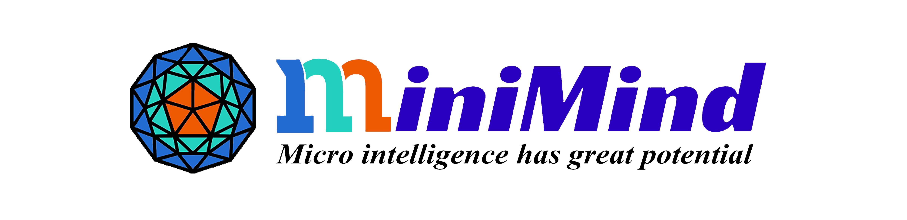

# Welcome to MiniMind!

<figure markdown>
  
  <figcaption><strong>"Simplicity is the ultimate sophistication"</strong></figcaption>
</figure>

## 📌 Introduction

**MiniMind** is a complete, open-source project for training ultra-small language models from scratch with minimal cost. Train a **26M** ChatBot in just **2 hours** with only **$3** on a single 3090 GPU!

- **MiniMind** series is extremely lightweight, the smallest version is **1/7000** the size of GPT-3
- Complete implementation covering:
  - **Tokenizer training** with custom vocabulary
  - **Pretraining** (knowledge learning)
  - **Supervised Fine-Tuning (SFT)** (conversation patterns)
  - **LoRA fine-tuning** (parameter-efficient adaptation)
  - **Direct Preference Optimization (DPO)** (human preference alignment)
  - **RLAIF algorithms** (PPO/GRPO/SPO - reinforcement learning)
  - **Knowledge distillation** (compress large model knowledge)
  - **Model reasoning distillation** (DeepSeek-R1 style)
  - **YaRN algorithm** (context length extrapolation)
- **Pure PyTorch implementation**: All core algorithms are implemented from scratch using native PyTorch, without relying on third-party abstract interfaces
- **Educational value**: This is not only a full-stage open-source reproduction of large language models, but also a comprehensive tutorial for getting started with LLMs
- **Extended capabilities**: MiniMind now supports [MiniMind-V](https://github.com/jingyaogong/minimind-v) for vision multimodal tasks

!!! note "Training Cost & Time"
    "2 hours" is based on **NVIDIA 3090** hardware (single card) testing
    
    "$3" refers to GPU server rental cost
    
    With 8× RTX 4090 GPUs, training time can be compressed to **under 10 minutes**

## ✨ Key Highlights

- **Ultra-low cost**: Single 3090, 2 hours, $3 to train a fully functional ChatBot from scratch
- **Complete pipeline**: Tokenizer → Pretraining → SFT → LoRA → DPO/RLAIF → Distillation → Reasoning
- **Latest algorithms**: Implements cutting-edge techniques including GRPO, SPO, and YaRN
- **Education-friendly**: Clean, well-documented code suitable for learning LLM principles
- **Ecosystem compatible**: Seamless support for `transformers`, `trl`, `peft`, `llama.cpp`, `vllm`, `ollama`, and `Llama-Factory`
- **Full capabilities**: Supports multi-GPU training (DDP/DeepSpeed), model visualization (Wandb/SwanLab), and dynamic checkpoint management
- **Production-ready**: OpenAI API protocol support for easy integration with third-party UIs (FastGPT, Open-WebUI, etc.)
- **Multimodal extension**: Extended to vision with [MiniMind-V](https://github.com/jingyaogong/minimind-v)

## 📊 Model Series

### MiniMind2 Series (Latest - 2025.04.26)

| Model | Parameters | Vocabulary | Layers | Hidden Dim | Context | Inference Memory |
|-------|-----------|------------|--------|-----------|---------|-----------------|
| MiniMind2-small | 26M | 6,400 | 8 | 512 | 2K | ~0.5 GB |
| MiniMind2-MoE | 145M | 6,400 | 8 | 640 | 2K | ~1.0 GB |
| MiniMind2 | 104M | 6,400 | 16 | 768 | 2K | ~1.0 GB |

### MiniMind-V1 Series (Legacy - 2024.09.01)

| Model | Parameters | Vocabulary | Layers | Hidden Dim | Context |
|-------|-----------|------------|--------|-----------|---------|
| minimind-v1-small | 26M | 6,400 | 8 | 512 | 2K |
| minimind-v1-moe | 104M | 6,400 | 8 | 512 | 2K |
| minimind-v1 | 108M | 6,400 | 16 | 768 | 2K |

## 📅 Latest Updates (2025-10-24)

🔥 **RLAIF Training Algorithms**: Native implementation of PPO, GRPO, and SPO

- **YaRN Algorithm**: RoPE length extrapolation for improved long-sequence handling
- **Adaptive Thinking**: Reasoning models support optional thinking chains
- **Full template support**: Tool calling and reasoning tags (`<tool_call>`, `<think>`, etc.)
- **Visualization**: Switched from WandB to [SwanLab](https://swanlab.cn/) (China-friendly)
- **Reasoning models**: Complete MiniMind-Reason series based on DeepSeek-R1 distillation

## 🎯 Project Contents

- Complete MiniMind-LLM architecture code (Dense + MoE models)
- Detailed Tokenizer training code
- Full training pipeline: Pretrain → SFT → LoRA → RLHF/RLAIF → Distillation
- High-quality, curated and deduplicated datasets at all stages
- Native PyTorch implementation of key algorithms, minimal third-party dependencies
- Multi-GPU training support (single-machine multi-card DDP, DeepSpeed, distributed clusters)
- Visualization with Wandb/SwanLab
- Model evaluation on third-party benchmarks (C-Eval, C-MMLU, OpenBookQA)
- YaRN algorithm for RoPE context length extrapolation
- OpenAI API protocol server for easy integration
- Streamlit web UI for chat
- Full compatibility with community tools: llama.cpp, vllm, ollama, Llama-Factory
- MiniMind-Reason models: Complete open-source data + weights for reasoning distillation

## 🚀 Quick Navigation

- **[Quick Start](quickstart.md)** - Environment setup, model download, quick testing
- **[Model Training](training.md)** - Pretraining, SFT, LoRA, RLHF, RLAIF, and reasoning training

## 🔗 Links & Resources

**Project Repositories**:
- **GitHub**: [https://github.com/jingyaogong/minimind](https://github.com/jingyaogong/minimind)
- **HuggingFace**: [MiniMind Collection](https://huggingface.co/collections/jingyaogong/minimind-66caf8d999f5c7fa64f399e5)
- **ModelScope**: [MiniMind Profile](https://www.modelscope.cn/profile/gongjy)

**Online Demos**:
- [ModelScope Studio - Standard Chat](https://www.modelscope.cn/studios/gongjy/MiniMind)
- [ModelScope Studio - Reasoning Model](https://www.modelscope.cn/studios/gongjy/MiniMind-Reasoning)
- [Bilibili Video Introduction](https://www.bilibili.com/video/BV12dHPeqE72/)

**Vision Extension**:
- [MiniMind-V](https://github.com/jingyaogong/minimind-v) - Multimodal vision language models

## 💡 Why MiniMind?

The AI community is flooded with high-cost, complex frameworks that abstract away the fundamentals. MiniMind aims to democratize LLM learning by:

1. **Lowering the barrier**: No need for expensive GPUs or cloud services
2. **Understanding, not just using**: Learn every detail from tokenization to inference
3. **End-to-end learning**: Train from scratch, not just fine-tune existing models
4. **Code clarity**: Pure PyTorch implementations you can read and understand
5. **Practical results**: Get a working ChatBot with minimal resources

As we say: **"Building a Lego airplane is far more exciting than flying first class!"**

---

Next: [Get Started →](quickstart.md)

