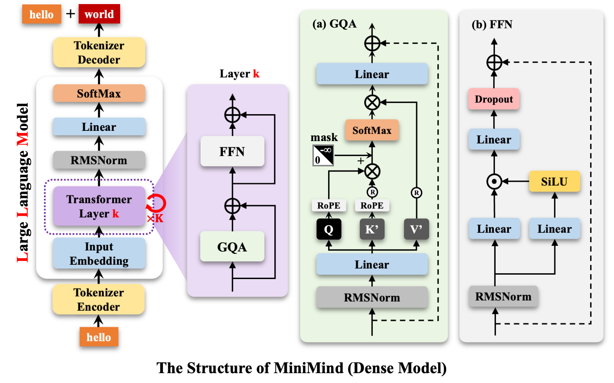

# Model Training

This page introduces how to train MiniMind language models from scratch.

## 📊 Data Preparation

### 1. Download Dataset

Download datasets from [ModelScope](https://www.modelscope.cn/datasets/gongjy/minimind_dataset/files) or [HuggingFace](https://huggingface.co/datasets/jingyaogong/minimind_dataset).

Create `./dataset` directory and place data files:

```bash
./dataset/
├── pretrain_hq.jsonl (1.6GB, ✨Recommended)
├── sft_mini_512.jsonl (1.2GB, ✨Recommended)
├── sft_512.jsonl (7.5GB)
├── sft_1024.jsonl (5.6GB)
├── sft_2048.jsonl (9GB)
├── dpo.jsonl (909MB)
├── r1_mix_1024.jsonl (340MB)
└── lora_*.jsonl
```

!!! tip "Recommended Combination"
    Fastest reproduction: `pretrain_hq.jsonl` + `sft_mini_512.jsonl`
    
    **Single 3090 only needs 2 hours + $0.5!**

### 2. Data Format

**Pretrain Data** (`pretrain_hq.jsonl`):
```json
{"text": "How to overcome procrastination? Overcoming procrastination is not easy..."}
```

**SFT Data** (`sft_*.jsonl`):
```json
{
  "conversations": [
    {"role": "user", "content": "Hello"},
    {"role": "assistant", "content": "Hello!"}
  ]
}
```

## 🎯 Training Pipeline

All training scripts are located in the `./trainer` directory.

### 1. Pretraining

The pretraining stage lets the model learn basic knowledge, the goal is to **learn word continuation**.

```bash
cd trainer
python train_pretrain.py

# Multi-GPU training
torchrun --nproc_per_node 2 train_pretrain.py
```

Output weights: `./out/pretrain_*.pth`

!!! info "Training Duration"
    - MiniMind2-Small (26M): ~1.1h (single 3090)
    - MiniMind2 (104M): ~3.9h (single 3090)

### 2. Supervised Fine-Tuning (SFT)

The SFT stage teaches the model conversation patterns and adapts to chat templates.

```bash
python train_full_sft.py

# Multi-GPU training
torchrun --nproc_per_node 2 train_full_sft.py
```

Output weights: `./out/full_sft_*.pth`

!!! info "Training Duration"
    - MiniMind2-Small: ~1h (using sft_mini_512)
    - MiniMind2: ~3.3h (using sft_mini_512)

### 3. LoRA Fine-tuning (Optional)

LoRA is a parameter-efficient fine-tuning method, suitable for domain adaptation.

```bash
python train_lora.py
```

**Use Cases**:
- Medical Q&A: use `lora_medical.jsonl`
- Self-awareness: use `lora_identity.jsonl`

Output weights: `./out/lora/lora_*.pth`

### 4. DPO Reinforcement Learning (Optional)

DPO is used to optimize model response quality to better align with human preferences.

```bash
python train_dpo.py
```

Output weights: `./out/rlhf_*.pth`

### 5. Reasoning Model Distillation (Optional)

Distill reasoning capabilities from DeepSeek-R1.

```bash
python train_distill_reason.py
```

Output weights: `./out/reason_*.pth`

## 📈 Model Architecture

MiniMind uses Transformer Decoder-Only architecture (similar to Llama3):



### Model Parameter Configuration

| Model Name | params | d_model | n_layers | kv_heads | q_heads |
|------------|--------|---------|----------|----------|---------|
| MiniMind2-Small | 26M | 512 | 8 | 2 | 8 |
| MiniMind2-MoE | 145M | 640 | 8 | 2 | 8 |
| MiniMind2 | 104M | 768 | 16 | 2 | 8 |

## 🧪 Test Model

```bash
# model_mode: 0=pretrain, 1=sft, 2=rlhf, 3=reason
python eval_model.py --model_mode 1

# Test LoRA model
python eval_model.py --lora_name 'lora_medical' --model_mode 2
```

## 🔧 Multi-GPU Training

### DDP Method

```bash
torchrun --nproc_per_node N train_xxx.py
```

### DeepSpeed Method

```bash
deepspeed --master_port 29500 --num_gpus=N train_xxx.py
```

### Wandb Monitoring

```bash
# Login first
wandb login

# Enable wandb
torchrun --nproc_per_node N train_xxx.py --use_wandb
```

## 💰 Training Cost

Based on single NVIDIA 3090:

| Dataset Combination | Duration | Cost | Effect |
|-----------|------|------|------|
| pretrain_hq + sft_mini_512 | 2.1h | ≈$0.35 | 😊😊 Basic chat |
| Full dataset (MiniMind2-Small) | 38h | ≈$6.50 | 😊😊😊😊😊😊 Complete capabilities |
| Full dataset (MiniMind2) | 122h | ≈$20.80 | 😊😊😊😊😊😊😊😊 Best performance |

!!! success "Quick Reproduction"
    Using `pretrain_hq` + `sft_mini_512`, single 3090 only needs **2 hours + $0.5** to train a ChatBot!

## 📝 Common Issues

- **Out of memory**: Reduce `batch_size` or use DeepSpeed
- **Training not converging**: Adjust learning rate or check data quality
- **Multi-GPU training error**: Ensure all GPUs are visible and CUDA versions are consistent

